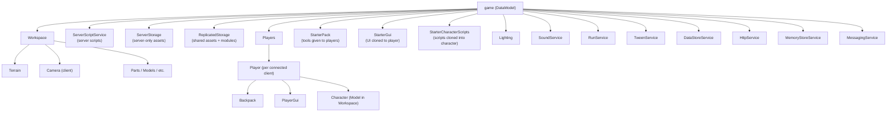
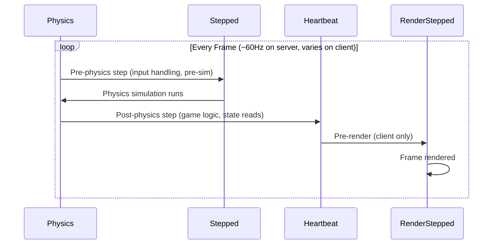
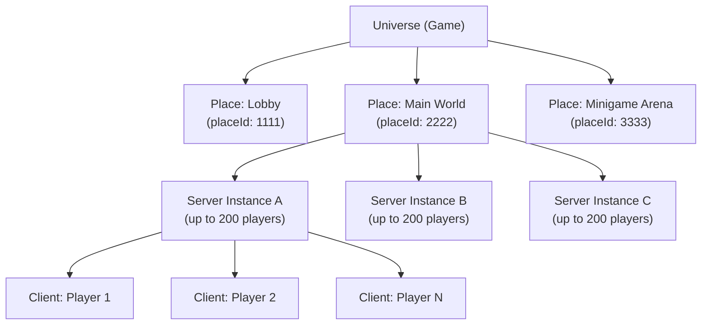

# Module 1.1: Roblox Engine & DataModel

## The Mental Model Shift

If you come from backend systems, your instinct is to think in terms of processes, services communicating over the network, and persistent stores. Roblox is different: the entire game world — its logic, physics, assets, and UI — lives in a single in-memory object tree called the **DataModel**. Every running place (server instance or client) has its own copy of this tree. The server's copy is authoritative; clients receive synchronized views of it.

Think of the DataModel like a DOM tree for a web page, except:
- Nodes have typed classes with defined behaviors (a `Part` has physics, a `Script` executes Luau code)
- The tree is live — mutations trigger replication across the network in real time
- The engine traverses and evaluates the tree on every simulation tick

---

## The DataModel as an Object Graph

The root node is always `game`, which is an instance of class `DataModel`. Every object in a Roblox place is an **Instance** — a node in this tree with:

- A `ClassName` (immutable, set at creation time)
- A `Name` (mutable string, like a dictionary key among siblings)
- A `Parent` reference
- Zero or more child Instances
- A set of class-defined properties plus arbitrary user-defined **Attributes**

Navigation is just property traversal:

```luau
-- Navigate by name (errors if not found)
local part = game.Workspace.MyModel.Part

-- Safe navigation with FindFirstChild
local part = game.Workspace:FindFirstChild("MyModel")
    and game.Workspace.MyModel:FindFirstChild("Part")

-- WaitForChild blocks until the child exists (client use case: streamed assets)
local part = game.Workspace:WaitForChild("MyModel"):WaitForChild("Part")
```

The `.` accessor is syntactic sugar for `:FindFirstChild()` with an error on nil. For production code, prefer explicit `FindFirstChild` or `WaitForChild` to surface missing instances early.

### Path Analogy

| File System | DataModel |
|---|---|
| `/` | `game` |
| `/usr/bin/` | `game.ServerScriptService` |
| `ls /path` | `instance:GetChildren()` |
| `find /path -name "foo"` | `instance:FindFirstChild("foo", true)` (recursive) |
| inode type | `ClassName` |
| file permissions | Filtering Enabled trust boundary |

---

## Key Services (Direct Children of `game`)

The top-level children of `game` are called **Services**. They are singletons — you get them via `game:GetService("ServiceName")` rather than instantiating them. Each has a well-defined role in the DataModel contract.



### Service Reference

| Service | Runs On | Purpose |
|---|---|---|
| `Workspace` | Both | The 3D simulation world. Parts, models, terrain, the camera. |
| `ServerScriptService` | Server only | Scripts here run server-side. NOT replicated to clients. |
| `ServerStorage` | Server only | Asset/data storage invisible to clients. Use for server-only templates. |
| `ReplicatedStorage` | Both | Shared assets, ModuleScripts, RemoteEvents. Replicated to all clients. |
| `Players` | Both | Container for connected `Player` objects. Access via `Players.LocalPlayer` on client. |
| `StarterPack` | Both | Contents cloned into each player's `Backpack` on spawn. |
| `StarterGui` | Both | Contents cloned into each `PlayerGui` on spawn. |
| `StarterCharacterScripts` | Both | `LocalScript`s cloned into the character model on spawn. |
| `Lighting` | Both | Global environment settings (fog, ambient light, sky). |
| `RunService` | Both | Lifecycle events: `Heartbeat`, `Stepped`, `RenderStepped`. |
| `DataStoreService` | Server only | Persistent key-value storage (think: Redis without TTL). |
| `MemoryStoreService` | Server only | Ephemeral shared memory across servers (think: Redis with TTL). |
| `MessagingService` | Server only | Cross-server pub/sub (up to 150 servers in universe). |
| `HttpService` | Server only | Outbound HTTP requests. No inbound webhooks. |
| `TweenService` | Both | Interpolation engine for smooth property transitions. |

### Accessing Services

```luau
-- Preferred: GetService is the canonical way
local RunService = game:GetService("RunService")
local Players = game:GetService("Players")
local ReplicatedStorage = game:GetService("ReplicatedStorage")

-- game.RunService also works but GetService is more explicit and
-- won't error if the service hasn't been accessed yet
```

---

## Class-Based Instantiation

Every Instance has an immutable `ClassName`. This is the Roblox equivalent of a type in a class hierarchy. The engine gives meaning to classes — a `Part` participates in physics simulation, a `Script` executes Luau on the server, a `RemoteEvent` is a network channel.

```luau
-- Create a new Part programmatically
local part = Instance.new("Part")
part.Name = "MyPart"
part.Size = Vector3.new(4, 1, 4)
part.CFrame = CFrame.new(0, 10, 0)
part.Anchored = true
part.Parent = workspace  -- Setting Parent last triggers replication

-- Check class
print(part.ClassName)        --> "Part"
print(part:IsA("BasePart"))  --> true  (class hierarchy check)
print(part:IsA("Instance"))  --> true
```

The class hierarchy matters: `BasePart` is the abstract base for `Part`, `MeshPart`, `UnionOperation`, etc. `:IsA()` is the idiomatic type check, analogous to `instanceof` in Java or `isinstance()` in Python.

### Important Instantiation Rule

Always set `Parent` **last**. Parenting an Instance into the DataModel triggers network replication and engine registration. Setting properties before parenting means those properties are transmitted as part of the initial state rather than as incremental updates — more efficient and avoids partial-state clients seeing the object.

---

## RunService Lifecycle

The engine runs a tight simulation loop. `RunService` exposes three hook points:



| Event | Context | When | Use For |
|---|---|---|---|
| `Stepped` | Both | Before physics simulation | Input processing, applying forces before physics runs |
| `Heartbeat` | Both | After physics simulation | Game logic, reading post-physics state, AI updates |
| `RenderStepped` | Client only | Before rendering | Camera manipulation, UI updates tied to frame |

```luau
local RunService = game:GetService("RunService")

-- Heartbeat: deltaTime is seconds since last frame
RunService.Heartbeat:Connect(function(deltaTime: number)
    -- Good: read physics results, update game state
    -- Runs at server tick rate (60Hz by default)
end)

-- Stepped: receives time (elapsed) and deltaTime
RunService.Stepped:Connect(function(time: number, deltaTime: number)
    -- Good: apply forces, read input before physics
end)

-- RenderStepped: CLIENT ONLY — will error on server
-- Use BindToRenderStep for prioritized execution order
RunService:BindToRenderStep(
    "CameraUpdate",           -- unique binding name
    Enum.RenderPriority.Camera.Value + 1,  -- priority (higher = later)
    function(deltaTime: number)
        -- Runs before this frame is rendered
        -- Ideal for camera/character visual updates
    end
)
```

### Why `BindToRenderStep` Beats `while true do wait() end`

This is a common mistake for Roblox beginners. The legacy pattern:

```luau
-- BAD: Legacy anti-pattern
while true do
    updateCamera()
    wait()  -- yields for at minimum 1/30th second, often more
end
```

Problems with `while true do wait()`:
1. `wait()` has no guaranteed timing — it batches deferred coroutines and can skip frames
2. No control over execution order relative to physics or rendering
3. Accumulates timing drift over time
4. Forces a coroutine context switch on every iteration

The correct pattern:

```luau
-- GOOD: Precise, prioritized, no drift
RunService:BindToRenderStep(
    "MyCameraBinding",
    Enum.RenderPriority.Camera.Value,
    function(dt: number)
        updateCamera(dt)  -- called exactly once per rendered frame
    end
)

-- For server-side loops, Heartbeat is the equivalent
RunService.Heartbeat:Connect(function(dt: number)
    updateAI(dt)  -- exactly once per physics frame, post-simulation
end)
```

---

## Checking RunContext

Scripts need to know whether they're running server-side or client-side. The canonical approach:

```luau
local RunService = game:GetService("RunService")

-- Runtime context checks
local isServer = RunService:IsServer()
local isClient = RunService:IsClient()
local isStudio = RunService:IsStudio()  -- true when running in Studio (even in Play mode)
local isRunning = RunService:IsRunning() -- false in edit mode

-- Common guard pattern in ModuleScripts shared between server and client
if RunService:IsServer() then
    -- Initialize server-side state
    setupDataStore()
elseif RunService:IsClient() then
    -- Initialize client-side UI
    setupHUD()
end
```

A `Script` with `RunContext = Server` (default) will only execute server-side. A `LocalScript` only executes client-side. A `ModuleScript` executes in whichever context `require()`s it. The RunService checks are mainly useful inside `ModuleScript`s that adapt their behavior based on who loaded them.

Modern Roblox (2023+) introduced the `RunContext` property on `Script` instances, letting you place a single `Script` and set it to `Server`, `Client`, or `Legacy`. This is cleaner than maintaining separate `Script` vs `LocalScript` instances.

---

## Place & Universe Structure



Key facts for backend architects:

- **Universe** = your game. Has one `universeId`. Persists `DataStore` data.
- **Place** = a discrete game scene. Has a `placeId`. Each place runs as isolated server instances.
- **Server Instance** = a single server process running one place. Stateless beyond what you persist to `DataStore`.
- **Server capacity**: default 200 players/server. A beta feature (2024) raised this to 700.
- **You do not manage servers.** Roblox provisions and scales server instances automatically based on player join requests. There is no Kubernetes, no auto-scaling config, no instance types to choose.

### Cross-Server Communication

Since each server instance is isolated, inter-server communication uses:
- `MessagingService` — pub/sub, up to 150 subscribers (servers). ~1s latency. Think: Redis Pub/Sub.
- `MemoryStoreService` — shared sorted sets and hash maps with TTL. Think: Redis with atomic operations.
- `TeleportService` — move players between places/servers. Think: redirect with session handoff.

```luau
-- MessagingService: broadcast to all servers in universe
local MessagingService = game:GetService("MessagingService")

-- Subscribe (each server instance does this on startup)
MessagingService:SubscribeAsync("GlobalAnnouncement", function(message)
    print("Received:", message.Data)
end)

-- Publish from any server
MessagingService:PublishAsync("GlobalAnnouncement", {
    text = "Server maintenance in 5 minutes",
    severity = "warning"
})
```

---

## DataModel Navigation Patterns

```luau
-- Pattern 1: Direct path (errors loudly if path is wrong — good for known structure)
local part = workspace.Lobby.SpawnPad

-- Pattern 2: Safe find (nil if not found)
local part = workspace:FindFirstChild("Lobby")
if part then
    local pad = part:FindFirstChild("SpawnPad")
end

-- Pattern 3: Recursive search (searches entire subtree)
local anyPartNamedSpawnPad = workspace:FindFirstChild("SpawnPad", true)

-- Pattern 4: Find by class (returns first child of that class)
local primaryPart = model:FindFirstChildOfClass("Part")

-- Pattern 5: Wait for async (client-side streaming / race conditions)
local remoteEvent = ReplicatedStorage:WaitForChild("PlayerAction", 10)
-- Second arg is timeout in seconds; returns nil on timeout

-- Pattern 6: Get all children of a class
for _, tool in ipairs(player.Backpack:GetChildren()) do
    if tool:IsA("Tool") then
        print("Player has tool:", tool.Name)
    end
end
```

---

## Key Takeaways

1. The DataModel is the single source of truth for all game state. Everything is an Instance in a tree rooted at `game`.
2. Services are singletons accessed via `game:GetService()`. Learn which services are server-only vs shared.
3. Set `Parent` last when constructing Instances to minimize replication overhead.
4. `RunService.Heartbeat` is the server game loop. `BindToRenderStep` is the client rendering loop. Never use `while true do wait() end` for time-sensitive logic.
5. You have no infrastructure to manage. Roblox handles server provisioning, scaling, and networking automatically.
6. Cross-server state requires explicit mechanisms: `MessagingService` (pub/sub), `MemoryStoreService` (shared cache), `DataStoreService` (persistence).

---

## Next: Module 1.2 — Client-Server Replication

Module 1.2 covers the trust boundary between clients and servers: Filtering Enabled, what replicates automatically vs manually, RemoteEvents/RemoteFunctions, and why you must validate all client input on the server.
