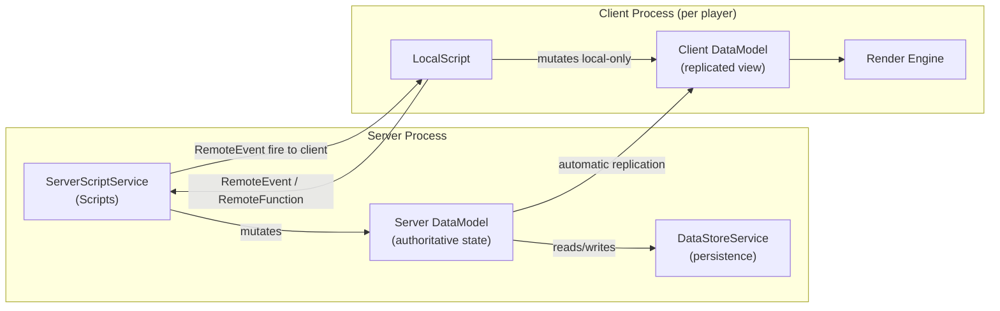
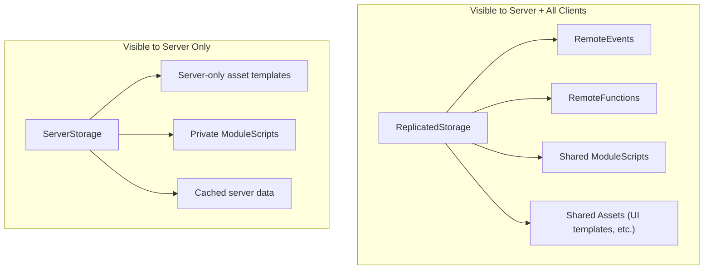
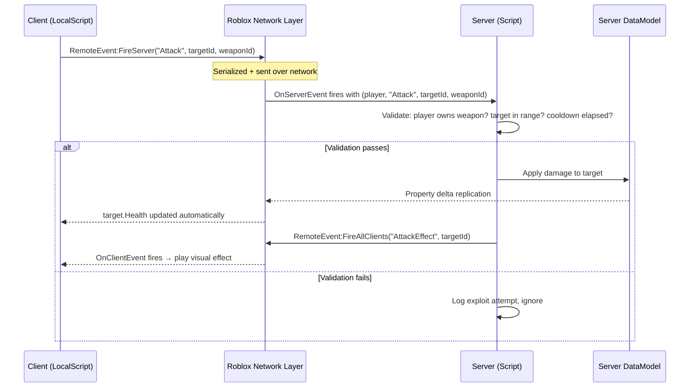
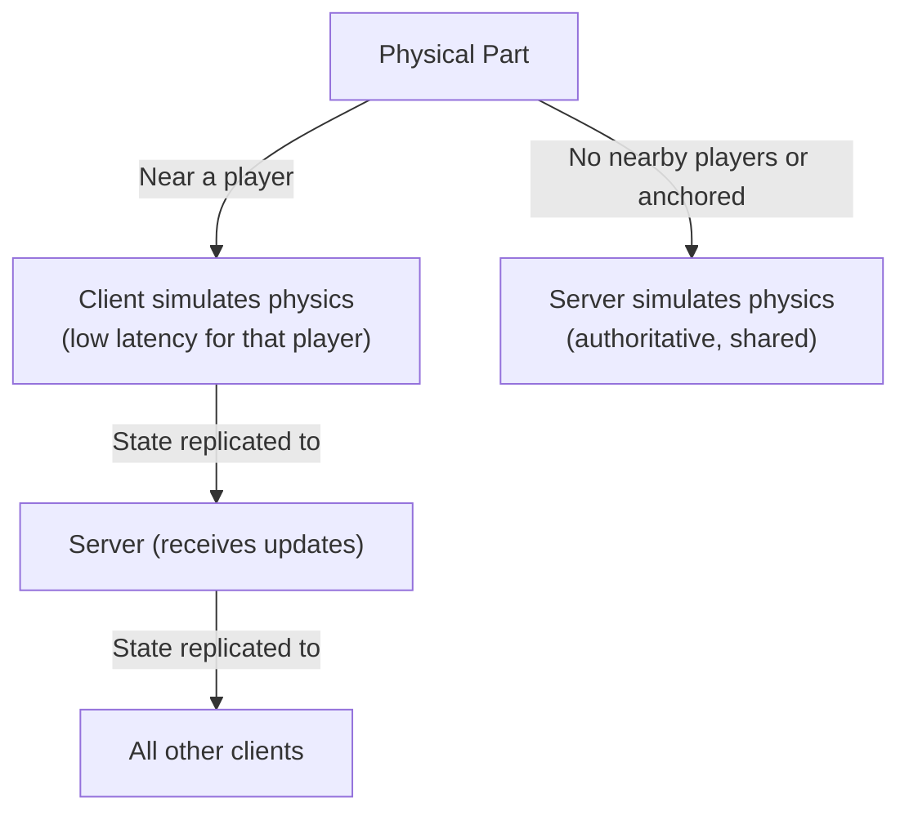

# Module 1.2: Client-Server Architecture & Replication

## The Architecture at a Glance

Roblox's client-server model maps well onto distributed systems patterns you already know, but with Roblox-specific mechanics layered on top. The server is a stateful authoritative simulation. Each connected client is a thin rendering node that receives synchronized state and sends input events. There is no GraphQL, REST API, or gRPC — the transport is a proprietary binary protocol managed entirely by the engine.



---

## Filtering Enabled: The Trust Boundary

**Filtering Enabled (FE)** is a security model that has been mandatory since 2018. It cannot be disabled. The rule is simple:

> **Clients cannot directly modify server-side DataModel state.**

If a `LocalScript` does `workspace.SomePart.Position = Vector3.new(0, 0, 0)`, that change is local-only. The server never sees it. Other clients never see it. It evaporates when the client disconnects.

This is analogous to a frontend that cannot directly write to the database. All mutations go through an API layer (RemoteEvents/RemoteFunctions), which the server validates before applying.

### What FE Means in Practice

| Action | Result |
|---|---|
| LocalScript modifies a Part's Position | Change is local only, not replicated |
| LocalScript fires a RemoteEvent to server | Server receives the event and can act on it |
| Server modifies a Part's Position | Change replicates to ALL clients automatically |
| Server fires a RemoteEvent to a client | That client's LocalScript receives it |
| Client calls a RemoteFunction on server | Server runs a function, returns a value to client |

---

## What Runs Where: Script Types

| Script Type | Execution Context | Location |
|---|---|---|
| `Script` (RunContext=Server) | Server only | `ServerScriptService`, `ServerStorage`, `Workspace` |
| `LocalScript` | Client only | `StarterGui`, `StarterPack`, `StarterCharacterScripts`, `PlayerGui`, `Backpack` |
| `ModuleScript` | Wherever `require()`d | `ReplicatedStorage` (shared), `ServerScriptService` (server-only) |

```luau
-- Script (server): Runs once per server instance at game startup
-- Lives in ServerScriptService
local Players = game:GetService("Players")
local ReplicatedStorage = game:GetService("ReplicatedStorage")

local damageEvent = ReplicatedStorage:WaitForChild("DamageEvent")

Players.PlayerAdded:Connect(function(player: Player)
    print("Player joined server:", player.Name)
end)
```

```luau
-- LocalScript (client): Runs once per player on their machine
-- Lives in StarterGui or StarterPlayerScripts
local Players = game:GetService("Players")
local ReplicatedStorage = game:GetService("ReplicatedStorage")

local localPlayer = Players.LocalPlayer  -- Only accessible from LocalScript
local playerGui = localPlayer.PlayerGui

print("This is running on:", localPlayer.Name, "'s machine")
```

```luau
-- ModuleScript: No execution on its own — only runs when require()'d
-- In ReplicatedStorage: can be required by both server and client scripts
local RunService = game:GetService("RunService")

local MyModule = {}

function MyModule.doSomething()
    if RunService:IsServer() then
        return "server behavior"
    else
        return "client behavior"
    end
end

return MyModule
```

---

## Automatic Replication

The engine replicates certain things automatically from server to all clients. No code required.

### Replicated Automatically

- **Instance creation/deletion**: When the server creates or destroys a Part, Script, or any Instance in a replicated location, clients see it.
- **Property changes**: Position, Color, Transparency, custom properties — if the server sets it, clients receive the delta.
- **Physics state**: A Part's position and velocity are replicated based on who has **network ownership** (covered below).
- **Attributes**: Custom key-value pairs attached to Instances. Delta-replicated (only changes sent).
- **Tags** (via `CollectionService`): Membership in named tag sets replicates.

### NOT Replicated

| Location | Reason |
|---|---|
| `ServerScriptService` contents | Intentionally hidden from clients. Server logic is server-only. |
| `ServerStorage` contents | Server-only asset storage. Never visible to clients. |
| Local changes by `LocalScript` | FE prevents upward replication. |
| Server-side variables/state | In-memory Luau variables are process-local, not replicated. |
| `DataStoreService` data | Persistence layer, not replicated to clients directly. |

---

## ReplicatedStorage vs ServerStorage: The Splitting Decision



Rule of thumb: if a client needs to reference it (ModuleScript, RemoteEvent, asset), put it in `ReplicatedStorage`. If it should never be visible to clients (exploiter-sensitive logic, server templates), use `ServerStorage` or `ServerScriptService`.

---

## Attributes: Per-Instance Key-Value Metadata

Attributes are typed key-value pairs you attach to any Instance. They replicate just like built-in properties — delta only, efficient.

```luau
-- Server: set attributes on an instance
local npc = workspace.EnemyNPC
npc:SetAttribute("Health", 100)
npc:SetAttribute("MaxHealth", 100)
npc:SetAttribute("Faction", "RedTeam")
npc:SetAttribute("IsElite", false)

-- Read anywhere (server or client, after replication)
local health = npc:GetAttribute("Health")  --> 100
local faction = npc:GetAttribute("Faction")  --> "RedTeam"

-- Listen for changes (useful on client for reactive UI)
npc:GetAttributeChangedSignal("Health"):Connect(function()
    local newHealth = npc:GetAttribute("Health")
    updateHealthBar(newHealth)
end)

-- Enumerate all attributes
for name, value in npc:GetAttributes() do
    print(name, "=", value)
end
```

### Attribute Limits

| Constraint | Limit |
|---|---|
| Attributes per Instance | 64 |
| Attribute name length | 50 characters |
| String value length | 50 characters |
| Supported types | `boolean`, `number`, `string`, `Color3`, `Vector2`, `Vector3`, `UDim`, `UDim2`, `CFrame`, `BrickColor`, `NumberRange`, `NumberSequence`, `ColorSequence`, `Rect`, `Font` |

For larger or more complex data, use the Instance's tagged state pattern with `CollectionService`, or encode into a separate `StringValue`/`IntValue` object as a child.

---

## RemoteEvents and RemoteFunctions: The API Layer

These are the only sanctioned way for clients to communicate with the server (and vice versa). They live in `ReplicatedStorage`.



```luau
-- In ReplicatedStorage: create once, access everywhere
-- (Usually done from a setup script or exists in the place file)
local AttackEvent = Instance.new("RemoteEvent")
AttackEvent.Name = "AttackEvent"
AttackEvent.Parent = game:GetService("ReplicatedStorage")
```

```luau
-- SERVER SCRIPT: Handle incoming client requests
local ReplicatedStorage = game:GetService("ReplicatedStorage")
local AttackEvent = ReplicatedStorage:WaitForChild("AttackEvent")

local ATTACK_COOLDOWN = 0.5  -- seconds
local lastAttackTime: {[Player]: number} = {}

AttackEvent.OnServerEvent:Connect(function(
    player: Player,       -- injected by engine; NEVER trust client-sent player identity
    targetId: number,
    weaponName: string
)
    -- 1. Validate cooldown (rate limiting)
    local now = tick()
    if (now - (lastAttackTime[player] or 0)) < ATTACK_COOLDOWN then
        return  -- Silently ignore: client might be cheating or laggy
    end
    lastAttackTime[player] = now

    -- 2. Validate the player actually has this weapon
    local weapon = player.Backpack:FindFirstChild(weaponName)
        or (player.Character and player.Character:FindFirstChild(weaponName))
    if not weapon then
        warn("Player", player.Name, "attempted attack with unowned weapon:", weaponName)
        return
    end

    -- 3. Validate target exists and is in range
    local target = game:GetService("Players"):GetPlayerByUserId(targetId)
    if not target or not target.Character then return end

    local playerChar = player.Character
    if not playerChar then return end

    local distance = (playerChar:GetPivot().Position
        - target.Character:GetPivot().Position).Magnitude
    if distance > 20 then
        return  -- Out of range
    end

    -- 4. Apply validated state change — server-side, authoritative
    local humanoid = target.Character:FindFirstChildOfClass("Humanoid")
    if humanoid then
        humanoid.Health -= 25
    end
end)
```

```luau
-- CLIENT LOCALSCRIPT: Fire events, never trust the outcome until server confirms
local ReplicatedStorage = game:GetService("ReplicatedStorage")
local Players = game:GetService("Players")
local AttackEvent = ReplicatedStorage:WaitForChild("AttackEvent")

local localPlayer = Players.LocalPlayer
local mouse = localPlayer:GetMouse()

-- User input → fire event to server
local UserInputService = game:GetService("UserInputService")
UserInputService.InputBegan:Connect(function(input, gameProcessed)
    if gameProcessed then return end  -- UI consumed this input
    if input.KeyCode == Enum.KeyCode.E then
        -- Find target under mouse
        local target = mouse.Target
        if target and target.Parent then
            local targetPlayer = Players:GetPlayerFromCharacter(target.Parent)
            if targetPlayer then
                -- Fire and forget: server validates and applies
                AttackEvent:FireServer(targetPlayer.UserId, "Sword")
            end
        end
    end
end)
```

### RemoteFunction: Request-Response Pattern

```luau
-- SERVER: implement the function
local GetInventoryFunction = ReplicatedStorage:WaitForChild("GetInventory")

GetInventoryFunction.OnServerInvoke = function(player: Player)
    -- Return serializable data (no Instance references that won't be visible client-side)
    return {
        gold = getPlayerGold(player),
        items = getPlayerItems(player),
    }
end
```

```luau
-- CLIENT: call it like an async RPC
local GetInventoryFunction = ReplicatedStorage:WaitForChild("GetInventory")

-- This YIELDS (blocks the coroutine) until server responds
local inventory = GetInventoryFunction:InvokeServer()
print("Gold:", inventory.gold)
```

**Warning**: `RemoteFunction:InvokeServer()` is a blocking RPC. If the server handler errors, the client coroutine yields forever. Always wrap in a protected call or use `RemoteEvent` with a correlation ID + callback table for production systems. The `Promise` pattern from `evaera/promise` is popular here.

---

## Client Prediction and Network Ownership

### Character Physics Prediction

The Roblox engine automatically predicts character movement on the client. When you press W to move forward, your character moves immediately on your screen without waiting for the server round-trip. The server runs its own physics simulation and reconciles differences.

This is engine-managed and happens transparently — you don't write reconciliation logic for the default character controller. For custom movement systems (vehicles, special abilities), you manage prediction explicitly.

### Network Ownership

For non-character physics Parts, the engine decides whether the server or a specific client simulates physics for that Part:



```luau
-- SERVER: explicitly set network ownership
local part = workspace.MovingPlatform

-- Give ownership to a specific player (their client simulates this part's physics)
part:SetNetworkOwner(somePlayer)

-- Return ownership to server
part:SetNetworkOwner(nil)

-- Check current owner
local owner = part:GetNetworkOwner()  -- returns Player or nil (server)
local isAutomatic = part:GetNetworkOwnershipAuto()  -- true if engine decides
```

Ownership tradeoffs:
- **Client ownership**: lower perceived latency for that player, but other players see the physics results after a round-trip delay. Risk: exploiters can fake physics if they own a Part.
- **Server ownership**: authoritative, all players see consistent physics, but movement feels laggy for the player physically interacting with it.

For competitive games, keep ownership server-side for anything that affects game state. For casual decorative objects, client ownership is fine.

---

## The Golden Rule: Never Trust Client Input

This cannot be overstated. Every `RemoteEvent:FireServer()` call is potentially crafted by an exploiter using a Lua executor. Standard attacks include:

- Sending arguments of the wrong type (`nil`, wrong Instance, negative numbers)
- Replaying valid requests faster than the game intends (infinite money duplication)
- Sending valid-format requests with invalid semantic values (attack a player on a different server, buy items with negative currency)
- Sending requests out of order (equip an item before it's been "picked up")

Server validation pattern:

```luau
-- Defensive validation utility
local function validateTypes(args: {any}, expected: {string}): boolean
    for i, expectedType in ipairs(expected) do
        if type(args[i]) ~= expectedType then
            return false
        end
    end
    return true
end

-- In your event handler:
SomeEvent.OnServerEvent:Connect(function(player: Player, ...)
    local args = {...}

    -- Type check first
    if not validateTypes(args, {"number", "string"}) then
        warn("Type mismatch from", player.Name)
        return
    end

    local amount: number = args[1]
    local itemName: string = args[2]

    -- Range check
    if amount <= 0 or amount > 100 then return end

    -- Ownership check
    if not playerOwnsItem(player, itemName) then return end

    -- Business logic
    applyPurchase(player, amount, itemName)
end)
```

---

## Key Takeaways

1. Filtering Enabled is always on. Client mutations to the DataModel are local-only. The server is the only source of truth.
2. `Script` = server, `LocalScript` = client, `ModuleScript` = context of caller.
3. `ReplicatedStorage` is the "public API surface" — RemoteEvents, RemoteFunctions, and shared modules live here.
4. Server property changes replicate to all clients automatically. Attributes replicate incrementally.
5. `RemoteEvent` is fire-and-forget; `RemoteFunction` is blocking RPC. Use caution with the latter.
6. The `player` argument injected into `OnServerEvent` is authoritative — never accept a player reference from client-sent arguments.
7. Validate everything on the server: type, range, ownership, rate limits, business rules.
8. Network ownership controls who simulates physics for a Part — client ownership trades latency for exploitability risk.

---

## Next: Module 1.3 — Luau Language

Module 1.3 covers the Luau language itself: its type system, `--!strict` mode, OOP patterns with metatables, the `task` library, and performance patterns for high-frequency game loops.
