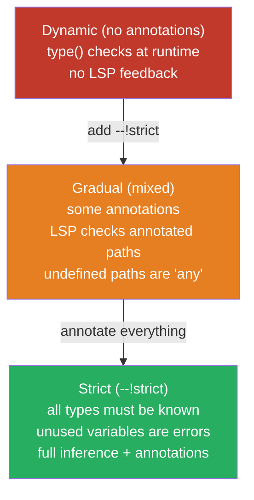
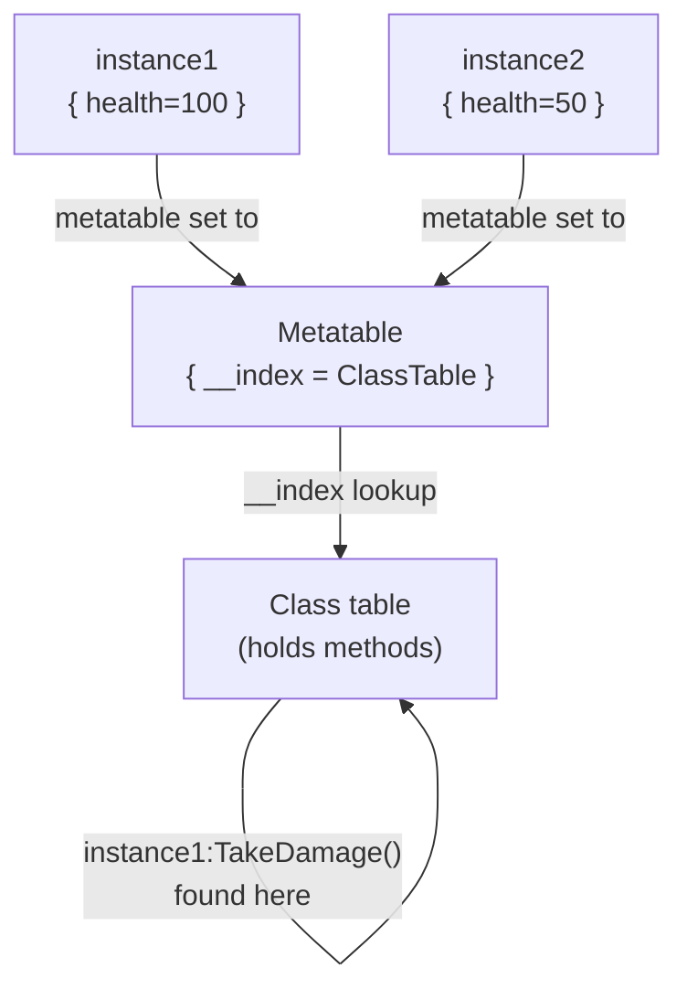

# Module 1.3: Luau Language

## Luau vs Lua: The Relationship

Luau is **not** Lua 5.x with extensions bolted on. It is a significant fork of Lua 5.1 that diverges deliberately in several areas. If you've used Lua in Nginx (OpenResty), Redis scripting, or embedded contexts, you know the basics — but there are important differences:

| Feature | Lua 5.1 | Lua 5.3+ | Luau |
|---|---|---|---|
| Integers (native) | No | Yes | No (all numbers are `double`) |
| Bitwise operators | No | Yes (`&`, `|`) | `bit32` library instead |
| Generalized `for ... in` | No | No | Yes |
| String interpolation | No | No | Yes (backtick syntax) |
| Type annotations | No | No | Yes (gradual, optional) |
| `continue` keyword | No | No | Yes |
| Incremental GC | Stop-the-world | Stop-the-world | Yes |
| `goto` | Lua 5.2+ | Yes | No (intentionally removed) |
| `debug` library (full) | Yes | Yes | Restricted |
| `os`/`io` libraries | Yes | Yes | Not available (sandbox) |
| `require` semantics | File path | File path | ModuleScript instances |

Key insight: Luau targets Lua 5.1 compatibility for the *syntax baseline*, then adds features on top. Do not assume Lua 5.3/5.4 features work.

---

## The Type System

Luau's type system is **gradual** — you can annotate as much or as little as you want. The type checker runs at the language server level (see Module 2.1) and optionally at CI time (`luau-lsp analyze`).



### Mode Directives

```luau
--!strict    -- Full type checking. Recommended for new code.
--!nonstrict -- Relaxed checking (default for Scripts without directive)
--!nocheck   -- Disable type checking entirely for this file
```

### Type Solver Rewrite (November 2025)

The Luau type solver was completely rewritten and graduated from beta in November 2025. Key improvements:
- Better inference through conditional branches
- Correct handling of union and intersection types in complex scenarios
- Improved generic function inference
- Better error messages pointing to root cause rather than symptoms

If you're reading pre-2025 Roblox Luau docs about type inference limitations, many of those limitations are now fixed.

---

## Type Annotations

```luau
--!strict

-- Basic scalar types
local count: number = 0
local name: string = "player"
local active: boolean = true
local anything: any = nil  -- escape hatch, disables checking for this binding

-- Optional types (can be nil)
local maybeName: string? = nil  -- equivalent to: string | nil

-- Function annotations
local function add(a: number, b: number): number
    return a + b
end

-- Multiple return values
local function divmod(a: number, b: number): (number, number)
    return math.floor(a / b), a % b
end

-- Variadic functions
local function sum(...: number): number
    local total = 0
    for _, v in {...} do
        total += v
    end
    return total
end

-- Type aliases
type PlayerId = number
type ItemName = string
type Inventory = {[ItemName]: number}  -- dictionary type

-- Inline table types
type Vector2D = {
    x: number,
    y: number,
}

-- Union types
type StringOrNumber = string | number

-- Literal types (specific values)
type Direction = "north" | "south" | "east" | "west"
type StatusCode = 200 | 404 | 500
```

### Type Narrowing

```luau
--!strict

local function processValue(value: string | number | nil)
    if value == nil then
        -- type of value is nil here
        return
    end

    if type(value) == "string" then
        -- type is narrowed to string here
        print(value:upper())
    else
        -- type is narrowed to number here
        print(value * 2)
    end
end

-- Instance type narrowing
local function processInstance(inst: Instance)
    if inst:IsA("BasePart") then
        -- type narrowed to BasePart
        print(inst.Size)  -- Size is a BasePart property, now accessible
    end
end
```

---

## OOP in Luau: Metatables and the Class Pattern

Lua/Luau has no built-in `class` keyword. Classes are implemented via **metatables** — a mechanism that intercepts operations on a table. The standard Roblox class pattern:



```luau
--!strict

-- Standard Roblox class pattern
local Enemy = {}
Enemy.__index = Enemy

-- Type declaration for the instance shape
export type EnemyType = typeof(setmetatable({} :: {
    name: string,
    health: number,
    maxHealth: number,
    faction: string,
}, Enemy))

-- Constructor
function Enemy.new(name: string, health: number, faction: string): EnemyType
    local self = setmetatable({}, Enemy)
    self.name = name
    self.health = health
    self.maxHealth = health
    self.faction = faction
    return self
end

-- Methods defined on the class table
function Enemy:TakeDamage(damage: number): ()
    self.health = math.max(0, self.health - damage)
    if self.health == 0 then
        self:OnDeath()
    end
end

function Enemy:Heal(amount: number): ()
    self.health = math.min(self.maxHealth, self.health + amount)
end

function Enemy:IsAlive(): boolean
    return self.health > 0
end

function Enemy:OnDeath(): ()
    print(self.name, "has been defeated!")
    -- Override in subclasses
end

function Enemy:GetHealthPercent(): number
    return self.health / self.maxHealth
end

return Enemy
```

```luau
-- Usage
local Enemy = require(game.ReplicatedStorage.Classes.Enemy)

local goblin = Enemy.new("Goblin", 50, "Bandits")
goblin:TakeDamage(30)
print(goblin:GetHealthPercent())  --> 0.4
print(goblin:IsAlive())           --> true
```

### Inheritance Pattern

```luau
--!strict
local Enemy = require(script.Parent.Enemy)

local EliteEnemy = setmetatable({}, {__index = Enemy})
EliteEnemy.__index = EliteEnemy

export type EliteEnemyType = typeof(setmetatable({} :: {
    name: string,
    health: number,
    maxHealth: number,
    faction: string,
    armor: number,
    abilities: {string},
}, EliteEnemy))

function EliteEnemy.new(name: string, health: number, faction: string, armor: number): EliteEnemyType
    -- Call parent constructor, then augment
    local self = setmetatable(Enemy.new(name, health, faction) :: any, EliteEnemy) :: EliteEnemyType
    self.armor = armor
    self.abilities = {}
    return self
end

-- Override parent method
function EliteEnemy:TakeDamage(damage: number): ()
    local mitigated = math.max(0, damage - self.armor)
    -- Call parent implementation with mitigated damage
    Enemy.TakeDamage(self, mitigated)
end

-- Add new method
function EliteEnemy:AddAbility(abilityName: string): ()
    table.insert(self.abilities, abilityName)
end

return EliteEnemy
```

---

## Module System: ModuleScript + require()

Luau's module system is Instance-based, not file-path-based. `require()` takes a `ModuleScript` instance (or a path alias).

```luau
-- In a Script or LocalScript:

-- By direct DataModel path (works but brittle)
local MyModule = require(game.ReplicatedStorage.Modules.MyModule)

-- By relative path from the current script (preferred for collocated modules)
local MyModule = require(script.Parent.MyModule)

-- By path alias (configured in .luaurc — see Module 2.1)
local MyModule = require("@shared/MyModule")
```

### Singleton Pattern

`require()` is **memoized** — the module runs once per Lua VM context (once on server, once per client). The returned table is cached; subsequent `require()` calls return the same table.

```luau
--!strict
-- GameState.luau — a server-side singleton
-- Lives in ServerScriptService/Modules

local GameState = {}

-- Private state (module-local, not returned)
local _currentRound: number = 0
local _players: {[number]: {score: number}} = {}  -- keyed by UserId

-- Public API
function GameState.incrementRound(): ()
    _currentRound += 1
end

function GameState.getRound(): number
    return _currentRound
end

function GameState.registerPlayer(userId: number): ()
    _players[userId] = {score = 0}
end

function GameState.addScore(userId: number, points: number): ()
    local playerState = _players[userId]
    if playerState then
        playerState.score += points
    end
end

function GameState.getLeaderboard(): {{userId: number, score: number}}
    local entries = {}
    for userId, state in _players do
        table.insert(entries, {userId = userId, score = state.score})
    end
    table.sort(entries, function(a, b) return a.score > b.score end)
    return entries
end

return GameState
```

```luau
-- Any server script can require this and gets the SAME instance
local GameState = require(game.ServerScriptService.Modules.GameState)
GameState.incrementRound()
-- Another script:
local GameState = require(game.ServerScriptService.Modules.GameState)
print(GameState.getRound())  --> 1  (same singleton)
```

---

## The task Library: Modern Async Primitives

The legacy `spawn`, `wait`, `delay`, and `coroutine.wrap` had subtle timing bugs and poor error propagation. The `task` library (introduced 2021) replaces all of them.

| Legacy | Replacement | Notes |
|---|---|---|
| `spawn(f)` | `task.spawn(f)` | Runs `f` immediately in a new coroutine (same frame) |
| `wait(n)` | `task.wait(n)` | Yields for at least `n` seconds, resumes on next engine step after `n` |
| `delay(n, f)` | `task.delay(n, f)` | Schedules `f` to run after `n` seconds |
| `coroutine.wrap` (for loops) | `task.defer(f)` | Defers until end of current frame |
| `coroutine.running()` | still valid | Get current coroutine |

```luau
--!strict
local task_lib = task  -- avoid shadowing

-- task.spawn: immediate execution in new coroutine
-- Does NOT yield the caller
task.spawn(function()
    print("This runs now, in a new coroutine")
    task.wait(1)
    print("This runs 1 second later, caller was not blocked")
end)
print("This runs immediately after task.spawn returns")

-- task.wait: accurate yielding
local function countdownAsync(seconds: number): ()
    for i = seconds, 1, -1 do
        print(i)
        task.wait(1)  -- yields this coroutine for ~1 second
    end
    print("Go!")
end

-- task.delay: scheduled future execution
task.delay(5, function()
    print("5 seconds have passed")
end)

-- task.defer: run at end of current frame (useful for avoiding re-entrancy)
task.defer(function()
    print("Runs after current execution stack unwinds")
end)

-- task.cancel: cancel a pending delayed task
local handle = task.delay(10, function()
    print("This will never print")
end)
task.cancel(handle)

-- Combining with coroutines for structured concurrency
local function runWithTimeout<T>(fn: () -> T, timeout: number): (boolean, T?)
    local done = false
    local result: T? = nil

    task.spawn(function()
        result = fn()
        done = true
    end)

    local elapsed = 0
    while not done and elapsed < timeout do
        elapsed += task.wait(0.1)
    end

    return done, result
end
```

---

## Modern Luau Syntax

### String Interpolation

```luau
local playerName = "Alex"
local score = 1500
local rank = 3

-- Backtick string with {expression} interpolation
local message = `Player {playerName} ranked #{rank} with {score} points`
print(message)  --> Player Alex ranked #3 with 1500 points

-- Expressions are fully supported
local formatted = `Health: {math.floor(health / maxHealth * 100)}%`
local nested = `Item: {inventory[itemName] or "none"}`
```

### Generalized Iteration

```luau
-- Luau's "generalized for...in" works on any table without explicit pairs()/ipairs()
local items = {"sword", "shield", "potion"}
for i, item in items do  -- equivalent to: for i, item in ipairs(items) do
    print(i, item)
end

local stats = {strength = 10, agility = 15, intelligence = 8}
for key, value in stats do  -- equivalent to: for key, value in pairs(stats) do
    print(key, "=", value)
end

-- Works on iterators too
for player in game:GetService("Players"):GetPlayers() do
    print(player.Name)
end
```

### `continue` Keyword

```luau
-- Skip to next iteration without nested if-else
for _, item in inventory do
    if item.equipped then continue end  -- skip equipped items
    if item.quantity <= 0 then continue end

    processUnequippedItem(item)
end
```

### Compound Assignment Operators

```luau
local x = 10
x += 5   -- x = x + 5 → 15
x -= 3   -- x = x - 3 → 12
x *= 2   -- x = x * 2 → 24
x /= 4   -- x = x / 4 → 6
x //= 2  -- x = floor(x / 2) → 3
x ^= 2   -- x = x ^ 2 → 9
x ..= "!"  -- string concat: only valid for string type
```

---

## Incremental Garbage Collection

Luau uses an incremental GC (not generational, not concurrent). "Incremental" means GC work is spread across multiple frames rather than blocking for one large collection.

Implications for game loops:

1. **No stop-the-world pauses** — GC does small increments of work each frame. Frame drops from GC are much rarer than in Lua 5.1.
2. **Allocation still costs** — Every table creation, string concatenation, or closure capture allocates. The GC will have to collect it.
3. **High-frequency paths matter** — Code running every frame (Heartbeat, RenderStepped) at 60Hz runs 3,600+ times per minute. Even small allocations accumulate.

### Performance Patterns

```luau
--!strict

-- BAD: Allocates a new table every frame
RunService.Heartbeat:Connect(function(dt: number)
    local positions = {}  -- new table every 1/60s
    for _, part in workspace:GetDescendants() do
        if part:IsA("BasePart") then
            table.insert(positions, part.Position)  -- allocates Vector3 values too
        end
    end
    processPositions(positions)
end)

-- BETTER: Reuse a pre-allocated table
local positionCache: {Vector3} = {}

RunService.Heartbeat:Connect(function(dt: number)
    -- Clear by setting length to 0 (reuses table memory)
    table.clear(positionCache)
    for _, part in workspace:GetDescendants() do
        if part:IsA("BasePart") then
            table.insert(positionCache, part.Position)
        end
    end
    processPositions(positionCache)
end)
```

```luau
-- BAD: String concatenation in a loop builds N intermediate strings
local function buildReport(players: {Player}): string
    local result = ""
    for _, player in players do
        result = result .. player.Name .. ", "  -- O(n^2) allocation
    end
    return result
end

-- GOOD: table.concat builds one string at the end
local function buildReport(players: {Player}): string
    local parts: {string} = {}
    for _, player in players do
        table.insert(parts, player.Name)
    end
    return table.concat(parts, ", ")  -- single allocation
end
```

```luau
-- BAD: Creating closures in hot paths
RunService.Heartbeat:Connect(function(dt: number)
    for _, enemy in enemies do
        task.spawn(function()  -- new closure+coroutine every frame per enemy
            enemy:Update(dt)
        end)
    end
end)

-- GOOD: Call directly, or pre-allocate coroutines
RunService.Heartbeat:Connect(function(dt: number)
    for _, enemy in enemies do
        enemy:Update(dt)  -- direct call, zero allocation
    end
end)
```

### The `buffer` Type (2024+)

For high-performance binary data manipulation (network packets, save data serialization), Luau added a native `buffer` type:

```luau
-- Create a 64-byte binary buffer
local buf = buffer.create(64)

-- Write typed values at byte offsets
buffer.writeu8(buf, 0, 255)      -- unsigned 8-bit at offset 0
buffer.writei16(buf, 1, -1000)   -- signed 16-bit at offset 1
buffer.writef32(buf, 3, 3.14)    -- 32-bit float at offset 3

-- Read back
local byte = buffer.readu8(buf, 0)   --> 255
local short = buffer.readi16(buf, 1)  --> -1000

-- Convert to/from string for storage/transmission
local encoded = buffer.tostring(buf)
local decoded = buffer.fromstring(encoded)
```

This is equivalent to `ByteBuffer` in Java or `struct` in Python — used for efficient binary serialization when you're squeezing the most out of `RemoteEvent` argument bandwidth.

---

## Type System Reference: Common Patterns

```luau
--!strict

-- Generic functions
local function first<T>(list: {T}): T?
    return list[1]
end

local function map<T, U>(list: {T}, fn: (T) -> U): {U}
    local result: {U} = {}
    for i, v in list do
        result[i] = fn(v)
    end
    return result
end

-- Callback types
type UpdateCallback = (deltaTime: number) -> ()
type ValidatorFn<T> = (value: T) -> (boolean, string?)

-- Roblox-specific type shortcuts
type Connection = RBXScriptConnection
type Signal<T...> = RBXScriptSignal<T...>

-- Enum types (Roblox enums are accessed via Enum global)
local material: Enum.Material = Enum.Material.SmoothPlastic
local keyCode: Enum.KeyCode = Enum.KeyCode.Space
```

---

## Key Takeaways

1. Luau is a Lua 5.1 fork — do not assume Lua 5.3+ features work. Check the Luau docs, not the Lua 5.x docs.
2. Always use `--!strict` in new files. The type solver rewrite (Nov 2025) makes it significantly more capable.
3. OOP is via metatables. The standard `ClassName.__index = ClassName` pattern is universal across the Roblox ecosystem.
4. `require()` is memoized per VM — modules are singletons. Use this for service layers.
5. Use `task.spawn`, `task.wait`, `task.delay` — never the legacy `spawn`, `wait`, `delay` functions.
6. Avoid allocations in Heartbeat/RenderStepped loops: reuse tables with `table.clear()`, use `table.concat()` for string building, avoid closures.
7. The `buffer` type is the tool for efficient binary serialization.

---

## Next: Module 2.1 — VS Code & Luau LSP

Module 2.1 covers the development toolchain: setting up `luau-lsp` in VS Code, configuring `.luaurc` for strictness, wiring up the Rojo sourcemap so the LSP can resolve DataModel paths, and running static analysis in CI.
