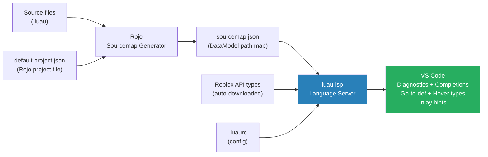
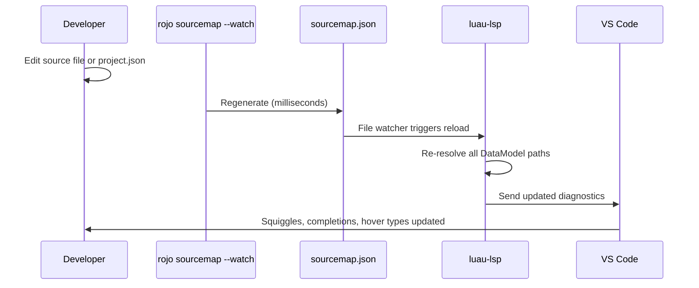
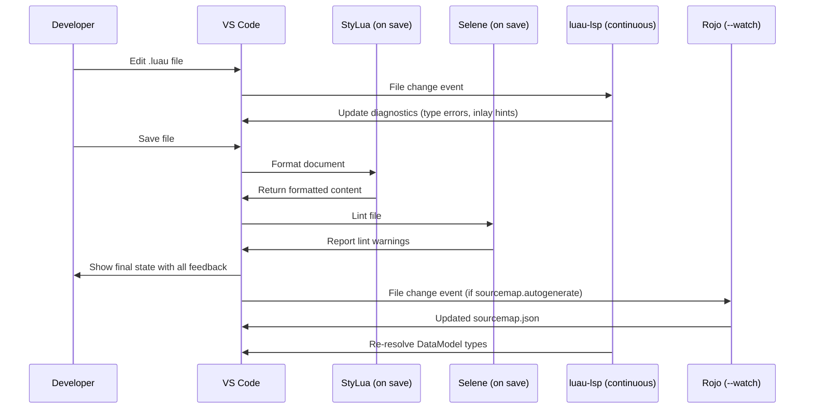

# Module 2.1: VS Code & Luau LSP

## The Toolchain Philosophy

Coming from a backend background you expect a complete IDE experience: type errors underlined as you type, go-to-definition across the codebase, find-all-references, inline type hints, format-on-save. Roblox development in VS Code achieves all of this — but requires wiring three components together:

1. **`luau-lsp`** — the language server providing type checking and navigation
2. **Rojo sourcemap** — maps filesystem files to DataModel paths so the LSP knows what `game.Workspace.MyModel` resolves to
3. **`.luaurc`** — configures strictness and path aliases

Without the sourcemap, the LSP cannot resolve DataModel-style paths like `game:GetService("ReplicatedStorage")` to real types. With it, you get full type information for every Instance in your project.



---

## Installing the Extension

Extension ID: `JohnnyMorganz.luau-lsp`

Install via VS Code marketplace or CLI:

```bash
code --install-extension JohnnyMorganz.luau-lsp
```

The extension bundles the `luau-lsp` binary. On first activation it downloads the Roblox API type definitions from GitHub automatically. No manual setup of the binary is needed.

Companion extensions to install alongside it:

| Extension | ID | Purpose |
|---|---|---|
| luau-lsp | `JohnnyMorganz.luau-lsp` | Type checking, autocompletion, go-to-def |
| StyLua | `JohnnyMorganz.stylua` | Format-on-save (Luau formatter) |
| Selene | `Kampfkarren.selene-vscode` | Lint rules beyond the type checker |
| Rojo | `evaera.vscode-rojo` | Optional: Studio sync management |

---

## `.luaurc` Configuration

`.luaurc` is a JSON file at your project root. It configures the Luau type checker for the entire project.

```json
{
    "$schema": "https://raw.githubusercontent.com/JohnnyMorganz/luau-lsp/main/schemas/luaurc.schema.json",

    "languageMode": "strict",

    "lint": {
        "*": true,
        "LocalShadow": false,
        "ShadowedLocal": false
    },

    "aliases": {
        "shared": "src/shared",
        "server": "src/server",
        "client": "src/client",
        "packages": "Packages"
    }
}
```

### `languageMode` Options

| Mode | Behavior |
|---|---|
| `"nonstrict"` | Relaxed (like `--!nonstrict` on every file). Some errors still shown. |
| `"strict"` | Strict checking (like `--!strict` on every file). Recommended. |
| `"nocheck"` | No type checking at project level. Override per-file with `--!strict`. |

The `languageMode` sets the default for files that don't have a `--!` directive. Files with an explicit directive override this.

### Lint Rules

The `lint` block maps lint rule names to `true` (enable), `false` (disable), or a severity string (`"error"`, `"warning"`, `"information"`, `"hint"`).

```json
{
    "lint": {
        "*": true,
        "UnknownType": "error",
        "DeprecatedApi": "warning",
        "LocalUnused": "warning",
        "ImportUnused": "error",
        "LocalShadow": false
    }
}
```

### Path Aliases

Aliases let you write `require("@shared/Utils")` instead of `require(script.Parent.Parent.Parent.shared.Utils)`. The LSP resolves aliases to the filesystem path for type checking.

```luau
-- With alias configured as "shared" → "src/shared"
local Utils = require("@shared/Utils")
local NetworkConfig = require("@shared/Constants/Network")
```

The `@` prefix is the Luau convention for alias-based requires. Configure Rojo to recognize the same aliases for the runtime path resolution to match.

---

## VS Code Settings

Create or extend `.vscode/settings.json` in your project:

```json
{
    // Luau LSP: tell it where the sourcemap lives
    "luau-lsp.sourcemap.sourcemapFile": "sourcemap.json",

    // Auto-regenerate sourcemap when project files change (requires rojo in PATH)
    "luau-lsp.sourcemap.autogenerate": true,
    "luau-lsp.sourcemap.rojoProjectFile": "default.project.json",

    // Roblox-specific type definitions
    "luau-lsp.types.roblox": true,
    "luau-lsp.types.robloxSecurityLevel": "PluginSecurity",

    // Inlay hints (inline type annotations)
    "luau-lsp.inlayHints.parameterNames": "all",
    "luau-lsp.inlayHints.variableTypes": true,
    "luau-lsp.inlayHints.returnTypes": true,
    "luau-lsp.inlayHints.functionReturnTypes": false,

    // Completion behavior
    "luau-lsp.completion.addParentheses": true,
    "luau-lsp.completion.addTabstopAfterParentheses": true,
    "luau-lsp.completion.fillCallArguments": true,
    "luau-lsp.completion.imports.enabled": true,
    "luau-lsp.completion.imports.suggestServices": true,
    "luau-lsp.completion.imports.suggestRequires": true,
    "luau-lsp.completion.imports.requireStyle": "alwaysRelative",

    // Diagnostics
    "luau-lsp.diagnostics.enabled": true,
    "luau-lsp.diagnostics.strictDatamodelTypes": true,

    // Hover information
    "luau-lsp.hover.enabled": true,
    "luau-lsp.hover.multilineFunctionDefinitions": true,
    "luau-lsp.hover.showTableKinds": true,

    // Format-on-save via StyLua
    "[luau]": {
        "editor.defaultFormatter": "JohnnyMorganz.stylua",
        "editor.formatOnSave": true
    },

    // Exclude generated/output directories from file watcher
    "files.watcherExclude": {
        "**/Packages/**": true,
        "**/.robloxrc/**": true
    }
}
```

### Key Settings Explained

| Setting | What It Does |
|---|---|
| `sourcemap.autogenerate` | Runs `rojo sourcemap` on file change. Requires Rojo in PATH or installed via Rokit. |
| `types.roblox` | Downloads and uses official Roblox API types from GitHub. Provides types for `game`, `workspace`, all services. |
| `types.robloxSecurityLevel` | Controls which API members are visible. `PluginSecurity` shows all including plugin-only APIs. |
| `diagnostics.strictDatamodelTypes` | Enforces types on DataModel instances resolved via sourcemap. Catch `workspace.MissingPart` at edit time. |
| `inlayHints.variableTypes` | Show inferred types inline: `local x: number = 5` even without the annotation. |
| `completion.imports.enabled` | Suggest auto-require for modules in the project. |

---

## The Sourcemap Workflow

The sourcemap is the bridge between your filesystem and the DataModel. Without it, `game.Workspace.SpawnPad` is unresolvable — the LSP doesn't know what `SpawnPad` is. With it, the LSP knows the exact class (`Part`, `Model`, etc.) of every Instance defined in your Rojo project.



### Running the Sourcemap Generator

```bash
# One-shot generation
rojo sourcemap default.project.json --output sourcemap.json

# Watch mode: auto-regenerate when project.json or source files change
rojo sourcemap --watch default.project.json --output sourcemap.json
```

With `luau-lsp.sourcemap.autogenerate: true` in settings, VS Code handles this for you using its bundled Rojo process. For CI pipelines you run it manually.

### What a Sourcemap Looks Like

```json
{
    "name": "game",
    "className": "DataModel",
    "children": [
        {
            "name": "Workspace",
            "className": "Workspace",
            "children": [
                {
                    "name": "SpawnPad",
                    "className": "Part",
                    "filePaths": ["src/world/SpawnPad.rbxm"]
                }
            ]
        },
        {
            "name": "ReplicatedStorage",
            "className": "ReplicatedStorage",
            "children": [
                {
                    "name": "Modules",
                    "className": "Folder",
                    "children": [
                        {
                            "name": "GameState",
                            "className": "ModuleScript",
                            "filePaths": ["src/shared/GameState.luau"]
                        }
                    ]
                }
            ]
        }
    ]
}
```

The LSP reads this to answer questions like: "What is `game.ReplicatedStorage.Modules.GameState`?" → "A `ModuleScript` at `src/shared/GameState.luau`". It can then check the module's return type and provide completions.

---

## `luau-lsp analyze`: Static Analysis in CI

The `luau-lsp` binary ships a CLI `analyze` command that runs the type checker headlessly — no VS Code required. Use this in your CI pipeline to catch type errors on PRs.

```bash
# Basic analysis
luau-lsp analyze --sourcemap=sourcemap.json src/

# With Roblox types
luau-lsp analyze \
    --sourcemap=sourcemap.json \
    --flag:LuauTypeInferIterationLimit=0 \
    --definitions=globalTypes.d.luau \
    src/

# Analyze specific files
luau-lsp analyze --sourcemap=sourcemap.json src/server/ src/shared/
```

The `globalTypes.d.luau` file contains Roblox API type declarations. Download it from the luau-lsp GitHub releases or generate it:

```bash
# Generate fresh Roblox API types (run occasionally to update)
rojo sourcemap default.project.json --output sourcemap.json
```

### Exit Codes

| Code | Meaning |
|---|---|
| `0` | No errors |
| `1` | Type errors found (fail the CI job) |

---

## Selene Integration

Selene is a Rust-based linter that catches issues the type checker misses: deprecated API usage, unused variables in specific patterns, incorrect argument counts for well-known functions.

Install via Rokit (see Module 2.2):

```toml
# rokit.toml
[tools]
selene = "Kampfkarren/selene@0.27.1"
```

VS Code integration: the `Kampfkarren.selene-vscode` extension reads `selene.toml` and runs `selene` on save.

```toml
# selene.toml — minimal Roblox setup
std = "roblox"

[rules]
unused_variable = "warning"
deprecated = "deny"
incorrect_standard_library_use = "deny"
global_usage = "allow"  # Roblox globals like game, workspace are fine
```

The `std = "roblox"` ruleset tells Selene about Roblox globals (`game`, `workspace`, `script`, `Enum`, etc.) so they aren't flagged as undefined.

For custom globals in your project:

```toml
# selene.toml
std = "roblox+custom_globals"

[config]
[config.globals]
MY_GLOBAL = { any = true }
```

---

## StyLua Integration

StyLua is an opinionated Luau formatter, similar to Prettier for JavaScript or gofmt for Go. Zero config needed for default behavior.

```toml
# stylua.toml
column_width = 100
line_endings = "Unix"
indent_type = "Spaces"
indent_width = 4
quote_style = "AutoPreferDouble"
call_parentheses = "Always"
```

Inline ignore comments:

```luau
-- stylua: ignore
local uglyButNecessary = {1,2,3,4,5,6,7,8,9,10,11,12,13,14,15,16}

-- stylua: ignore start
local matrix = {
    {1, 0, 0},
    {0, 1, 0},  -- manually aligned, don't reformat
    {0, 0, 1},
}
-- stylua: ignore end
```

Format check in CI (non-destructive, exits non-zero if files need formatting):

```bash
stylua --check src/
```

---

## Practical Development Workflow

With all tools configured, a typical edit-save cycle looks like:



---

## Troubleshooting Common LSP Issues

### "Cannot find module" for DataModel paths

Symptom: `require(game.ReplicatedStorage.Modules.X)` shows "Cannot find module".

Fix: Ensure the sourcemap is generated and `luau-lsp.sourcemap.sourcemapFile` points to it. Run `rojo sourcemap default.project.json --output sourcemap.json` manually and check the output includes the missing module.

### Type errors in `Packages/` (Wally packages)

Wally-installed packages often lack type annotations or use patterns the strict checker dislikes.

Fix:
```json
{
    "luau-lsp.ignoreGlobs": ["**/Packages/**", "**/DevPackages/**"]
}
```

### LSP not activating

Ensure a `.luaurc` or `.luaurc` ancestor exists. The extension activates on Luau files, but needs a project root indicator.

### Performance: LSP slow on large projects

```json
{
    "luau-lsp.diagnostics.workspace": false
}
```

This limits diagnostics to open files only, reducing background analysis load.

---

## Key Takeaways

1. `luau-lsp` + sourcemap + `.luaurc` is the complete static analysis stack. All three are required for full DataModel-aware type checking.
2. `languageMode: "strict"` in `.luaurc` enforces `--!strict` project-wide. Start with this from day one.
3. `luau-lsp analyze` runs headlessly in CI — wire it into your PR checks.
4. `sourcemap.autogenerate: true` handles the Rojo sourcemap regeneration automatically in VS Code.
5. StyLua + Selene together cover formatting and linting concerns that the type checker doesn't address.
6. Ignore `Packages/` in LSP config — third-party packages are often not strict-clean.

---

## Next: Module 2.2 — Rokit, Rojo & Sync

Module 2.2 covers the toolchain manager (Rokit), project structure sync (Rojo), file naming conventions, and Argon as an alternative — all the plumbing that connects your filesystem to the Roblox Studio DataModel.
