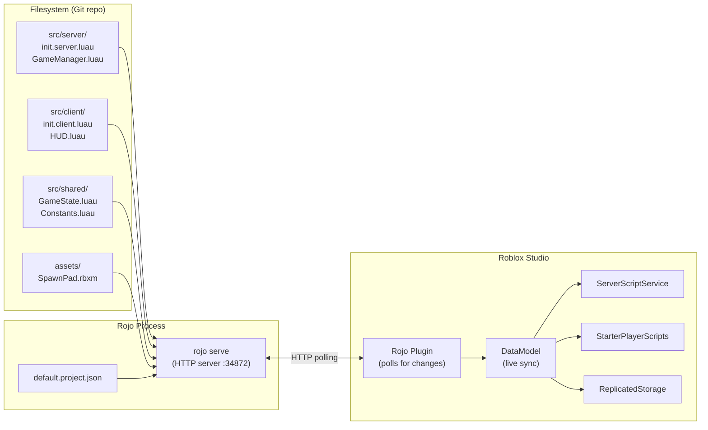

# Module 2.2: Rokit, Rojo & Studio Sync

## The Problem Being Solved

Roblox Studio is a visual editor with an internal DataModel. By default, all your code lives inside `.rbxl` or `.rbxlx` binary/XML files — not version-control-friendly, not reviewable in PRs, not diffable. The toolchain described in this module solves that by externalizing the codebase to the filesystem and syncing bidirectionally with Studio.

The workflow becomes:
- **Develop** in VS Code with the Luau LSP
- **Run/Play** in Roblox Studio (it sees your file changes live)
- **Version control** with Git like any other software project
- **Build** `.rbxl` files in CI for automated testing or publishing

---

## Rokit: Toolchain Version Manager

**Rokit** is the current (2025/2026) standard for managing Roblox toolchain binaries. It replaces Foreman (which is no longer actively maintained).

Think of Rokit as the `asdf` or `nvm` of the Roblox ecosystem — it installs and pins specific versions of tools (Rojo, Selene, StyLua, Lune, etc.) per project via a `rokit.toml` manifest.

### Installation

```bash
# macOS/Linux
curl -fsSL https://github.com/rojo-rbx/rokit/releases/latest/download/rokit-macos.zip | tar xz
sudo mv rokit /usr/local/bin/

# Windows (PowerShell)
irm https://github.com/rojo-rbx/rokit/releases/latest/download/rokit-windows.zip | iex

# After installation: initialize (creates ~/.rokit if first run)
rokit self-install
```

### `rokit.toml` Configuration

```toml
# rokit.toml — lives at project root, committed to git

[tools]
# Format: "author/repo@version"
rojo = "rojo-rbx/rojo@7.4.4"
wally = "UpliftGames/wally@0.3.2"
selene = "Kampfkarren/selene@0.27.1"
stylua = "JohnnyMorganz/StyLua@0.20.0"
lune = "lune-org/lune@0.8.6"
luau-lsp = "JohnnyMorganz/luau-lsp@1.33.1"
```

### Installing Tools

```bash
# Install all tools defined in rokit.toml
rokit install

# After this, tools are available in PATH for the current directory
rojo --version   # Uses version pinned in rokit.toml
stylua --version
selene --version

# Install a specific tool globally (available everywhere)
rokit install --global rojo@7.4.4

# List installed tools
rokit list
```

### Per-Project vs Global

Rokit shims executables into `~/.rokit/bin/`. When you run `rojo` in a directory with a `rokit.toml`, Rokit automatically uses the version pinned in that file. Different projects can use different versions without conflict.

This is equivalent to npm's `package.json` engines field + nvm, but it applies to all CLI tools, not just Node packages.

---

## Rojo v7: Filesystem-to-DataModel Mapping

Rojo maps a directory structure to the Roblox DataModel. It watches files for changes and syncs them to Studio in real time (via a Studio plugin that polls a local Rojo server).



### `default.project.json` Format

```json
{
    "name": "MyGame",
    "tree": {
        "$className": "DataModel",

        "ServerScriptService": {
            "$className": "ServerScriptService",
            "$path": "src/server"
        },

        "StarterPlayer": {
            "$className": "StarterPlayer",
            "StarterPlayerScripts": {
                "$className": "StarterPlayerScripts",
                "$path": "src/client"
            },
            "StarterCharacterScripts": {
                "$className": "StarterCharacterScripts",
                "$path": "src/character"
            }
        },

        "ReplicatedStorage": {
            "$className": "ReplicatedStorage",
            "Modules": {
                "$className": "Folder",
                "$path": "src/shared"
            },
            "Remotes": {
                "$className": "Folder",
                "$path": "src/remotes"
            }
        },

        "ServerStorage": {
            "$className": "ServerStorage",
            "$path": "src/server-storage"
        },

        "Workspace": {
            "$className": "Workspace",
            "$properties": {
                "FilteringEnabled": true,
                "Gravity": 196.2
            },
            "World": {
                "$path": "assets/world"
            }
        }
    }
}
```

### Key `$` Properties

| Key | Purpose |
|---|---|
| `$className` | The Roblox class for this node (required unless inferred from file type) |
| `$path` | Map a filesystem path to this DataModel location |
| `$properties` | Set properties on the Instance directly from the project file |
| `$ignoreUnknownInstances` | If `true`, don't delete DataModel instances that aren't in the filesystem |

---

## File Naming Conventions

Rojo infers the Roblox Instance type from the file extension and suffix:

| Filename Pattern | Roblox Instance | Notes |
|---|---|---|
| `Foo.server.luau` | `Script` (RunContext=Server), Name="Foo" | Server script |
| `Foo.client.luau` | `LocalScript`, Name="Foo" | Client script |
| `Foo.luau` | `ModuleScript`, Name="Foo" | Module |
| `init.server.luau` | `Script` inside the parent folder | Folder becomes an Instance |
| `init.client.luau` | `LocalScript` inside the parent folder | |
| `init.luau` | `ModuleScript` inside the parent folder | Module represents the folder |
| `Foo.rbxm` | Instance tree from binary model file | Meshes, complex models |
| `Foo.rbxmx` | Instance tree from XML model file | Human-readable model |
| `Foo.json` | `ModuleScript` with JSON content | Auto-requires return decoded table |
| `Foo.txt` | `StringValue` with text content | |
| `Foo.csv` | `LocalizationTable` | |

### The `init` Pattern

When a directory contains an `init.luau` (or `init.server.luau` / `init.client.luau`), the directory itself becomes the named Instance, and the `init` file becomes its script. Children of the directory become children of that Instance.

```
src/shared/
  GameState/
    init.luau          → ModuleScript named "GameState"
    Validators.luau    → ModuleScript named "Validators" (child of GameState)
    Types.luau         → ModuleScript named "Types" (child of GameState)
```

This mirrors the Node.js `index.js` convention. The `init` module can `require` its siblings:

```luau
-- GameState/init.luau
local Validators = require(script.Validators)  -- script = the GameState ModuleScript
local Types = require(script.Types)

-- ... module implementation
```

---

## Directory Structure: A Full Example

```
my-game/
├── rokit.toml
├── wally.toml
├── wally.lock
├── default.project.json
├── selene.toml
├── stylua.toml
├── .luaurc
├── sourcemap.json          ← generated by rojo, gitignored
├── .vscode/
│   └── settings.json
├── src/
│   ├── server/
│   │   ├── init.server.luau    → Script in ServerScriptService
│   │   ├── GameManager.luau    → ModuleScript (child)
│   │   ├── DataManager.luau    → ModuleScript (child)
│   │   └── Remotes/
│   │       └── init.luau       → ModuleScript setting up RemoteEvents
│   ├── client/
│   │   ├── init.client.luau    → LocalScript in StarterPlayerScripts
│   │   ├── HUD.luau            → ModuleScript
│   │   └── InputHandler.luau   → ModuleScript
│   ├── shared/
│   │   ├── GameState.luau      → ModuleScript in ReplicatedStorage/Modules
│   │   ├── Constants.luau
│   │   └── Types.luau
│   └── character/
│       └── init.client.luau    → LocalScript in StarterCharacterScripts
├── assets/
│   └── world/
│       ├── SpawnArea.rbxm
│       └── LevelGeometry.rbxm
└── Packages/                   ← generated by wally, gitignored
    └── ...
```

---

## `rojo serve` vs `rojo build`

### `rojo serve`: Live Development

```bash
# Start the Rojo dev server
rojo serve default.project.json

# Custom port if 34872 is taken
rojo serve default.project.json --port 34873
```

With Rojo serving, the Studio Rojo plugin polls `http://localhost:34872/` every few hundred milliseconds. File changes appear in Studio within ~500ms. This is a one-way sync from filesystem → Studio by default. See Argon below for true two-way sync.

### `rojo build`: Generate a `.rbxl` File

```bash
# Build a place file (for CI, publishing, playtesting without Studio plugin)
rojo build default.project.json --output game.rbxl

# XML format (human-readable, version-controllable but large)
rojo build default.project.json --output game.rbxlx
```

The built `.rbxl` can be:
- Uploaded via Roblox Open Cloud API
- Tested with Lune headlessly
- Archived as a release artifact

---

## `rojo sourcemap`: LSP Integration

```bash
# One-shot sourcemap generation
rojo sourcemap default.project.json --output sourcemap.json

# Watch mode (keeps sourcemap current as you add/rename files)
rojo sourcemap --watch default.project.json --output sourcemap.json
```

The sourcemap tells `luau-lsp` how DataModel paths map to filesystem paths and what `ClassName` each node has. Without it, the LSP cannot provide completions or type-check DataModel references. See Module 2.1 for the full LSP configuration.

---

## Bidirectional Sync: Rojo Limitations

Standard Rojo (`rojo serve`) is **one-way**: filesystem to Studio. Changes made directly in Studio (moving a Part, changing a property in the properties panel) do not sync back to the filesystem.

For a pure code project (scripts, configuration) this is fine — all changes happen in VS Code anyway. Problems arise when:
- Designers work in Studio to place and configure models
- You want to extract in-Studio work to the filesystem
- Non-script instance properties are changed in Studio

Solutions:
1. Use `rojo build --output` + commit the `.rbxlx` for designer-heavy scenes
2. Use `rojo plugin sync` (partial support in newer Rojo versions)
3. Use **Argon** for full two-way sync

---

## Argon: Full-Featured Sync Alternative

**Argon** is a community-developed alternative to Rojo that provides full bidirectional sync. It is 100% Rojo project format compatible — you can switch between Rojo and Argon on the same project.

Key features Argon adds over Rojo:

| Feature | Rojo | Argon |
|---|---|---|
| Filesystem → Studio | Yes | Yes |
| Studio → Filesystem | Limited | Full |
| Non-script instances | No | Yes |
| Instance properties | Partial | Full |
| VS Code extension | No (3rd party) | Official |
| Roblox plugin | Required | Required |
| `placeIds` in project | `placeId` (singular) | `placeIds` (array) |

### Argon Project Migration

Argon uses `placeIds` (an array) where older Rojo used `placeId` (a single value):

```json
// Old Rojo format
{
    "name": "MyGame",
    "placeId": 1234567890,
    "tree": { ... }
}

// Argon-compatible (and new Rojo 7.x compatible) format
{
    "name": "MyGame",
    "placeIds": [1234567890, 9876543210],
    "tree": { ... }
}
```

### Using Argon

```bash
# Install Argon via Rokit
# Add to rokit.toml:
# argon = "argon-rbx/argon@2.0.0"

rokit install

# Serve with Argon (same project.json as Rojo)
argon serve default.project.json

# Build a place file
argon build default.project.json --output game.rbxl

# Two-way sync: Studio changes sync back to filesystem
argon serve default.project.json --two-way
```

The VS Code extension (`argon-rbx.argon`) provides a sidebar UI for managing sync sessions without touching the terminal.

---

## When to Use Which Tool

| Scenario | Recommendation |
|---|---|
| Code-only project (scripts, no designer assets) | Rojo — simpler, well-documented |
| Mixed code + Studio-designed scenes | Argon — two-way sync is essential |
| CI/CD pipeline (build + test) | Rojo — `rojo build` is battle-tested |
| Team with both engineers and designers | Argon — prevents overwrite conflicts |
| Existing Rojo project | Stay on Rojo unless you need two-way |
| New project from scratch (2026) | Either — both are excellent |

---

## `.gitignore` for a Rojo/Argon Project

```gitignore
# Generated files
sourcemap.json
*.rbxl
*.rbxlx

# Wally packages (reinstalled via wally install)
Packages/
DevPackages/
ServerPackages/

# Rokit local cache
.rokit/

# OS cruft
.DS_Store
Thumbs.db

# Editor
.vscode/launch.json
```

Note: Some teams commit `sourcemap.json` to avoid requiring every developer to run Rojo before opening VS Code. The tradeoff is merge conflicts on the sourcemap. If your CI generates it fresh each run, it's safe to gitignore.

---

## Key Takeaways

1. Rokit replaces Foreman. Use `rokit.toml` to pin all tool versions per project. `rokit install` sets everything up from scratch.
2. Rojo maps your filesystem to the DataModel via `default.project.json`. File suffixes (`.server.luau`, `.client.luau`, `.luau`) determine the Instance class.
3. The `init.luau` pattern lets a directory represent a named ModuleScript — use it for modules with sub-modules.
4. `rojo serve` for live development, `rojo build` for CI artifacts, `rojo sourcemap` for LSP integration.
5. Rojo is one-way (filesystem → Studio) by default. For two-way sync with designer assets, use Argon.
6. Argon is 100% Rojo project compatible. The only migration needed is `placeId` → `placeIds`.

---

## Next: Module 2.3 — Wally, Selene, StyLua & CI/CD

Module 2.3 covers the full quality toolchain: Wally for package management, Selene for linting, StyLua for formatting, Lune for headless scripting, and wiring everything into a GitHub Actions CI pipeline.
