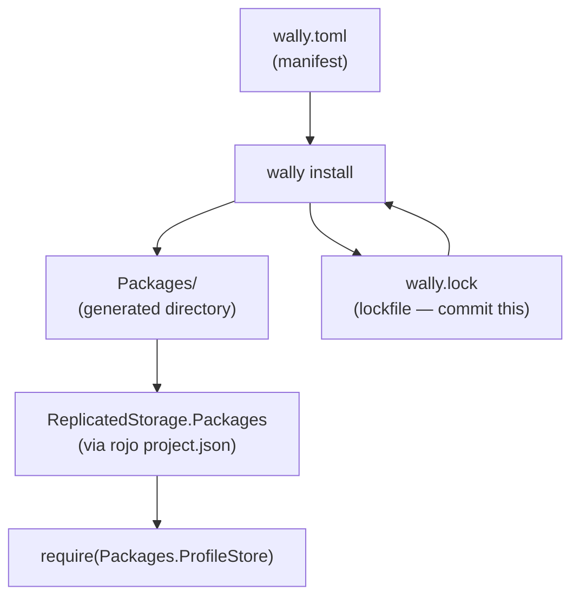
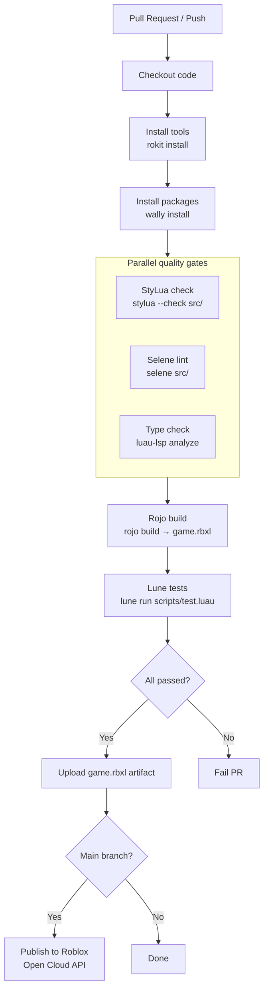
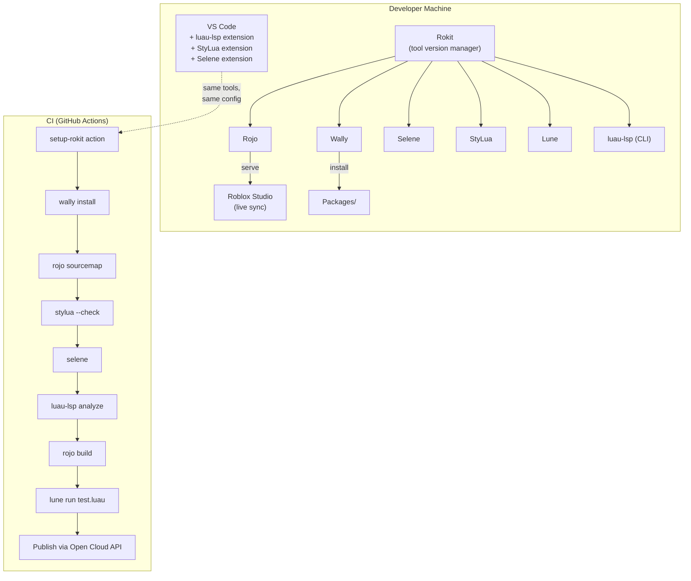

# Module 2.3: Wally, Selene, StyLua & CI/CD

## The Quality Toolchain

By this point you have:
- A Luau LSP providing type checking (Module 2.1)
- Rojo/Argon syncing your filesystem to Studio (Module 2.2)

This module completes the picture with the tooling that enforces code quality at commit and PR time:

| Tool | Role | Analogy |
|---|---|---|
| **Wally** | Package manager | Cargo / npm |
| **Selene** | Linter | ESLint / Clippy |
| **StyLua** | Formatter | Prettier / gofmt |
| **Lune** | Headless Luau runtime | Node.js / Deno (for scripts) |
| **GitHub Actions** | CI orchestrator | GitHub Actions (same) |

All tools are version-pinned via `rokit.toml` (see Module 2.2).

---

## Wally: The Package Manager

Wally is a Cargo-inspired package manager for Roblox Luau. Packages live on the Wally registry (`wally.pkg.st`) and are identified by `author/package@version`.



### `wally.toml` Configuration

```toml
[package]
name = "my-org/my-game"
version = "0.1.0"
registry = "https://github.com/UpliftGames/wally-index"
realm = "shared"  # "shared", "server", or "dev"

[dependencies]
# Player data persistence
ProfileStore = "madstudioroblox/profilestore@1.0.0"

# Reactive UI framework
Fusion = "dphfox/fusion@0.3.0"

# Networking with type-safe packets
ByteNet = "ffrostflame/bytennet@0.6.0"

# Promise/async pattern
Promise = "evaera/promise@4.0.0"

# Entity Component System
Matter = "matter-ecs/matter@0.8.4"

# Lightweight ECS (newer alternative to Matter)
Jecs = "ukendio/jecs@0.4.0"

# Admin commands framework
Cmdr = "evaera/cmdr@1.12.0"

[server-dependencies]
# Server-only packages (not replicated to client)
ProfileService = "loleris/profileservice@1.7.0"

[dev-dependencies]
# Testing framework (only in development)
TestEZ = "roblox/testez@0.4.1"
```

### Installing and Using Packages

```bash
# Install all dependencies
wally install

# This generates:
# Packages/           ← shared packages (goes to ReplicatedStorage)
# ServerPackages/     ← server packages (goes to ServerStorage)
# DevPackages/        ← dev packages (not synced to Studio)
```

Wire Wally's output into your Rojo project:

```json
{
    "name": "MyGame",
    "tree": {
        "$className": "DataModel",

        "ReplicatedStorage": {
            "$className": "ReplicatedStorage",
            "Packages": {
                "$path": "Packages"
            }
        },

        "ServerStorage": {
            "$className": "ServerStorage",
            "Packages": {
                "$path": "ServerPackages"
            }
        }
    }
}
```

```luau
-- Require Wally packages like any other module
local ReplicatedStorage = game:GetService("ReplicatedStorage")
local Packages = ReplicatedStorage.Packages

local Promise = require(Packages.Promise)
local ProfileStore = require(Packages.ProfileStore)
local Fusion = require(Packages.Fusion)
```

### Popular Wally Packages (2026)

| Package | Author | Purpose |
|---|---|---|
| `ProfileStore` | madstudioroblox | Player data persistence with session locking |
| `Fusion` | dphfox | Reactive UI framework (like React for Roblox) |
| `ByteNet` | ffrostflame | Typed, efficient networking |
| `Promise` | evaera | Promise/async abstraction |
| `Matter` | matter-ecs | Entity Component System |
| `Jecs` | ukendio | Lightweight ECS, faster than Matter |
| `Cmdr` | evaera | Admin command framework |
| `Signal` | sleitnick | Type-safe event signals |
| `Trove` | sleitnick | Connection/cleanup management (like AbortController) |
| `TableUtil` | sleitnick | Extended table utilities |
| `Janitor` | howmanysmall | Alternative cleanup/destruction manager |
| `React` | jsdotlua | Full React port for Roblox UI |

### `wally.lock`: The Lockfile

Wally generates `wally.lock` to pin exact resolved versions of all transitive dependencies. Commit this file. It ensures every developer and CI run gets identical packages.

```toml
# wally.lock (auto-generated, do not edit manually)
[metadata]
lockfile-version = 3

[[package]]
name = "evaera/promise"
version = "4.0.0"
dependencies = []
checksum = "sha512-abc123..."

[[package]]
name = "madstudioroblox/profilestore"
version = "1.0.0"
dependencies = []
checksum = "sha512-def456..."
```

### pesde: The Emerging Alternative

**pesde** is a newer package manager (2024-2025) that supports multiple package sources (Wally registry, GitHub, local paths) and has a richer dependency model. It is not yet the dominant standard but is gaining traction as of early 2026. Worth monitoring if starting a new long-lived project — it may become the standard.

```toml
# pesde.toml (if using pesde)
[package]
name = "my-org/my-game"
version = "0.1.0"
description = "My Roblox game"

[dependencies]
promise = { wally = "evaera/promise", version = "^4.0.0" }
```

---

## Selene: Rust-Based Luau Linter

Selene is a static analysis tool written in Rust that catches issues beyond type errors: deprecated APIs, unused variables, incorrect argument patterns, and Roblox-specific antipatterns.

Think of it as ESLint for Luau — the type checker catches type errors, Selene catches code quality issues.

### `selene.toml` Configuration

```toml
# selene.toml

# Use the Roblox standard library definition
# This makes Selene aware of Roblox globals: game, workspace, script, Enum, etc.
std = "roblox"

# Severity overrides per rule
[rules]
# Errors (fail CI)
incorrect_standard_library_use = "deny"
shadowing = "deny"
undefined_variable = "deny"
mismatched_arg_count = "deny"

# Warnings (shown but don't fail CI unless --display-style=json used)
unused_variable = "warn"
empty_if = "warn"
global_usage = "warn"

# Disabled rules
mixed_table = "allow"       # Roblox DataModel iteration sometimes mixes
multiple_returns = "allow"  # Common Roblox pattern
```

### Running Selene

```bash
# Lint all source files
selene src/

# Lint with JSON output (for CI integration)
selene --display-style=json src/ | jq '.[] | select(.severity == "Error")'

# Check a single file
selene src/server/GameManager.luau
```

### Selene and External Type Definitions

Selene's Roblox standard library definition (`std = "roblox"`) is built into the package, but you can add custom global definitions for your project's specific globals:

```toml
# selene.toml
std = "roblox+game_globals"

[config]
[config.globals]
# Custom globals your codebase defines
MY_GAME_VERSION = { any = true }
DEBUG_MODE = { any = true }
```

For Wally packages, Selene needs to know about the `Packages` directory:

```toml
# selene.toml
std = "roblox"

[rules]
undefined_variable = "allow"  # Packages directory paths aren't known to Selene

# OR: add Packages to the exclude list
[exclude]
paths = ["Packages/**", "DevPackages/**", "ServerPackages/**"]
```

### Key Selene Rules to Know

| Rule | What It Catches | Default |
|---|---|---|
| `undefined_variable` | Using a variable before declaration | deny |
| `unused_variable` | Declared but never read | warn |
| `shadowing` | Inner variable hiding outer with same name | warn |
| `deprecated` | Using deprecated Roblox APIs | warn |
| `incorrect_standard_library_use` | Wrong arg count/type for stdlib | deny |
| `empty_if` | `if condition then end` with no body | warn |
| `global_usage` | Writing to globals (not reading) | warn |
| `mismatched_arg_count` | Calling function with wrong arg count | deny |

---

## StyLua: Opinionated Luau Formatter

StyLua is to Luau what `gofmt` is to Go or `black` is to Python — one canonical format, no arguments. It is written in Rust and is extremely fast.

### `stylua.toml` Configuration

```toml
# stylua.toml

# Line length before wrapping expressions
column_width = 100

# Line endings
line_endings = "Unix"          # "Unix" (LF) or "Windows" (CRLF)

# Indentation
indent_type = "Spaces"         # "Spaces" or "Tabs"
indent_width = 4

# Quote style for strings
quote_style = "AutoPreferDouble"
# "AutoPreferDouble" — use double quotes unless string contains double quotes
# "AutoPreferSingle" — prefer single quotes
# "ForceDouble" / "ForceSingle" — always use one style

# Whether to add parentheses to call expressions
call_parentheses = "Always"
# "Always" — always add parens: foo()
# "NoSingleString" — omit parens for single string arg: foo "bar"
# "NoSingleTable" — omit parens for single table arg: foo { key = val }
# "None" — never add extra parens

# Collapse simple functions onto one line
collapse_simple_statement = "Never"
# "Never" / "FunctionOnly" / "ConditionalOnly" / "Always"
```

### StyLua Commands

```bash
# Format all Luau files in src/ (in-place)
stylua src/

# Check if files need formatting (CI mode — no file modification)
stylua --check src/
# Exits 0 if all files are formatted, 1 if any need formatting

# Format a single file
stylua src/server/GameManager.luau

# Format stdin
cat myfile.luau | stylua -
```

### Inline Ignore Directives

```luau
-- stylua: ignore
local matrix = {{1,0,0},{0,1,0},{0,0,1}}  -- StyLua won't touch this line

-- stylua: ignore start
local lookup = {
    ["NORTH"] = Vector3.new( 0,  0, -1),
    ["SOUTH"] = Vector3.new( 0,  0,  1),
    ["EAST"]  = Vector3.new( 1,  0,  0),  -- aligned for readability
    ["WEST"]  = Vector3.new(-1,  0,  0),
}
-- stylua: ignore end
```

---

## Lune: Standalone Luau Runtime

Lune is a standalone Luau runtime — think Deno but for Luau. It lets you write Luau scripts that run outside Roblox for:

- **CI scripts**: build steps, file processing, release automation
- **Headless testing**: run tests without Studio
- **Tooling scripts**: code generation, documentation extraction

Lune provides standard libraries not available in Roblox: `fs` (filesystem), `net` (HTTP), `process` (shell), `task` (same as Roblox), `serde` (JSON/TOML/YAML).

### TestEZ Replacement

TestEZ was archived by Roblox in September 2024. The current standard for headless testing is running tests with Lune directly, or using `lune-test` runner patterns.

```luau
-- scripts/test.luau (runs with Lune in CI)
local process = require("@lune/process")
local fs = require("@lune/fs")

-- Simple test runner example
local passed = 0
local failed = 0

local function test(name: string, fn: () -> ())
    local ok, err = pcall(fn)
    if ok then
        passed += 1
        print(`  PASS  {name}`)
    else
        failed += 1
        print(`  FAIL  {name}: {err}`)
    end
end

local function assertEqual<T>(actual: T, expected: T, msg: string?)
    if actual ~= expected then
        error(`Expected {tostring(expected)}, got {tostring(actual)}: {msg or ""}`, 2)
    end
end

-- Import shared modules (Lune can require filesystem paths)
local GameState = require("../src/shared/GameState")

-- Tests
test("GameState.getRound returns 0 initially", function()
    assertEqual(GameState.getRound(), 0)
end)

test("GameState.incrementRound increments round", function()
    GameState.incrementRound()
    assertEqual(GameState.getRound(), 1)
end)

-- Summary
print(`<br/>{passed} passed, {failed} failed`)
if failed > 0 then
    process.exit(1)
end
```

### Lune Build Script

```luau
-- scripts/build.luau
local process = require("@lune/process")
local fs = require("@lune/fs")

-- Run rojo build
local result = process.spawn("rojo", {
    "build",
    "default.project.json",
    "--output",
    "game.rbxl"
})

if not result.ok then
    print("Rojo build failed:")
    print(result.stderr)
    process.exit(1)
end

print("Build successful: game.rbxl")
print(`File size: {fs.metadata("game.rbxl").size} bytes`)
```

---

## CI/CD Pipeline: Putting It Together



### GitHub Actions Workflow

```yaml
# .github/workflows/ci.yml
name: CI

on:
  push:
    branches: [main]
  pull_request:
    branches: [main]

jobs:
  quality:
    name: Quality Gates
    runs-on: ubuntu-latest

    steps:
      - name: Checkout
        uses: actions/checkout@v4

      - name: Install Rokit
        uses: rojo-rbx/setup-rokit@v0.1.2
        # Reads rokit.toml and installs all pinned tools

      - name: Install Wally packages
        run: wally install

      - name: Generate sourcemap
        run: rojo sourcemap default.project.json --output sourcemap.json

      - name: Check formatting (StyLua)
        run: stylua --check src/
        # Fails if any file needs formatting — developer must run stylua locally

      - name: Lint (Selene)
        run: selene src/

      - name: Type check (luau-lsp)
        run: |
          luau-lsp analyze \
            --sourcemap=sourcemap.json \
            --definitions=globalTypes.d.luau \
            src/

  build:
    name: Build
    runs-on: ubuntu-latest
    needs: quality  # Only run if quality gates pass

    steps:
      - name: Checkout
        uses: actions/checkout@v4

      - name: Install Rokit
        uses: rojo-rbx/setup-rokit@v0.1.2

      - name: Install Wally packages
        run: wally install

      - name: Build place file
        run: rojo build default.project.json --output game.rbxl

      - name: Run tests
        run: lune run scripts/test.luau

      - name: Upload artifact
        uses: actions/upload-artifact@v4
        with:
          name: game-${{ github.sha }}
          path: game.rbxl
          retention-days: 14

  publish:
    name: Publish to Roblox
    runs-on: ubuntu-latest
    needs: build
    if: github.ref == 'refs/heads/main'

    steps:
      - name: Download artifact
        uses: actions/download-artifact@v4
        with:
          name: game-${{ github.sha }}

      - name: Publish via Open Cloud API
        env:
          ROBLOX_API_KEY: ${{ secrets.ROBLOX_API_KEY }}
          UNIVERSE_ID: ${{ secrets.UNIVERSE_ID }}
          PLACE_ID: ${{ secrets.PLACE_ID }}
        run: |
          curl -X PATCH \
            "https://apis.roblox.com/universes/v1/$UNIVERSE_ID/places/$PLACE_ID/versions" \
            -H "x-api-key: $ROBLOX_API_KEY" \
            -H "Content-Type: application/octet-stream" \
            --data-binary @game.rbxl
```

### Pre-commit Hooks

For fast local feedback before CI runs:

```bash
# Install pre-commit (Python tool, or use the npm package)
pip install pre-commit

# .pre-commit-config.yaml
cat > .pre-commit-config.yaml << 'EOF'
repos:
  - repo: local
    hooks:
      - id: stylua
        name: StyLua
        entry: stylua --check
        language: system
        files: \.luau$
        pass_filenames: true

      - id: selene
        name: Selene
        entry: selene
        language: system
        files: \.luau$
        pass_filenames: true
EOF

pre-commit install
```

Alternatively, use the simpler approach of a `Makefile` + git hooks:

```makefile
# Makefile
.PHONY: check fmt lint typecheck build test

check: fmt lint typecheck

fmt:
	stylua --check src/

fmt-fix:
	stylua src/

lint:
	selene src/

typecheck:
	rojo sourcemap default.project.json --output sourcemap.json
	luau-lsp analyze --sourcemap=sourcemap.json src/

build:
	wally install
	rojo build default.project.json --output game.rbxl

test:
	lune run scripts/test.luau

clean:
	rm -f game.rbxl sourcemap.json
	rm -rf Packages/ ServerPackages/ DevPackages/
```

---

## Full Project Bootstrap Sequence

```bash
# 1. Install Rokit globally (once per machine)
curl -fsSL https://github.com/rojo-rbx/rokit/releases/latest/download/rokit-macos.zip | tar xz
sudo mv rokit /usr/local/bin/
rokit self-install

# 2. Clone project
git clone https://github.com/my-org/my-game
cd my-game

# 3. Install all pinned tools from rokit.toml
rokit install

# 4. Install Wally packages
wally install

# 5. Generate sourcemap (so LSP works immediately in VS Code)
rojo sourcemap default.project.json --output sourcemap.json

# 6. Open in VS Code (LSP activates automatically)
code .

# 7. Start Rojo dev server (connect Studio to it)
rojo serve default.project.json
```

New developer onboarding: steps 2-7. No global install chaos — everything is version-pinned per project.

---

## Complete Configuration Files Reference

### `rokit.toml`

```toml
[tools]
rojo = "rojo-rbx/rojo@7.4.4"
wally = "UpliftGames/wally@0.3.2"
selene = "Kampfkarren/selene@0.27.1"
stylua = "JohnnyMorganz/StyLua@0.20.0"
lune = "lune-org/lune@0.8.6"
luau-lsp = "JohnnyMorganz/luau-lsp@1.33.1"
```

### `wally.toml`

```toml
[package]
name = "my-org/my-game"
version = "0.1.0"
registry = "https://github.com/UpliftGames/wally-index"
realm = "shared"

[dependencies]
ProfileStore = "madstudioroblox/profilestore@1.0.0"
Promise = "evaera/promise@4.0.0"
Trove = "sleitnick/trove@1.1.1"
Signal = "sleitnick/signal@2.0.2"
TableUtil = "sleitnick/tableutil@2.1.0"

[server-dependencies]
Cmdr = "evaera/cmdr@1.12.0"

[dev-dependencies]
Testez = "roblox/testez@0.4.1"
```

### `selene.toml`

```toml
std = "roblox"

[rules]
incorrect_standard_library_use = "deny"
undefined_variable = "deny"
shadowing = "warn"
unused_variable = "warn"
deprecated = "warn"
empty_if = "warn"
global_usage = "warn"
mismatched_arg_count = "deny"
```

### `stylua.toml`

```toml
column_width = 100
line_endings = "Unix"
indent_type = "Spaces"
indent_width = 4
quote_style = "AutoPreferDouble"
call_parentheses = "Always"
collapse_simple_statement = "Never"
```

### `.luaurc`

```json
{
    "$schema": "https://raw.githubusercontent.com/JohnnyMorganz/luau-lsp/main/schemas/luaurc.schema.json",
    "languageMode": "strict",
    "lint": {
        "*": true,
        "LocalShadow": false
    },
    "aliases": {
        "shared": "src/shared",
        "server": "src/server",
        "client": "src/client",
        "packages": "Packages"
    }
}
```

---

## Key Takeaways

1. Wally is Cargo for Roblox. `wally.toml` + `wally.lock` are committed; `Packages/` is gitignored and regenerated.
2. Wire Wally's `Packages/` directory into your Rojo project so packages are available in the DataModel.
3. Selene (`std = "roblox"`) catches issues the type checker misses. Run it alongside `luau-lsp analyze`.
4. StyLua is zero-configuration formatting. Use `stylua --check` in CI and `stylua` locally. Remove all formatting opinions from code review.
5. TestEZ was archived in September 2024. Use Lune as the headless test runtime.
6. The CI pipeline order matters: format check → lint → type check → build → test → publish. Each gate is fast and catches a distinct class of problems.
7. `setup-rokit` GitHub Action installs all tools from `rokit.toml` in a single CI step. No separate tool installation steps needed.

---

## The Complete Toolchain at a Glance



The key insight: every tool run in CI is also run locally with identical versions (via Rokit). "Works on my machine" ceases to be a valid excuse.
