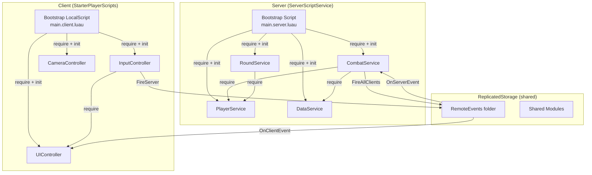
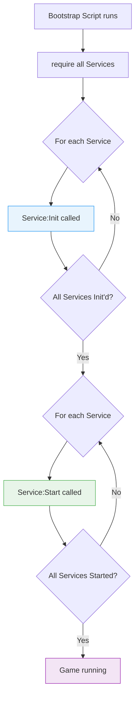

# 3.1 Service-Controller Pattern

## Overview

If you've built microservice backends, the Service-Controller pattern will feel immediately familiar — it's essentially the same separation of concerns applied to a Roblox codebase. Server-side **Services** own game logic and state. Client-side **Controllers** manage local UI and player experience. A single bootstrap script wires everything together at startup.

This pattern is the de-facto standard for production Roblox codebases. It predates any framework — the frameworks (Knit, Flamework, etc.) emerged to codify and automate the pattern, but the pattern itself is simple enough to implement without dependencies.

---

## Backend Analogy

| Backend Concept | Roblox Equivalent |
|---|---|
| Microservice (Node.js process, Go binary) | Server Service (`ModuleScript` under `ServerScriptService`) |
| API Gateway / BFF | Server `Script` (the bootstrap entry point) |
| Client-side state manager (Redux, Zustand) | Client Controller (`ModuleScript` under `StarterPlayerScripts`) |
| Service mesh / internal RPC | Direct `require()` on server (same process) |
| Service registry / IoC container | Manual dependency ordering in bootstrap |
| `main()` entry point | Root `Script` or `LocalScript` that bootstraps all modules |

The key insight: **on the server, all Services run in the same Luau VM**. There is no network boundary between services. A `PlayerService` can directly call into a `CurrencyService` by requiring it. This is simpler than microservices — no HTTP, no message queues between server-side components.

---

## ModuleScript as a Singleton

This is the foundation of the entire pattern. Understanding how `require()` works is non-negotiable.

When Roblox evaluates a `ModuleScript`, the return value is **cached**. Every subsequent `require()` call on the same `ModuleScript` returns the exact same table reference — not a copy.

```luau
-- services/PlayerService.luau
local PlayerService = {}

-- This table is created ONCE and shared everywhere
local _activePlayers: { [Player]: PlayerData } = {}

function PlayerService:GetPlayer(player: Player): PlayerData?
    return _activePlayers[player]
end

function PlayerService:Init()
    -- Called once during bootstrap
    print("PlayerService initialized")
end

function PlayerService:Start()
    -- Called after all services are initialized
    game:GetService("Players").PlayerAdded:Connect(function(player)
        -- handle join
    end)
end

return PlayerService  -- This table is cached by require()
```

```luau
-- Anywhere on the server:
local PlayerService = require(game.ServerScriptService.Services.PlayerService)
local PlayerService2 = require(game.ServerScriptService.Services.PlayerService)

print(PlayerService == PlayerService2)  -- true — same reference
```

This is the **Module Pattern** — equivalent to a singleton in OOP. The first `require()` runs the module body; subsequent calls return the cached result. There is no thread-safety concern here because Roblox's task scheduler is cooperative — modules are loaded synchronously during bootstrap before any async code runs.

---

## The Service-Controller Architecture



---

## Services: Server-Side Singletons

Services live under `ServerScriptService` (or a subfolder). They are never accessible from the client — the client cannot `require()` scripts from `ServerScriptService`.

**Conventions:**
- Named `XyzService` or `XyzManager`
- Expose `Init()` and `Start()` methods
- Hold mutable server state in module-level locals
- Communicate with clients via RemoteEvents only

```luau
-- ServerScriptService/Services/PlayerService.luau
local Players = game:GetService("Players")
local ReplicatedStorage = game:GetService("ReplicatedStorage")

-- Type definitions
type PlayerData = {
    UserId: number,
    DisplayName: string,
    JoinTime: number,
    IsLoaded: boolean,
}

local PlayerService = {}

-- Module-level state (singleton scope)
local _playerData: { [Player]: PlayerData } = {}
local _onPlayerLoaded: BindableEvent = Instance.new("BindableEvent")

-- Public signal (other services can connect to this)
PlayerService.PlayerLoaded = _onPlayerLoaded.Event

function PlayerService:Init()
    -- Pure setup: create instances, define constants
    -- Do NOT start listening to events here (services may not be ready)
    print("[PlayerService] Initialized")
end

function PlayerService:Start()
    -- Safe to connect events here — all services are initialized
    Players.PlayerAdded:Connect(function(player)
        self:_onPlayerAdded(player)
    end)

    Players.PlayerRemoving:Connect(function(player)
        self:_onPlayerRemoving(player)
    end)

    -- Handle players who joined before Start() ran (rare in practice)
    for _, player in Players:GetPlayers() do
        self:_onPlayerAdded(player)
    end
end

function PlayerService:_onPlayerAdded(player: Player)
    _playerData[player] = {
        UserId = player.UserId,
        DisplayName = player.DisplayName,
        JoinTime = os.time(),
        IsLoaded = false,
    }
end

function PlayerService:_onPlayerRemoving(player: Player)
    _playerData[player] = nil
end

function PlayerService:GetData(player: Player): PlayerData?
    return _playerData[player]
end

function PlayerService:SetLoaded(player: Player)
    local data = _playerData[player]
    if data then
        data.IsLoaded = true
        _onPlayerLoaded:Fire(player)
    end
end

function PlayerService:GetAllLoadedPlayers(): { Player }
    local result = {}
    for player, data in _playerData do
        if data.IsLoaded then
            table.insert(result, player)
        end
    end
    return result
end

return PlayerService
```

---

## Controllers: Client-Side Singletons

Controllers live under `StarterPlayerScripts` (or `StarterGui` for UI-specific). They run on each client independently — every player has their own instance of every controller.

**Conventions:**
- Named `XyzController`
- Never access server-only APIs (DataStore, ServerStorage, etc.)
- Own local state (camera state, UI visibility, input maps)
- Communicate with server via RemoteEvents only

```luau
-- StarterPlayerScripts/Controllers/UIController.luau
local Players = game:GetService("Players")
local TweenService = game:GetService("TweenService")
local ReplicatedStorage = game:GetService("ReplicatedStorage")

local Remotes = ReplicatedStorage:WaitForChild("Remotes")

type NotificationData = {
    Message: string,
    Duration: number,
    Style: "Info" | "Warning" | "Error",
}

local UIController = {}

-- Module-level state
local _localPlayer = Players.LocalPlayer
local _playerGui = _localPlayer:WaitForChild("PlayerGui")
local _notificationQueue: { NotificationData } = {}
local _isShowingNotification = false

function UIController:Init()
    -- Create UI instances, bind references
    -- No events yet
    print("[UIController] Initialized")
end

function UIController:Start()
    -- Listen for server-driven UI updates
    local notifyRemote = Remotes:WaitForChild("NotifyPlayer")
    notifyRemote.OnClientEvent:Connect(function(data: NotificationData)
        self:ShowNotification(data)
    end)
end

function UIController:ShowNotification(data: NotificationData)
    table.insert(_notificationQueue, data)
    if not _isShowingNotification then
        self:_processQueue()
    end
end

function UIController:_processQueue()
    if #_notificationQueue == 0 then
        _isShowingNotification = false
        return
    end

    _isShowingNotification = true
    local notification = table.remove(_notificationQueue, 1)

    -- Show the notification UI...
    task.delay(notification.Duration, function()
        self:_processQueue()
    end)
end

return UIController
```

---

## The Bootstrap Pattern

The bootstrap script is the entry point. It is the only `Script` (server) or `LocalScript` (client) that does anything — all logic lives in services/controllers. The bootstrap job is:

1. Collect all service/controller modules
2. Call `Init()` on each (pure setup, no async, no cross-service calls)
3. Call `Start()` on each (safe to connect events, start loops, call into other services)

The two-phase Init/Start split solves the **circular dependency initialization problem**: during `Init()`, no service tries to use another service. During `Start()`, all services are guaranteed to be initialized.



```luau
-- ServerScriptService/main.server.luau
-- This is the ONLY Script in the project. Everything else is ModuleScript.

local ServerScriptService = game:GetService("ServerScriptService")

-- Collect all services from a folder
local servicesFolder = ServerScriptService:WaitForChild("Services")

local services = {}

-- Discover all service modules
for _, module in servicesFolder:GetDescendants() do
    if module:IsA("ModuleScript") then
        local service = require(module)
        table.insert(services, service)
    end
end

-- Phase 1: Initialize all services
-- No service should call into another service during Init()
for _, service in services do
    if typeof(service) == "table" and typeof(service.Init) == "function" then
        local ok, err = pcall(function()
            service:Init()
        end)
        if not ok then
            warn(string.format("[Bootstrap] Init failed for service: %s", tostring(err)))
        end
    end
end

-- Phase 2: Start all services
-- All services are initialized — safe to connect, query, etc.
for _, service in services do
    if typeof(service) == "table" and typeof(service.Start) == "function" then
        local ok, err = pcall(function()
            service:Start()
        end)
        if not ok then
            warn(string.format("[Bootstrap] Start failed for service: %s", tostring(err)))
        end
    end
end

print("[Bootstrap] All services started successfully")
```

```luau
-- StarterPlayerScripts/main.client.luau
-- Mirror of the server bootstrap, but for controllers

local StarterPlayerScripts = game:GetService("StarterPlayerScripts")

local controllersFolder = script.Parent:WaitForChild("Controllers")
local controllers = {}

for _, module in controllersFolder:GetDescendants() do
    if module:IsA("ModuleScript") then
        local controller = require(module)
        table.insert(controllers, controller)
    end
end

-- Phase 1: Init
for _, controller in controllers do
    if typeof(controller) == "table" and typeof(controller.Init) == "function" then
        local ok, err = pcall(function()
            controller:Init()
        end)
        if not ok then
            warn(string.format("[Bootstrap] Controller Init failed: %s", tostring(err)))
        end
    end
end

-- Phase 2: Start
for _, controller in controllers do
    if typeof(controller) == "table" and typeof(controller.Start) == "function" then
        local ok, err = pcall(function()
            controller:Start()
        end)
        if not ok then
            warn(string.format("[Bootstrap] Controller Start failed: %s", tostring(err)))
        end
    end
end

print("[Bootstrap] All controllers started successfully")
```

---

## Cross-Service Communication on Server

Because all services run in the same Luau VM, cross-service calls are just function calls — no IPC, no message queues, no serialization. This is the primary advantage over microservices for game logic.

```luau
-- ServerScriptService/Services/CombatService.luau
local ServerScriptService = game:GetService("ServerScriptService")

-- Directly require sibling services
-- require() is cached — no performance concern calling this at module load time
local PlayerService = require(ServerScriptService.Services.PlayerService)
local DataService = require(ServerScriptService.Services.DataService)

local CombatService = {}

function CombatService:Init()
    -- PlayerService and DataService are required but NOT called here
    -- They may not be Init'd yet
end

function CombatService:Start()
    local Remotes = game:GetService("ReplicatedStorage"):WaitForChild("Remotes")
    local attackRemote = Remotes:WaitForChild("CombatAttack")

    attackRemote.OnServerEvent:Connect(function(player, targetId: number)
        self:HandleAttack(player, targetId)
    end)
end

function CombatService:HandleAttack(attacker: Player, targetId: number)
    -- Direct call into PlayerService — no network hop, no async
    local attackerData = PlayerService:GetData(attacker)
    if not attackerData or not attackerData.IsLoaded then
        return
    end

    -- Direct call into DataService
    local stats = DataService:GetStats(attacker)
    if not stats then
        return
    end

    local damage = stats.AttackPower

    -- Apply damage logic...
    -- Then update data
    DataService:AdjustStat(attacker, "TotalDamageDealt", damage)
end

return CombatService
```

**Key point**: The `require()` at the top of `CombatService` does NOT cause a circular dependency problem as long as neither service calls into the other during module initialization (i.e., at the top level of the module, outside of any function). The problem only occurs if `PlayerService`'s module body calls `require(CombatService)` AND `CombatService`'s module body calls `require(PlayerService)` — Roblox will error with a cyclic dependency. The fix is to use `require()` inside functions rather than at the top level when true cycles exist.

---

## Dependency Ordering

When services have dependencies, the two-phase bootstrap handles most cases. For services that must initialize in a specific order, use explicit ordering:

```luau
-- ServerScriptService/main.server.luau (ordered variant)

local ServerScriptService = game:GetService("ServerScriptService")
local Services = ServerScriptService:WaitForChild("Services")

-- Explicit order matters: DataService must init before PlayerService
-- because PlayerService may reference DataService during Init
local orderedServices = {
    require(Services.DataService),     -- 1. persistence layer first
    require(Services.PlayerService),   -- 2. player management (uses DataService)
    require(Services.CombatService),   -- 3. game logic (uses PlayerService + DataService)
    require(Services.RoundService),    -- 4. orchestrator (uses all others)
}

for _, service in orderedServices do
    service:Init()
end

for _, service in orderedServices do
    service:Start()
end
```

For most codebases, automatic discovery (as shown earlier) works fine because Init/Start separation prevents ordering issues. Explicit ordering is only needed when Init() itself has dependencies.

---

## Knit Framework: Reference Implementation

Knit (by Sleitnick, now archived) was the most widely adopted framework implementing this pattern. It's archived but instructive because thousands of tutorials reference it, and its patterns appear in community code everywhere.

Knit's API was:

```luau
-- Knit (archived) — reference only, do not use in new projects
local Knit = require(ReplicatedStorage.Packages.Knit)

local PlayerService = Knit.CreateService({
    Name = "PlayerService",
    Client = {
        -- RemoteFunctions/Events auto-created here
        GetData = Knit.RemoteFunction,
    }
})

function PlayerService:KnitInit()  -- equivalent to Init()
    -- setup
end

function PlayerService:KnitStart()  -- equivalent to Start()
    -- connect
end

Knit.Start():andThen(function()
    print("Knit started")
end)
```

Knit handled: automatic RemoteEvent/Function creation, service discovery, client-side mirrors. Its weakness was the archived status and complexity it added. Modern projects either roll their own (as shown above) or use lighter alternatives.

---

## Framework vs Roll Your Own

| Factor | Use a Framework | Roll Your Own |
|---|---|---|
| Team size | 3+ developers | Solo or 2 devs |
| Codebase scale | 50k+ lines | Under 20k lines |
| Onboarding speed | Framework docs help | Simpler to understand |
| Framework maintenance | Risk if abandoned | Full control |
| RemoteEvent boilerplate | Framework eliminates it | Manual but transparent |
| Type safety | Depends on framework | You control it |
| Debugging | May hide internals | Transparent call stacks |

**Recommendation for 2026**: Roll your own bootstrap (50–100 lines). It's simple, you understand every line, and it won't become a liability when a framework goes unmaintained. Add typed RemoteEvent wrappers (see Module 3.2) to handle the main source of boilerplate.

---

## File Structure

```
ServerScriptService/
  main.server.luau          ← only Script; bootstrap
  Services/
    PlayerService.luau
    CombatService.luau
    DataService.luau
    RoundService.luau

StarterPlayerScripts/
  main.client.luau          ← only LocalScript; bootstrap
  Controllers/
    UIController.luau
    InputController.luau
    CameraController.luau

ReplicatedStorage/
  Remotes/                  ← RemoteEvents and RemoteFunctions
  Shared/                   ← ModuleScripts accessible to both sides
    Types.luau
    Constants.luau
```

---

## Key Takeaways

- `require()` caches — every call to `require(SomeModule)` returns the same table. This is how singletons work.
- The Init/Start split solves initialization ordering: Init is setup-only, Start is when services can interact.
- On the server, cross-service calls are direct function calls. No message passing needed.
- One `Script` (server) and one `LocalScript` (client) run the bootstrap. All logic is in `ModuleScript`s.
- Controllers are per-client. Services are per-server. They communicate only via RemoteEvents.
- Rolling your own bootstrap is ~50 lines. You don't need a framework for this pattern.

---

## Next: Module 3.2 — RemoteEvent & RPC Patterns

With services and controllers in place, you need a communication channel between them. Module 3.2 covers the three remote communication primitives (RemoteEvent, RemoteFunction, UnreliableRemoteEvent), the five-step validation pattern that prevents exploits, and typed wrapper patterns that eliminate raw `FireServer` / `OnServerEvent` calls from your codebase.
