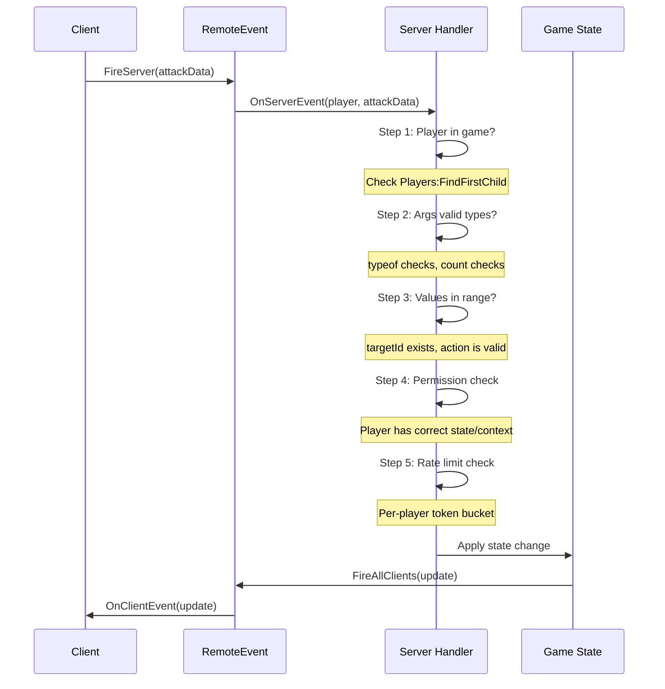

# 3.2 RemoteEvent & RPC Patterns

## Overview

RemoteEvents and RemoteFunctions are the only sanctioned communication channel between the server and client. There is no shared memory, no direct socket, no callback — only the three remote primitives Roblox provides. Understanding their behavior, constraints, and failure modes is critical for building both correct and secure games.

This module covers the mechanics of each primitive, the most important security rule in all of Roblox game development, a five-step validation pattern for every server handler, and typed wrapper patterns that keep your codebase clean.

---

## Backend Analogy

| Roblox Primitive | Backend Analogy | Delivery |
|---|---|---|
| `RemoteEvent` (client → server) | Pub/sub message, one-way push, UDP-like but ordered | Async, fire-and-forget |
| `RemoteEvent` (server → client) | Server-sent event, WebSocket push | Async, no response |
| `RemoteFunction` (client → server) | HTTP POST request/response | Synchronous yield, blocks caller |
| `RemoteFunction` (server → client) | **Do not use** — see critical warning below | Blocks server thread |
| `UnreliableRemoteEvent` | UDP datagram | No guarantee of delivery or order |

The mental model: **the server is the authoritative backend service; the client is an untrusted frontend**. Every `FireServer` call is an untrusted input from an anonymous end-user. Treat it exactly as you would treat an HTTP request to a public API endpoint — validate everything.

---

## The Three Remote Primitives

### RemoteEvent — Async One-Way

`RemoteEvent` is the workhorse. Fire-and-forget, no response, ordered delivery within a given remote.

```luau
-- Fire from client to server
remoteEvent:FireServer(arg1, arg2)

-- Fire from server to one client
remoteEvent:FireClient(player, arg1, arg2)

-- Fire from server to all clients
remoteEvent:FireAllClients(arg1, arg2)

-- Fire from server to all clients EXCEPT one
for _, p in game:GetService("Players"):GetPlayers() do
    if p ~= excludedPlayer then
        remoteEvent:FireClient(p, arg1, arg2)
    end
end
```

Use RemoteEvent for:
- Player actions (attack, move, interact)
- Server → client state updates (health changed, round started)
- Server → client notifications (loot drop, achievement)

### RemoteFunction — Synchronous RPC

`RemoteFunction` blocks the calling thread until the other side returns a value. It is the HTTP request/response pattern.

```luau
-- Client calls server, waits for response
local result = remoteFunction:InvokeServer(requestData)
-- Thread is YIELDED here until server callback returns

-- Server defines the callback
remoteFunction.OnServerInvoke = function(player, requestData)
    -- validate, process
    return responseData  -- unblocks the client
end
```

Use RemoteFunction for:
- Client requesting computed data it doesn't have (e.g., "what items can I craft?")
- Client initiating a purchase flow that requires server confirmation before UI update
- Sparingly — prefer RemoteEvent with a response event for most cases

### CRITICAL RULE: Never Invoke Server → Client

**Never call `RemoteFunction:InvokeClient()` from the server.**

This is arguably the most important security rule in Roblox development. An exploiter can intercept the `OnClientInvoke` callback and simply never return a value. The server thread that called `InvokeClient()` will yield forever, consuming a thread slot. If an exploiter loops this, they can exhaust the server's thread pool and crash or hang the server for all players.

```luau
-- WRONG — never do this
remoteFunction:InvokeClient(player, data)  -- server can hang forever waiting

-- RIGHT — fire a RemoteEvent and handle the response asynchronously
local requestId = HttpService:GenerateGUID(false)
pendingRequests[requestId] = { resolve = resolveCallback, timeout = tick() + 5 }
responseRemote:FireClient(player, requestId, data)
-- Client fires back on a separate RemoteEvent with the requestId
```

### UnreliableRemoteEvent — UDP-Like High Frequency

Introduced for high-frequency data where occasional packet loss is acceptable and latency matters more than delivery guarantees.

```luau
-- Characteristics:
-- - No guaranteed delivery (packets can be dropped)
-- - No guaranteed ordering (packets can arrive out of order)
-- - Lower bandwidth overhead than RemoteEvent
-- - Same rate limit as RemoteEvent

-- Use cases: character position sync, mouse/cursor position, non-critical visual updates
unreliableRemote:FireServer(position, velocity, rotation)
unreliableRemote.OnServerEvent:Connect(function(player, position, velocity, rotation)
    -- May arrive out of order — use server-side timestamp validation
    -- Do NOT trust this for authoritative state changes
end)
```

---

## Rate Limits

Roblox enforces a **shared rate limit of ~500 remote calls per second per client** across ALL RemoteEvents and RemoteFunctions in the game. This is a platform-level limit, not configurable.

Implications:
- 10 RemoteEvents firing at 50 Hz each = 500/sec = at the limit
- Character position via `UnreliableRemoteEvent` at 30 Hz uses 30 of your 500 budget
- Combat actions at 60 Hz = 60 slots, leaving 440 for everything else
- Design your remote architecture with this budget in mind

---

## Where to Store RemoteEvents

RemoteEvents and RemoteFunctions must be in `ReplicatedStorage` — the only service visible to both server and client scripts. Organize them by feature:

```
ReplicatedStorage/
  Remotes/
    Combat/
      Attack          (RemoteEvent)
      UseAbility      (RemoteEvent)
      SyncHealth      (RemoteEvent)
    Economy/
      PurchaseItem    (RemoteFunction)
      GetShopData     (RemoteFunction)
    Social/
      SendMessage     (RemoteEvent)
    System/
      NotifyPlayer    (RemoteEvent)
      SyncGameState   (RemoteEvent)
```

---

## Five-Step Validation Pattern

Every `OnServerEvent` handler must validate the incoming request. An exploiter can fire any RemoteEvent with any arguments at any time. The five-step pattern creates a defense-in-depth checklist:



### Complete Five-Step Implementation

```luau
-- ServerScriptService/Services/CombatService.luau
local Players = game:GetService("Players")
local ReplicatedStorage = game:GetService("ReplicatedStorage")

local PlayerService = require(script.Parent.PlayerService)

local CombatService = {}

-- Rate limiting: token bucket per player
-- Each player gets 10 tokens, refills 2/second, max 10
type RateLimitBucket = {
    tokens: number,
    lastRefill: number,
}

local RATE_LIMIT_MAX = 10
local RATE_LIMIT_REFILL_PER_SECOND = 2
local _rateLimitBuckets: { [Player]: RateLimitBucket } = {}

local function consumeToken(player: Player): boolean
    local bucket = _rateLimitBuckets[player]
    if not bucket then
        _rateLimitBuckets[player] = { tokens = RATE_LIMIT_MAX, lastRefill = os.clock() }
        bucket = _rateLimitBuckets[player]
    end

    -- Refill tokens based on elapsed time
    local now = os.clock()
    local elapsed = now - bucket.lastRefill
    local refill = elapsed * RATE_LIMIT_REFILL_PER_SECOND
    bucket.tokens = math.min(RATE_LIMIT_MAX, bucket.tokens + refill)
    bucket.lastRefill = now

    if bucket.tokens >= 1 then
        bucket.tokens -= 1
        return true
    end
    return false
end

function CombatService:_handleAttack(player: Player, targetId: unknown, attackType: unknown)
    -- ============================================================
    -- STEP 1: Check player is in the game and data is loaded
    -- ============================================================
    local playerData = PlayerService:GetData(player)
    if not playerData or not playerData.IsLoaded then
        warn(string.format("[CombatService] Attack rejected: player %s not loaded", player.Name))
        return
    end

    -- ============================================================
    -- STEP 2: Validate argument types and count
    -- ============================================================
    if typeof(targetId) ~= "number" then
        warn(string.format("[CombatService] Attack rejected: targetId wrong type from %s", player.Name))
        return
    end

    if typeof(attackType) ~= "string" then
        warn(string.format("[CombatService] Attack rejected: attackType wrong type from %s", player.Name))
        return
    end

    -- ============================================================
    -- STEP 3: Validate argument values (ranges, lengths, enums)
    -- ============================================================
    local VALID_ATTACK_TYPES = { Melee = true, Ranged = true, Ability = true }
    if not VALID_ATTACK_TYPES[attackType] then
        warn(string.format("[CombatService] Attack rejected: unknown attackType '%s' from %s", attackType, player.Name))
        return
    end

    -- Validate target exists and is attackable
    local targetPlayer = Players:GetPlayerByUserId(targetId)
    if not targetPlayer then
        -- Could be an NPC — check NPC registry
        -- For this example, only player targets are valid
        return
    end

    if targetPlayer == player then
        return  -- Can't attack yourself
    end

    -- ============================================================
    -- STEP 4: Check player has permission / correct context
    -- ============================================================
    -- Is the game in an active round? (state machine check)
    local RoundService = require(script.Parent.RoundService)
    if RoundService:GetState() ~= "Playing" then
        return  -- Combat only allowed during active round
    end

    -- Is the player alive?
    local character = player.Character
    if not character then
        return
    end

    local humanoid = character:FindFirstChildOfClass("Humanoid")
    if not humanoid or humanoid.Health <= 0 then
        return
    end

    -- Are the two players close enough? (server-side distance check)
    local targetCharacter = targetPlayer.Character
    if not targetCharacter then
        return
    end

    local attackerPos = character:GetPivot().Position
    local targetPos = targetCharacter:GetPivot().Position
    local MAX_ATTACK_RANGE = 10  -- studs

    if (attackerPos - targetPos).Magnitude > MAX_ATTACK_RANGE then
        warn(string.format("[CombatService] Attack rejected: %s too far from target", player.Name))
        return
    end

    -- ============================================================
    -- STEP 5: Rate limiting per player
    -- ============================================================
    if not consumeToken(player) then
        warn(string.format("[CombatService] Attack rejected: rate limit exceeded for %s", player.Name))
        return
    end

    -- ============================================================
    -- ALL CHECKS PASSED — apply the state change
    -- ============================================================
    self:_applyDamage(player, targetPlayer, attackType)
end

function CombatService:_applyDamage(attacker: Player, target: Player, attackType: string)
    -- Apply damage logic (server authoritative)
    local damage = 10  -- simplified

    local targetChar = target.Character
    if not targetChar then return end

    local humanoid = targetChar:FindFirstChildOfClass("Humanoid")
    if not humanoid then return end

    humanoid:TakeDamage(damage)

    -- Notify all clients of the hit for visual effects
    local Remotes = game:GetService("ReplicatedStorage").Remotes
    Remotes.Combat.SyncHealth:FireAllClients(target.UserId, humanoid.Health, humanoid.MaxHealth)
end

function CombatService:Init()
    -- Clean up rate limit buckets on player leave
    Players.PlayerRemoving:Connect(function(player)
        _rateLimitBuckets[player] = nil
    end)
end

function CombatService:Start()
    local Remotes = game:GetService("ReplicatedStorage"):WaitForChild("Remotes")
    local attackRemote = Remotes:WaitForChild("Combat"):WaitForChild("Attack")

    attackRemote.OnServerEvent:Connect(function(player: Player, targetId: unknown, attackType: unknown)
        self:_handleAttack(player, targetId, attackType)
    end)
end

return CombatService
```

---

## Typed RemoteEvent Wrapper Pattern

Raw `FireServer` / `OnServerEvent` calls have no type safety. A typo in an argument name or a wrong argument count won't be caught until runtime. The wrapper pattern creates a typed interface:

```luau
-- ReplicatedStorage/Shared/RemoteTypes.luau
-- Shared type definitions for remote payloads

export type AttackRequest = {
    targetId: number,
    attackType: "Melee" | "Ranged" | "Ability",
}

export type HealthSyncPayload = {
    userId: number,
    health: number,
    maxHealth: number,
}

export type NotificationPayload = {
    message: string,
    duration: number,
    style: "Info" | "Warning" | "Error",
}
```

```luau
-- ReplicatedStorage/Shared/Remotes.luau
-- Typed wrapper module — single source of truth for all remotes

local ReplicatedStorage = game:GetService("ReplicatedStorage")
local RemoteTypes = require(ReplicatedStorage.Shared.RemoteTypes)

local function getRemote(path: string): RemoteEvent
    local parts = path:split("/")
    local current: Instance = ReplicatedStorage.Remotes
    for _, part in parts do
        current = current:WaitForChild(part)
    end
    return current :: RemoteEvent
end

local function getRemoteFunction(path: string): RemoteFunction
    local parts = path:split("/")
    local current: Instance = ReplicatedStorage.Remotes
    for _, part in parts do
        current = current:WaitForChild(part)
    end
    return current :: RemoteFunction
end

-- Typed wrappers — no raw FireServer in gameplay code
local Remotes = {}

-- Combat/Attack
Remotes.Combat = {}

-- Client fires: Remotes.Combat.Attack.FireServer({ targetId = 123, attackType = "Melee" })
-- Server listens: Remotes.Combat.Attack.OnServer(function(player, data) ... end)
function Remotes.Combat.Attack.FireServer(data: RemoteTypes.AttackRequest)
    getRemote("Combat/Attack"):FireServer(data)
end

function Remotes.Combat.Attack.OnServer(callback: (player: Player, data: RemoteTypes.AttackRequest) -> ())
    getRemote("Combat/Attack").OnServerEvent:Connect(function(player, data)
        -- Type assertion — data comes in as unknown from the network
        if typeof(data) == "table" then
            callback(player, data :: RemoteTypes.AttackRequest)
        end
    end)
end

-- System/NotifyPlayer
Remotes.System = {}

function Remotes.System.Notify.FireClient(player: Player, data: RemoteTypes.NotificationPayload)
    getRemote("System/NotifyPlayer"):FireClient(player, data)
end

function Remotes.System.Notify.OnClient(callback: (data: RemoteTypes.NotificationPayload) -> ())
    getRemote("System/NotifyPlayer").OnClientEvent:Connect(function(data)
        if typeof(data) == "table" then
            callback(data :: RemoteTypes.NotificationPayload)
        end
    end)
end

return Remotes
```

Usage with typed wrappers — no raw remote calls in service/controller code:

```luau
-- In CombatService (server)
local Remotes = require(ReplicatedStorage.Shared.Remotes)

Remotes.Combat.Attack.OnServer(function(player, data)
    -- data is typed as AttackRequest here
    self:_handleAttack(player, data.targetId, data.attackType)
end)

-- In InputController (client)
local Remotes = require(ReplicatedStorage.Shared.Remotes)

function InputController:OnAttackInput(targetId: number)
    Remotes.Combat.Attack.FireServer({
        targetId = targetId,
        attackType = "Melee",
    })
end
```

---

## UnreliableRemoteEvent for Position Sync

High-frequency position updates are the canonical use case for `UnreliableRemoteEvent`. On the server, you cannot trust client-reported positions as authoritative — they are used for interpolation/display only:

```luau
-- StarterPlayerScripts/Controllers/MovementController.luau
local RunService = game:GetService("RunService")
local ReplicatedStorage = game:GetService("ReplicatedStorage")
local Players = game:GetService("Players")

local MovementController = {}

local _localPlayer = Players.LocalPlayer
local _positionRemote: UnreliableRemoteEvent

-- Send position at 20 Hz — well within rate limit budget
local SYNC_RATE = 20  -- times per second
local _timeSinceLastSync = 0

function MovementController:Init()
    _positionRemote = ReplicatedStorage.Remotes.Movement.SyncPosition
end

function MovementController:Start()
    RunService.Heartbeat:Connect(function(dt)
        _timeSinceLastSync += dt
        if _timeSinceLastSync < (1 / SYNC_RATE) then
            return
        end
        _timeSinceLastSync = 0

        local character = _localPlayer.Character
        if not character then return end

        local rootPart = character:FindFirstChild("HumanoidRootPart")
        if not rootPart then return end

        -- Fire without waiting for acknowledgment — loss is acceptable
        _positionRemote:FireServer(
            rootPart.Position,
            rootPart.AssemblyLinearVelocity,
            rootPart.CFrame.LookVector
        )
    end)
end

return MovementController
```

```luau
-- ServerScriptService/Services/MovementService.luau
-- Server receives position hints but does NOT trust them for hit detection

local Players = game:GetService("Players")
local ReplicatedStorage = game:GetService("ReplicatedStorage")

local MovementService = {}

-- Last known client-reported positions (for interpolation, display, NOT authority)
local _clientPositions: { [Player]: { position: Vector3, velocity: Vector3, time: number } } = {}

function MovementService:GetLastKnownPosition(player: Player)
    return _clientPositions[player]
end

function MovementService:Start()
    local posRemote = ReplicatedStorage.Remotes.Movement.SyncPosition

    posRemote.OnServerEvent:Connect(function(player: Player, position: unknown, velocity: unknown, lookVector: unknown)
        -- Minimal validation — this is display data, not authoritative
        if typeof(position) ~= "Vector3" then return end
        if typeof(velocity) ~= "Vector3" then return end

        -- Sanity check: is the position wildly out of range?
        if position.Magnitude > 10000 then return end

        _clientPositions[player] = {
            position = position,
            velocity = typeof(velocity) == "Vector3" and velocity or Vector3.zero,
            time = os.clock(),
        }

        -- Replicate to OTHER clients for smooth interpolation
        -- NOTE: Using UnreliableRemoteEvent here too — consistent with source data
        for _, otherPlayer in Players:GetPlayers() do
            if otherPlayer ~= player then
                posRemote:FireClient(otherPlayer, player.UserId, position, velocity)
            end
        end
    end)

    Players.PlayerRemoving:Connect(function(player)
        _clientPositions[player] = nil
    end)
end

function MovementService:Init() end

return MovementService
```

---

## Namespacing and Organization

As your game grows, flat lists of RemoteEvents become unmanageable. Namespace by feature domain:

```luau
-- ServerScriptService/Services/RemoteSetupService.luau
-- Creates all RemoteEvent instances at server startup
-- Having one service own Remote creation prevents duplicates and naming conflicts

local ReplicatedStorage = game:GetService("ReplicatedStorage")

local RemoteSetupService = {}

type RemoteDefinition = {
    name: string,
    class: "RemoteEvent" | "RemoteFunction" | "UnreliableRemoteEvent",
}

local REMOTE_DEFINITIONS: { [string]: { RemoteDefinition } } = {
    Combat = {
        { name = "Attack",      class = "RemoteEvent" },
        { name = "UseAbility",  class = "RemoteEvent" },
        { name = "SyncHealth",  class = "RemoteEvent" },
    },
    Movement = {
        { name = "SyncPosition", class = "UnreliableRemoteEvent" },
    },
    Economy = {
        { name = "PurchaseItem", class = "RemoteFunction" },
        { name = "GetShopData",  class = "RemoteFunction" },
    },
    System = {
        { name = "NotifyPlayer",  class = "RemoteEvent" },
        { name = "SyncGameState", class = "RemoteEvent" },
    },
}

function RemoteSetupService:Init()
    local remotesFolder = Instance.new("Folder")
    remotesFolder.Name = "Remotes"
    remotesFolder.Parent = ReplicatedStorage

    for domain, definitions in REMOTE_DEFINITIONS do
        local domainFolder = Instance.new("Folder")
        domainFolder.Name = domain
        domainFolder.Parent = remotesFolder

        for _, def in definitions do
            local remote = Instance.new(def.class)
            remote.Name = def.name
            remote.Parent = domainFolder
        end
    end
end

function RemoteSetupService:Start() end

return RemoteSetupService
```

**Important**: `RemoteSetupService` must be the first service in the Init order (or use a dedicated bootstrap step) so remotes exist before any other service tries to connect to them.

---

## Key Takeaways

- `RemoteEvent` is async fire-and-forget. Use it for 90% of client-server communication.
- `RemoteFunction` client → server is synchronous RPC — use sparingly, prefer async patterns.
- **Never** call `RemoteFunction:InvokeClient()` from the server — it is a server hang vulnerability.
- `UnreliableRemoteEvent` is for high-frequency, loss-tolerant data like position. Never use it for authoritative state changes.
- Every `OnServerEvent` handler is a public API endpoint. Apply all five validation steps: player in game, type check, value check, permission check, rate limit.
- The shared rate limit is ~500 remote calls/sec/client. Design your remote budget accordingly.
- Typed wrapper modules eliminate raw `FireServer` calls and surface type errors at author time.

---

## Next: Module 3.3 — State Machine Architecture

Validated remote events change game state. Module 3.3 covers how to model and implement that state robustly — from simple round systems (Waiting → Playing → Results) to per-entity state machines for characters, NPCs, and UI screens. It includes table-driven implementations, invalid transition prevention, and integration with RunService for frame-by-frame state updates.
