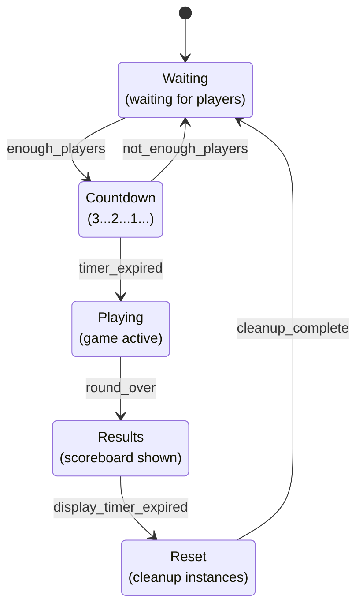
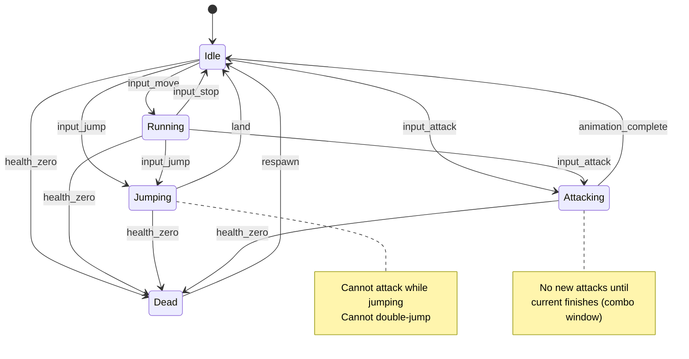
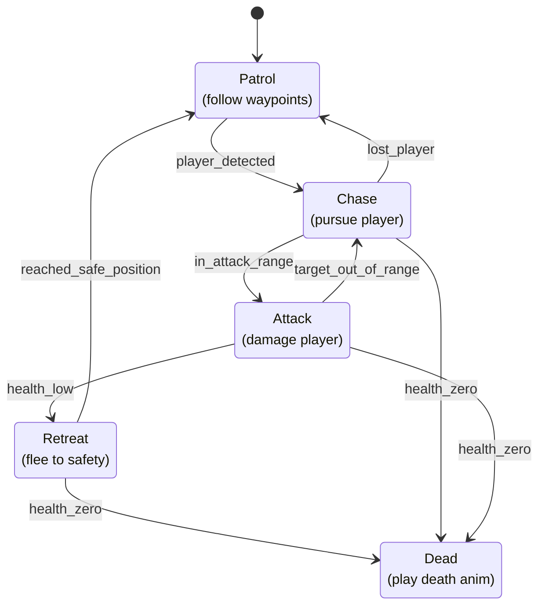

# 3.3 State Machine Architecture

## Overview

State machines are more central to game development than to backend development. In a typical backend service, a request handler is (ideally) stateless — it reads inputs, computes outputs, writes to a database, and exits. In a game, everything is stateful and everything changes over time: the round is in a countdown, the player is mid-jump, the NPC is chasing, the shop UI is open. State machines are the primary tool for making this complexity manageable.

If you've used XState, Redux reducers, or saga state machines in backend work, the pattern is familiar. Roblox adds the dimension of time — state machines tick every frame via RunService and must sync across the network.

---

## Why State Machines in Game Dev

Backend request handlers answer the question "given this input, what's the output?" Game entities answer the question "given the current state and this input, what's the next state?" The state itself is persistent across frames.

Without state machines, game logic collapses into nested conditionals:

```luau
-- Without state machine — impossible to reason about at scale
if not isJumping and not isAttacking and not isDead and health > 0 then
    if isMoving then
        if isSprinting then
            playSprintAnimation()
        else
            playRunAnimation()
        end
    else
        playIdleAnimation()
    end
elseif isJumping and not isAttacking then
    -- ... 15 more conditions
end
```

With a state machine, each state owns its behavior:

```luau
-- With state machine — each state is self-contained
local handlers = {
    Idle    = { update = playIdleAnim,   transitions = { Move = "Running", Jump = "Jumping", Die = "Dead" } },
    Running = { update = playRunAnim,    transitions = { Stop = "Idle",    Jump = "Jumping", Die = "Dead" } },
    Jumping = { update = playJumpAnim,   transitions = { Land = "Idle",    Die  = "Dead" } },
    Dead    = { update = playDeadAnim,   transitions = {} },
}
```

---

## Game Flow State Machine: Round System

The round system is the most common game-wide state machine. It controls the lifecycle of a match.



States and what they do:

| State | Entry Action | While In State | Exit Condition |
|---|---|---|---|
| `Waiting` | Show lobby UI | Poll player count | `>= MIN_PLAYERS` |
| `Countdown` | Start timer, show countdown | Tick timer, check player count | Timer reaches 0 |
| `Playing` | Spawn players, start game logic | Tick game timer, check win conditions | Win condition met or timer expired |
| `Results` | Show scoreboard, update stats | Display results timer | Timer expired |
| `Reset` | Destroy spawned instances | Wait for cleanup tasks | All cleanup done |

---

## Per-Entity State Machine: Character States



The diagram makes explicit what logic alone hides: **you cannot attack while jumping**. Without state machines, preventing invalid transitions requires scattered boolean flags. With state machines, it's encoded in the transition table — if there's no transition from `Jumping` to `Attacking`, the machine simply ignores the attack input.

---

## Implementation Patterns

### Pattern 1: Simple Enum + if/elseif (Small Machines)

For machines with 3–4 states and simple transitions, a plain enum and conditional is sufficient:

```luau
-- Simple round state (not recommended for production — use table-driven instead)
type RoundState = "Waiting" | "Countdown" | "Playing" | "Results"

local currentState: RoundState = "Waiting"

local function transition(newState: RoundState)
    currentState = newState
    print("Round state:", newState)
end

-- In update loop
if currentState == "Waiting" then
    if #Players:GetPlayers() >= MIN_PLAYERS then
        transition("Countdown")
    end
elseif currentState == "Countdown" then
    countdownTimer -= dt
    if countdownTimer <= 0 then
        transition("Playing")
    end
end
```

This breaks down past ~4 states. Use for prototyping only.

### Pattern 2: Table-Driven State Machine

The production pattern. States are table keys; transitions are explicit. Adding a new state never requires touching existing state logic.

```luau
-- ReplicatedStorage/Shared/StateMachine.luau
-- Generic reusable state machine

type TransitionGuard<TContext> = (context: TContext) -> boolean
type StateAction<TContext> = (context: TContext, dt: number?) -> ()

type StateDefinition<TContext> = {
    onEnter: StateAction<TContext>?,
    onExit: StateAction<TContext>?,
    onUpdate: StateAction<TContext>?,
    transitions: {
        [string]: {
            target: string,
            guard: TransitionGuard<TContext>?,
        }
    },
}

export type StateMachine<TContext> = {
    current: string,
    send: (machine: StateMachine<TContext>, event: string) -> boolean,
    update: (machine: StateMachine<TContext>, dt: number) -> (),
    getState: (machine: StateMachine<TContext>) -> string,
}

local StateMachine = {}
StateMachine.__index = StateMachine

function StateMachine.new<TContext>(
    states: { [string]: StateDefinition<TContext> },
    initialState: string,
    context: TContext
): StateMachine<TContext>
    assert(states[initialState], "Initial state '" .. initialState .. "' not found in states table")

    local self = setmetatable({
        _states = states,
        _context = context,
        current = initialState,
    }, StateMachine)

    -- Run onEnter for the initial state
    local initialDef = states[initialState]
    if initialDef.onEnter then
        initialDef.onEnter(context)
    end

    return self :: any
end

function StateMachine:send(event: string): boolean
    local stateDef = self._states[self.current]
    if not stateDef then
        warn("StateMachine: unknown state", self.current)
        return false
    end

    local transition = stateDef.transitions[event]
    if not transition then
        -- Event not valid from current state — silently ignored
        return false
    end

    -- Check guard condition if present
    if transition.guard and not transition.guard(self._context) then
        return false
    end

    local previousState = self.current

    -- Run onExit for current state
    if stateDef.onExit then
        stateDef.onExit(self._context)
    end

    -- Transition
    self.current = transition.target

    -- Run onEnter for new state
    local newStateDef = self._states[self.current]
    if newStateDef and newStateDef.onEnter then
        newStateDef.onEnter(self._context)
    end

    return true
end

function StateMachine:update(dt: number)
    local stateDef = self._states[self.current]
    if stateDef and stateDef.onUpdate then
        stateDef.onUpdate(self._context, dt)
    end
end

function StateMachine:getState(): string
    return self.current
end

return StateMachine
```

### Pattern 3: OOP State Machine Class

For entities with behavior that requires polymorphism — different state objects with shared interface:

```luau
-- Each state is an object with enter/exit/update/handleInput
-- Good when states have complex, self-contained logic

type StateInterface = {
    enter: (self: any) -> (),
    exit: (self: any) -> (),
    update: (self: any, dt: number) -> (),
    handleInput: (self: any, input: string) -> string?,  -- returns next state name or nil
}

-- Example: NPC state objects
local PatrolState = {}
PatrolState.__index = PatrolState

function PatrolState.new(npc): StateInterface
    return setmetatable({ npc = npc, waypointIndex = 1 }, PatrolState)
end

function PatrolState:enter()
    self.npc:SetAnimation("Walk")
end

function PatrolState:exit()
    -- nothing
end

function PatrolState:update(dt)
    self.npc:MoveToNextWaypoint(dt)
end

function PatrolState:handleInput(input: string): string?
    if input == "PlayerDetected" then return "Chase" end
    if input == "TakeDamage" then return "Retreat" end
    return nil
end
```

---

## Complete Round System Using Table-Driven Pattern

```luau
-- ServerScriptService/Services/RoundService.luau
local Players = game:GetService("Players")
local ReplicatedStorage = game:GetService("ReplicatedStorage")
local RunService = game:GetService("RunService")

local StateMachine = require(ReplicatedStorage.Shared.StateMachine)

local RoundService = {}

-- Round configuration
local CONFIG = {
    MIN_PLAYERS = 2,
    COUNTDOWN_DURATION = 10,   -- seconds
    ROUND_DURATION = 180,      -- seconds
    RESULTS_DURATION = 10,     -- seconds
}

-- Round context — mutable data the state machine operates on
type RoundContext = {
    timer: number,
    round: number,
    scores: { [Player]: number },
    isCleanedUp: boolean,
}

local _machine: any = nil  -- set during Init

-- Helper: sync state to all clients
local function syncStateToClients(state: string, context: RoundContext)
    local Remotes = ReplicatedStorage.Remotes
    Remotes.System.SyncGameState:FireAllClients({
        state = state,
        timer = context.timer,
        round = context.round,
    })
end

-- ============================================================
-- State Definitions
-- ============================================================

local roundStates = {
    Waiting = {
        onEnter = function(ctx: RoundContext)
            ctx.timer = 0
            ctx.scores = {}
            syncStateToClients("Waiting", ctx)
            print("[RoundService] Entering Waiting state")
        end,
        onUpdate = function(ctx: RoundContext, dt: number)
            -- Transition is driven by player count check in Start()
            -- State machine receives "EnoughPlayers" event externally
        end,
        onExit = function(ctx: RoundContext)
            -- nothing
        end,
        transitions = {
            EnoughPlayers = { target = "Countdown" },
        },
    },

    Countdown = {
        onEnter = function(ctx: RoundContext)
            ctx.timer = CONFIG.COUNTDOWN_DURATION
            syncStateToClients("Countdown", ctx)
            print("[RoundService] Countdown started")
        end,
        onUpdate = function(ctx: RoundContext, dt: number)
            ctx.timer -= dt
            -- Timer expiry and player count are checked externally and sent as events
        end,
        onExit = function(ctx: RoundContext) end,
        transitions = {
            TimerExpired    = { target = "Playing" },
            NotEnoughPlayers = { target = "Waiting" },
        },
    },

    Playing = {
        onEnter = function(ctx: RoundContext)
            ctx.timer = CONFIG.ROUND_DURATION
            ctx.round += 1
            syncStateToClients("Playing", ctx)
            print(string.format("[RoundService] Round %d started", ctx.round))
            -- Spawn players, start game logic
        end,
        onUpdate = function(ctx: RoundContext, dt: number)
            ctx.timer -= dt
        end,
        onExit = function(ctx: RoundContext) end,
        transitions = {
            TimerExpired = { target = "Results" },
            RoundWon     = { target = "Results" },
        },
    },

    Results = {
        onEnter = function(ctx: RoundContext)
            ctx.timer = CONFIG.RESULTS_DURATION
            syncStateToClients("Results", ctx)
            print("[RoundService] Showing results")
            -- Record stats, award XP, etc.
        end,
        onUpdate = function(ctx: RoundContext, dt: number)
            ctx.timer -= dt
        end,
        onExit = function(ctx: RoundContext) end,
        transitions = {
            TimerExpired = { target = "Reset" },
        },
    },

    Reset = {
        onEnter = function(ctx: RoundContext)
            ctx.isCleanedUp = false
            print("[RoundService] Cleaning up round")
            -- Async cleanup — send event when done
            task.spawn(function()
                -- Destroy spawned instances, reset positions
                task.wait(0.5)  -- cleanup time
                ctx.isCleanedUp = true
                _machine:send("CleanupComplete")
            end)
        end,
        onUpdate = function(ctx: RoundContext, dt: number) end,
        onExit = function(ctx: RoundContext) end,
        transitions = {
            CleanupComplete = { target = "Waiting" },
        },
    },
}

-- ============================================================
-- Service implementation
-- ============================================================

function RoundService:GetState(): string
    return _machine.current
end

function RoundService:Init()
    local context: RoundContext = {
        timer = 0,
        round = 0,
        scores = {},
        isCleanedUp = false,
    }

    _machine = StateMachine.new(roundStates, "Waiting", context)
end

function RoundService:Start()
    -- Heartbeat drives the state machine and auto-transitions based on context
    RunService.Heartbeat:Connect(function(dt)
        _machine:update(dt)

        local state = _machine.current
        local ctx = _machine._context

        -- External event injection based on observable conditions
        if state == "Waiting" then
            if #Players:GetPlayers() >= CONFIG.MIN_PLAYERS then
                _machine:send("EnoughPlayers")
            end

        elseif state == "Countdown" then
            if #Players:GetPlayers() < CONFIG.MIN_PLAYERS then
                _machine:send("NotEnoughPlayers")
            elseif ctx.timer <= 0 then
                _machine:send("TimerExpired")
            end

        elseif state == "Playing" then
            if ctx.timer <= 0 then
                _machine:send("TimerExpired")
            end

        elseif state == "Results" then
            if ctx.timer <= 0 then
                _machine:send("TimerExpired")
            end
        end
    end)
end

-- Called by CombatService when a win condition is detected
function RoundService:SignalRoundOver()
    _machine:send("RoundWon")
end

return RoundService
```

---

## Preventing Invalid Transitions

The table-driven pattern prevents invalid transitions by construction: if an event is not in the current state's `transitions` table, the `send()` function returns `false` without modifying state.

Example: why this matters in combat

```luau
-- Character state machine context
type CharacterContext = {
    jumpCount: number,
    MAX_JUMPS: number,
    humanoid: Humanoid,
}

local characterStates = {
    Idle = {
        transitions = {
            Move = { target = "Running" },
            Jump = {
                target = "Jumping",
                guard = function(ctx: CharacterContext)
                    return ctx.jumpCount < ctx.MAX_JUMPS
                end,
            },
            Attack = { target = "Attacking" },
            Die    = { target = "Dead" },
        },
        onEnter = function(ctx) ctx.humanoid:ChangeState(Enum.HumanoidStateType.Standing) end,
        onUpdate = function(ctx, dt) end,
        onExit   = function(ctx) end,
    },

    Jumping = {
        transitions = {
            -- Note: NO "Attack" transition here — you cannot attack while in the air
            -- This prevents the exploit of firing Attack events while jumping
            Land = { target = "Idle" },
            Die  = { target = "Dead" },
        },
        onEnter = function(ctx)
            ctx.jumpCount += 1
        end,
        onUpdate = function(ctx, dt)
            -- Check if humanoid has landed
            if ctx.humanoid:GetState() == Enum.HumanoidStateType.Running then
                -- Will send Land event from the monitor loop
            end
        end,
        onExit = function(ctx) end,
    },

    Attacking = {
        transitions = {
            -- No "Jump" from Attacking — must finish attack first
            AnimationComplete = { target = "Idle" },
            Die = { target = "Dead" },
        },
        onEnter = function(ctx) end,
        onUpdate = function(ctx, dt) end,
        onExit  = function(ctx) end,
    },

    Dead = {
        transitions = {
            Respawn = { target = "Idle" },
        },
        onEnter = function(ctx)
            ctx.jumpCount = 0
            ctx.humanoid.Health = 0
        end,
        onUpdate = function(ctx, dt) end,
        onExit   = function(ctx)
            ctx.humanoid.Health = ctx.humanoid.MaxHealth
        end,
    },
}
```

When a RemoteEvent fires `Attack` while the character is in `Jumping` state, `machine:send("Attack")` returns `false`. No special-case code needed. The state table is the source of truth for what's allowed.

---

## Networked State Machines

Game state must be visible to clients so they can render the correct UI and behavior. Two approaches:

### Approach 1: RemoteEvent sync on transition

```luau
-- In onEnter for each state, fire a RemoteEvent
onEnter = function(ctx)
    Remotes.System.SyncGameState:FireAllClients({
        state = "Playing",
        timer = ctx.timer,
    })
end
```

Clients maintain a local mirror of the state and update their UI accordingly. This is the right approach for discrete, infrequent transitions (round states change a few times per minute).

### Approach 2: Instance Attributes

Roblox Attributes on an Instance replicate automatically to all clients. This is simpler for simple string/number state:

```luau
-- Server
local stateIndicator = ReplicatedStorage.GameState  -- a Folder or Part

stateIndicator:SetAttribute("RoundState", "Playing")
stateIndicator:SetAttribute("TimeRemaining", 120)

-- Client — automatically receives attribute changes
stateIndicator:GetAttributeChangedSignal("RoundState"):Connect(function()
    local state = stateIndicator:GetAttribute("RoundState")
    UIController:UpdateRoundState(state)
end)
```

Attributes are best for simple, frequently-read values (current state name, timer). RemoteEvents are best for triggering effects on transition (play sound, show animation, spawn particles).

---

## RunService Integration

State machines that need frame-by-frame behavior integrate with `RunService.Heartbeat`:

```luau
-- The update loop pattern
RunService.Heartbeat:Connect(function(dt: number)
    -- 1. Update the machine (calls onUpdate for current state)
    machine:update(dt)

    -- 2. Check auto-transition conditions
    if machine.current == "Countdown" then
        if ctx.timer <= 0 then
            machine:send("TimerExpired")
        end
    end
end)
```

**Heartbeat vs RenderStepped vs Stepped:**

| Event | Fires | Use For |
|---|---|---|
| `Heartbeat` | After physics, before render (server + client) | Game logic, state machines, AI |
| `Stepped` | Before physics simulation | Physics manipulation, force application |
| `RenderStepped` | Before frame render (client only) | Camera, visual-only updates |

State machines run on `Heartbeat`. Never run game logic on `RenderStepped` — it runs client-only and at variable rate tied to frame rate.

---

## Common Game Patterns Using State Machines

### NPC Behavior



### UI Screen Flow

```luau
type UIState = "MainMenu" | "Loading" | "Playing" | "Paused" | "GameOver"

local uiStates = {
    MainMenu = {
        onEnter = function(ctx) ctx.mainMenuFrame.Visible = true end,
        onExit  = function(ctx) ctx.mainMenuFrame.Visible = false end,
        transitions = {
            Play    = { target = "Loading" },
        },
        onUpdate = function() end,
    },
    Loading = {
        onEnter = function(ctx) ctx.loadingFrame.Visible = true end,
        onExit  = function(ctx) ctx.loadingFrame.Visible = false end,
        transitions = {
            Loaded  = { target = "Playing" },
        },
        onUpdate = function() end,
    },
    Playing = {
        onEnter = function(ctx) ctx.gameHUD.Visible = true end,
        onExit  = function(ctx) ctx.gameHUD.Visible = false end,
        transitions = {
            Pause   = { target = "Paused" },
            GameOver = { target = "GameOver" },
        },
        onUpdate = function() end,
    },
    Paused = {
        onEnter = function(ctx) ctx.pauseMenu.Visible = true end,
        onExit  = function(ctx) ctx.pauseMenu.Visible = false end,
        transitions = {
            Resume  = { target = "Playing" },
        },
        onUpdate = function() end,
    },
    GameOver = {
        onEnter = function(ctx) ctx.gameOverFrame.Visible = true end,
        onExit  = function(ctx) ctx.gameOverFrame.Visible = false end,
        transitions = {
            Restart = { target = "Loading" },
            Menu    = { target = "MainMenu" },
        },
        onUpdate = function() end,
    },
}
```

### Matchmaking Queue

```luau
-- Server-side per-player matchmaking states
type MatchmakingState = "Idle" | "Queued" | "MatchFound" | "Loading" | "InGame"

-- Each player has their own state machine instance
local playerMachines: { [Player]: any } = {}

-- On player joining queue (from RemoteEvent handler):
local function onPlayerQueue(player: Player)
    local machine = playerMachines[player]
    if machine then
        machine:send("JoinQueue")  -- Only transitions if in Idle state
    end
end
```

---

## Key Takeaways

- State machines encode valid transitions explicitly. Invalid inputs are silently ignored — no scattered `if` guards needed.
- The table-driven pattern scales to any number of states without touching existing state logic.
- The Init/Start separation in services maps directly to state machine entry: `Init()` creates the machine, `Start()` connects it to RunService.
- Two-phase transitions (onExit → change state → onEnter) keep each state self-contained.
- For networked state, fire RemoteEvents on `onEnter` for UI transitions; use Instance Attributes for frequently-polled values.
- `RunService.Heartbeat` is the game loop. State machines that depend on time (`timer -= dt`) must tick there.
- Guards in transitions enable conditional transitions without polluting the state handler code.

---

## Next: Module 3.4 — ECS with Matter & Jecs

State machines manage individual entity lifecycles. When you have hundreds or thousands of entities with overlapping behaviors (status effects, abilities, physics), a different architecture becomes compelling: Entity-Component-System. Module 3.4 covers ECS concepts, the Matter and Jecs libraries, when ECS is worth the overhead, and how to integrate it with the Service-Controller pattern.
