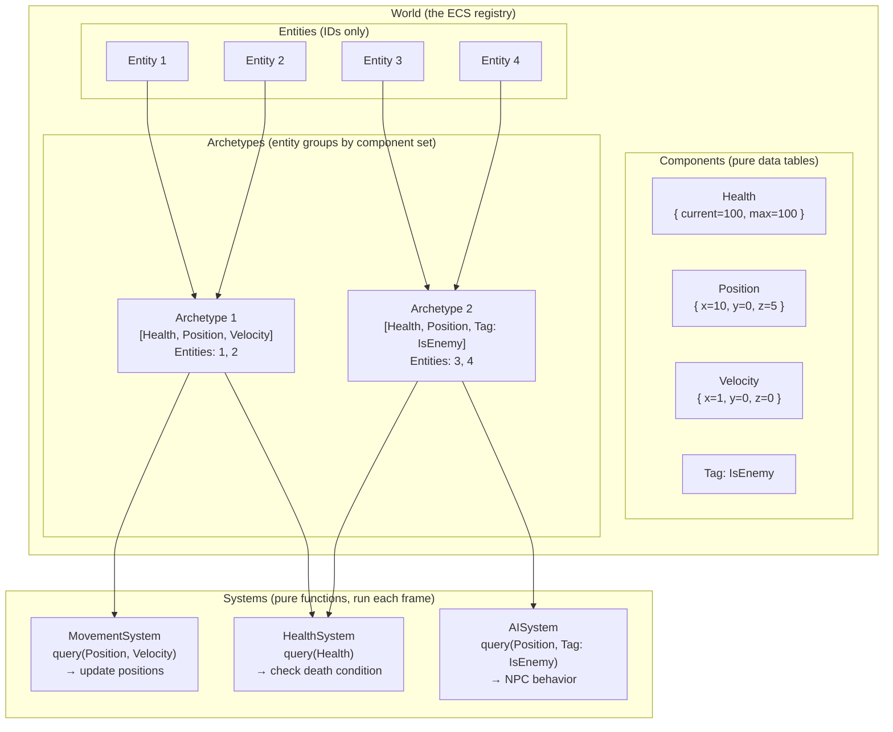
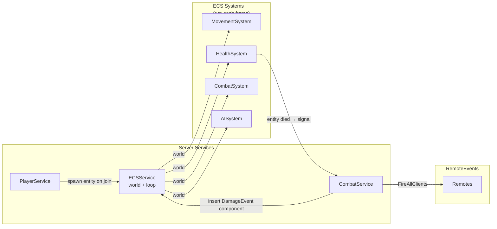

# 3.4 ECS with Matter & Jecs

## Overview

Entity-Component-System is an architectural pattern that inverts how you think about game objects. Instead of objects that own their behaviors (OOP), you have pure data (components), pure IDs (entities), and pure logic (systems) that operates on components in bulk. The result is cache-friendly batch processing, emergent composition, and systems that scale to thousands of entities where OOP starts to choke.

For a backend architect, ECS will feel familiar from a different angle: it is essentially a **columnar in-memory database** where entities are row IDs, components are typed columns, and systems are queries that operate on row subsets. If you've worked with data-oriented design, columnar analytics, or bitmap index scans, the mental model maps cleanly.

---

## Backend Analogy

| ECS Concept | Backend Analogy |
|---|---|
| Entity | Row ID / UUID in a database |
| Component | Typed column (Health, Position, Velocity) |
| System | Query + transform function running on column subsets |
| World | The in-memory database instance |
| Archetype | Row group where all rows have the same set of columns |
| Query `world:query(A, B)` | `SELECT * FROM entities WHERE has_column_A AND has_column_B` |
| Adding a component | `INSERT INTO column_table (entity_id, data)` |
| Removing a component | `DELETE FROM column_table WHERE entity_id = ?` |
| Dirty flag | Write-ahead log entry for change detection |

The database analogy breaks down in one important way: ECS is designed to be processed in-order, cache-hot, every frame. The data layout is optimized for sequential iteration, not for arbitrary lookups. This is the opposite of a database index's goal.

---

## Core ECS Concepts



### Entity

An entity is just an integer ID. It has no data, no methods. It is a key that maps to a collection of components.

```luau
local entityId = world:entity()  -- returns an integer
```

### Component

A component is a plain data table attached to an entity. No methods. No inheritance.

```luau
-- Components are defined as opaque handles
local Health   = matter.component()  -- returns a unique component type
local Position = matter.component()
local Velocity = matter.component()
local IsEnemy  = matter.component()  -- tag component (no data needed)

-- Attach to an entity
world:insert(entityId,
    Health({ current = 100, max = 100 }),
    Position({ x = 0, y = 0, z = 0 }),
    Velocity({ x = 1, y = 0, z = 0 })
)
```

### System

A system is a function that queries for entities with specific components and operates on them. Systems run every frame.

```luau
local function movementSystem(world)
    for entityId, pos, vel in world:query(Position, Velocity) do
        world:insert(entityId, pos:patch({
            x = pos.x + vel.x,
            y = pos.y + vel.y,
            z = pos.z + vel.z,
        }))
    end
end
```

---

## When ECS Shines vs When It's Overkill

| Scenario | OOP | ECS | Why |
|---|---|---|---|
| 10 enemy types with unique behaviors | Good | Overkill | Small count, bespoke logic fits OOP |
| 500 projectiles updated every frame | Slow | Excellent | Batch iteration, cache hot |
| Complex ability/status-effect system | Messy | Excellent | Composition over inheritance |
| Player inventory (50 items) | Good | Overkill | Not iterated in bulk |
| Simulation game (city builder, factory) | Painful | Excellent | Thousands of agents, emergent behavior |
| Simple platformer (1 player, no AI) | Perfect | Massive overkill | No iteration needed |
| NPC behavior with 20 different states | Manageable | Good | State machine + ECS is common hybrid |
| Particle-like visual effects (1000s) | Too slow | Excellent | Pure data iteration |

**Rule of thumb**: If you find yourself writing `for _, npc in npcs do npc:update(dt) end` and that loop is slow, ECS will help. If your entity count is under ~100 and behaviors don't compose heavily, OOP is simpler.

---

## Matter ECS

Matter is the most-used Roblox ECS library. It uses Luau's type system, integrates with RunService via a Loop abstraction, and supports the full ECS feature set. As of 2026 it has moved to a new GitHub org and remains actively maintained.

```
Wally: matter-ecs/matter
```

### Matter World Setup

```luau
-- ServerScriptService/Services/ECSService.luau
local ReplicatedStorage = game:GetService("ReplicatedStorage")
local RunService = game:GetService("RunService")
local matter = require(ReplicatedStorage.Packages.matter)

-- Import component definitions (shared between systems)
local Components = require(ReplicatedStorage.Shared.Components)

local ECSService = {}
local _world: matter.World
local _loop: matter.Loop

function ECSService:Init()
    _world = matter.World.new()
end

function ECSService:GetWorld(): matter.World
    return _world
end

function ECSService:Start()
    -- Import systems
    local systems = {
        require(script.Parent.Systems.MovementSystem),
        require(script.Parent.Systems.HealthSystem),
        require(script.Parent.Systems.CombatSystem),
        require(script.Parent.Systems.NPCBehaviorSystem),
    }

    -- Loop runs all systems each heartbeat
    _loop = matter.Loop.new(_world)
    _loop:scheduleSystems(systems)

    -- Connect the loop to RunService
    _loop:begin({
        default = RunService.Heartbeat,
    })
end

return ECSService
```

### Component Definitions

```luau
-- ReplicatedStorage/Shared/Components.luau
local matter = require(game:GetService("ReplicatedStorage").Packages.matter)

-- Component definitions — these are type tokens, not data
-- matter.component() returns a unique function that constructs component instances

local Components = {}

Components.Health = matter.component()
--[[
    Health { current: number, max: number }
]]

Components.Position = matter.component()
--[[
    Position { value: Vector3 }
]]

Components.Velocity = matter.component()
--[[
    Velocity { value: Vector3 }
]]

Components.CharacterRef = matter.component()
--[[
    CharacterRef { model: Model, rootPart: BasePart, humanoid: Humanoid }
]]

Components.PlayerRef = matter.component()
--[[
    PlayerRef { player: Player }
]]

Components.IsEnemy = matter.component()
--[[
    IsEnemy { } -- tag, no meaningful data
]]

Components.StatusEffect = matter.component()
--[[
    StatusEffect {
        type: "Poison" | "Slow" | "Stun",
        duration: number,
        magnitude: number,
    }
]]

Components.CombatStats = matter.component()
--[[
    CombatStats {
        attackPower: number,
        defense: number,
        attackSpeed: number,
    }
]]

return Components
```

### Writing Systems

```luau
-- ServerScriptService/Services/Systems/MovementSystem.luau
local Components = require(game:GetService("ReplicatedStorage").Shared.Components)

-- Systems are just functions
-- matter.Loop passes the world as the first argument
local function movementSystem(world: matter.World)
    -- Query: iterate all entities that have BOTH Position AND Velocity
    -- This is extremely fast — iterates contiguous memory by archetype
    for entityId, position, velocity in world:query(Components.Position, Components.Velocity) do
        local newPos = position.value + velocity.value * (1/60)  -- dt from loop

        -- patch() returns a new component with updated fields
        -- Never mutate components in place — matter detects changes via new inserts
        world:insert(entityId, Components.Position({
            value = newPos,
        }))
    end
end

return movementSystem
```

```luau
-- ServerScriptService/Services/Systems/HealthSystem.luau
local Components = require(game:GetService("ReplicatedStorage").Shared.Components)
local matter = require(game:GetService("ReplicatedStorage").Packages.matter)

local function healthSystem(world: matter.World)
    -- Query all entities with Health
    for entityId, health in world:query(Components.Health) do
        if health.current <= 0 then
            -- Entity is dead — check if it has a CharacterRef to apply death
            local characterRef = world:get(entityId, Components.CharacterRef)
            if characterRef then
                local humanoid = characterRef.humanoid
                if humanoid and humanoid.Health > 0 then
                    humanoid.Health = 0
                end
            end

            -- Remove the entity from the world after handling death
            -- In a real game you'd transition to a Dead component or fire an event
            world:despawn(entityId)
        end
    end
end

return healthSystem
```

### Dirty-Flag Optimization

Matter tracks which components changed since the last frame. Use `world:queryChanged()` to process only entities whose components changed — critical for expensive operations:

```luau
-- Only process entities whose Health changed this frame
local function healthChangedSystem(world: matter.World)
    -- queryChanged iterates only entities where Health was inserted/changed this frame
    for entityId, record in world:queryChanged(Components.Health) do
        local newHealth = record.new  -- new component value (nil if removed)
        local oldHealth = record.old  -- previous value (nil if just added)

        if newHealth and oldHealth then
            local delta = newHealth.current - oldHealth.current
            if delta < 0 then
                -- Health decreased — trigger damage visual on client
                -- (would fire a RemoteEvent here in practice)
                print(string.format("Entity %d took %d damage", entityId, -delta))
            end
        end
    end
end
```

This is the equivalent of database change data capture (CDC) — only process what changed.

### Spawning Player Entities

```luau
-- In PlayerService or a dedicated player-entity system
local ECSService = require(script.Parent.ECSService)
local Components = require(ReplicatedStorage.Shared.Components)

local function spawnPlayerEntity(player: Player)
    local world = ECSService:GetWorld()
    local character = player.Character
    if not character then return end

    local humanoid = character:FindFirstChildOfClass("Humanoid")
    local rootPart = character:FindFirstChild("HumanoidRootPart")
    if not humanoid or not rootPart then return end

    local entityId = world:spawn(
        Components.Health({ current = humanoid.MaxHealth, max = humanoid.MaxHealth }),
        Components.Position({ value = rootPart.Position }),
        Components.PlayerRef({ player = player }),
        Components.CharacterRef({ model = character, rootPart = rootPart, humanoid = humanoid }),
        Components.CombatStats({ attackPower = 10, defense = 5, attackSpeed = 1.0 })
    )

    -- Store the mapping player → entityId for lookup
    return entityId
end
```

---

## Jecs

Jecs is a newer Roblox ECS library inspired by Flecs, a high-performance C++ ECS. It targets scenarios where Matter's performance is insufficient — typically 5000+ entities or extremely tight frame budgets.

```
Wally: ukendio/jecs
```

### Jecs World Setup

```luau
-- Jecs uses a different API but same conceptual model
local jecs = require(ReplicatedStorage.Packages.jecs)

local world = jecs.World.new()

-- Define components
local Health   = world:component()
local Position = world:component()
local Velocity = world:component()
local IsEnemy  = world:component()
```

### Jecs Entity and Component Operations

```luau
-- Spawn entity with components
local entity = world:entity()
world:set(entity, Health,   { current = 100, max = 100 })
world:set(entity, Position, { value = Vector3.new(0, 0, 0) })
world:set(entity, Velocity, { value = Vector3.new(1, 0, 0) })

-- Query — same concept as Matter but different API
-- Returns an iterator over matching entities
local query = world:query(Position, Velocity)
for entityId, pos, vel in query do
    world:set(entityId, Position, {
        value = pos.value + vel.value
    })
end

-- Tag components (no data)
world:add(entity, IsEnemy)  -- adds tag with no data

-- Check if entity has component
if world:has(entity, IsEnemy) then
    -- handle enemy
end

-- Remove component
world:remove(entity, StatusEffect)

-- Despawn entity
world:delete(entity)
```

### Jecs System Pattern

```luau
-- Jecs doesn't have a built-in Loop — you connect to RunService manually
local RunService = game:GetService("RunService")
local jecs = require(ReplicatedStorage.Packages.jecs)

local world = jecs.World.new()
local Health   = world:component()
local Position = world:component()
local Velocity = world:component()

local function movementSystem()
    for id, pos, vel in world:query(Position, Velocity) do
        world:set(id, Position, { value = pos.value + vel.value })
    end
end

local function healthSystem()
    for id, health in world:query(Health) do
        if health.current <= 0 then
            world:delete(id)
        end
    end
end

RunService.Heartbeat:Connect(function(dt)
    movementSystem()
    healthSystem()
end)
```

---

## Matter vs Jecs Comparison

| Feature | Matter | Jecs |
|---|---|---|
| API style | Lua-idiomatic, high-level | Lower-level, closer to Flecs |
| Loop management | Built-in `matter.Loop` | Manual RunService connection |
| `queryChanged` / dirty tracking | Yes, built-in | Manual implementation required |
| Performance (entity count) | Excellent up to ~2000 entities | Excellent at 10000+ entities |
| Luau type safety | Good | Good |
| Community tutorials | More (older, established) | Growing |
| Active maintenance | Yes (new org 2024) | Yes |
| Studio debugger widget | Yes (matter-hooks) | No |
| Complexity | Lower | Higher |
| When to choose | Most games | Simulations, very high entity counts |

---

## Integrating ECS with Service-Controller Pattern

ECS and the Service-Controller pattern are complementary, not mutually exclusive. The typical integration:



- `ECSService` owns the `World` and `Loop`
- Other services (`CombatService`, `PlayerService`) interact with the world via `ECSService:GetWorld()`
- Systems run inside ECS and signal back to services via BindableEvents or direct function calls
- RemoteEvent handlers (in services) translate network input → ECS component mutations
- ECS systems translate component changes → RemoteEvent broadcasts

```luau
-- CombatService bridging RemoteEvents to ECS
local ECSService = require(script.Parent.ECSService)
local Components = require(ReplicatedStorage.Shared.Components)

local DamageEvent = Components.DamageEvent  -- ephemeral component, consumed by CombatSystem

-- When a validated attack RemoteEvent fires:
function CombatService:ApplyAttack(attackerId: number, targetEntityId: number, damage: number)
    local world = ECSService:GetWorld()

    -- Insert a DamageEvent component — CombatSystem processes it next frame
    world:insert(targetEntityId, Components.DamageEvent({
        source = attackerId,
        amount = damage,
        type = "Melee",
    }))
end

-- CombatSystem (ECS) processes DamageEvent components each frame
local function combatSystem(world)
    for entityId, damageEvent, health in world:query(Components.DamageEvent, Components.Health) do
        local newHealth = math.max(0, health.current - damageEvent.amount)

        world:insert(entityId, Components.Health({
            current = newHealth,
            max = health.max,
        }))

        -- Remove the consumed event component
        world:remove(entityId, Components.DamageEvent)
    end
end
```

---

## Status Effects: Where ECS Truly Shines

The classic OOP problem: a character has a list of active status effects, each needs to tick, and effects can interact. In OOP this requires a `StatusEffectManager` with explicit update loops. In ECS, each active effect is just a component:

```luau
-- Add a Poison effect — as a component
world:insert(targetEntityId, Components.PoisonEffect({
    damagePerSecond = 5,
    duration = 10,
    elapsed = 0,
}))

-- Add a Slow effect simultaneously — no conflict
world:insert(targetEntityId, Components.SlowEffect({
    speedMultiplier = 0.5,
    duration = 3,
    elapsed = 0,
}))

-- PoisonSystem handles all poisoned entities this frame
local function poisonSystem(world, dt)
    for entityId, poison, health in world:query(Components.PoisonEffect, Components.Health) do
        local newElapsed = poison.elapsed + dt
        local tickDamage = poison.damagePerSecond * dt

        world:insert(entityId, Components.Health({
            current = health.current - tickDamage,
            max = health.max,
        }))

        if newElapsed >= poison.duration then
            world:remove(entityId, Components.PoisonEffect)  -- effect expired
        else
            world:insert(entityId, Components.PoisonEffect({
                damagePerSecond = poison.damagePerSecond,
                duration = poison.duration,
                elapsed = newElapsed,
            }))
        end
    end
end
```

With OOP: the `StatusEffectManager` needs to iterate `character.activeEffects`, check each effect type, dispatch to the correct handler. With ECS: add the component, write a system, it's done. The composition is automatic — Poison and Slow don't know about each other.

---

## Key Takeaways

- ECS = columnar in-memory database for game objects. Entities are IDs, components are typed data columns, systems are batch queries.
- Use ECS when you have 100s of entities with overlapping behaviors, status effects, abilities, or simulation mechanics. Skip it for simple games.
- Matter is the practical choice for most Roblox games in 2026 — good API, built-in Loop, dirty-flag change tracking, Studio debugger.
- Jecs is for extreme entity counts (5000+) or when you need Flecs-like performance. Lower-level API.
- ECS and Service-Controller coexist. Services are the entry points (RemoteEvent handlers, player lifecycle). ECS systems are the computation layer (physics, combat math, AI).
- Status effects and ability systems are the canonical ECS win cases — composition replaces inheritance hierarchies.
- Never mutate components in place. Always insert new component instances — libraries detect changes by comparison.

---

## Next: Module 4.1 — DataStore & ProfileStore

With architecture patterns covered, the next challenge is persistence. Roblox's DataStore API is a simple key-value store, but naive use leads to data loss. Module 4.1 covers the session locking problem, ProfileStore as the production solution, schema design for Lua tables, and migration strategies — the equivalent of safe database schema evolution in a schemaless environment.
