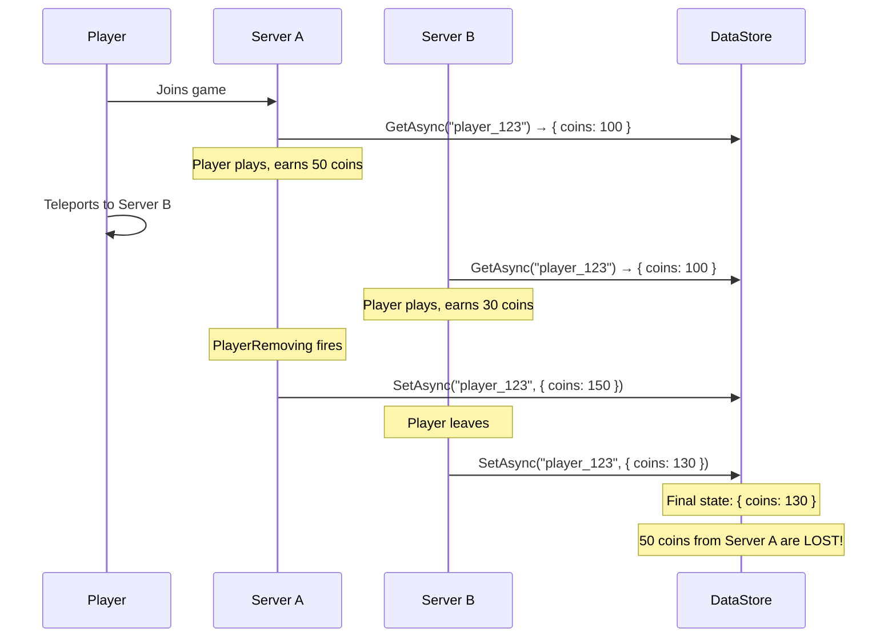
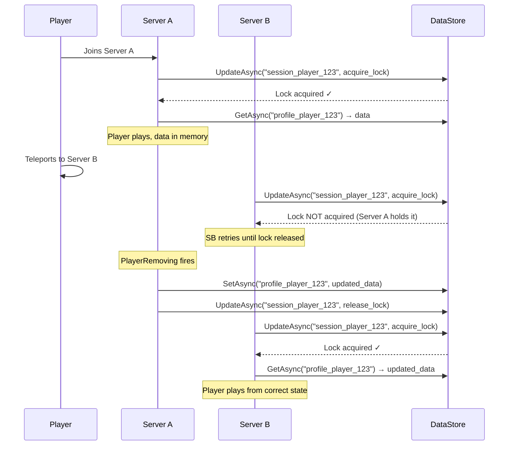

# 4.1 DataStore & ProfileStore

## Overview

Roblox DataStore is the platform's built-in persistence layer — a globally distributed key-value store. It's simple to get started with and very easy to use incorrectly. The naive API conceals a critical problem: without session locking, concurrent server access to the same player's data leads to silent data loss. ProfileStore solves this with the same session locking pattern you'd implement in any distributed system managing shared mutable state.

This module covers the raw API, why it's dangerous without wrappers, ProfileStore as the production solution, schema design in a schemaless environment, and migration strategies.

---

## Backend Analogy

| Roblox Concept | Backend Analogy |
|---|---|
| DataStore | Redis + a simplified SDK / DynamoDB single-table |
| DataStore key | Redis key or DynamoDB partition key |
| `SetAsync` / `GetAsync` | `SET` / `GET` or `PutItem` / `GetItem` |
| Session locking | Distributed lock (Redis SETNX + TTL, DynamoDB conditional write) |
| ProfileStore | A managed session-locking library (like Redlock + auto-save) |
| `Profile:Reconcile()` | Schema migration with backward-compatible defaults |
| Ordered DataStore | Redis Sorted Set (ZADD / ZRANGE) |
| Global Updates | Cross-server admin command channel (like a dedicated admin queue) |

The key difference from a backend database: DataStore has **no transactions**, **no schema enforcement**, and **no query language**. It is `get(key)` and `set(key, value)` — that's the entire read/write model.

---

## DataStore API Basics

```luau
local DataStoreService = game:GetService("DataStoreService")

-- Get a named DataStore (creates it if it doesn't exist)
local playerStore = DataStoreService:GetDataStore("PlayerData")

-- Write
local ok, err = pcall(function()
    playerStore:SetAsync("player_12345", { coins = 100, level = 5 })
end)

-- Read
local ok, data = pcall(function()
    return playerStore:GetAsync("player_12345")
end)

-- Update (read-modify-write with optimistic locking)
local ok, err = pcall(function()
    playerStore:UpdateAsync("player_12345", function(existingData)
        existingData = existingData or {}
        existingData.coins = (existingData.coins or 0) + 50
        return existingData
    end)
end)

-- Delete
local ok, err = pcall(function()
    playerStore:RemoveAsync("player_12345")
end)
```

**Important**: every DataStore call can fail. Always wrap in `pcall`. Roblox DataStore is a network call to external storage — it has latency (~100–300ms), transient failures, and rate limits.

---

## Rate Limits (2026)

| Operation Type | Limit |
|---|---|
| Standard read/write | `250 + (CCU × 40)` requests per minute |
| List operations | `10 + (CCU × 2)` requests per minute |
| Experience storage cap | `100 MB + 1 MB per lifetime unique player` |
| Key value size | 4 MB per key |
| Key name length | 50 characters max |

**CCU** = Concurrent Users. A server with 20 players has a budget of `250 + (20 × 40)` = 1050 requests/minute. With 60-second auto-save intervals and 20 players, that's 20 save operations/minute — well within budget. At 100 CCU: `250 + 4000 = 4250` requests/minute.

Rate limits are enforced per experience (not per server), so across all game servers for your experience.

---

## Why Raw DataStore is Dangerous

The fundamental problem: **multiple game servers can read and write the same player's data simultaneously**.

### The Session Locking Problem



This scenario — player joining Server B while Server A hasn't finished saving — is common during teleports, server crashes, and quick reconnects. The last write wins, and whichever write comes second silently discards the other. There is no conflict detection, no merge, no error.

A server crash is even worse: Server A never calls `PlayerRemoving`, so the data isn't saved at all. Server B loads stale data.

### UpdateAsync vs SetAsync

`UpdateAsync` uses server-side optimistic locking (compare-and-swap), but it doesn't solve multi-server session contention — it only ensures that concurrent updates to the same key from different goroutines merge correctly. If two servers both load at coins=100, both increment, and both write, `UpdateAsync` can handle the second write being based on stale data — but only if the callback pattern is used correctly and only for additive operations.

For complex player state (inventory, progress, quests), `UpdateAsync` alone is not sufficient.

---

## Session Locking Solution

The correct approach: when a player joins, **acquire a lock** on their data. While the lock is held, no other server can load their profile. When the player leaves, save the data and release the lock.



Building this from scratch is non-trivial. ProfileStore implements it correctly.

---

## ProfileStore

ProfileStore is the community-maintained library that handles session locking, auto-saving, global updates, and profile reconciliation. It supersedes the older ProfileService library.

```
Wally: loleris/profilestore
```

### Setup

```luau
-- ServerScriptService/Services/DataService.luau
local ReplicatedStorage = game:GetService("ReplicatedStorage")
local Players = game:GetService("Players")
local ProfileStore = require(ReplicatedStorage.Packages.ProfileStore)

-- ============================================================
-- Data Schema Definition
-- ============================================================
-- This is the TEMPLATE for new profiles — what a brand-new player gets
-- For existing players, ProfileStore loads their stored data and then
-- Reconcile() adds any missing fields from this template

type PlayerInventoryItem = {
    itemId: string,
    quantity: number,
    acquiredAt: number,
}

type PlayerStats = {
    level: number,
    experience: number,
    totalPlayTime: number,
    matchesPlayed: number,
    matchesWon: number,
}

type PlayerCurrency = {
    coins: number,
    gems: number,
    premiumCurrency: number,
}

type PlayerSettings = {
    musicVolume: number,
    sfxVolume: number,
    showFPS: boolean,
}

type PlayerData = {
    -- Schema version — increment when making breaking changes
    schemaVersion: number,
    currency: PlayerCurrency,
    inventory: { PlayerInventoryItem },
    stats: PlayerStats,
    settings: PlayerSettings,
    -- Persistent flags
    hasCompletedTutorial: boolean,
    dailyLoginStreak: number,
    lastLoginDate: number,
}

local DEFAULT_DATA: PlayerData = {
    schemaVersion = 1,
    currency = {
        coins = 0,
        gems = 0,
        premiumCurrency = 0,
    },
    inventory = {},
    stats = {
        level = 1,
        experience = 0,
        totalPlayTime = 0,
        matchesPlayed = 0,
        matchesWon = 0,
    },
    settings = {
        musicVolume = 0.8,
        sfxVolume = 1.0,
        showFPS = false,
    },
    hasCompletedTutorial = false,
    dailyLoginStreak = 0,
    lastLoginDate = 0,
}

-- ============================================================
-- ProfileStore instance
-- ============================================================
local PlayerProfileStore = ProfileStore.New("PlayerData_v1", DEFAULT_DATA)

-- ============================================================
-- Service
-- ============================================================
local DataService = {}

type ActiveProfile = {
    Data: PlayerData,
    -- ProfileStore methods available on the profile object
}

local _profiles: { [Player]: ActiveProfile } = {}

function DataService:Init()
    Players.PlayerAdded:Connect(function(player)
        self:_loadProfile(player)
    end)

    Players.PlayerRemoving:Connect(function(player)
        self:_releaseProfile(player)
    end)

    -- Handle players who joined before service started (rare)
    for _, player in Players:GetPlayers() do
        task.spawn(function()
            self:_loadProfile(player)
        end)
    end
end

function DataService:Start() end

function DataService:_loadProfile(player: Player)
    -- ProfileStore handles session locking internally
    -- :StartSessionAsync() blocks until lock is acquired or the player leaves
    local profile = PlayerProfileStore:StartSessionAsync(
        tostring(player.UserId),
        {
            Cancel = function()
                -- Called if player leaves before lock acquired
                return player.Parent == nil
            end,
        }
    )

    if profile == nil then
        -- Session could not start (player left, or DataStore error)
        -- Kick the player to prevent playing with no data
        player:Kick("Failed to load your data. Please rejoin.")
        return
    end

    -- Reconcile: add any fields from DEFAULT_DATA that don't exist in the stored profile
    -- This is how you add new fields to existing players without breaking old saves
    profile:Reconcile()

    -- Handle session steal: if another server loaded this profile, this session ends
    profile:AddUseCaseTag("CharacterData")

    -- Store reference
    _profiles[player] = profile

    -- Signal that data is ready
    -- Other services can now safely access player data
    local PlayerService = require(script.Parent.PlayerService)
    PlayerService:SetLoaded(player)
end

function DataService:_releaseProfile(player: Player)
    local profile = _profiles[player]
    if profile then
        -- Saves data and releases the session lock
        profile:EndSession()
        _profiles[player] = nil
    end
end

function DataService:GetData(player: Player): PlayerData?
    local profile = _profiles[player]
    if profile then
        return profile.Data
    end
    return nil
end

-- Safe mutation helper — always use this, never directly mutate profile.Data
-- in production code that may run before data is loaded
function DataService:UpdateData(player: Player, updater: (data: PlayerData) -> ())
    local profile = _profiles[player]
    if not profile then
        warn(string.format("[DataService] UpdateData called for %s but profile not loaded", player.Name))
        return
    end
    updater(profile.Data)
end

return DataService
```

### Usage Pattern in Other Services

```luau
-- In CurrencyService
local DataService = require(script.Parent.DataService)

function CurrencyService:AddCoins(player: Player, amount: number)
    DataService:UpdateData(player, function(data)
        data.currency.coins = data.currency.coins + amount
    end)
end

function CurrencyService:GetCoins(player: Player): number
    local data = DataService:GetData(player)
    return data and data.currency.coins or 0
end
```

---

## Reconciling New Fields on Schema Update

When you add new fields to `DEFAULT_DATA`, existing players don't have those fields in their stored profile. `profile:Reconcile()` does a deep merge — any keys present in `DEFAULT_DATA` but absent in the stored data are filled in with the default values.

```luau
-- BEFORE (schemaVersion = 1):
local DEFAULT_DATA = {
    schemaVersion = 1,
    currency = { coins = 0, gems = 0 },
    stats = { level = 1, experience = 0 },
}

-- AFTER (schemaVersion = 2 — adding achievements and prestigeLevel):
local DEFAULT_DATA = {
    schemaVersion = 2,
    currency = { coins = 0, gems = 0 },
    stats = { level = 1, experience = 0, prestigeLevel = 0 },  -- new field
    achievements = {},                                          -- new table
    settings = { musicVolume = 0.8, sfxVolume = 1.0 },        -- new section
}
```

After `Reconcile()`:
- Existing player who had `{ coins = 500, level = 10 }` now also has `prestigeLevel = 0`, `achievements = {}`, `settings = { musicVolume = 0.8, sfxVolume = 1.0 }`
- Their existing `coins = 500` and `level = 10` are preserved
- `schemaVersion` field remains at `1` until you explicitly update it in code

### Handling Breaking Schema Changes

Reconcile handles additive changes. For breaking changes (renaming a field, changing a type, restructuring a subtable), use the `schemaVersion` field:

```luau
-- After profile:Reconcile(), run schema migration
local function migrateProfile(data: table)
    -- Migration: v1 → v2
    if data.schemaVersion == 1 then
        -- Old: data.stats.prestige (number)
        -- New: data.prestige (table with more fields)
        if data.stats.prestige then
            data.prestige = {
                level = data.stats.prestige,
                totalPrestiges = data.stats.prestige,
                unlockedAt = os.time(),
            }
            data.stats.prestige = nil  -- remove old field
        end

        data.schemaVersion = 2
        print("[DataService] Migrated profile from v1 → v2")
    end

    -- Migration: v2 → v3
    if data.schemaVersion == 2 then
        -- Rename: data.currency.robux → data.currency.premiumCurrency
        if data.currency.robux ~= nil then
            data.currency.premiumCurrency = data.currency.robux
            data.currency.robux = nil
        end

        data.schemaVersion = 3
    end

    -- Always run reconcile AFTER migration so new fields get defaults
    -- (Reconcile is called from the load path, migration runs here as a hook)
end

-- In _loadProfile, after profile:Reconcile():
migrateProfile(profile.Data)
```

**Key principle**: migrations must be **idempotent** and **backward-compatible**. They run on join — if a player joins, migrates, crashes before save, and rejoins, the migration must run again safely.

---

## Ordered DataStores: Leaderboards

Ordered DataStores are a separate API for sorted integer values — the equivalent of a Redis Sorted Set:

```luau
local DataStoreService = game:GetService("DataStoreService")
local leaderboard = DataStoreService:GetOrderedDataStore("GlobalCoinsLeaderboard")

-- Write a player's score
local function updateLeaderboard(player: Player, score: number)
    local ok, err = pcall(function()
        leaderboard:SetAsync(tostring(player.UserId), score)
    end)
    if not ok then
        warn("[Leaderboard] Failed to update:", err)
    end
end

-- Read top 10
local function getTopPlayers(count: number)
    local ok, pages = pcall(function()
        return leaderboard:GetSortedAsync(false, count)  -- false = descending
    end)

    if not ok then return {} end

    local results = {}
    local page = pages:GetCurrentPage()

    for rank, entry in page do
        table.insert(results, {
            rank = rank,
            userId = tonumber(entry.key),
            score = entry.value,
        })
    end

    return results
end
```

Ordered DataStores have the same rate limits as regular DataStores but with additional `list ops` limits. Don't update leaderboard on every stat change — batch updates, or update on session end only.

---

## Global Updates (Cross-Server Profile Modification)

ProfileStore supports **Global Updates** — a mechanism for other servers (or server-side admin tools) to write data into a player's profile, even if they're currently on a different server. Conceptually this is like a cross-server message queue per-player.

```luau
-- Send a global update to a player from any server (e.g., admin tool or reward system)
-- This does NOT require the player to be online
PlayerProfileStore:GlobalUpdateProfileAsync(
    tostring(targetUserId),
    function(globalUpdates)
        globalUpdates:AddActiveUpdate({
            type = "GiftCoins",
            amount = 500,
            fromUserId = adminUserId,
            timestamp = os.time(),
        })
    end
)

-- On the receiving server, in _loadProfile, handle pending global updates
profile:ListenToNewActiveUpdate(function(updateId, updateData)
    if updateData.type == "GiftCoins" then
        profile.Data.currency.coins += updateData.amount
        print(string.format("Gifted %d coins from admin", updateData.amount))
    end
    -- Must call :LockActiveUpdate() to mark as processed
    profile:LockActiveUpdate(updateId)
end)
```

Global Updates are useful for:
- Admin commands that grant items/currency to online or offline players
- Cross-server event rewards
- System-generated gifts (login bonus credit from a separate process)

---

## Schema Design Best Practices

### Nested Structure

Organize player data into logical subtables:

```luau
-- Good: grouped, extensible
local DEFAULT_DATA = {
    schemaVersion = 1,
    currency = {
        coins = 0,
        gems = 0,
        premiumCurrency = 0,
    },
    inventory = {
        weapons = {},
        armor = {},
        consumables = {},
    },
    progression = {
        level = 1,
        experience = 0,
        completedQuests = {},
        unlockedAreas = {},
    },
    social = {
        friendIds = {},
        guildId = nil,
    },
    meta = {
        firstJoinTimestamp = 0,
        totalPlayTime = 0,
        lastSaveTimestamp = 0,
    },
}

-- Avoid: flat structure that's hard to extend
local BAD_DATA = {
    coins = 0,
    gems = 0,
    level = 1,
    exp = 0,
    -- all at top level — no room to grow without schema conflicts
}
```

### Size Budget

The 4 MB key limit is generous but finite. Common pitfalls:
- Storing entire serialized `Instance` trees
- Logs or history arrays that grow unbounded
- Storing derived data that can be recomputed

```luau
-- WRONG: storing item IDs as full strings grows without bound
inventory = {
    "legendary_sword_of_doom_v2",
    "common_health_potion_x500",
    -- ... 2000 items later = large string table
}

-- BETTER: reference IDs (integers) pointing to a separate catalog
inventory = {
    { itemId = 1042, quantity = 1 },
    { itemId = 8,    quantity = 500 },
}
-- item catalog is in a shared ModuleScript, not in the DataStore
```

### Backward-Compatible Changes Only

Since Roblox has no coordinated deploy — old and new code can run simultaneously on different servers — treat schema changes like database migrations in a rolling deploy:

| Change Type | Safe? | Notes |
|---|---|---|
| Add new optional field | Yes | Reconcile adds it with default |
| Remove a field | Risky | Old code reading old saves might crash on missing field |
| Rename a field | Breaking | Use migration with schemaVersion |
| Change a value type (string → number) | Breaking | Use migration |
| Add item to an enum | Usually safe | If code uses `if type == "X"` patterns |
| Remove item from an enum | Risky | Old saves may have the removed value |

---

## Key Takeaways

- Raw `SetAsync`/`GetAsync` without session locking causes silent data loss on teleport, crash, or multi-server join.
- ProfileStore solves this with distributed session locking — acquire lock on join, save and release on leave.
- `Profile:Reconcile()` is the additive migration tool — fills missing fields from the default template.
- Use `schemaVersion` for breaking changes and run migrations in the load path after `Reconcile()`.
- Design data schemas as nested tables grouped by domain. Use integer IDs for item references, not full strings.
- All mutations go through a helper (e.g., `DataService:UpdateData()`) — never touch `profile.Data` directly from caller code.
- Always `pcall` raw DataStore calls. ProfileStore handles retries internally but its methods can still fail.
- Ordered DataStores are Redis Sorted Sets — use for global leaderboards, not frequently-updated stats.

---

## Next: Module 4.2 — Cross-Server Communication

Single-server persistence is solved by ProfileStore. Module 4.2 covers the tools for communicating across multiple game servers: MessagingService for pub/sub announcements (Redis Pub/Sub analogue), MemoryStoreService for ephemeral shared state (Redis analogue), and TeleportService for moving players between places with data handoff. These tools together enable matchmaking queues, cross-server events, and multi-place game universes.
