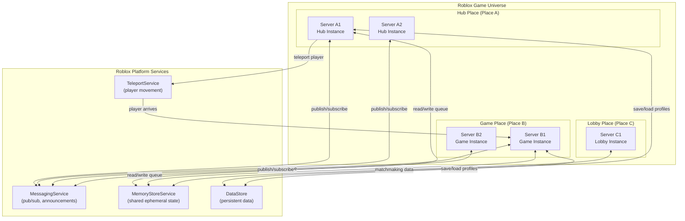
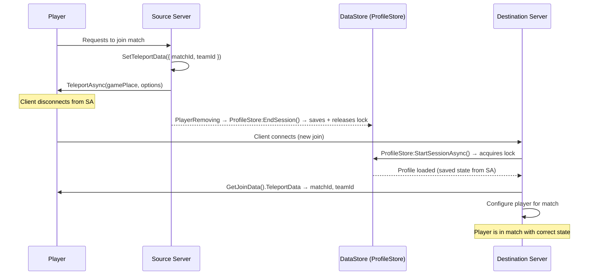
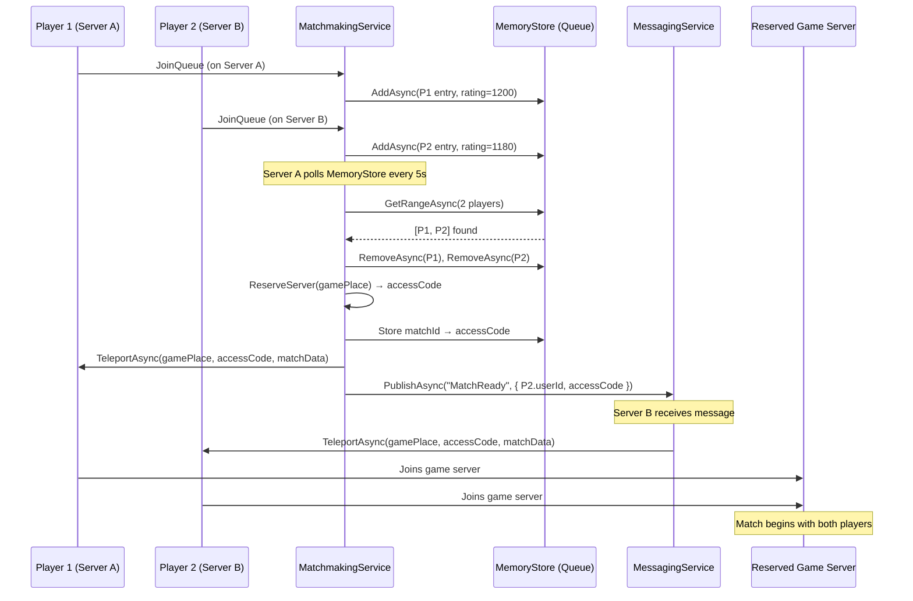

# 4.2 Cross-Server Communication

## Overview

Each Roblox game server is an isolated process. There is no shared memory, no direct RPC between servers, and no server registry. Cross-server communication happens through three platform services: MessagingService (pub/sub), MemoryStoreService (shared ephemeral state), and TeleportService (player movement between places). Understanding how these compose lets you build real-time matchmaking, cross-server events, party systems, and multi-place game universes.

---

## Backend Analogy

| Roblox Concept | Backend Analogy |
|---|---|
| MessagingService | Redis Pub/Sub, AWS SNS, Google Cloud Pub/Sub |
| MemoryStoreService SortedMap | Redis Sorted Set (ZADD/ZRANGE) |
| MemoryStoreService Queue | Redis List as queue / AWS SQS FIFO |
| TeleportService | Load balancer redirect + session handoff |
| Multi-place universe | Microservice cluster with dedicated service pods |
| `SetTeleportData` / `GetLocalPlayerTeleportData` | JWT passed in redirect URL / session cookie |

The key constraint: **there is no direct server-to-server function call**. Every cross-server operation goes through platform services that are themselves external to the game servers. Think of it as a strict event-driven architecture where servers communicate only through a shared message bus and shared state store.

---

## Architecture Overview



---

## MessagingService — Cross-Server Pub/Sub

MessagingService is the platform's pub/sub bus. Any server can publish to a topic; all servers subscribed to that topic receive the message within seconds. It is fire-and-forget — there's no acknowledgment, no guaranteed delivery, no ordering guarantee.

### Rate Limits

| Limit | Value |
|---|---|
| Message size | 1 KB max |
| Publish rate | 150 messages per minute per topic |
| Subscriptions per server | 20 per topic |
| Message delivery latency | Typically < 1 second |

### Use Cases

- Cross-server admin commands (ban player, shutdown all, broadcast message)
- Global event announcements ("boss has spawned on Server A7")
- Player join/leave notifications for friends system
- Server health broadcasting for a custom matchmaking dashboard

### Example: Cross-Server Announcement

```luau
-- ServerScriptService/Services/AnnouncementService.luau
local MessagingService = game:GetService("MessagingService")
local Players = game:GetService("Players")
local ReplicatedStorage = game:GetService("ReplicatedStorage")

local AnnouncementService = {}

local TOPIC_GLOBAL_ANNOUNCEMENT = "GlobalAnnouncement"

type AnnouncementPayload = {
    message: string,
    style: "Info" | "Warning" | "System",
    sourceServerId: string,
    timestamp: number,
}

function AnnouncementService:Init()
    -- Subscribe to the global announcement topic
    -- All servers run this — every server receives messages published to this topic
    local ok, err = pcall(function()
        MessagingService:SubscribeAsync(TOPIC_GLOBAL_ANNOUNCEMENT, function(messageData)
            -- messageData.Data is the JSON-decoded payload (Roblox auto-decodes)
            local payload = messageData.Data :: AnnouncementPayload

            -- Avoid processing our own messages if needed
            -- if payload.sourceServerId == game.JobId then return end

            self:_displayToAllPlayers(payload)
        end)
    end)

    if not ok then
        warn("[AnnouncementService] Failed to subscribe:", err)
    end
end

function AnnouncementService:Start() end

-- Called by admin tools or game events to send a cross-server announcement
function AnnouncementService:PublishGlobalAnnouncement(message: string, style: string)
    local payload: AnnouncementPayload = {
        message = message,
        style = style or "Info",
        sourceServerId = game.JobId,  -- game.JobId is unique per server instance
        timestamp = os.time(),
    }

    local ok, err = pcall(function()
        -- MessagingService auto-serializes the table to JSON
        MessagingService:PublishAsync(TOPIC_GLOBAL_ANNOUNCEMENT, payload)
    end)

    if not ok then
        warn("[AnnouncementService] Failed to publish:", err)
    end

    -- Also display locally immediately (publisher doesn't receive its own message)
    self:_displayToAllPlayers(payload)
end

function AnnouncementService:_displayToAllPlayers(payload: AnnouncementPayload)
    local Remotes = ReplicatedStorage.Remotes
    Remotes.System.NotifyPlayer:FireAllClients({
        message = payload.message,
        duration = 5,
        style = payload.style,
    })
end

return AnnouncementService
```

### Example: Admin Kick via MessagingService

```luau
-- Cross-server admin ban: kick a player regardless of which server they're on
local TOPIC_ADMIN_KICK = "AdminKick"

type AdminKickPayload = {
    targetUserId: number,
    reason: string,
    adminUserId: number,
}

-- Subscribe on every server
MessagingService:SubscribeAsync(TOPIC_ADMIN_KICK, function(messageData)
    local payload = messageData.Data :: AdminKickPayload
    local targetPlayer = Players:GetPlayerByUserId(payload.targetUserId)
    if targetPlayer then
        targetPlayer:Kick(string.format("Kicked by admin: %s", payload.reason))
    end
end)

-- Publish from admin tool (fires on all servers simultaneously)
MessagingService:PublishAsync(TOPIC_ADMIN_KICK, {
    targetUserId = 12345,
    reason = "Violation of ToS",
    adminUserId = adminPlayer.UserId,
})
```

---

## MemoryStoreService — Ephemeral Shared State

MemoryStoreService is the platform's Redis equivalent — an in-memory store shared across all servers in an experience, with automatic TTL-based expiry. Data does not persist across server restarts (unlike DataStore). It's purpose-built for real-time coordination: matchmaking queues, party state, session metadata.

### Rate Limits

| Limit | Value |
|---|---|
| Requests per minute | 1000 + 100 × CCU (standard) |
| SortedMap value size | 32 KB |
| Queue item size | 32 KB |
| SortedMap items | 1 million per map |
| TTL | 45 days maximum, set per item |

### SortedMap — Leaderboards and Matchmaking State

```luau
-- ServerScriptService/Services/MatchmakingService.luau
local MemoryStoreService = game:GetService("MemoryStoreService")
local TeleportService = game:GetService("TeleportService")
local Players = game:GetService("Players")

local MatchmakingService = {}

-- SortedMap for the matchmaking pool
-- Key: userId (string), Score: ELO rating, Value: { userId, joinTime, serverJobId }
local matchmakingMap = MemoryStoreService:GetSortedMap("MatchmakingPool")

local GAME_PLACE_ID = 12345678  -- your game place ID
local MATCH_SIZE = 4             -- players per match
local QUEUE_TTL = 300            -- 5 minutes: if not matched, entry expires

type MatchmakingEntry = {
    userId: number,
    displayName: string,
    rating: number,
    joinTime: number,
    originServerId: string,
}

function MatchmakingService:Init() end

function MatchmakingService:Start()
    -- Poll for matches every 5 seconds
    task.spawn(function()
        while true do
            task.wait(5)
            self:_checkForMatches()
        end
    end)
end

function MatchmakingService:JoinQueue(player: Player, rating: number)
    local entry: MatchmakingEntry = {
        userId = player.UserId,
        displayName = player.DisplayName,
        rating = rating,
        joinTime = os.time(),
        originServerId = game.JobId,
    }

    local ok, err = pcall(function()
        -- Score = rating (used for sorting by skill)
        -- Key must be a string
        matchmakingMap:SetAsync(
            tostring(player.UserId),
            entry,
            QUEUE_TTL,   -- TTL in seconds
            rating       -- score for sorted retrieval
        )
    end)

    if ok then
        print(string.format("[Matchmaking] %s joined queue (rating %d)", player.DisplayName, rating))
    else
        warn("[Matchmaking] Failed to join queue:", err)
    end
end

function MatchmakingService:LeaveQueue(player: Player)
    pcall(function()
        matchmakingMap:RemoveAsync(tostring(player.UserId))
    end)
end

function MatchmakingService:_checkForMatches()
    -- GetRangeAsync returns entries sorted by score
    -- We want similar-skill players, so get a range and batch them
    local ok, entries = pcall(function()
        return matchmakingMap:GetRangeAsync(
            Enum.SortDirection.Ascending,
            MATCH_SIZE * 2,   -- get 2x match size to have room for selection
            nil,              -- lowerBound (unbounded)
            nil               -- upperBound (unbounded)
        )
    end)

    if not ok or #entries < MATCH_SIZE then
        return  -- not enough players
    end

    -- Take the first MATCH_SIZE players (closest in rating due to sorted order)
    local matchedEntries = {}
    for i = 1, MATCH_SIZE do
        table.insert(matchedEntries, entries[i])
    end

    -- Remove matched players from queue
    for _, entry in matchedEntries do
        pcall(function()
            matchmakingMap:RemoveAsync(entry.key)
        end)
    end

    -- Create the match
    self:_createMatch(matchedEntries)
end

function MatchmakingService:_createMatch(entries: { any })
    print(string.format("[Matchmaking] Creating match for %d players", #entries))

    -- Collect player instances who are on THIS server
    local localPlayers = {}
    for _, entry in entries do
        local data = entry.value :: MatchmakingEntry
        local player = Players:GetPlayerByUserId(data.userId)
        if player then
            table.insert(localPlayers, player)
        end
        -- Players on other servers will be notified via MessagingService
        -- (implementing cross-server teleport coordination is shown below)
    end

    if #localPlayers > 0 then
        -- Teleport local players to the game place
        local teleportOptions = Instance.new("TeleportOptions")
        teleportOptions:SetTeleportData({
            matchId = game:GetService("HttpService"):GenerateGUID(false),
            playerCount = MATCH_SIZE,
        })

        local ok, err = pcall(function()
            TeleportService:TeleportAsync(GAME_PLACE_ID, localPlayers, teleportOptions)
        end)

        if not ok then
            warn("[Matchmaking] Teleport failed:", err)
        end
    end
end

return MatchmakingService
```

### Queue — FIFO Job Processing

```luau
local jobQueue = MemoryStoreService:GetQueue("RewardProcessingQueue")

-- Producer: enqueue a reward job
local function enqueueReward(userId: number, rewardType: string, amount: number)
    local job = {
        userId = userId,
        rewardType = rewardType,
        amount = amount,
        enqueuedAt = os.time(),
    }

    local ok, err = pcall(function()
        jobQueue:AddAsync(job, 3600, 0)  -- TTL 1 hour, priority 0
    end)

    if not ok then
        warn("[RewardQueue] Failed to enqueue:", err)
    end
end

-- Consumer: process jobs (runs on a dedicated server or background task)
local function processRewardQueue()
    while true do
        local ok, items, id = pcall(function()
            -- Read up to 5 items, mark as invisible for 30 seconds
            return jobQueue:ReadAsync(5, false, 30)
        end)

        if ok and #items > 0 then
            for _, item in items do
                local job = item.value
                -- Process the reward
                print(string.format("Processing reward: %s %d for user %d",
                    job.rewardType, job.amount, job.userId))
                -- ... apply to DataStore ...

                -- Remove from queue after successful processing
                pcall(function()
                    jobQueue:RemoveAsync(item.id)
                end)
            end
        else
            task.wait(2)  -- nothing in queue, wait before polling again
        end
    end
end
```

---

## TeleportService — Player Movement Between Places

TeleportService moves players between places (different games within your universe). The player's client disconnects from the current server and reconnects to the destination place. From the server's perspective, the player leaves normally — `PlayerRemoving` fires, ProfileStore saves and releases the lock.

### Basic Teleport

```luau
local TeleportService = game:GetService("TeleportService")

local LOBBY_PLACE_ID = 11111111
local GAME_PLACE_ID  = 22222222

-- Teleport one player
TeleportService:TeleportAsync(GAME_PLACE_ID, { player })

-- Teleport multiple players to the same server (party/match teleport)
local teleportOptions = Instance.new("TeleportOptions")
teleportOptions.ShouldReserveServer = true  -- create a fresh private server
TeleportService:TeleportAsync(GAME_PLACE_ID, { player1, player2, player3 }, teleportOptions)

-- Teleport to a specific reserved server (you hold the access code)
local options = Instance.new("TeleportOptions")
options.ReservedServerAccessCode = accessCode
TeleportService:TeleportAsync(GAME_PLACE_ID, { player }, options)
```

### Passing Data Across Teleport

Players carry a small data payload through teleports. This is how you pass match configuration, party info, or origin context from the source server to the destination:

```luau
-- SOURCE SERVER (before teleport)
local function teleportPlayerToMatch(player: Player, matchData: table)
    -- Save critical data to DataStore BEFORE teleporting
    -- (ProfileStore auto-saves on PlayerRemoving, but explicit save adds safety)
    local DataService = require(script.Parent.DataService)
    -- DataService save is handled by ProfileStore:EndSession() on PlayerRemoving

    -- Set teleport data — this survives the teleport
    -- Max size: ~1 KB (keep it small — IDs and metadata only, not full state)
    local teleportData = {
        matchId = matchData.matchId,
        teamId = matchData.teamAssignments[player.UserId],
        originPlace = game.PlaceId,
        spawnPoint = matchData.spawnPoints[player.UserId],
    }

    local options = Instance.new("TeleportOptions")
    options:SetTeleportData(teleportData)

    local ok, err = pcall(function()
        TeleportService:TeleportAsync(GAME_PLACE_ID, { player }, options)
    end)

    if not ok then
        warn(string.format("[Teleport] Failed to teleport %s: %s", player.Name, tostring(err)))
        -- Retry logic or notify player
    end
end
```

```luau
-- DESTINATION SERVER (on player join)
local Players = game:GetService("Players")
local TeleportService = game:GetService("TeleportService")

Players.PlayerAdded:Connect(function(player)
    -- Get the teleport data the source server attached
    local teleportData = player:GetJoinData().TeleportData

    if teleportData then
        print(string.format("Player %s arrived from match %s on team %d",
            player.Name,
            tostring(teleportData.matchId),
            tostring(teleportData.teamId)
        ))

        -- Use the data to configure the player's spawn, team, etc.
        if teleportData.spawnPoint then
            -- Teleport to their designated spawn after character loads
            player.CharacterAdded:Wait()
            local character = player.Character
            if character then
                character:PivotTo(CFrame.new(teleportData.spawnPoint))
            end
        end
    else
        -- Player joined directly (not via teleport) — handle as new join
        print(string.format("Player %s joined directly", player.Name))
    end
end)
```

### Session Handoff Pattern

The full session handoff combines ProfileStore save + teleport data + destination-side load:



---

## Multi-Place Universe Architecture

A Roblox "universe" is a collection of related places (games) under one `UniverseId`. Places share DataStore namespace, MessagingService topics, and MemoryStore data.

### Common Patterns

**Hub-and-Spoke**: One persistent social hub place where players hang out, and multiple game places for actual gameplay.

```
Hub Place     →  (matchmaking queue)  →  Game Place A
                                      →  Game Place B
              ←  (game complete, return home)
```

**Lobby-to-Instance**: A lobby place that fills up, then a private server is reserved for the match.

```
Lobby Place   →  (match found, reserve server)  →  Private Game Instance
                                                 ←  (match over, teleport back)
```

**When to use multiple places vs zones:**

| Scenario | Multiple Places | Single Place + Zones |
|---|---|---|
| Very different art styles | Yes — separate asset loading | Wasteful — all assets in memory |
| Radically different physics | Yes | Possible but complex |
| >100 player servers | Yes — separate instances | Limited by server capacity |
| Player count < 30 | Usually no | Simpler with zones |
| Different game modes | Consider it | Feature flags work fine |
| Separate dev teams per area | Yes | Rojo can handle it |
| Instant travel needed | No — 2-5s teleport delay | Yes — zone teleports are instant |

### Reserved Server Pattern for Matches

```luau
-- MatchmakingService: create a private server for a match group
local function reserveServerForMatch(players: { Player }, matchConfig: table)
    local ok, accessCode = pcall(function()
        return TeleportService:ReserveServer(GAME_PLACE_ID)
    end)

    if not ok then
        warn("[Matchmaking] Failed to reserve server:", accessCode)
        return
    end

    -- Store the access code in MemoryStore for other servers to use
    -- (e.g., if players are spread across multiple lobby servers)
    local matchStore = MemoryStoreService:GetSortedMap("ActiveMatches")
    pcall(function()
        matchStore:SetAsync(matchConfig.matchId, {
            accessCode = accessCode,
            players = matchConfig.playerIds,
            createdAt = os.time(),
        }, 3600, os.time())  -- expire after 1 hour
    end)

    -- Teleport players on THIS server to the reserved instance
    local options = Instance.new("TeleportOptions")
    options.ReservedServerAccessCode = accessCode
    options:SetTeleportData(matchConfig)

    pcall(function()
        TeleportService:TeleportAsync(GAME_PLACE_ID, players, options)
    end)

    -- Notify players on other servers via MessagingService
    pcall(function()
        MessagingService:PublishAsync("MatchReady", {
            matchId = matchConfig.matchId,
            accessCode = accessCode,
            playerIds = matchConfig.playerIds,
        })
    end)
end
```

---

## Combining All Three for a Complete Matchmaking Flow



---

## Key Takeaways

- There is no direct server-to-server RPC in Roblox. All cross-server coordination uses platform services.
- MessagingService is pub/sub: 150 messages/min/topic, 1 KB limit, fire-and-forget. Use for announcements, admin commands, global events.
- MemoryStoreService is ephemeral shared Redis: SortedMap for leaderboards/queues with scoring, Queue for FIFO jobs. Data expires automatically via TTL.
- TeleportService moves players between places — client reconnects, ProfileStore handles the data handoff automatically.
- `SetTeleportData` / `GetJoinData().TeleportData` is the cookie pattern for passing small payloads (IDs, config) across teleports. Keep it small (<1 KB).
- `ReserveServer` + access code is how you create private match instances. Coordinate access codes via MemoryStore.
- Multi-place universes share DataStore namespace and platform services. Use them when places have fundamentally different content requirements or player counts.

---

## Next: Module 4.3 — Open Cloud & External APIs

With in-game and cross-server communication covered, Module 4.3 addresses the boundary between your Roblox game and the external world: HttpService for outbound API calls (AI integration, webhooks, analytics), the Open Cloud REST API for external tooling and admin panels, MarketplaceService for monetization with idempotent purchase handling, and a brief intro to the Roblox MCP Server for LLM-driven development tooling.
