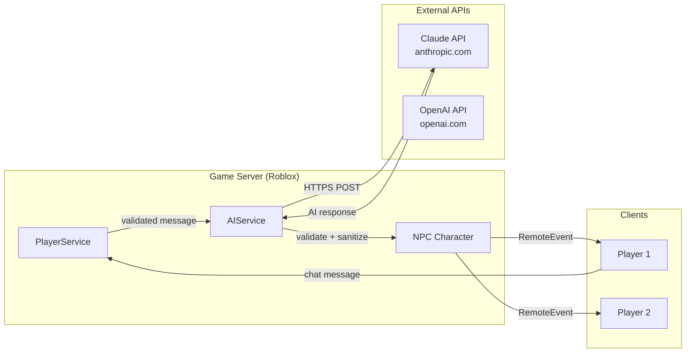
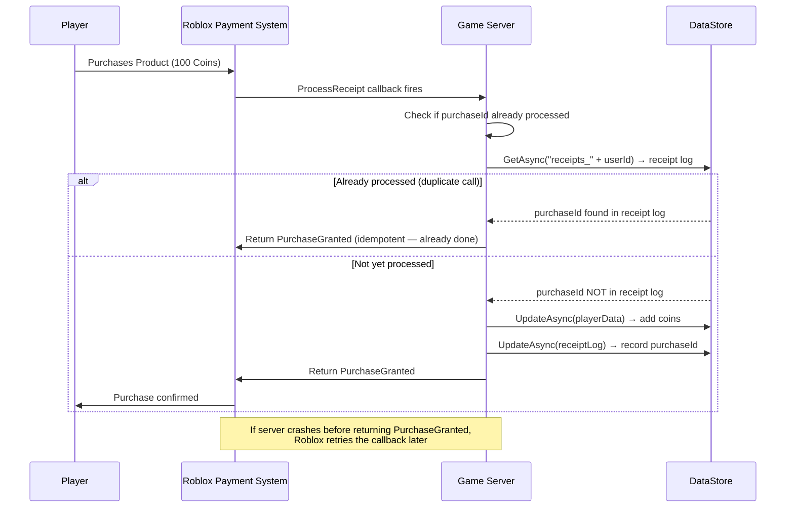

# 4.3 Open Cloud & External APIs

## Overview

Roblox game servers can communicate with the outside world in two directions: outbound (game server calls external APIs via HttpService) and inbound/external (external systems manage game data via Open Cloud REST API). This module covers the architecture, constraints, and idiomatic patterns for each channel — plus MarketplaceService for monetization, which has its own idempotency requirements that backend developers will recognize immediately.

---

## Backend Analogy

| Roblox Concept | Backend Analogy |
|---|---|
| `HttpService:RequestAsync()` | `fetch()` / `http.Get()` — outbound HTTP from your service |
| No inbound webhooks | Firewall rule: inbound connections to game servers are blocked |
| Open Cloud REST API | Admin API / management plane API (like AWS management APIs) |
| Open Cloud DataStore API | DynamoDB table access from an external service |
| Open Cloud Engine (UpdateScript) | Remote code deployment API |
| `MarketplaceService.ProcessReceipt` | Payment webhook handler — must be idempotent |
| API key auth (Open Cloud) | Service account / machine token auth |
| `PromptProductPurchase` | Initiate payment flow (like Stripe Checkout) |

---

## HttpService — Outbound HTTP from Game Servers

Game servers can make outbound HTTPS calls to external services. There is no inbound — Roblox servers cannot receive webhooks or listen on ports.

### Critical Constraints

| Constraint | Detail |
|---|---|
| Direction | Outbound only — no inbound connections |
| Protocol | HTTPS only in live games; HTTP allowed in Studio |
| Blocked domains | Roblox API (`roblox.com`, `robloxlabs.com`) is blocked — use Open Cloud from external tooling instead |
| Timeout | Default ~30 seconds per request |
| Size | Request/response body max ~1 MB |
| Enable in Studio | `HttpService.HttpEnabled = true` (game settings) |

### Basic Request Pattern

```luau
-- ServerScriptService/Services/HttpService example
local HttpService = game:GetService("HttpService")

type HttpResponse = {
    Success: boolean,
    StatusCode: number,
    StatusMessage: string,
    Headers: { [string]: string },
    Body: string,
}

-- Generic request helper with error handling
local function request(options: {
    Url: string,
    Method: string?,
    Headers: { [string]: string }?,
    Body: string?,
}): (boolean, any)
    local ok, result = pcall(function()
        return HttpService:RequestAsync({
            Url = options.Url,
            Method = options.Method or "GET",
            Headers = options.Headers or {},
            Body = options.Body,
        })
    end)

    if not ok then
        -- Network error, timeout, blocked domain
        warn("[HTTP] Request failed:", tostring(result))
        return false, { error = tostring(result) }
    end

    local response = result :: HttpResponse

    if not response.Success then
        warn(string.format("[HTTP] %s %s → %d %s",
            options.Method or "GET",
            options.Url,
            response.StatusCode,
            response.StatusMessage
        ))
        return false, { statusCode = response.StatusCode, body = response.Body }
    end

    -- Decode JSON body
    local decoded, decodeErr = pcall(function()
        return HttpService:JSONDecode(response.Body)
    end)

    if not decoded then
        return false, { error = "Failed to decode JSON: " .. tostring(decodeErr) }
    end

    return true, decodeErr  -- decodeErr is the decoded body when decoded = true
end
```

---

## Server-Side AI Integration Pattern

The most compelling modern use of HttpService is calling AI APIs directly from game servers — for NPCs that converse, dynamic content generation, game masters that narrate, or procedural content.



**Architecture notes:**
- AI calls happen server-side, never client-side. Clients cannot hold API keys.
- The server validates and sanitizes AI responses before replicating to clients — a malicious prompt injection on the client could attempt to get the AI to produce content that violates platform rules. Server-side validation is the last line of defense.
- AI calls are async and can take 1–5 seconds. Use `task.spawn()` so the calling thread doesn't block.
- Cache responses where possible — identical NPC lines don't need a new API call.

```luau
-- ServerScriptService/Services/AIService.luau
local HttpService = game:GetService("HttpService")
local ReplicatedStorage = game:GetService("ReplicatedStorage")

local AIService = {}

-- API configuration (load from a secure server-side config, never hardcode in published scripts)
-- In production: load from environment variable via a startup Script argument,
-- or from a private DataStore key only accessible server-side
local API_KEY = "sk-ant-..."  -- NEVER commit real keys
local API_URL = "https://api.anthropic.com/v1/messages"
local MODEL = "claude-3-5-haiku-20241022"  -- fast, cost-effective for NPC chat

-- Simple response cache to avoid repeat API calls for common queries
local _responseCache: { [string]: { response: string, timestamp: number } } = {}
local CACHE_TTL = 300  -- 5 minutes

type AIMessage = {
    role: "user" | "assistant",
    content: string,
}

type NPCContext = {
    npcName: string,
    npcPersonality: string,
    npcKnowledge: string,
    gameContext: string,
}

function AIService:GetNPCResponse(
    npcContext: NPCContext,
    conversationHistory: { AIMessage },
    playerMessage: string
): (boolean, string)
    -- Validate player message before sending to AI
    if #playerMessage > 500 then
        return false, "Message too long"
    end

    -- Check cache for identical context + message combination
    local cacheKey = npcContext.npcName .. "|" .. playerMessage
    local cached = _responseCache[cacheKey]
    if cached and (os.time() - cached.timestamp) < CACHE_TTL then
        return true, cached.response
    end

    -- Build the system prompt
    local systemPrompt = string.format([[
You are %s, an NPC in a Roblox game.
Personality: %s
Knowledge: %s
Game context: %s

Rules:
- Keep responses to 1-2 sentences (players are in an active game)
- Stay in character at all times
- Never break the fourth wall
- If asked to do something harmful or inappropriate, redirect to the game context
- Do not reveal you are an AI
]], npcContext.npcName, npcContext.npcPersonality, npcContext.npcKnowledge, npcContext.gameContext)

    -- Build the messages array
    local messages = {}
    -- Include last 5 turns for context (limit to control token cost)
    local historyStart = math.max(1, #conversationHistory - 10)
    for i = historyStart, #conversationHistory do
        table.insert(messages, conversationHistory[i])
    end
    table.insert(messages, { role = "user", content = playerMessage })

    -- Build request body
    local requestBody = HttpService:JSONEncode({
        model = MODEL,
        max_tokens = 150,  -- short responses for game chat
        system = systemPrompt,
        messages = messages,
    })

    -- Make the API call (this yields — call from task.spawn if non-blocking needed)
    local ok, response = pcall(function()
        return HttpService:RequestAsync({
            Url = API_URL,
            Method = "POST",
            Headers = {
                ["Content-Type"] = "application/json",
                ["x-api-key"] = API_KEY,
                ["anthropic-version"] = "2023-06-01",
            },
            Body = requestBody,
        })
    end)

    if not ok or not response.Success then
        warn("[AIService] API call failed:", tostring(response))
        return false, "I'm not sure how to respond to that."  -- graceful fallback
    end

    -- Decode response
    local decoded, data = pcall(function()
        return HttpService:JSONDecode(response.Body)
    end)

    if not decoded or not data.content or #data.content == 0 then
        return false, "I'm busy right now, come back later."
    end

    local aiResponse = data.content[1].text

    -- Sanitize: basic content check before sending to clients
    -- In production: add profanity filter, injection detection, etc.
    if #aiResponse > 300 then
        aiResponse = aiResponse:sub(1, 300) .. "..."
    end

    -- Cache the response
    _responseCache[cacheKey] = {
        response = aiResponse,
        timestamp = os.time(),
    }

    return true, aiResponse
end

-- Called from an NPC interaction handler
function AIService:HandlePlayerChat(player: Player, npcId: string, message: string)
    -- Run async so the game loop isn't blocked waiting for the AI API
    task.spawn(function()
        local npcContext: NPCContext = {
            npcName = "Eldrin the Merchant",
            npcPersonality = "Friendly, slightly greedy, loves to haggle",
            npcKnowledge = "Knows all item prices, rumors about the dungeon, town history",
            gameContext = "Fantasy RPG, player is in the marketplace",
        }

        local ok, response = self:GetNPCResponse(npcContext, {}, message)

        if ok then
            -- Send to the requesting player's client
            local Remotes = ReplicatedStorage.Remotes
            Remotes.System.NotifyPlayer:FireClient(player, {
                message = string.format("[%s]: %s", npcContext.npcName, response),
                duration = 6,
                style = "Info",
            })
        end
    end)
end

function AIService:Init() end
function AIService:Start() end

return AIService
```

### Discord Webhook Integration

```luau
-- Send server events to a Discord channel for monitoring
local DISCORD_WEBHOOK_URL = "https://discord.com/api/webhooks/..."

local function sendDiscordAlert(title: string, description: string, color: number)
    local payload = HttpService:JSONEncode({
        embeds = {
            {
                title = title,
                description = description,
                color = color or 0x5865F2,  -- Discord blurple
                timestamp = os.date("!%Y-%m-%dT%H:%M:%SZ"),
                footer = {
                    text = string.format("Server %s | Place %d", game.JobId:sub(1, 8), game.PlaceId)
                },
            }
        }
    })

    task.spawn(function()
        pcall(function()
            HttpService:PostAsync(DISCORD_WEBHOOK_URL, payload, Enum.HttpContentType.ApplicationJson)
        end)
    end)
end

-- Example: alert when a player reaches max level
local function onPlayerMaxLevel(player: Player)
    sendDiscordAlert(
        "Player Reached Max Level!",
        string.format("**%s** (UserId: %d) reached level 100!", player.DisplayName, player.UserId),
        0xFFD700  -- gold
    )
end
```

---

## Open Cloud REST API — External Tooling

The Open Cloud API is Roblox's management plane — a REST API for external tools to read and modify game data without running inside a game server. It is authenticated with API keys and can only be called from external services, not from within the game itself.

### Key APIs

| API | What It Does |
|---|---|
| DataStore | Read/write player data from external tools (admin panels, migration scripts) |
| Inventory | Query player inventory (items, game passes, developer products) |
| Groups | Manage group ranks, roles, membership |
| Engine (UpdateScript) | Modify script source code in published places programmatically |
| Developer Products | CRUD developer products for your game |
| Game Passes | Manage game pass metadata |
| Creator Store | Query assets |
| Luau Execution | Run Luau scripts in a universe |

### Authentication

```json
// All Open Cloud requests use x-api-key header
// Create API keys at: roblox.com/create/credentials
{
  "headers": {
    "x-api-key": "your-api-key-here",
    "Content-Type": "application/json"
  }
}
```

### Reading DataStore from External Service (Node.js example)

```json
// GET https://apis.roblox.com/datastores/v1/universes/{universeId}/standard-datastores/datastore/entries/entry
// Headers: x-api-key, Content-Type
// Query params: datastoreName=PlayerData_v1, entryKey=player_12345

// Response:
{
  "currency": { "coins": 500, "gems": 10 },
  "stats": { "level": 25, "experience": 12500 },
  "schemaVersion": 2
}
```

### CRITICAL: Open Cloud Messages Don't Reach Studio

When you send a MessagingService message via Open Cloud API, it is delivered only to **live published game servers** — not to Roblox Studio playtests. This is a common source of confusion during development.

```bash
# This works in live game servers, NOT in Studio
curl -X POST https://apis.roblox.com/messaging-service/v1/universes/{universeId}/topics/{topic} \
  -H "x-api-key: YOUR_KEY" \
  -H "Content-Type: application/json" \
  -d '{"message": "Test announcement"}'
```

To test MessagingService during development, test with two simultaneous Studio windows (Team Test) or with a published game.

### Engine API: Update Scripts Programmatically

```bash
# Update a script's source in a live place — useful for CI/CD, config updates
PATCH https://apis.roblox.com/cloud/v2/universes/{universeId}/places/{placeId}/instances/{instanceId}
Content-Type: application/json
x-api-key: YOUR_KEY

{
  "engineInstance": {
    "details": {
      "script": {
        "source": "print('Hello from CI/CD')"
      }
    }
  }
}
```

---

## MarketplaceService — Monetization

MarketplaceService handles in-game purchases. There are two product types:

| Type | Behavior | Use Case |
|---|---|---|
| Developer Product | Can be purchased multiple times | Coins, boosts, consumables |
| Game Pass | Purchased once, permanent | VIP, extra lives, cosmetics |

### Prompting Purchases

```luau
-- From a client controller (LocalScript context)
local MarketplaceService = game:GetService("MarketplaceService")
local Players = game:GetService("Players")

local DEV_PRODUCT_100_COINS = 1234567890  -- Product ID from Creator Dashboard
local GAME_PASS_VIP = 9876543210

-- Prompt a developer product purchase
local function promptCoinPurchase()
    MarketplaceService:PromptProductPurchase(Players.LocalPlayer, DEV_PRODUCT_100_COINS)
end

-- Prompt a game pass purchase
local function promptVIPPurchase()
    MarketplaceService:PromptGamePassPurchase(Players.LocalPlayer, GAME_PASS_VIP)
end

-- Listen for purchase completion (fires on client, but DO NOT grant items client-side)
MarketplaceService.PromptProductPurchaseFinished:Connect(function(userId, productId, wasPurchased)
    if wasPurchased then
        -- DO NOT grant items here — this fires client-side and can be exploited
        -- Item granting MUST happen in ProcessReceipt on the server
        print("Purchase initiated — waiting for server confirmation")
    end
end)
```

### ProcessReceipt: The Idempotent Handler

`ProcessReceipt` is a server-side callback that fires when a player completes a purchase. This is the only place where you grant items. It must be **idempotent** — Roblox may call it multiple times for the same purchase if your server crashes or returns an error.



```luau
-- ServerScriptService/Services/PurchaseService.luau
local MarketplaceService = game:GetService("MarketplaceService")
local Players = game:GetService("Players")
local DataStoreService = game:GetService("DataStoreService")

-- Separate DataStore for receipt logs (don't mix with player data)
local receiptStore = DataStoreService:GetDataStore("PurchaseReceipts")

local PurchaseService = {}

-- Map product IDs to their grant handlers
type GrantHandler = (player: Player, receiptInfo: table) -> boolean

local PRODUCT_HANDLERS: { [number]: GrantHandler } = {}

-- Register a product handler
function PurchaseService:RegisterProduct(productId: number, handler: GrantHandler)
    PRODUCT_HANDLERS[productId] = handler
end

-- ============================================================
-- ProcessReceipt — the idempotent purchase handler
-- ============================================================
-- IMPORTANT: This must be set as the callback, not connected as an event
-- Only ONE ProcessReceipt callback can exist per server
local function processReceipt(receiptInfo: {
    PurchaseId: string,
    PlayerId: number,
    ProductId: number,
    CurrencySpent: number,
    CurrencyType: Enum.CurrencyType,
    PlaceIdWherePurchased: number,
}): Enum.ProductPurchaseDecision
    -- ============================================================
    -- STEP 1: Check if this receipt was already processed (idempotency)
    -- ============================================================
    local receiptKey = string.format("receipt_%d_%s", receiptInfo.PlayerId, receiptInfo.PurchaseId)

    local alreadyProcessed = false
    local checkOk, checkErr = pcall(function()
        local existing = receiptStore:GetAsync(receiptKey)
        alreadyProcessed = existing ~= nil
    end)

    if not checkOk then
        -- DataStore failure — cannot safely process
        -- Return NotProcessedYet so Roblox retries later
        warn("[PurchaseService] Receipt check failed:", checkErr)
        return Enum.ProductPurchaseDecision.NotProcessedYet
    end

    if alreadyProcessed then
        -- Already granted — return success to prevent Roblox from retrying indefinitely
        print(string.format("[PurchaseService] Duplicate receipt %s — already processed", receiptInfo.PurchaseId))
        return Enum.ProductPurchaseDecision.PurchaseGranted
    end

    -- ============================================================
    -- STEP 2: Find the player (they might have disconnected)
    -- ============================================================
    local player = Players:GetPlayerByUserId(receiptInfo.PlayerId)
    if not player then
        -- Player left before grant completed
        -- Return NotProcessedYet — Roblox will retry when they rejoin
        -- (Roblox re-fires ProcessReceipt when the player next joins any server in the experience)
        return Enum.ProductPurchaseDecision.NotProcessedYet
    end

    -- ============================================================
    -- STEP 3: Find and call the product grant handler
    -- ============================================================
    local handler = PRODUCT_HANDLERS[receiptInfo.ProductId]
    if not handler then
        warn(string.format("[PurchaseService] No handler for productId %d", receiptInfo.ProductId))
        -- Unknown product — grant to avoid player losing their purchase
        -- Log for investigation
        return Enum.ProductPurchaseDecision.PurchaseGranted
    end

    local grantSuccess = handler(player, receiptInfo)

    if not grantSuccess then
        -- Handler failed (e.g., DataStore error while adding coins)
        return Enum.ProductPurchaseDecision.NotProcessedYet
    end

    -- ============================================================
    -- STEP 4: Record the receipt to prevent duplicate grants
    -- ============================================================
    local recordOk, recordErr = pcall(function()
        receiptStore:SetAsync(receiptKey, {
            processedAt = os.time(),
            productId = receiptInfo.ProductId,
            playerId = receiptInfo.PlayerId,
        }, nil, nil)  -- no TTL — receipts are permanent records
    end)

    if not recordOk then
        -- Failed to record — do NOT grant again on retry (items were already added)
        -- This is a tricky case: items were granted but we can't record the receipt
        -- Log this for manual review. In practice this is extremely rare.
        warn(string.format("[PurchaseService] CRITICAL: Could not record receipt %s: %s",
            receiptInfo.PurchaseId, recordErr))
        -- Still return PurchaseGranted — items were given, don't make player wait
        return Enum.ProductPurchaseDecision.PurchaseGranted
    end

    return Enum.ProductPurchaseDecision.PurchaseGranted
end

function PurchaseService:Init()
    -- Set the ProcessReceipt callback
    MarketplaceService.ProcessReceipt = processReceipt

    -- Register product handlers
    local DataService = require(script.Parent.DataService)

    -- 100 Coins product
    self:RegisterProduct(1234567890, function(player: Player, receipt: table): boolean
        local ok = pcall(function()
            DataService:UpdateData(player, function(data)
                data.currency.coins += 100
            end)
        end)
        return ok
    end)

    -- 500 Coins product
    self:RegisterProduct(1234567891, function(player: Player, receipt: table): boolean
        local ok = pcall(function()
            DataService:UpdateData(player, function(data)
                data.currency.coins += 500
            end)
        end)
        return ok
    end)
end

function PurchaseService:Start() end

-- Check if player owns a game pass (cached check — no DataStore call)
function PurchaseService:PlayerOwnsGamePass(player: Player, gamePassId: number): boolean
    local ok, result = pcall(function()
        return MarketplaceService:UserOwnsGamePassAsync(player.UserId, gamePassId)
    end)
    return ok and result
end

return PurchaseService
```

### Game Pass Handling

Game passes are permanent — check ownership on join and cache it:

```luau
-- In PlayerService, on player join
local GAME_PASS_VIP = 9876543210
local GAME_PASS_DOUBLE_XP = 1111111111

local MarketplaceService = game:GetService("MarketplaceService")

local function checkGamePasses(player: Player, data: PlayerData)
    -- Check and cache game pass ownership (async call)
    task.spawn(function()
        local ownsVIP = false
        local ok = pcall(function()
            ownsVIP = MarketplaceService:UserOwnsGamePassAsync(player.UserId, GAME_PASS_VIP)
        end)

        if ok and ownsVIP then
            data.gamePassFlags = data.gamePassFlags or {}
            data.gamePassFlags.hasVIP = true
            -- Apply VIP perks
        end
    end)
end
```

---

## Roblox MCP Server — Brief Introduction

The Roblox MCP (Model Context Protocol) Server is an open-source tool that lets external LLMs like Claude interact with Roblox Studio directly. It bridges the gap between AI assistants and the Studio IDE.

Capabilities exposed via MCP:
- Insert models and instances into the DataModel
- Execute Luau scripts in Studio
- Read and modify instance properties
- Query the DataModel hierarchy
- Run plugin operations

```
Installation: github.com/roblox/studio-mcp-server
Protocol: MCP (standardized AI tool protocol)
Usage: Configure in Claude Code / Claude Desktop settings
```

**Important constraint**: Open Cloud messages sent from external tools do NOT reach Studio sessions — only live game servers receive them (as noted in the Open Cloud section above). The MCP server works by directly communicating with the Studio process, not via the game server network.

This is covered in depth in Module 6.1 — Claude Code + Roblox MCP Setup. For now, the mental model is: MCP Server = REST API that your AI assistant uses to operate Studio as if it were an IDE plugin.

---

## Key Takeaways

- `HttpService:RequestAsync()` supports outbound HTTPS only. There is no inbound. Your game servers cannot receive webhooks.
- Roblox-owned domains (`roblox.com`) are blocked from HttpService — use Open Cloud from external services to interact with Roblox APIs.
- Always call AI APIs server-side, never client-side. API keys must never leave the server. Validate and sanitize AI responses before replicating to clients.
- Open Cloud is the external management API. Use it for admin panels, CI/CD scripts, migration tooling — not for in-game logic.
- Open Cloud messages do not reach Studio. Test MessagingService with Team Test or published places.
- `ProcessReceipt` is a payment webhook — it MUST be idempotent. Check a receipt log before granting, record after granting. Return `NotProcessedYet` on transient failures so Roblox retries.
- Never grant items in client-side purchase events — `PromptProductPurchaseFinished` fires on the client and can be exploited. Only `ProcessReceipt` on the server is authoritative.
- Game passes are permanent purchases. Check with `UserOwnsGamePassAsync` on join and cache the result.

---

## Next: Module 5.1 — Performance Optimization

With architecture and APIs covered, Module 5.1 shifts to making your game run well. Topics include the 16ms frame budget, object pooling, workspace streaming, event connection management, draw call optimization, and tools like the Microprofiler and Roblox Studio Performance tab for identifying bottlenecks.
