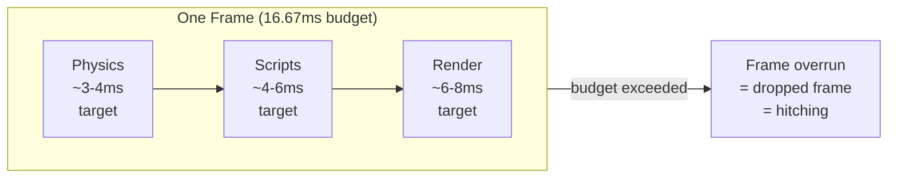

# 5.1 Performance Optimization

## Overview

Performance in Roblox hits you from two angles simultaneously: the game must run smoothly on the client (60 FPS desktop, 30 FPS mobile) *and* the server must handle dozens of concurrent players without falling behind. Unlike a backend service where you can scale horizontally and throw more machines at the problem, a Roblox server is a single process — and a Roblox client runs on hardware you don't control, ranging from a modern gaming PC to a budget Android phone from 2019.

This module maps backend performance thinking (throughput, latency budgets, GC pressure, connection pooling) to Roblox equivalents. The mental models transfer well. The APIs are different.

---

## Backend Analogy

| Backend Concept | Roblox Equivalent |
|---|---|
| Request latency budget (e.g. p99 < 200ms) | Frame budget (16.67ms at 60 FPS, 33.33ms at 30 FPS) |
| GC pressure / allocation rate | Instance.new / Destroy churn; Luau table allocations per frame |
| Connection pool (DB connections) | Object pool (pre-allocated instances reused across requests) |
| Event listener leak | Orphaned RBXScriptConnection running forever |
| CDN / lazy loading | StreamingEnabled (proximity-based content loading) |
| Memory limit per pod | Client memory target: <1000 MB |
| APM / distributed tracing | MicroProfiler, Studio Profiler, Developer Console |

---

## The Frame Budget Model

Your game loop runs at a target of 60 FPS on desktop (16.67ms per frame) and 30 FPS on mobile (33.33ms per frame). Every frame, Roblox must complete physics simulation, run all scripts, and render the scene — all within that window.

```mermaid
gantt
    title Frame Budget Breakdown (16.67ms at 60 FPS)
    dateFormat X
    axisFormat %Lms

    section Physics
    Physics simulation    :0, 4

    section Scripts
    Server scripts        :4, 6
    Client scripts        :4, 6

    section Render
    Render pipeline       :10, 16
    GPU present           :16, 17
```



Think of it like this:



**Key numbers to internalize:**

| Target | Budget |
|---|---|
| Desktop (60 FPS) | 16.67ms per frame |
| Mobile (30 FPS) | 33.33ms per frame |
| Client memory | < 1000 MB |
| Script execution | < 6ms per frame ideally |

If your script takes 10ms in a single frame, you've already consumed 60% of the desktop budget before physics or rendering even runs. This is why tight loops, expensive per-frame callbacks, and synchronous data processing all hurt.

---

## Monitor Tools

### Developer Console (F9)

Press F9 in any running game. The Performance tab shows:

- **FPS** — current frame rate
- **Memory** — breakdown by category (Scripts, Instances, Textures, Sounds, etc.)
- **Network** — data sent/received per second

This is your first line of triage. Open it, watch memory climb, and you've found a leak. Watch FPS drop during combat and you've found a hot path.

### Studio Profiler

In Studio: `View → Profiler`. Shows a timeline of every task in every frame — physics, scripts, render. Click any task to see which script caused it. Equivalent to a flame graph in backend profiling.

### MicroProfiler (Ctrl+F6)

The most powerful tool. Accessible in-game via `Ctrl+F6`. Shows microsecond-level timing for every step of the frame pipeline. You can add custom labels:

```luau
-- Mark a custom region in MicroProfiler
debug.profilebegin("CombatService:ProcessHit")
-- ... expensive work ...
debug.profileend()
```

This is equivalent to adding spans in OpenTelemetry. Instrument first, then profile, then optimize. Never guess.

---

## Object Pooling

### The Problem

`Instance.new("Part")` allocates memory, initializes the object, and registers it with the DataModel. `Part:Destroy()` tears it down and triggers garbage collection. In a game with bullets firing at 10/second, you're creating and destroying 600 instances per minute. The GC pressure accumulates.

This is the exact same problem as allocating new database connection objects per request instead of using a connection pool.

### The Solution

Pre-allocate a fixed pool of instances at startup. When you need one, pull it from the pool and enable/reposition it. When you're done, disable it and return it to the pool. No allocation, no GC.

```luau
--!strict
-- ObjectPool.luau
-- Generic object pool for any Roblox instance type

local ObjectPool = {}
ObjectPool.__index = ObjectPool

export type PoolConfig = {
    template: Instance,
    initialSize: number,
    maxSize: number,
    parent: Instance,
}

export type Pool = typeof(setmetatable({} :: {
    _available: { Instance },
    _active: { Instance },
    _template: Instance,
    _maxSize: number,
    _parent: Instance,
}, ObjectPool))

function ObjectPool.new(config: PoolConfig): Pool
    local self = setmetatable({
        _available = {} :: { Instance },
        _active = {} :: { Instance },
        _template = config.template,
        _maxSize = config.maxSize,
        _parent = config.parent,
    }, ObjectPool)

    -- Pre-allocate initial pool
    for _ = 1, config.initialSize do
        local obj = config.template:Clone()
        obj.Parent = config.parent
        -- Disable/hide — implementation depends on instance type
        if obj:IsA("BasePart") then
            (obj :: BasePart).Anchored = true
            obj.Parent = nil  -- Remove from workspace until needed
        end
        table.insert(self._available, obj)
    end

    return self
end

-- Acquire an object from the pool
-- Returns nil if pool is exhausted and at max size
function ObjectPool:Acquire(): Instance?
    local obj: Instance?

    if #self._available > 0 then
        -- Reuse existing object
        obj = table.remove(self._available, #self._available)
    elseif #self._available + #self._active < self._maxSize then
        -- Grow the pool (within limits)
        obj = self._template:Clone()
    else
        -- Pool exhausted — caller must handle nil
        warn("[ObjectPool] Pool exhausted, consider increasing maxSize")
        return nil
    end

    if obj then
        obj.Parent = self._parent
        table.insert(self._active, obj)
    end

    return obj
end

-- Release an object back to the pool
function ObjectPool:Release(obj: Instance): ()
    -- Remove from active list
    local idx = table.find(self._active, obj)
    if idx then
        table.remove(self._active, idx)
    end

    -- Reset and park
    obj.Parent = nil
    table.insert(self._available, obj)
end

-- Release all active objects at once (e.g. round end)
function ObjectPool:ReleaseAll(): ()
    for _, obj in self._active do
        obj.Parent = nil
        table.insert(self._available, obj)
    end
    table.clear(self._active)
end

return ObjectPool
```

**Usage in a bullet system:**

```luau
--!strict
-- BulletService.luau (server or client depending on ownership model)
local ObjectPool = require(script.Parent.ObjectPool)
local RunService = game:GetService("RunService")

-- Create a bullet template (done once at startup)
local bulletTemplate = Instance.new("Part")
bulletTemplate.Size = Vector3.new(0.2, 0.2, 1)
bulletTemplate.Material = Enum.Material.Neon
bulletTemplate.BrickColor = BrickColor.new("Bright yellow")
bulletTemplate.CanCollide = false
bulletTemplate.Anchored = false

local bulletPool = ObjectPool.new({
    template = bulletTemplate,
    initialSize = 50,
    maxSize = 200,
    parent = workspace,
})

local function fireBullet(origin: Vector3, direction: Vector3): ()
    local bullet = bulletPool:Acquire()
    if not bullet then return end  -- Pool exhausted, skip this bullet

    local part = bullet :: BasePart
    part.CFrame = CFrame.new(origin, origin + direction)
    part.AssemblyLinearVelocity = direction.Unit * 100

    -- Auto-release after 3 seconds
    task.delay(3, function()
        if part.Parent then  -- Still active (not already released)
            bulletPool:Release(bullet)
        end
    end)
end
```

**Performance impact:**
- First 50 bullets: zero allocations (pool pre-warmed)
- Bullets 51-200: one-time allocation per bullet, no subsequent churn
- After that: pure reuse — GC never sees bullet allocations again

---

## Event Connection Management

### The Problem

In Roblox, connecting to events returns an `RBXScriptConnection` object. If you never call `Disconnect()` on it, the connection persists forever — even after the object that owns it is destroyed, even after the player leaves, even after a round ends. The callback keeps running, accessing potentially-nil references, and the memory it captured never gets collected.

This is the Roblox equivalent of an event listener leak in Node.js (`emitter.on()` without `emitter.off()`).

```luau
-- DANGEROUS: orphaned connection
local part = workspace:FindFirstChild("SomePart") :: BasePart
part.Touched:Connect(function(hit)
    -- If part is destroyed, this callback still runs if something touches where it was
    -- If 'part' was a local variable captured here, it's now keeping that memory alive
    print(hit.Name)
end)
-- Connection is never stored, never disconnected
-- It runs until the game shuts down
```

### Maid / Janitor Pattern

A Maid (also called Janitor) is a cleanup registry — you register connections and instances with it, then call `Destroy()` to clean everything up atomically. This is the Roblox equivalent of a `using` statement, a defer block, or a destructor.

```luau
--!strict
-- Maid.luau
-- Cleanup registry for connections, instances, and callbacks

type Cleanup = RBXScriptConnection | Instance | () -> () | thread

local Maid = {}
Maid.__index = Maid

export type MaidObject = typeof(setmetatable({} :: {
    _tasks: { Cleanup },
}, Maid))

function Maid.new(): MaidObject
    return setmetatable({ _tasks = {} }, Maid)
end

-- Register anything that needs cleanup
-- Accepts: RBXScriptConnection, Instance, function, coroutine
function Maid:Add(task: Cleanup): Cleanup
    table.insert(self._tasks, task)
    return task  -- Return for chaining
end

-- Convenience: connect and auto-register
function Maid:Connect(signal: RBXScriptSignal, callback: (...any) -> ()): RBXScriptConnection
    local connection = signal:Connect(callback)
    self:Add(connection)
    return connection
end

-- Clean up everything registered
function Maid:Destroy(): ()
    for _, cleanup in self._tasks do
        if typeof(cleanup) == "RBXScriptConnection" then
            cleanup:Disconnect()
        elseif typeof(cleanup) == "Instance" then
            cleanup:Destroy()
        elseif typeof(cleanup) == "function" then
            cleanup()
        elseif typeof(cleanup) == "thread" then
            task.cancel(cleanup)
        end
    end
    table.clear(self._tasks)
end

return Maid
```

**Usage — per-player cleanup lifecycle:**

```luau
--!strict
-- CombatController.luau (client)
local Maid = require(script.Parent.Maid)
local UserInputService = game:GetService("UserInputService")
local RunService = game:GetService("RunService")

local CombatController = {}

local _playerMaid: typeof(Maid.new())?

function CombatController:Init(): ()
    local Players = game:GetService("Players")
    local localPlayer = Players.LocalPlayer

    -- Create a maid for this player session
    _playerMaid = Maid.new()

    -- All connections registered — will be cleaned up on player leave
    _playerMaid:Connect(UserInputService.InputBegan, function(input, processed)
        if processed then return end
        if input.KeyCode == Enum.KeyCode.E then
            CombatController:OnAttackPressed()
        end
    end)

    _playerMaid:Connect(RunService.Heartbeat, function(dt: number)
        CombatController:OnHeartbeat(dt)
    end)

    -- Clean up when player character is removed (respawn)
    _playerMaid:Connect(localPlayer.CharacterRemoving, function()
        CombatController:OnCharacterRemoving()
    end)
end

function CombatController:OnAttackPressed(): ()
    -- ...
end

function CombatController:OnHeartbeat(dt: number): ()
    -- ...
end

function CombatController:OnCharacterRemoving(): ()
    -- Clean up character-specific state here
    -- The maid itself stays alive (player is still in the game)
end

function CombatController:Destroy(): ()
    if _playerMaid then
        _playerMaid:Destroy()
        _playerMaid = nil
    end
end

return CombatController
```

**Pattern summary:** every service/controller that registers connections should own a Maid. The Maid's `Destroy()` is called when the owning object's lifecycle ends. Never let a connection outlive the context that created it.

---

## StreamingEnabled

### What It Is

StreamingEnabled is Roblox's proximity-based LOD system for the DataModel itself. Instead of loading the entire workspace on join, the server streams only the parts of the world near each player. As they move, new content streams in, old content unloads.

Think of it as lazy-loading for the game world — equivalent to pagination or cursor-based fetching in backend APIs. You never send more data than the client needs right now.

### When to Use It

| Scenario | Use StreamingEnabled? |
|---|---|
| Large open world (>600×600 studs) | Yes — essential |
| Mobile target audience | Yes — memory savings critical |
| Small arena / contained map | No — overhead not worth it |
| Obby or linear experience | Depends — test both |

### Configuration

Enable in Studio: `Workspace → StreamingEnabled = true`. Set `StreamingMinRadius` (always loaded) and `StreamingTargetRadius` (loaded when possible).

### The Critical Behavior Quirk

With StreamingEnabled on, parts near a player may not have loaded yet when a LocalScript runs. `FindFirstChild()` will return `nil`. You must use `WaitForChild()` defensively.

```luau
--!strict
-- WRONG with StreamingEnabled — may get nil if world hasn't loaded yet
local function getSpawnPad(): BasePart?
    return workspace:FindFirstChild("SpawnPad") :: BasePart?
end

-- CORRECT — wait with timeout to avoid infinite yield
local function getSpawnPadSafe(timeout: number?): BasePart?
    local maxWait = timeout or 10
    local success, result = pcall(function()
        return workspace:WaitForChild("SpawnPad", maxWait)
    end)

    if success and result then
        return result :: BasePart
    else
        warn("[StreamingEnabled] SpawnPad not available within timeout")
        return nil
    end
end

-- Pattern: check streaming status before depending on world geometry
local function onCharacterAdded(character: Model): ()
    -- Wait for the character's HumanoidRootPart (also subject to streaming)
    local hrp = character:WaitForChild("HumanoidRootPart", 5) :: BasePart?
    if not hrp then
        warn("HumanoidRootPart not available — streaming delay?")
        return
    end

    -- Now safe to work with character
    local humanoid = character:WaitForChild("Humanoid") :: Humanoid
    humanoid.Died:Connect(function()
        -- handle death
    end)
end

local Players = game:GetService("Players")
local localPlayer = Players.LocalPlayer

localPlayer.CharacterAdded:Connect(onCharacterAdded)
if localPlayer.Character then
    onCharacterAdded(localPlayer.Character)
end
```

**StreamingEnabled gotchas:**

- `WaitForChild()` without a timeout will yield forever if the part never streams in — always pass a timeout argument
- Server scripts see the full workspace always — streaming only affects clients
- UI, sounds in SoundService, and content in ReplicatedStorage are never streamed — always available
- `workspace:GetPropertyChangedSignal("StreamedPartsLoadedForPlayer")` can tell you when initial streaming is complete

---

## Level of Detail (LOD)

### Automatic LOD

Roblox applies automatic LOD to `MeshPart` instances based on screen size. The `RenderFidelity` property controls this:

| RenderFidelity | Behavior |
|---|---|
| `Automatic` | LOD applied based on screen distance (default, recommended) |
| `Precise` | Always high detail — use for hero props only |
| `Performance` | Always low detail — use for background clutter |

For most projects: leave MeshParts on `Automatic`. Override to `Precise` for key gameplay objects (weapons, character accessories the player will examine closely). Override to `Performance` for distant background props.

### Manual LOD

For cases where automatic LOD isn't sufficient — e.g., a complex NPC that's expensive to render at full fidelity even close up — you can implement distance-based swapping:

```luau
--!strict
-- LODManager.luau (client)
-- Swaps high/low poly models based on camera distance

local RunService = game:GetService("RunService")
local Players = game:GetService("Players")

type LODEntry = {
    highPoly: Model,
    lowPoly: Model,
    threshold: number,  -- studs distance at which to swap
}

local LODManager = {}
local _entries: { LODEntry } = {}
local _camera = workspace.CurrentCamera

function LODManager:Register(highPoly: Model, lowPoly: Model, threshold: number): ()
    table.insert(_entries, {
        highPoly = highPoly,
        lowPoly = lowPoly,
        threshold = threshold,
    })
    -- Start with low poly hidden
    lowPoly.Parent = workspace
    -- Visibility managed by update loop
end

-- Run every 10 frames (not every frame — LOD doesn't need per-frame precision)
local _frameCount = 0
RunService.Heartbeat:Connect(function()
    _frameCount += 1
    if _frameCount % 10 ~= 0 then return end

    local cameraPos = _camera.CFrame.Position

    for _, entry in _entries do
        if not entry.highPoly.Parent or not entry.lowPoly.Parent then continue end

        local pivot = entry.highPoly:GetPivot().Position
        local distance = (cameraPos - pivot).Magnitude

        if distance > entry.threshold then
            -- Show low poly, hide high poly
            entry.highPoly:ScaleTo(0)  -- Or toggle visibility via attributes
            -- In practice: use Model:PivotTo + scale tricks, or toggle a BoolValue
        else
            entry.highPoly:ScaleTo(1)
        end
    end
end)

return LODManager
```

---

## Physics Budget

### Anchored vs Unanchored

This is the single highest-impact physics optimization: **anchor everything that doesn't need to move.**

An Anchored part has zero physics simulation cost. Roblox doesn't compute collisions, gravity, joints, or velocity for it. For terrain, buildings, platforms, walls, decorative props — they should all be `Anchored = true`.

```luau
-- At map setup: anchor all static geometry programmatically
local function anchorStaticGeometry(model: Model): ()
    for _, descendant in model:GetDescendants() do
        if descendant:IsA("BasePart") then
            local part = descendant :: BasePart
            -- Only anchor parts that aren't meant to move
            if not part:GetAttribute("Dynamic") then
                part.Anchored = true
            end
        end
    end
end
```

### Network Ownership

Physics ownership determines who computes the physics — server or a client. By default, Roblox assigns ownership to the nearest player for performance. But this means a player's client computes physics for nearby objects, and they can lie about it (see Module 5.2 for security implications).

```luau
-- Force server ownership for game-critical physics objects
-- nil = server owns it
local boss = workspace:FindFirstChild("BossNPC") :: BasePart
if boss then
    boss:SetNetworkOwner(nil)  -- Server computes physics, not any client
end

-- Explicitly assign to a player (default behavior, but explicit)
local function assignOwnershipToPlayer(part: BasePart, player: Player): ()
    local success, err = pcall(function()
        part:SetNetworkOwner(player)
    end)
    if not success then
        warn("Failed to set network owner:", err)
    end
end
```

### Constraint Systems vs Welds

For connecting parts:

| Constraint Type | Physics Cost | Use Case |
|---|---|---|
| `WeldConstraint` | Very low | Rigid attachment, no movement needed |
| `Motor6D` | Low | Character joints, animated attachments |
| `HingeConstraint` | Medium | Doors, rotating platforms |
| `SpringConstraint` | Higher | Suspension, bouncy platforms |
| `RopeConstraint` | Higher | Dynamic ropes, chains |

Use `WeldConstraint` for anything rigidly attached. Use `Model:PivotTo()` to move welded assemblies — the physics engine treats the assembly as a unit.

### PhysicsService for Collision Groups

```luau
--!strict
-- Server setup: collision groups prevent bullets from hitting the player who fired them
local PhysicsService = game:GetService("PhysicsService")

-- Create groups (done once at server startup)
local function setupCollisionGroups(): ()
    PhysicsService:RegisterCollisionGroup("Players")
    PhysicsService:RegisterCollisionGroup("PlayerBullets")
    PhysicsService:RegisterCollisionGroup("Environment")

    -- Players don't collide with their own bullets
    PhysicsService:CollisionGroupSetCollidable("Players", "PlayerBullets", false)

    -- Bullets still hit environment
    PhysicsService:CollisionGroupSetCollidable("PlayerBullets", "Environment", true)
end

local function onCharacterAdded(character: Model): ()
    for _, part in character:GetDescendants() do
        if part:IsA("BasePart") then
            (part :: BasePart).CollisionGroup = "Players"
        end
    end
end
```

---

## Luau Performance Patterns

### String Concatenation in Loops

```luau
-- BAD: creates a new string object on every iteration — O(n²) memory
local function buildBadLog(events: { string }): string
    local result = ""
    for _, event in events do
        result = result .. event .. "<br/>"  -- New string allocated each time
    end
    return result
end

-- GOOD: collect into table, join once — O(n) memory
local function buildGoodLog(events: { string }): string
    local parts: { string } = {}
    for _, event in events do
        table.insert(parts, event)
    end
    return table.concat(parts, "<br/>")
end
```

### Table Reuse in Hot Paths

```luau
-- BAD: allocates a new table every frame
RunService.Heartbeat:Connect(function(dt: number)
    local nearbyPlayers = {}  -- New table every 16ms
    for _, player in Players:GetPlayers() do
        -- fill table
        table.insert(nearbyPlayers, player)
    end
    processPlayers(nearbyPlayers)
    -- Table becomes garbage immediately
end)

-- GOOD: reuse a module-level table
local _nearbyPlayers: { Player } = {}

RunService.Heartbeat:Connect(function(dt: number)
    table.clear(_nearbyPlayers)  -- Reset without deallocation
    for _, player in Players:GetPlayers() do
        table.insert(_nearbyPlayers, player)
    end
    processPlayers(_nearbyPlayers)
    -- No new allocation
end)
```

### Upvalue Capture in Tight Loops

```luau
-- BAD: accessing a global service inside a per-frame callback
RunService.Heartbeat:Connect(function(dt: number)
    local players = game:GetService("Players"):GetPlayers()  -- Service lookup each frame
    -- ...
end)

-- GOOD: capture the service reference once at module level
local Players = game:GetService("Players")  -- Captured once

RunService.Heartbeat:Connect(function(dt: number)
    local players = Players:GetPlayers()  -- Direct upvalue access
    -- ...
end)
```

### Profile Before You Optimize

The MicroProfiler will tell you exactly where your frame time is going. Add custom labels around suspect code:

```luau
local function processAllNPCs(): ()
    debug.profilebegin("NPCSystem:ProcessAll")

    for _, npc in _activeNPCs do
        debug.profilebegin("NPCSystem:ProcessOne")
        -- NPC AI update
        debug.profileend()
    end

    debug.profileend()
end

-- Then press Ctrl+F6 in-game, look for your labels in the timeline
-- If they're thin slices, you're fine. If they're fat bars, optimize.
```

---

## Key Takeaways

- The frame budget (16.67ms) is your p99 latency target — everything must fit inside it
- Object pooling eliminates GC pressure on hot paths; implement it for any instance created/destroyed repeatedly
- Every `Connect()` call must have a corresponding `Disconnect()` path — use a Maid pattern to guarantee cleanup
- StreamingEnabled is essential for large worlds and mobile targets, but requires defensive `WaitForChild()` patterns throughout client code
- Anchor all static geometry — it's the highest-ROI physics optimization
- Server ownership (`SetNetworkOwner(nil)`) prevents physics exploits on game-critical objects
- Profile with MicroProfiler before optimizing; Luau performance surprises come from allocation patterns, not algorithmic complexity

---

## Next

**Module 5.2 — Anti-Cheat Architecture** covers the threat model for Roblox games: what exploiters can and cannot do, server-side validation patterns for RemoteEvents, physics exploit mitigation, and rate limiting. The foundation is Module 5.1's `SetNetworkOwner` — security and performance are deeply connected in Roblox.
