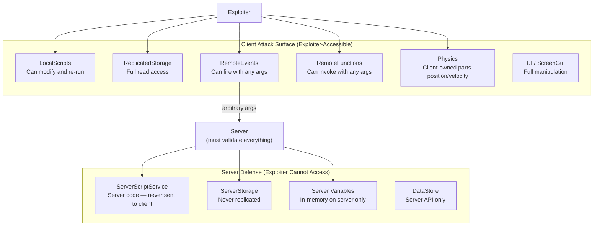
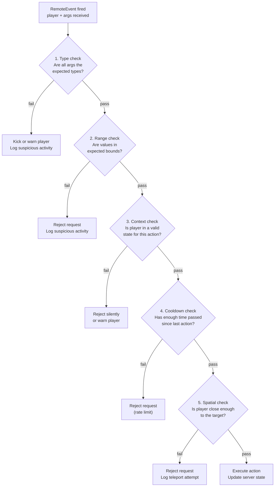
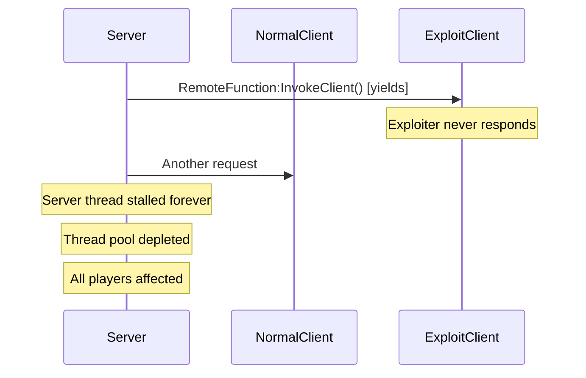
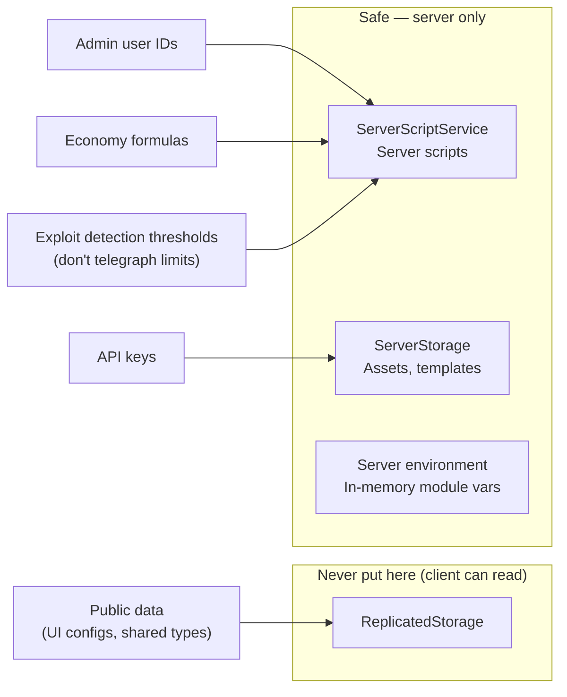

# 5.2 Anti-Cheat Architecture

## Overview

Roblox games run Luau code on player devices. Players control that device. This is the fundamental threat model: **the client is untrusted, always**. A player can modify their local Luau environment, inject code, and fire any RemoteEvent with any arguments they choose.

If you've built web APIs, you already have the right instinct: never trust user input. Validate everything on the server. The client is a browser — capable of sending anything. The same principle applies here with more attack surface, because the client also runs physics.

This module maps backend security patterns (input validation, rate limiting, authorization) to Roblox's specific attack vectors and defenses.

---

## Backend Analogy

| Backend Concept | Roblox Equivalent |
|---|---|
| "Never trust the client" | Server is authoritative — clients send inputs, never state |
| SQL injection / input validation | Validate RemoteEvent arguments (type, range, context) |
| Rate limiting (requests/second) | Per-player RemoteEvent rate limiter |
| Authorization middleware | Player context validation (in game? has item? in range?) |
| Replay attack / double-spend | Cooldown validation (enough time since last action?) |
| Man-in-the-middle / request forgery | Physics spoofing (client lies about position/velocity) |
| Privilege escalation | Client attempting server-owned actions |

---

## The Threat Model: What Exploiters Can Do

Understanding the attack surface is prerequisite to defending it. Exploiters use tools (colloquially "executors") that inject Luau code into the client's VM.



### What They CAN Do

- **Modify LocalScripts**: re-run them with different logic, disable anti-cheat client code, inject new behavior
- **Fire RemoteEvents with arbitrary arguments**: call `DealDamage` with `damage = 999999`, call `PurchaseItem` with `itemId` they don't own
- **Invoke RemoteFunctions with arbitrary arguments**: same as above
- **Spoof physics for client-owned parts**: teleport their character, set unrealistic velocities
- **Read everything in ReplicatedStorage**: any secrets, IDs, configuration put there are exposed
- **Simulate multiple inputs simultaneously**: auto-clicking, scripted macros

### What They CANNOT Do

- **Read or modify ServerScriptService contents**: server scripts are never sent to clients
- **Access ServerStorage**: never replicated
- **Run server-side Luau**: they can only influence the server through RemoteEvents/Functions
- **Directly modify other players**: they can only affect state the server allows them to change
- **Access DataStore directly**: DataStore is a server-only API

**The implication**: all security logic must live on the server. Client-side anti-cheat (obfuscation, client validation) is speed bump at best. The server is your only trust boundary.

---

## Server-Side Validation Checklist

Every RemoteEvent handler on the server should run through this five-step validation pipeline before doing anything meaningful:



### Complete Example: Combat RemoteEvent

```luau
--!strict
-- CombatService.luau (server)
-- Demonstrates the complete five-step validation pattern

local Players = game:GetService("Players")
local ReplicatedStorage = game:GetService("ReplicatedStorage")

-- Configuration constants
local MAX_DAMAGE = 100
local MIN_DAMAGE = 1
local ATTACK_RANGE_STUDS = 8
local ATTACK_COOLDOWN_SECONDS = 0.5
local MAX_POSITION_DELTA_PER_FRAME = 10  -- studs/frame, used elsewhere

-- RemoteEvents (defined in ReplicatedStorage)
local remotes = ReplicatedStorage:WaitForChild("Remotes")
local playerAttackedRemote = remotes:WaitForChild("PlayerAttacked") :: RemoteEvent

-- Per-player cooldown tracking
local _lastAttackTime: { [Player]: number } = {}

-- Cleanup when player leaves
Players.PlayerRemoving:Connect(function(player: Player)
    _lastAttackTime[player] = nil
end)

-- === Validation Helpers ===

local function validateTypes(damage: unknown, targetId: unknown): (boolean, string)
    if typeof(damage) ~= "number" then
        return false, "damage must be a number"
    end
    if typeof(targetId) ~= "number" then
        return false, "targetId must be a number"
    end
    return true, ""
end

local function validateRanges(damage: number): (boolean, string)
    if damage < MIN_DAMAGE or damage > MAX_DAMAGE then
        return false, string.format("damage %d out of range [%d, %d]", damage, MIN_DAMAGE, MAX_DAMAGE)
    end
    if damage ~= math.floor(damage) then
        return false, "damage must be an integer"
    end
    return true, ""
end

local function validateContext(attacker: Player, targetPlayer: Player?): (boolean, string)
    -- Is attacker still in the game?
    if not attacker.Parent then
        return false, "attacker not in game"
    end

    -- Does attacker have a living character?
    local attackerChar = attacker.Character
    if not attackerChar then
        return false, "attacker has no character"
    end
    local attackerHumanoid = attackerChar:FindFirstChildOfClass("Humanoid") :: Humanoid?
    if not attackerHumanoid or attackerHumanoid.Health <= 0 then
        return false, "attacker is dead"
    end

    -- Is the target valid?
    if not targetPlayer then
        return false, "target player not found"
    end
    if targetPlayer == attacker then
        return false, "cannot attack yourself"
    end
    local targetChar = targetPlayer.Character
    if not targetChar then
        return false, "target has no character"
    end
    local targetHumanoid = targetChar:FindFirstChildOfClass("Humanoid") :: Humanoid?
    if not targetHumanoid or targetHumanoid.Health <= 0 then
        return false, "target is already dead"
    end

    return true, ""
end

local function validateCooldown(attacker: Player): (boolean, string)
    local now = os.clock()
    local lastAttack = _lastAttackTime[attacker]

    if lastAttack and (now - lastAttack) < ATTACK_COOLDOWN_SECONDS then
        local remaining = ATTACK_COOLDOWN_SECONDS - (now - lastAttack)
        return false, string.format("cooldown active: %.2fs remaining", remaining)
    end

    return true, ""
end

local function validateSpatial(attacker: Player, target: Player): (boolean, string)
    local attackerChar = attacker.Character
    local targetChar = target.Character

    if not attackerChar or not targetChar then
        return false, "missing character for spatial check"
    end

    local attackerHRP = attackerChar:FindFirstChild("HumanoidRootPart") :: BasePart?
    local targetHRP = targetChar:FindFirstChild("HumanoidRootPart") :: BasePart?

    if not attackerHRP or not targetHRP then
        return false, "missing HumanoidRootPart for spatial check"
    end

    local distance = (attackerHRP.Position - targetHRP.Position).Magnitude
    if distance > ATTACK_RANGE_STUDS then
        return false, string.format(
            "distance %.1f exceeds attack range %d studs",
            distance,
            ATTACK_RANGE_STUDS
        )
    end

    return true, ""
end

-- === Main Handler ===

local function onPlayerAttacked(attacker: Player, damage: unknown, targetUserId: unknown): ()
    -- Step 1: Type validation
    local typeOk, typeErr = validateTypes(damage, targetUserId)
    if not typeOk then
        warn(string.format("[CombatService] Type violation from %s: %s", attacker.Name, typeErr))
        -- Consider kicking persistent offenders
        return
    end

    -- Cast after type validation
    local dmg = damage :: number
    local uid = targetUserId :: number

    -- Step 2: Range validation
    local rangeOk, rangeErr = validateRanges(dmg)
    if not rangeOk then
        warn(string.format("[CombatService] Range violation from %s: %s", attacker.Name, rangeErr))
        return
    end

    -- Resolve target from UserId (not from a direct Player reference — they could send any player)
    local targetPlayer: Player? = Players:GetPlayerByUserId(uid)

    -- Step 3: Context validation
    local ctxOk, ctxErr = validateContext(attacker, targetPlayer)
    if not ctxOk then
        -- Context failures can be legitimate (e.g., target died between fire and server receive)
        -- Only log if it looks intentional
        if ctxErr:find("cannot attack yourself") or ctxErr:find("not in game") then
            warn(string.format("[CombatService] Context violation from %s: %s", attacker.Name, ctxErr))
        end
        return
    end

    -- Step 4: Cooldown validation
    local cdOk, cdErr = validateCooldown(attacker)
    if not cdOk then
        warn(string.format("[CombatService] Cooldown violation from %s: %s", attacker.Name, cdErr))
        return
    end

    -- Step 5: Spatial validation
    local spatialOk, spatialErr = validateSpatial(attacker, targetPlayer :: Player)
    if not spatialOk then
        warn(string.format("[CombatService] Spatial violation from %s: %s", attacker.Name, spatialErr))
        return
    end

    -- All validations passed — apply damage
    _lastAttackTime[attacker] = os.clock()

    local targetChar = (targetPlayer :: Player).Character :: Model
    local targetHumanoid = targetChar:FindFirstChildOfClass("Humanoid") :: Humanoid
    targetHumanoid:TakeDamage(dmg)
end

playerAttackedRemote.OnServerEvent:Connect(onPlayerAttacked)
```

---

## Rate Limiting

Rate limiting prevents players from flooding the server with RemoteEvent calls — either as an exploit or as a bug (client-side loop firing too fast).

```luau
--!strict
-- RateLimiter.luau (server utility)
-- Token bucket rate limiter per player

type BucketState = {
    tokens: number,
    lastRefill: number,
}

export type RateLimiterConfig = {
    maxTokens: number,       -- Burst capacity
    refillRate: number,      -- Tokens added per second
    costPerRequest: number,  -- Tokens consumed per request
}

local RateLimiter = {}
RateLimiter.__index = RateLimiter

export type RateLimiterObject = typeof(setmetatable({} :: {
    _config: RateLimiterConfig,
    _buckets: { [Player]: BucketState },
}, RateLimiter))

function RateLimiter.new(config: RateLimiterConfig): RateLimiterObject
    local self = setmetatable({
        _config = config,
        _buckets = {} :: { [Player]: BucketState },
    }, RateLimiter)

    -- Clean up buckets on player leave
    game:GetService("Players").PlayerRemoving:Connect(function(player: Player)
        self._buckets[player] = nil
    end)

    return self
end

-- Returns true if request is allowed, false if rate limited
function RateLimiter:Check(player: Player): boolean
    local now = os.clock()
    local bucket = self._buckets[player]

    if not bucket then
        -- First request from this player — create fresh bucket
        self._buckets[player] = {
            tokens = self._config.maxTokens - self._config.costPerRequest,
            lastRefill = now,
        }
        return true
    end

    -- Refill tokens based on elapsed time
    local elapsed = now - bucket.lastRefill
    local newTokens = elapsed * self._config.refillRate
    bucket.tokens = math.min(self._config.maxTokens, bucket.tokens + newTokens)
    bucket.lastRefill = now

    -- Check if we have enough tokens
    if bucket.tokens >= self._config.costPerRequest then
        bucket.tokens -= self._config.costPerRequest
        return true
    end

    return false  -- Rate limited
end

return RateLimiter
```

**Usage with progressive consequences:**

```luau
--!strict
-- Attach to a RemoteEvent with rate limiting + kick escalation
local RateLimiter = require(script.Parent.RateLimiter)

local attackRateLimiter = RateLimiter.new({
    maxTokens = 10,       -- Allow burst of 10 attacks
    refillRate = 2,       -- 2 tokens/second = max 2 attacks/second sustained
    costPerRequest = 1,
})

-- Track consecutive violations per player
local _violations: { [Player]: number } = {}
local MAX_VIOLATIONS_BEFORE_KICK = 20

Players.PlayerRemoving:Connect(function(p) _violations[p] = nil end)

playerAttackedRemote.OnServerEvent:Connect(function(player: Player, ...)
    if not attackRateLimiter:Check(player) then
        _violations[player] = (_violations[player] or 0) + 1

        if _violations[player] >= MAX_VIOLATIONS_BEFORE_KICK then
            player:Kick("Kicked for suspicious activity.")
        end

        return  -- Silently drop rate-limited requests
    end

    _violations[player] = 0  -- Reset on successful request

    -- ... rest of handler
end)
```

---

## Physics Ownership Exploits

### The Problem

When Roblox assigns physics ownership of a part to a player's client, that client computes the physics simulation for that part — including position and velocity. The server trusts these updates. An exploiter can set their character's position to anywhere in the map by overriding the physics simulation locally. The server receives the spoofed position and accepts it.

This enables:
- **Speed hacks**: move faster than humanly possible
- **Fly hacks**: set Y position to any value
- **Teleportation**: jump across the map instantly
- **NoClip**: pass through walls

### Server-Side Physics Validation

```luau
--!strict
-- PhysicsValidator.luau (server)
-- Validates character movement plausibility

local Players = game:GetService("Players")
local RunService = game:GetService("RunService")

-- Maximum plausible movement per second (studs)
-- Normal walk: ~16 studs/s, sprint: ~24 studs/s, jumping: adds vertical
-- Set generously to avoid false positives on high-latency connections
local MAX_SPEED_STUDS_PER_SECOND = 50
local TELEPORT_THRESHOLD = 100  -- Immediate flag: no way to move this far legitimately in one frame

type PlayerState = {
    lastPosition: Vector3,
    lastCheck: number,
    violations: number,
}

local _playerStates: { [Player]: PlayerState } = {}

Players.PlayerAdded:Connect(function(player: Player)
    player.CharacterAdded:Connect(function(character: Model)
        local hrp = character:WaitForChild("HumanoidRootPart") :: BasePart
        _playerStates[player] = {
            lastPosition = hrp.Position,
            lastCheck = os.clock(),
            violations = 0,
        }
    end)
end)

Players.PlayerRemoving:Connect(function(player: Player)
    _playerStates[player] = nil
end)

-- Run validation every 0.5 seconds (not every frame — reduces overhead)
local _checkInterval = 0.5

RunService.Heartbeat:Connect(function()
    local now = os.clock()

    for player, state in _playerStates do
        if (now - state.lastCheck) < _checkInterval then continue end

        local character = player.Character
        if not character then continue end

        local hrp = character:FindFirstChild("HumanoidRootPart") :: BasePart?
        if not hrp then continue end

        local currentPos = hrp.Position
        local elapsed = now - state.lastCheck
        local distance = (currentPos - state.lastPosition).Magnitude
        local speed = distance / elapsed

        if distance > TELEPORT_THRESHOLD then
            -- Immediate teleport detected — reset to last known good position
            warn(string.format(
                "[PhysicsValidator] Teleport detected for %s: %.0f studs in %.2fs",
                player.Name, distance, elapsed
            ))
            state.violations += 1
            -- Teleport back
            hrp.CFrame = CFrame.new(state.lastPosition)

            if state.violations >= 5 then
                player:Kick("Kicked for suspicious movement.")
            end
        elseif speed > MAX_SPEED_STUDS_PER_SECOND then
            -- Speed hack detected
            warn(string.format(
                "[PhysicsValidator] Speed violation for %s: %.0f studs/s",
                player.Name, speed
            ))
            state.violations += 1
            -- Don't teleport back for speed — latency can cause this legitimately
            -- Just log and increment violation counter
        else
            -- Valid movement — update state
            state.lastPosition = currentPos
            state.violations = math.max(0, state.violations - 1)  -- Decay violations over time
        end

        state.lastCheck = now
    end
end)
```

### Server Ownership for High-Value Objects

Game-critical objects — boss NPCs, capture-point flags, physics puzzles with rewards — should always be server-owned. Client physics ownership on these creates exploitable attack surfaces.

```luau
--!strict
-- BossSpawner.luau (server)
-- Spawns boss NPCs with forced server physics ownership

local function spawnBoss(position: Vector3): Model
    local bossTemplate = game.ServerStorage:FindFirstChild("BossNPC") :: Model
    local boss = bossTemplate:Clone()
    boss:PivotTo(CFrame.new(position))
    boss.Parent = workspace

    -- Force server ownership on all physics parts
    for _, descendant in boss:GetDescendants() do
        if descendant:IsA("BasePart") then
            local part = descendant :: BasePart
            -- nil = server owns the physics
            local success = pcall(function()
                part:SetNetworkOwner(nil)
            end)
            if not success then
                -- Some parts (anchored) don't support SetNetworkOwner
                -- That's fine — anchored parts don't have ownership
            end
        end
    end

    return boss
end
```

---

## The RemoteFunction Server→Client Exploit

This is a critical, non-obvious vulnerability that has crashed production games.

### The Problem

`RemoteFunction:InvokeClient(player, ...)` yields the server thread until the client responds. A client can:
1. Never respond — the server thread yields forever
2. Return after a very long delay — server memory accumulates from stalled threads
3. Error — the error propagates to the server (pre-2022 behavior; partially fixed, but still risky)

If an exploiter triggers many such invocations, they can exhaust the server's thread pool, causing the entire server to lag or crash. This affects all players on that server.



### The Fix: Never Use RemoteFunction Server→Client

```luau
-- DANGEROUS — never do this
local result = myRemoteFunction:InvokeClient(player, "GetInventory")

-- SAFE pattern: use RemoteEvent + callback
-- Server fires a request event
-- Client fires a response event with a correlation ID

local Requests = ReplicatedStorage.Remotes.RequestInventory :: RemoteEvent
local Responses = ReplicatedStorage.Remotes.InventoryResponse :: RemoteEvent

-- Server side: send request, register one-time callback
local function requestInventoryFromClient(
    player: Player,
    callback: (data: { string }) -> ()
): ()
    local correlationId = math.random(1, 2^31)

    -- Register one-time response handler
    local connection: RBXScriptConnection
    connection = Responses.OnServerEvent:Connect(function(
        respondingPlayer: Player,
        responseId: number,
        data: { string }
    )
        if respondingPlayer ~= player then return end
        if responseId ~= correlationId then return end
        connection:Disconnect()  -- One-time use
        callback(data)
    end)

    -- Set a timeout — don't wait forever
    task.delay(5, function()
        if connection.Connected then
            connection:Disconnect()
            warn(string.format("[RequestInventory] Timeout waiting for %s", player.Name))
        end
    end)

    Requests:FireClient(player, correlationId)
end

-- Client side: respond to requests
Requests.OnClientEvent:Connect(function(correlationId: number)
    local inventory = getLocalInventory()  -- Local function
    Responses:FireServer(correlationId, inventory)
end)
```

**Rule of thumb**: `RemoteFunction:InvokeServer()` (client→server) is acceptable with care. `RemoteFunction:InvokeClient()` (server→client) should never appear in production code.

---

## Sensitive Data: What Goes Where



Common mistakes:
- Storing the list of admin player UserIds in ReplicatedStorage — exploiters read it and know who to target
- Storing economy multipliers in ReplicatedStorage — exploiters derive currency exploits
- Storing exploit detection thresholds in ReplicatedStorage — exploiters learn exactly how to stay under the limit

**Rule**: if the client doesn't need it to render UI or make local decisions, it goes on the server.

---

## Key Takeaways

- The server is your only trust boundary — all client code can be modified and re-run by exploiters
- Clients can fire RemoteEvents with any arguments — validate type, range, context, cooldown, and spatial position on every handler
- `RemoteFunction:InvokeClient()` is a denial-of-service vector — never use server→client invocation
- Set `SetNetworkOwner(nil)` on game-critical physics objects; client physics ownership = client can lie about position
- Rate limiting protects against both malicious exploiters and buggy clients
- Never put secrets or admin configurations in ReplicatedStorage
- Server-side validation and rate limiting are not optional — they are the baseline

---

## Next

**Module 5.3 — Network Replication** goes deeper on how Roblox transmits state changes between server and clients, how to measure and reduce replication cost, and when to reach for advanced networking libraries like ByteNet for high-frequency data like combat positions.
