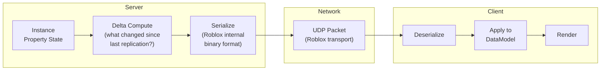
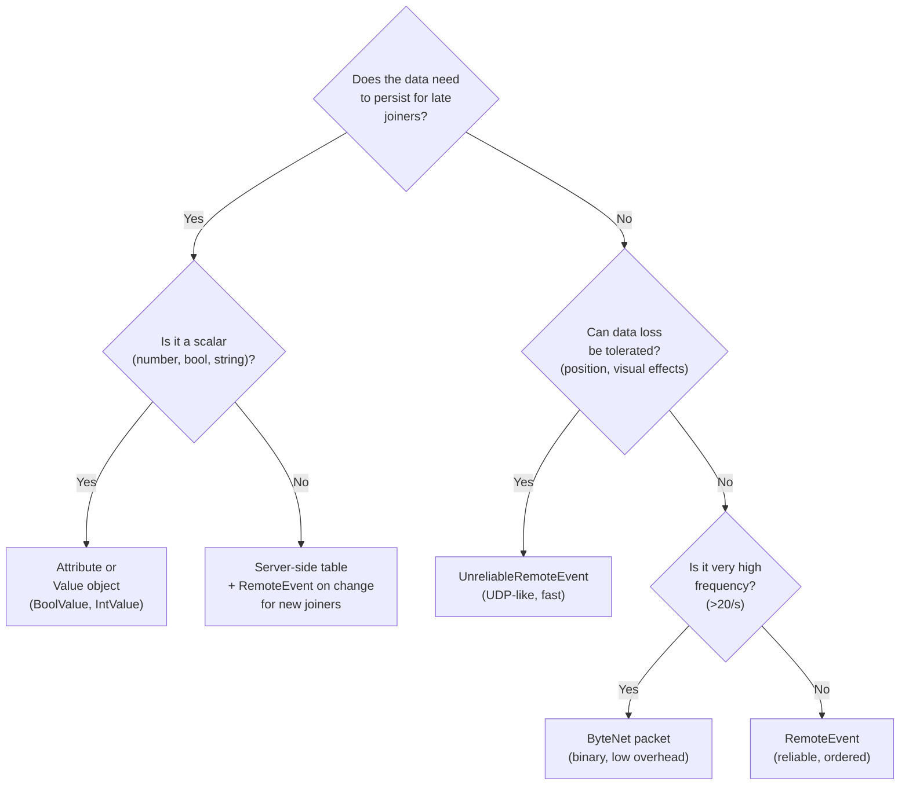

# 5.3 Network Replication

## Overview

Roblox's networking model is deceptively simple on the surface — the engine handles replication automatically. Change a Part's color on the server, and all clients see it. But this abstraction has costs, limits, and failure modes that become critical to understand as your game scales up to dozens of players, frequent combat, and rich world state.

This module maps network engineering concepts (delta encoding, serialization, throughput, UDP vs TCP) directly to Roblox's replication system, including when to use the built-in system and when to replace it with a custom networking library.

---

## Backend Analogy

| Backend Concept | Roblox Equivalent |
|---|---|
| Delta encoding / change data capture | Roblox property delta replication |
| Serialization (JSON, protobuf) | Roblox built-in serialization (or ByteNet for custom) |
| TCP (reliable, ordered) | RemoteEvent (reliable delivery, ordered per-remote) |
| UDP (unreliable, unordered) | UnreliableRemoteEvent (Roblox 2023+) |
| WebSocket message | RemoteEvent:FireClient/FireServer |
| Server-sent events / push | RemoteEvent:FireAllClients |
| Fanout / selective delivery | RemoteEvent:FireClient per-player |
| Message schema / typed API | ByteNet packet definitions |
| Data compression | Bitmask encoding; ByteNet binary buffers |

---

## How Roblox Replication Works

Roblox uses **delta replication**: only changed properties are transmitted each replication cycle (roughly every network step, which runs at 20Hz by default — every 50ms). If a Part's Position doesn't change, nothing is sent for it.



**What this means in practice:**

- Changing 100 Part positions every frame sends 100 position updates every network step
- Changing 1 Part position every frame sends 1 update every network step
- Not changing anything sends nothing
- The replication cycle is separate from the frame rate — a 60 FPS client still only receives world updates at ~20Hz

---

## Replication Cost Factors

### What's Expensive

| Scenario | Why It's Expensive |
|---|---|
| CFrame update on 50 NPCs every frame | 50 position+rotation values every replication cycle |
| Large string attributes (>100 chars) | Strings are fully re-sent when they change, no delta |
| Deep instance hierarchies (100+ children) | Each instance has overhead in the replication system |
| Frequent parent changes on many instances | Parent changes trigger hierarchy reconciliation on clients |
| High-frequency RemoteEvent fires (>20/second) | Each fire is a separate reliable message — buffer grows |

### What's Cheap

| Scenario | Why It's Cheap |
|---|---|
| Boolean/number attributes that rarely change | Small payloads, sent only on change |
| Moving instances between folders | Single parent-change message |
| BoolValue / IntValue / StringValue objects | Dedicated replication path, very efficient for their type |
| Anchored parts that never move | Zero position replication cost |
| Static geometry (terrain, buildings) | Sent once on join, never again |

---

## Attribute Limits

Roblox attributes have hard limits you must design around:

| Limit | Value |
|---|---|
| Max attributes per instance | 64 |
| Max attribute name length | 50 characters |
| Max string attribute value length | 200 characters |
| Supported types | boolean, number, string, Vector2, Vector3, Color3, BrickColor, UDim, UDim2, Rect, CFrame |

These limits mean attributes work well for scalar state (health, level, status flags) but poorly for complex structured data. For complex per-instance state, use a server-side Lua table keyed by the instance, not attributes.

---

## Replication Optimization Strategies

### Strategy 1: Throttle NPC Updates

NPCs don't need to be replicated every frame. Players can't perceive the difference between 60Hz and 10Hz NPC updates from more than a few studs away.

```luau
--!strict
-- NPCReplicationThrottle.luau (server)
-- Replicates NPC state every N frames instead of every frame

local RunService = game:GetService("RunService")

type NPCEntry = {
    npc: Model,
    rootPart: BasePart,
    lastReplicatedCFrame: CFrame,
    framesSinceUpdate: number,
    updateInterval: number,  -- frames between updates (distance-based)
}

local NPCReplicationService = {}
local _npcs: { NPCEntry } = {}
local _players = game:GetService("Players")

-- Distance-based update frequency
local function getUpdateInterval(npcPos: Vector3): number
    local closestDist = math.huge

    for _, player in _players:GetPlayers() do
        local char = player.Character
        if not char then continue end
        local hrp = char:FindFirstChild("HumanoidRootPart") :: BasePart?
        if not hrp then continue end
        local dist = (npcPos - hrp.Position).Magnitude
        closestDist = math.min(closestDist, dist)
    end

    if closestDist < 20 then
        return 1   -- Near player: update every frame
    elseif closestDist < 60 then
        return 3   -- Mid range: every 3 frames
    elseif closestDist < 150 then
        return 6   -- Far: every 6 frames
    else
        return 12  -- Very far: every 12 frames
    end
end

-- Minimum CFrame delta to warrant an update
local POSITION_THRESHOLD = 0.1  -- studs
local ROTATION_THRESHOLD = 0.05  -- radians

local function shouldReplicate(entry: NPCEntry): boolean
    local current = entry.rootPart.CFrame
    local last = entry.lastReplicatedCFrame

    local posDelta = (current.Position - last.Position).Magnitude
    if posDelta > POSITION_THRESHOLD then return true end

    -- Check rotation delta via dot product of look vectors
    local rotDelta = 1 - current.LookVector:Dot(last.LookVector)
    if rotDelta > ROTATION_THRESHOLD then return true end

    return false
end

function NPCReplicationService:Register(npc: Model): ()
    local rootPart = npc:FindFirstChild("HumanoidRootPart") :: BasePart?
        or npc.PrimaryPart :: BasePart?

    if not rootPart then
        warn("[NPCReplication] NPC has no root part:", npc.Name)
        return
    end

    table.insert(_npcs, {
        npc = npc,
        rootPart = rootPart,
        lastReplicatedCFrame = rootPart.CFrame,
        framesSinceUpdate = 0,
        updateInterval = 1,
    })
end

RunService.Heartbeat:Connect(function()
    for _, entry in _npcs do
        if not entry.npc.Parent then continue end  -- NPC was removed

        entry.framesSinceUpdate += 1

        -- Update interval based on nearest player distance
        entry.updateInterval = getUpdateInterval(entry.rootPart.Position)

        if entry.framesSinceUpdate < entry.updateInterval then continue end
        entry.framesSinceUpdate = 0

        -- Only replicate if NPC actually moved
        if not shouldReplicate(entry) then continue end

        -- Force replication by writing back the same CFrame (triggers delta)
        -- In practice, your NPC AI is setting CFrame — this is the check point
        entry.lastReplicatedCFrame = entry.rootPart.CFrame
        -- Actual CFrame writes happen in the NPC AI system; this tracks state
    end
end)

return NPCReplicationService
```

### Strategy 2: State Compression with Bitmasks

Multiple boolean flags can be packed into a single integer attribute, reducing attribute count and replication size.

```luau
--!strict
-- StatusFlags.luau (shared)
-- Encode/decode status booleans as a single number attribute

-- Flag definitions (bit positions)
local Flags = {
    IS_STUNNED    = 0,  -- bit 0
    IS_BURNING    = 1,  -- bit 1
    IS_FROZEN     = 2,  -- bit 2
    IS_INVISIBLE  = 3,  -- bit 3
    IS_SHIELDED   = 4,  -- bit 4
    IS_AIRBORNE   = 5,  -- bit 5
    HAS_BUFF_1    = 6,  -- bit 6
    HAS_BUFF_2    = 7,  -- bit 7
}

local StatusFlags = {}

-- Set a flag on a character
function StatusFlags.Set(character: Model, flag: number, value: boolean): ()
    local current = character:GetAttribute("StatusFlags") :: number? or 0
    if value then
        character:SetAttribute("StatusFlags", bit32.bor(current, bit32.lshift(1, flag)))
    else
        character:SetAttribute("StatusFlags", bit32.band(current, bit32.bnot(bit32.lshift(1, flag))))
    end
end

-- Read a flag from a character
function StatusFlags.Get(character: Model, flag: number): boolean
    local current = character:GetAttribute("StatusFlags") :: number? or 0
    return bit32.band(current, bit32.lshift(1, flag)) ~= 0
end

-- Export flag constants
StatusFlags.Flags = Flags

return StatusFlags

-- Usage on server:
-- StatusFlags.Set(character, StatusFlags.Flags.IS_STUNNED, true)
-- Clients read: StatusFlags.Get(character, StatusFlags.Flags.IS_STUNNED)
-- One attribute update = 8 boolean updates at once
```

### Strategy 3: Selective Replication via Parent

Roblox only replicates instances to clients that can "see" them in the DataModel hierarchy. You can use this to implement server-side filtering:

```luau
--!strict
-- Selective replication: only send player-specific data to that player
-- Instead of ReplicatedStorage (all clients), use a per-player folder

local Players = game:GetService("Players")

-- Create a per-player private storage folder in their PlayerGui
-- (PlayerGui is only accessible to that player's client)
local function createPrivateStorage(player: Player): Folder
    local folder = Instance.new("Folder")
    folder.Name = "PrivateData"
    folder.Parent = player.PlayerGui  -- Only this player sees it

    -- Add data specific to this player that other players shouldn't see
    local secretKey = Instance.new("StringValue")
    secretKey.Name = "SessionToken"
    secretKey.Value = generateSessionToken(player)  -- Server generates
    secretKey.Parent = folder

    return folder
end

Players.PlayerAdded:Connect(function(player: Player)
    createPrivateStorage(player)
end)
```

---

## ByteNet: Custom Binary Networking

### Why ByteNet

Roblox's default RemoteEvent serialization wraps your Luau tables into a proprietary format. For high-frequency events (position updates, combat packets firing 60 times/second), the overhead is significant:

| Method | Overhead per packet | Suitable for |
|---|---|---|
| RemoteEvent (default) | ~100-200 bytes for a simple table | Low-frequency events (<5/s) |
| ByteNet binary packet | ~20-60 bytes for same data | High-frequency data (positions, combat) |
| Attribute | Minimal | Persistent state changes |

ByteNet uses Roblox's `buffer` API (a contiguous memory block) to hand-pack binary data — similar to writing a protobuf encoder by hand.

### ByteNet Packet Definition

```luau
--!strict
-- packets/CombatPackets.luau (shared)
-- ByteNet packet definitions for combat system

-- Install ByteNet: https://ffrostflame.github.io/ByteNet/
local ByteNet = require(game.ReplicatedStorage.Packages.ByteNet)

-- Define packet schemas
-- ByteNet generates efficient binary serializers from these definitions
local CombatPackets = {
    -- Client → Server: player attacks
    PlayerAttack = ByteNet.definePacket({
        value = ByteNet.struct({
            targetUserId = ByteNet.uint32,    -- 4 bytes
            damage       = ByteNet.uint8,     -- 1 byte (0-255)
            weaponSlot   = ByteNet.uint8,     -- 1 byte
            attackType   = ByteNet.uint8,     -- 1 byte (enum)
        }),
        -- reliableOrdered = true (default)
    }),

    -- Server → Client: apply hit effect
    HitConfirmed = ByteNet.definePacket({
        value = ByteNet.struct({
            targetUserId  = ByteNet.uint32,
            damageDealt   = ByteNet.uint16,   -- 2 bytes (0-65535)
            hitPosition   = ByteNet.vec3,     -- 12 bytes (3x float32)
            isCritical    = ByteNet.bool,     -- 1 byte
        }),
    }),

    -- Server → All Clients: position broadcast (unreliable)
    PlayerPosition = ByteNet.definePacket({
        value = ByteNet.struct({
            userId    = ByteNet.uint32,
            position  = ByteNet.vec3,         -- 12 bytes
            yRotation = ByteNet.float32,      -- 4 bytes (Y-axis only for characters)
            speed     = ByteNet.uint8,        -- 1 byte (0-255 mapped to 0-50 studs/s)
        }),
        unreliable = true,  -- UDP-like: fast, can drop
    }),
}

return CombatPackets
```

### ByteNet Usage

```luau
--!strict
-- Server: send hit confirmation
local CombatPackets = require(game.ReplicatedStorage.Packets.CombatPackets)

local function onAttackValidated(
    attacker: Player,
    target: Player,
    damage: number,
    hitPos: Vector3,
    isCrit: boolean
): ()
    -- Apply damage on server
    local targetChar = target.Character :: Model
    local humanoid = targetChar:FindFirstChildOfClass("Humanoid") :: Humanoid
    humanoid:TakeDamage(damage)

    -- Broadcast hit confirmation to all clients (so they can show effects)
    CombatPackets.HitConfirmed:sendToAll({
        targetUserId = target.UserId,
        damageDealt  = damage,
        hitPosition  = hitPos,
        isCritical   = isCrit,
    })
end

-- Client: receive hit confirmation and play effect
local EffectsController = require(script.Parent.EffectsController)

CombatPackets.HitConfirmed:listen(function(data)
    EffectsController:PlayHitEffect(data.hitPosition, data.damageDealt, data.isCritical)
end)
```

```luau
--!strict
-- High-frequency position broadcast using unreliable channel
-- Client: broadcast own position every 2 frames
local CombatPackets = require(game.ReplicatedStorage.Packets.CombatPackets)
local RunService = game:GetService("RunService")
local Players = game:GetService("Players")

local _frame = 0
local _localPlayer = Players.LocalPlayer

RunService.Heartbeat:Connect(function()
    _frame += 1
    if _frame % 2 ~= 0 then return end  -- Every 2 frames

    local char = _localPlayer.Character
    if not char then return end

    local hrp = char:FindFirstChild("HumanoidRootPart") :: BasePart?
    if not hrp then return end

    local humanoid = char:FindFirstChildOfClass("Humanoid") :: Humanoid?
    local speed = humanoid and humanoid.WalkSpeed or 0

    -- Fire unreliable — if this packet drops, the next one arrives in 33ms anyway
    CombatPackets.PlayerPosition:send({
        userId    = _localPlayer.UserId,
        position  = hrp.Position,
        yRotation = hrp.CFrame.Rotation:ToEulerAnglesYXZ(),  -- Y component
        speed     = math.clamp(math.round(speed), 0, 255),
    })
end)
```

---

## UnreliableRemoteEvent

Added in 2023, `UnreliableRemoteEvent` provides UDP-like delivery — fast, low-overhead, but packets may arrive out of order or not at all.

### When to Use Each Delivery Method

| Data Type | Use | Reason |
|---|---|---|
| Player position / rotation | UnreliableRemoteEvent | Stale data is harmless; next update corrects it |
| Projectile spawn position | UnreliableRemoteEvent | Visual effect; if dropped, slight hitching acceptable |
| Health bar update | RemoteEvent | Must arrive; wrong health display causes confusion |
| Inventory change | RemoteEvent | Must arrive and be applied in order |
| Currency change | RemoteEvent | Must never be lost |
| Chat message | RemoteEvent | Must arrive |
| Combat hit confirm | RemoteEvent | Must arrive (financial transaction analog) |
| Player state flags | Attribute | Persistent; available to new clients who join later |
| NPC aggro target | Attribute | Persistent state, not a transient event |
| Round timer | IntValue in ReplicatedStorage | Persistent; late joiners see current value immediately |

```luau
--!strict
-- Creating and using UnreliableRemoteEvent
-- Setup in ReplicatedStorage (server or shared init script)

local function ensureRemote(parent: Instance, name: string, class: string): Instance
    local existing = parent:FindFirstChild(name)
    if existing then return existing end

    local remote = Instance.new(class)
    remote.Name = name
    remote.Parent = parent
    return remote
end

-- Server setup
local Remotes = game.ReplicatedStorage:FindFirstChild("Remotes") or Instance.new("Folder", game.ReplicatedStorage)
local positionSync = ensureRemote(Remotes, "PositionSync", "UnreliableRemoteEvent") :: UnreliableRemoteEvent

-- Fire unreliable from server to specific client
positionSync:FireClient(player, npcId, position, rotation)

-- Fire unreliable from client to server
positionSync:FireServer(position, rotation)

-- Note: exact same API as RemoteEvent, just different instance class
-- The "unreliable" part is the delivery guarantee, not the interface
```

---

## Character Replication Optimization

For games where character movement smoothness is critical (PvP, racing, platformers), the default Roblox character replication can stutter. Advanced games implement custom character state buffers:

```luau
--!strict
-- CharacterStateBuffer.luau (client)
-- Buffer incoming character states for smooth interpolation

type CharacterState = {
    timestamp: number,
    position: Vector3,
    rotation: CFrame,
    animationId: string,
}

type CharacterBuffer = {
    states: { CharacterState },
    maxStates: number,
}

local StateBuffers: { [number]: CharacterBuffer } = {}  -- Keyed by UserId

local function getOrCreateBuffer(userId: number): CharacterBuffer
    if not StateBuffers[userId] then
        StateBuffers[userId] = {
            states = {},
            maxStates = 10,  -- Store last 10 states = ~167ms of history at 60fps
        }
    end
    return StateBuffers[userId]
end

-- Called when a position update arrives (via UnreliableRemoteEvent)
local function onPositionUpdate(userId: number, pos: Vector3, rot: CFrame): ()
    local buffer = getOrCreateBuffer(userId)

    table.insert(buffer.states, {
        timestamp = os.clock(),
        position = pos,
        rotation = rot,
        animationId = "",  -- Populated from separate animation event
    })

    -- Keep buffer bounded
    while #buffer.states > buffer.maxStates do
        table.remove(buffer.states, 1)
    end
end

-- Called every frame to interpolate and apply character position
local INTERP_DELAY = 0.1  -- 100ms interpolation delay (smooths out jitter)

local function applyInterpolatedState(character: Model, userId: number): ()
    local buffer = StateBuffers[userId]
    if not buffer or #buffer.states < 2 then return end

    local renderTime = os.clock() - INTERP_DELAY

    -- Find the two states that bracket renderTime
    local stateA: CharacterState?
    local stateB: CharacterState?

    for i = #buffer.states, 2, -1 do
        if buffer.states[i].timestamp <= renderTime then
            stateA = buffer.states[i]
            stateB = buffer.states[i + 1]
            break
        end
    end

    if not stateA or not stateB then return end

    -- Interpolate between the two states
    local t = (renderTime - stateA.timestamp) / (stateB.timestamp - stateA.timestamp)
    t = math.clamp(t, 0, 1)

    local interpolatedPos = stateA.position:Lerp(stateB.position, t)
    local interpolatedRot = stateA.rotation:Lerp(stateB.rotation, t)

    -- Apply to character root part
    local hrp = character:FindFirstChild("HumanoidRootPart") :: BasePart?
    if hrp then
        hrp.CFrame = CFrame.new(interpolatedPos) * interpolatedRot
    end
end
```

---

## RemoteEvent Decision Guide



| Data | Recommended Method | Notes |
|---|---|---|
| Player position/rotation | UnreliableRemoteEvent or ByteNet | High frequency, loss acceptable |
| Projectile spawn | UnreliableRemoteEvent | Visual; loss = minor visual glitch |
| Damage dealt | RemoteEvent | Must arrive; affects gameplay state |
| Inventory contents | RemoteEvent | Must arrive, must be ordered |
| Currency transaction | RemoteEvent | Must arrive; log on server |
| Character status (stunned/burning) | Attribute (bitmask) | Persistent; visible to late joiners |
| Round state (Active/Lobby) | StringValue in ReplicatedStorage | Persistent; late joiners see it |
| Leaderboard scores | Leaderstat IntValues | Native Roblox leaderboard support |
| Private per-player data | RemoteEvent to specific player | Use FireClient, not FireAllClients |
| High-frequency combat | ByteNet | 40-60% smaller packets vs default |

---

## Key Takeaways

- Roblox replication is delta-based: only changed properties transmit, at ~20Hz cycles, not per-frame
- Attributes have hard limits (64/instance, 200-char strings) — plan data structures accordingly
- CFrame updates on many objects every frame is the most common replication bottleneck — throttle NPC updates by distance
- `UnreliableRemoteEvent` is UDP semantics — use it for position sync and visual effects; never for inventory or currency
- ByteNet's binary buffers reduce packet size 40-60% for structured data — worth the dependency for high-frequency combat systems
- Match the delivery mechanism to the data's requirements: persistent state → Attributes/Value objects; transient events → RemoteEvents; high-frequency visual → UnreliableRemoteEvent

---

## Next

**Module 6.1 — Claude Code + Roblox MCP** shifts from game engine internals to AI-assisted development workflow: how to wire Claude Code to Roblox Studio via the Model Context Protocol so you can generate, test, and iterate on Luau code without leaving your terminal.
