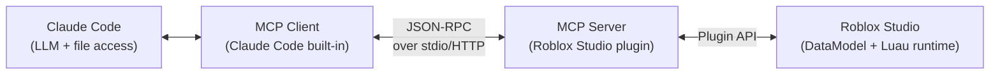
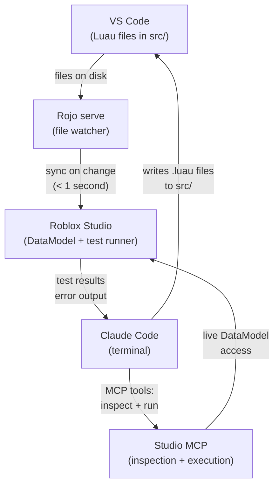

# 6.1 Claude Code + Roblox MCP

## Overview

This module covers the AI-assisted development workflow for Roblox: connecting Claude Code (Anthropic's CLI coding assistant) to Roblox Studio via the Model Context Protocol (MCP). The result is a tight feedback loop where you describe what you want, Claude writes the Luau, Rojo syncs it to Studio, and you test it — without touching Studio's script editor.

For an experienced developer coming from backend, this workflow will feel like having a senior engineer pair-programming with you who knows your codebase and can generate complete, wired-up systems in under a minute.

---

## Backend Analogy

| Backend Concept | Roblox AI Dev Equivalent |
|---|---|
| CLI + IDE workflow | Claude Code (terminal) + VS Code (files) + Studio (runtime) |
| Code generation / scaffolding | Claude generates complete Luau services/controllers |
| Hot reload / file watch | Rojo watches file system, syncs to Studio in real time |
| REPL / live execution | MCP server: run Luau directly in Studio from Claude |
| API documentation | create.roblox.com/docs (always verify Claude's API usage) |
| Language server / type checker | Luau LSP (VS Code extension) + `--!strict` |

---

## What Claude Code Is

Claude Code is Anthropic's official CLI-based AI coding assistant. It runs in your terminal, reads your project files, and can write, edit, and execute code. Unlike web-based chat interfaces, Claude Code:

- Maintains full project context (reads every file you point it to)
- Can write files directly to disk (no copy-paste workflow)
- Can run terminal commands (lint, test, build)
- Remembers context across the entire session
- Supports project-level instructions via `CLAUDE.md` (covered in Module 6.2)

**Installation:**

```bash
npm install -g @anthropic-ai/claude-code
# Then authenticate:
claude
# Follow the OAuth flow
```

**Cost**: Claude Code uses the Claude API. At typical development usage (a few hours of active coding per day), expect a few dollars per month. Intensive generation sessions (scaffolding a full game system) cost pennies.

---

## What MCP Is

MCP (Model Context Protocol) is an open standard for connecting LLMs to external tools. Think of it as a plugin system: instead of Claude only knowing about your files, you give it "tools" — functions it can call to interact with the world.



The Roblox Studio MCP server exposes tools like:
- `run_script` — execute arbitrary Luau in Studio's command bar context
- `insert_model` — insert a Creator Store asset by ID
- `get_instance` — inspect properties of any instance in the DataModel
- `search_creator_store` — find assets programmatically

---

## Roblox Studio MCP Server

### What It Is

The Roblox Studio MCP Server is an official, open-source server that turns Roblox Studio into an MCP-compatible tool provider. Claude Code connects to it and gains the ability to interact with your live Studio session.

**Two installation paths:**

**Path A — Studio 2026+ (built-in):**
The MCP server is bundled with Studio as of early 2026. Enable it in Studio settings:
`File → Studio Settings → AI → Enable MCP Server`

**Path B — Plugin (older Studio versions):**
Install the `boshyxd/robloxstudio-mcp` plugin from the Creator Store. The plugin runs a local HTTP server that Claude Code connects to.

### Connecting Claude Code to the MCP Server

Claude Code reads MCP server configurations from its settings file. Add the Roblox Studio server:

```json
// ~/.claude/settings.json (or project-level .claude/settings.json)
{
  "mcpServers": {
    "roblox-studio": {
      "command": "npx",
      "args": ["-y", "@roblox/studio-mcp-server"],
      "env": {}
    }
  }
}
```

For the plugin-based path (older Studio), the plugin exposes a local HTTP server — Claude Code connects via an SSE transport:

```json
{
  "mcpServers": {
    "roblox-studio": {
      "type": "sse",
      "url": "http://localhost:3000/sse"
    }
  }
}
```

**Verify the connection:**

```bash
# In Claude Code session, check available tools
claude
> /mcp
# Should show: roblox-studio (connected) with available tools listed
```

### Known Limitations

- **Studio must be running in a live session** (Play mode or opened place file). Offline/closed Studio means MCP tools return errors.
- **The MCP server sees the current Studio session** — it cannot open files, only interact with what's already loaded.
- **`run_script` runs in the command bar context** — this is the server VM, not client. Be aware of which services are accessible.
- **Not a deployment mechanism** — MCP doesn't publish your game. It's an inspection and execution tool for development.

---

## The Core Workflow

This is the full development loop that makes AI-assisted Roblox development effective:



### Step-by-Step Setup

**1. Install prerequisites:**

```bash
# Rojo (Roblox project sync tool)
aftman install          # If using aftman toolchain manager
# or
cargo install rojo      # If using cargo

# Claude Code
npm install -g @anthropic-ai/claude-code

# VS Code extensions
# - Luau LSP (JohnnyMorganz.luau-lsp)
# - Rojo (evaera.vscode-rojo)
```

**2. Initialize a Rojo project:**

```bash
mkdir my-game && cd my-game
rojo init
# Creates: default.project.json, src/
```

**3. Configure `default.project.json`:**

```json
{
  "name": "MyGame",
  "tree": {
    "$className": "DataModel",
    "ServerScriptService": {
      "$className": "ServerScriptService",
      "Services": {
        "$path": "src/server/services"
      },
      "main.server": {
        "$path": "src/server/main.server.luau"
      }
    },
    "StarterPlayer": {
      "$className": "StarterPlayer",
      "StarterPlayerScripts": {
        "$className": "StarterPlayerScripts",
        "Controllers": {
          "$path": "src/client/controllers"
        },
        "main.client": {
          "$path": "src/client/main.client.luau"
        }
      }
    },
    "ReplicatedStorage": {
      "$className": "ReplicatedStorage",
      "Shared": {
        "$path": "src/shared"
      }
    }
  }
}
```

**4. Start Rojo sync:**

```bash
rojo serve
# Output: Serving on port 34872...
```

**5. Connect Studio:**
In Roblox Studio: `Plugins → Rojo → Connect` (or auto-connect if using Rojo Studio plugin).

**6. Configure Claude Code MCP (from above).**

**7. Start Claude Code:**

```bash
cd my-game
claude
# Claude reads your project structure and CLAUDE.md
```

**8. Verify the full loop:**

```
You: Create a simple PlayerDataService that stores player level and XP in a table, 
     with GetData and AddXP methods. Use --!strict.

Claude: [writes src/server/services/PlayerDataService.luau]
        [Rojo syncs it to Studio automatically]
        [Claude can then run it via MCP to verify no syntax errors]
```

---

## Practical Capabilities

### What Claude Code Does Well for Roblox

**Generate complete DataStore systems (~40 seconds):**

```
You: Create a ProfileStore-based data service. Player profile has:
     coins (number), level (number), inventory ({string}), 
     lastLogin (number timestamp). Include migration version support.
     Follow the patterns in CLAUDE.md.
```

Claude writes the full service file with ProfileStore wiring, migration logic, and typed interfaces.

**Scaffold service-controller pairs with RemoteEvent wiring:**

```
You: Create a ShopService (server) and ShopController (client) 
     for purchasing items. Server validates purchase, deducts coins, 
     adds to inventory. Client shows confirmation UI. 
     Use the five-step validation pattern from 5.2-anti-cheat-architecture.md.
```

Claude writes both files and the RemoteEvent setup.

**Write typed Luau with `--!strict`:**
Claude generates properly annotated Luau when CLAUDE.md instructs it to use strict mode and when the surrounding codebase demonstrates the pattern.

**Generate test files:**

```
You: Write TestEZ tests for PlayerDataService covering: 
     new player initialization, XP overflow to next level, 
     and concurrent AddXP calls.
```

**Refactor and review existing code:**

```
You: Review CombatService.luau for missing validation in the attack handler.
     Check against the five-step pattern.
```

### Inspecting Studio State via MCP

```
You: [via MCP] What's the current workspace hierarchy? 
     List all children of ServerScriptService.

Claude: [calls get_instance MCP tool]
        ServerScriptService contains:
        - Services/ (Folder)
          - PlayerDataService (Script)
          - CombatService (Script)
        - main.server (Script)
```

```
You: [via MCP] Run this Luau in Studio and show me the output:
     print(game:GetService("Players").MaxPlayers)
```

---

## Limitations to Know

### Deprecated API Problem

Claude's training data has a cutoff. Roblox APIs change frequently — some are deprecated, some have new preferred alternatives. Claude may generate:

```luau
-- OUTDATED (Claude may generate this from older training data)
local player = game.Players.LocalPlayer
spawn(function()           -- deprecated; use task.spawn
    wait(1)                -- deprecated; use task.wait
    -- ...
end)

-- CORRECT (current as of 2026)
local Players = game:GetService("Players")
local player = Players.LocalPlayer
task.spawn(function()
    task.wait(1)
    -- ...
end)
```

**Mitigation**: CLAUDE.md (Module 6.2) explicitly bans deprecated APIs. Always verify unfamiliar API calls against [create.roblox.com/docs](https://create.roblox.com/docs) before shipping.

### Roblox-Specific Pattern Gaps

General LLMs (and even Claude without project context) tend to generate:
- Unity-style `MonoBehaviour` patterns (polling in `Update()` instead of event-driven)
- Node.js-style async patterns (`async/await`) instead of Luau's `task.*` coroutine model
- Import-style `require()` paths instead of service-path resolution

**Mitigation**: A well-crafted CLAUDE.md (Module 6.2) corrects most of these. The more Roblox-specific context you provide, the better the output.

### Studio in Offline Mode

If Studio is closed or not connected to Rojo, MCP tools fail silently or return errors. Always verify the Studio connection before relying on MCP inspection tools.

---

## Built-in Roblox AI (Studio)

Roblox Studio ships with its own AI assistant (as of 2024). For completeness:

| Feature | Studio Built-in AI | Claude Code + MCP |
|---|---|---|
| Access | Built into Studio | Terminal + VS Code |
| Daily quota | Yes (free tier limits) | No (pay-per-use) |
| Project context | Limited (open script only) | Full (all files via CLAUDE.md + reads) |
| Complex systems | Struggles with interconnected services | Handles multi-file systems well |
| Roblox API accuracy | High (native, up-to-date) | Good with CLAUDE.md; verify deprecated APIs |
| Best for | Quick one-off scripts, simple functions | Full service scaffolding, architecture |

The built-in AI is good for: "write a function that returns the distance between two parts." It struggles with: "create a DataStore service integrated with my existing ProfileStore setup, following the service-controller pattern in my codebase."

Use both. They're complementary.

---

## Full Setup Checklist

```
[ ] Node.js installed (v18+)
[ ] npm install -g @anthropic-ai/claude-code
[ ] claude (authenticate via OAuth)
[ ] Rojo installed (aftman or cargo)
[ ] VS Code with Luau LSP extension
[ ] VS Code with Rojo extension
[ ] Roblox Studio open with a place file
[ ] Rojo: rojo serve running in project directory
[ ] Studio: connected to Rojo (Plugins → Rojo → Connect)
[ ] MCP: ~/.claude/settings.json configured with roblox-studio server
[ ] Studio: MCP server enabled (Settings → AI → Enable MCP Server)
[ ] CLAUDE.md created in project root (see Module 6.2)
[ ] Verify: touch a .luau file, confirm it appears in Studio
[ ] Verify: run `claude` in project directory, confirm MCP connection
[ ] Verify: ask Claude to list Studio hierarchy via MCP
```

---

## Key Takeaways

- Claude Code + Rojo creates a tight write-sync-test loop: Claude writes files, Rojo syncs to Studio, you test, Claude iterates
- The MCP server gives Claude live access to the Studio DataModel — inspection, script execution, asset insertion
- Claude excels at generating complete systems (services, controllers, RemoteEvent wiring) from natural language descriptions
- Always verify API usage against current docs — Claude's training data may reference deprecated Roblox APIs
- CLAUDE.md (next module) is the critical complement to this workflow: it tells Claude your project's conventions so output needs fewer corrections

---

## Next

**Module 6.2 — CLAUDE.md Context Engineering** covers how to write the project-level instruction file that transforms Claude from a generic Luau generator into a specialist that understands your architecture, enforces your patterns, and avoids Roblox anti-patterns by default.
