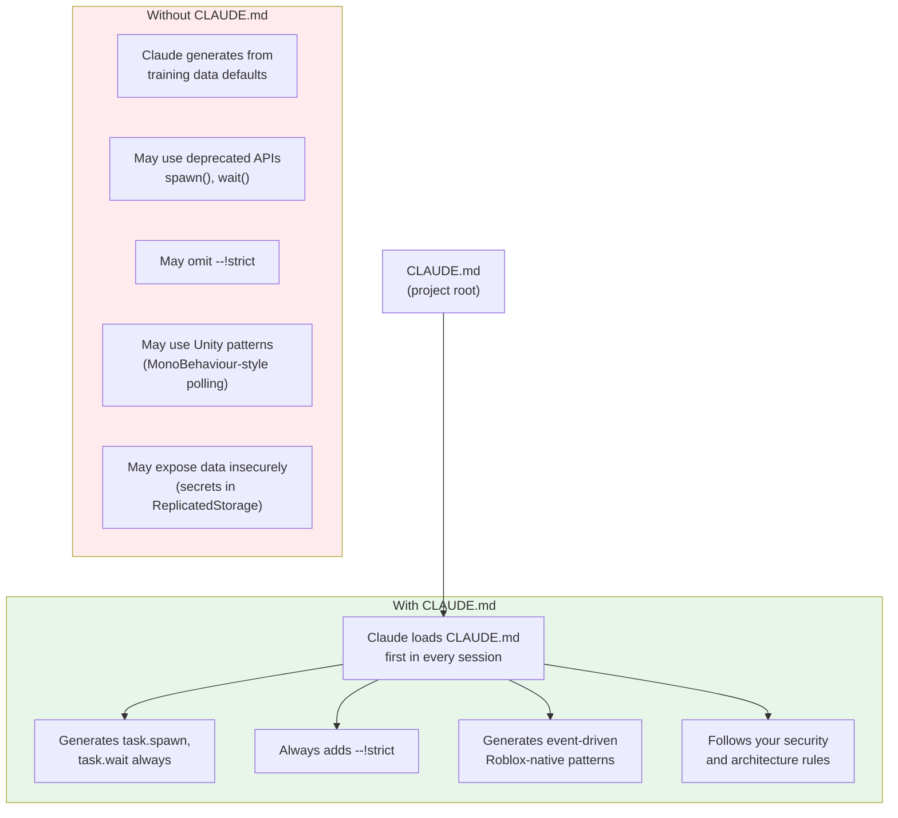
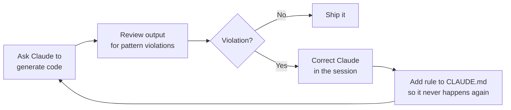

# 6.2 CLAUDE.md Context Engineering

## Overview

`CLAUDE.md` is a markdown file you place in your project root. Every time you start a Claude Code session in that directory, this file is automatically loaded as the first context Claude sees. It is the difference between Claude generating generic Luau that looks like a Unity tutorial and Claude generating production-quality Roblox code that follows your exact architecture.

For an experienced backend developer: think of CLAUDE.md as the `CONTRIBUTING.md` for your AI collaborator — except this one actually gets read, every time, and shapes every output.

---

## Why CLAUDE.md Matters for Roblox

Without a CLAUDE.md, Claude Code generates Luau using patterns from its training data. That training data includes a huge amount of Roblox content — but it also includes Unity tutorials, Godot docs, generic game dev patterns, and outdated Roblox 2019-era code. The result is a mix:

- `spawn()` instead of `task.spawn()` (deprecated API)
- `wait()` instead of `task.wait()` (deprecated)
- Missing `--!strict` at the top of files
- Services implemented as global tables instead of required singletons
- RemoteFunctions used server→client (security vulnerability — see Module 5.2)
- No type annotations on function parameters

CLAUDE.md fixes all of this. It is your standing instructions that override Claude's defaults.



---

## The Feedback Loop

CLAUDE.md is a living document. You update it when you catch Claude making the same mistake twice.



**Example:**

You ask Claude to create a leaderboard. It returns a module that reads player data in a `RunService.Heartbeat` loop instead of responding to events.

1. Correct it in the session: "Don't poll in Heartbeat for data that's event-driven. Connect to `PlayerAdded` and attribute changes instead."
2. Add to CLAUDE.md: "Never poll for state in RunService.Heartbeat when the state change can be detected via an event or attribute change signal."

Three iterations of this and Claude stops making the class of mistakes specific to your codebase.

---

## Key Sections for a Roblox CLAUDE.md

### Language and Type Rules

The most critical section. Roblox's API has a decade of legacy cruft, and Claude knows all of it — including the wrong parts.

```markdown
## Language & Type Rules

- Every file MUST start with `--!strict` on the first line. No exceptions.
- Use `task.spawn()`, `task.delay()`, `task.wait()` — NEVER `spawn()`, `wait()`, or `delay()`.
  These older forms are deprecated and behave differently.
- Use `string.format()` or `\`string interpolation\`` — never string concatenation with `..` 
  in loops or hot paths.
- Annotate all function parameters and return types in public module functions.
- Use `typeof()` for runtime type checking, not `type()` (typeof understands Roblox types).
- Never use `game.Players` — always `game:GetService("Players")`.
- Never use `game.Workspace` — always `workspace` (the global) or `game:GetService("Workspace")`.
- Always use `pcall` when calling any API that can throw (DataStore, HTTP, RemoteFunction).
```

### Project Structure

Claude needs to know where files live to generate correct `require()` paths and to place new files in the right directories.

```markdown
## Project Structure

Rojo syncs src/ to Studio. File naming conventions:
- `*.server.luau` — compiles to Script (ServerScriptService)
- `*.client.luau` — compiles to LocalScript (StarterPlayerScripts)
- `*.luau` — compiles to ModuleScript (required by other scripts)

Directory layout:
- `src/server/services/` → ServerScriptService.Services.*
- `src/server/main.server.luau` → ServerScriptService.main
- `src/client/controllers/` → StarterPlayerScripts.Controllers.*
- `src/client/main.client.luau` → StarterPlayerScripts.main
- `src/shared/` → ReplicatedStorage.Shared.*
- `src/shared/remotes/` → ReplicatedStorage.Shared.Remotes.*

When asked to create a new service, place it in src/server/services/.
When asked to create a new controller, place it in src/client/controllers/.
When asked to create a shared module, place it in src/shared/.
```

### Architecture Rules

These rules encode the patterns from Modules 3.1 (service-controller) and 5.2 (anti-cheat).

```markdown
## Architecture Rules

### State Authority
- All mutable game state lives on the server.
- Clients send inputs (RemoteEvent: "I pressed attack"), never state 
  ("I now have 100 health").
- Server validates all inputs with the five-step pattern:
  1. Type check
  2. Range check
  3. Context check (player alive? in game? owns item?)
  4. Cooldown check
  5. Spatial plausibility check

### RemoteEvent Rules
- NEVER use RemoteFunction server→client. The client can hang the server thread.
- RemoteFunction client→server is acceptable with pcall wrapping.
- For bidirectional communication: RemoteEvent for request + RemoteEvent for response 
  with correlation IDs.
- All RemoteEvent handlers on the server must validate ALL arguments — 
  assume every argument is attacker-controlled.

### Service Singleton Pattern
- Services are ModuleScripts that return a table.
- They are singletons: `require()` caches the result. 
  Never call `require()` in a loop or per-player.
- Services have Init() and Start() lifecycle methods.
  Init: set up internal state. Start: connect to events and other services.
  Bootstrap script calls all Init() then all Start() — never mix these phases.
- Services do not require each other in their module body — only in Init/Start.
  This prevents circular dependency issues.

### Server-Only APIs
Never access these from client scripts:
- DataStoreService (server only)
- ServerStorage (server only, never replicated)
- HttpService:RequestAsync (server only)
- Players:GetUserIdFromNameAsync (use from server, cache result)
```

### Naming Conventions

```markdown
## Naming Conventions

- **Services**: PascalCase + "Service" suffix. `PlayerService`, `CombatService`.
- **Controllers**: PascalCase + "Controller" suffix. `HUDController`, `InputController`.
- **RemoteEvents**: PascalCase verb-noun. `PlayerAttacked`, `ItemEquipped`, `ShopPurchased`.
- **Modules**: PascalCase noun. `ObjectPool`, `Maid`, `StatusFlags`.
- **Constants**: SCREAMING_SNAKE_CASE. `MAX_HEALTH`, `ATTACK_COOLDOWN_SECONDS`.
- **Private module variables**: `_camelCase` with leading underscore. `_activePlayers`.
- **Types**: PascalCase, exported with `export type`. `PlayerData`, `CombatResult`.
- **Folders in DataModel**: PascalCase. `Services`, `Controllers`, `Remotes`.
```

### Service Usage Reference

```markdown
## Roblox Service Usage

### Server-accessible services (require at top of server modules):
```luau
local Players = game:GetService("Players")
local RunService = game:GetService("RunService")
local DataStoreService = game:GetService("DataStoreService")
local HttpService = game:GetService("HttpService")
local PhysicsService = game:GetService("PhysicsService")
```

### Client-accessible services:
```luau
local Players = game:GetService("Players")
local RunService = game:GetService("RunService")
local UserInputService = game:GetService("UserInputService")
local TweenService = game:GetService("TweenService")
local SoundService = game:GetService("SoundService")
local GuiService = game:GetService("GuiService")
```

### DataStore access: server only, via ProfileStore library
- Never call DataStoreService directly — use the ProfileStore wrapper in src/server/services/ProfileStore.
- Player data is loaded in PlayerService:Init() via ProfileStore.
- Never read player data on the client — fire a RemoteEvent to request it from the server.

### UI: client controllers only
- All ScreenGui manipulation happens in client controllers.
- Server scripts never touch UI.
- Pass data to UI via RemoteEvents or Attributes, not by parenting UI objects from server.
```

---

## Per-Session Context

Beyond the permanent CLAUDE.md, you can add session-specific context for complex tasks. Claude Code supports referencing specific files inline:

```bash
# Ask Claude to read a specific doc before a task
You: Before implementing the shop system, read these files for context:
     - src/server/services/PlayerDataService.luau (existing data layer)
     - src/shared/remotes/RemoteDefinitions.luau (existing remotes)
     - docs/economy-design.md (design spec)
     Then implement ShopService.luau.
```

Claude reads all three, understands the existing patterns, and generates code that integrates correctly with what's already there.

For large tasks, you can also use a task brief file:

```bash
# Create a task brief
cat TASK.md  # temporary file describing the current sprint task
You: Read TASK.md and implement the features described there.
```

---

## Complete Example CLAUDE.md

The following is a production-ready CLAUDE.md for a Roblox game project:

````markdown
# CLAUDE.md — Roblox Project Instructions

## About This Project

This is a Roblox game built with Rojo, using the service-controller pattern.
TypeScript-style Luau with --!strict throughout. Backend developer context:
the server is an authoritative game loop, clients send inputs only.

## Language & Type Rules

- Every file MUST start with `--!strict` on line 1.
- Use `task.spawn()`, `task.delay()`, `task.wait()` — NEVER the deprecated 
  `spawn()`, `wait()`, `delay()`.
- Use `string.format()` over `..` concatenation in any loop.
- Annotate all public module function parameters and return types.
- Use `typeof()` for runtime type checking.
- Use `game:GetService("ServiceName")` — never `game.ServiceName`.
- Wrap all DataStore, HTTP, and RemoteFunction calls in `pcall`.
- Use `task.cancel(thread)` to cancel spawned threads, not just letting them go.

## File Naming (Rojo Conventions)

- `*.server.luau` → Script (runs on server)
- `*.client.luau` → LocalScript (runs on each client)
- `*.luau` → ModuleScript (required by other scripts)

## Project Structure

```
src/
  server/
    services/     → All server services (ModuleScripts)
    main.server.luau → Server bootstrap
  client/
    controllers/  → All client controllers (ModuleScripts)
    main.client.luau → Client bootstrap
  shared/
    types/        → Exported type definitions
    remotes/      → RemoteEvent/Function/UnreliableRemoteEvent definitions
    utils/        → Pure utility modules (no Roblox service dependencies)
```

When creating new files:
- New service → `src/server/services/MyService.luau`
- New controller → `src/client/controllers/MyController.luau`
- New shared module → `src/shared/MyModule.luau`

## Architecture Rules

### State Authority
All mutable game state lives on the server. Clients send inputs via RemoteEvents.
Never trust client-provided values — validate everything server-side.

### Five-Step Validation Pattern (all RemoteEvent server handlers)
1. Type check: `typeof(arg) == "expectedType"`
2. Range check: `value >= MIN and value <= MAX`
3. Context check: player alive? in game? owns the item?
4. Cooldown check: `os.clock() - lastAction > COOLDOWN`
5. Spatial check: `distance <= MAX_RANGE`

### RemoteEvent Rules
- NEVER `RemoteFunction:InvokeClient()` — server-to-client invocation can deadlock.
- `RemoteFunction:InvokeServer()` is acceptable inside pcall.
- For bidirectional: RemoteEvent request + RemoteEvent response with correlation ID.

### Service Pattern
```luau
--!strict
local MyService = {}

-- Private state
local _data: { [Player]: SomeType } = {}

function MyService:Init(): ()
    -- Initialize internal state
    -- Do NOT connect to events here
end

function MyService:Start(): ()
    -- Connect to events here (after all services are Init'd)
    game:GetService("Players").PlayerAdded:Connect(function(p)
        self:OnPlayerAdded(p)
    end)
end

function MyService:OnPlayerAdded(player: Player): ()
    -- ...
end

return MyService
```

Bootstrap calls all `:Init()` then all `:Start()` — never mix phases.

### Security Rules
- Never put secrets, admin UserIds, or economy formulas in ReplicatedStorage.
  Clients can read all of ReplicatedStorage.
- Server-only: DataStoreService, ServerStorage, HttpService, admin logic.
- Client code may be modified by exploiters — never trust client-reported state.

## Naming Conventions

| Thing | Convention | Example |
|---|---|---|
| Services | PascalCase + Service | `PlayerService`, `CombatService` |
| Controllers | PascalCase + Controller | `HUDController`, `InputController` |
| RemoteEvents | PascalCase verb-noun | `PlayerAttacked`, `ItemEquipped` |
| Constants | SCREAMING_SNAKE_CASE | `MAX_HEALTH`, `ATTACK_COOLDOWN` |
| Private vars | _camelCase | `_activePlayers`, `_roundState` |
| Exported types | PascalCase | `PlayerData`, `WeaponConfig` |

## Libraries in Use

- **ProfileStore** (`src/shared/libs/ProfileStore`) — DataStore wrapper. All persistent
  player data goes through ProfileStore. Never call DataStoreService directly.
- **Maid** (`src/shared/utils/Maid`) — Event connection cleanup. Use in every service
  and controller that connects to events.
- **ObjectPool** (`src/shared/utils/ObjectPool`) — Instance pooling. Use for any
  instance created and destroyed frequently (bullets, effects, particles).
- **ByteNet** (`src/shared/libs/ByteNet`) — Binary networking. Use for position sync
  and any RemoteEvent firing more than 10 times per second.

## Common Anti-Patterns to Avoid

```luau
-- BAD: deprecated
spawn(function() wait(1) end)

-- GOOD: current
task.spawn(function() task.wait(1) end)

-- BAD: no type annotation
local function getPlayer(name)

-- GOOD: typed
local function getPlayer(name: string): Player?

-- BAD: polling in Heartbeat
RunService.Heartbeat:Connect(function()
    if player:GetAttribute("Health") < 0 then -- polling
    end
end)

-- GOOD: event-driven
player:GetAttributeChangedSignal("Health"):Connect(function()
    -- only fires when health changes
end)

-- BAD: global service access inside hot loop
RunService.Heartbeat:Connect(function()
    local ps = game:GetService("Players") -- service lookup each frame
end)

-- GOOD: capture once at module level
local Players = game:GetService("Players")
RunService.Heartbeat:Connect(function()
    local players = Players:GetPlayers() -- direct upvalue
end)
```

## API Verification Note

Claude's training data may reference deprecated Roblox APIs. Always verify
against https://create.roblox.com/docs before shipping code that uses an
unfamiliar API. If unsure, ask for the current API and I'll check the docs.
````

---

## Iterating on CLAUDE.md

### Signals That CLAUDE.md Needs an Update

- Claude makes the same mistake in two consecutive sessions
- You catch yourself adding the same correction boilerplate at the start of each task
- A new library is added to the project and Claude keeps generating code that duplicates it
- Claude generates code that bypasses a security or architecture rule you care about

### Process for Adding a Rule

1. **Identify the pattern**: what exactly did Claude do wrong?
2. **Write the rule positively**: "Always do X" is clearer than "Don't do Y"
3. **Add an example**: code examples in CLAUDE.md are more effective than prose descriptions
4. **Test it**: start a new session, attempt to trigger the old mistake, verify it's fixed

### Organizing for Readability

As CLAUDE.md grows, organize it so the most critical rules are first. Claude reads the file top-to-bottom and earlier context has slightly stronger influence:

1. Critical security rules (RemoteFunction ban, validation requirements)
2. Language fundamentals (--!strict, task.* APIs)
3. Architecture patterns (service-controller, singleton)
4. Project structure (file paths, naming)
5. Library usage (which library to use for what)
6. Anti-patterns to avoid (concrete code examples)

---

## Key Takeaways

- CLAUDE.md is loaded automatically at the start of every Claude Code session in your project directory — it is your standing instruction set for the AI
- Without it, Claude generates from training data defaults which include deprecated APIs, missing type annotations, and Unity-influenced patterns
- The most critical sections are: language rules (task.* APIs, --!strict), architecture rules (server authority, RemoteEvent safety), and anti-patterns with code examples
- CLAUDE.md is a living document — update it whenever Claude makes a correctable mistake in a session
- Per-session context (asking Claude to read specific files) supplements CLAUDE.md for complex, file-dependent tasks
- The payoff compounds: each improvement to CLAUDE.md makes every future session better, multiplying the value of the investment

---

## What's Next

This concludes the AI-powered development section. The patterns in Modules 6.1 and 6.2 — the MCP-connected Studio workflow and the CLAUDE.md instruction file — combine to create a development experience where Claude Code functions as a senior Roblox developer who knows your codebase, follows your conventions, and generates production-quality systems from natural language descriptions.

The final module in this series (Module 7.1) covers the game development mindset shift: thinking about player experience, progression loops, and game feel — the concepts that don't have direct backend analogues and require building new mental models from scratch.
