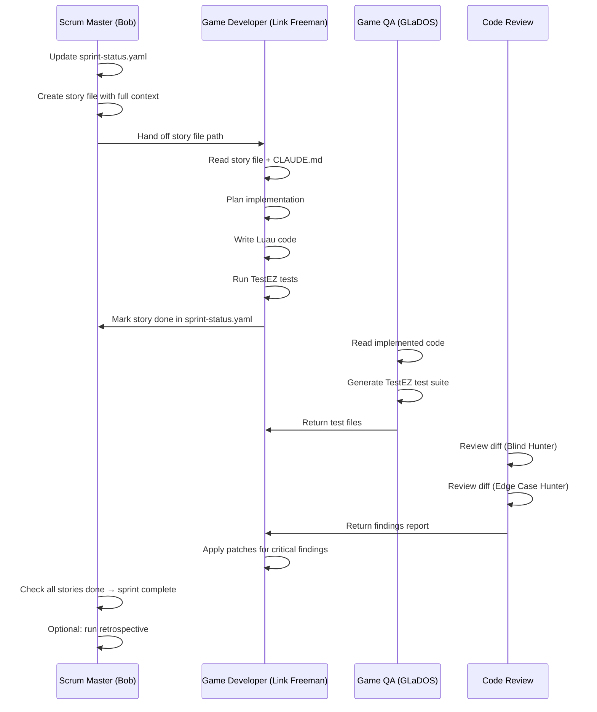

# Module 6.3: BMAD Game Dev Studio Workflow

## What is BMAD Game Dev Studio?

BMAD Game Dev Studio (BMGD) is an AI-assisted game development framework that runs on top of Claude Code. It provides 7 specialized agents — each with a distinct persona and expertise domain — that guide you through every phase of game development, from initial concept to shipped feature.

Key characteristics:

- **Agents are loaded via SKILL.md files** inside the Claude Code session. Invoking `/bmad-agent-game-dev` loads the developer agent (Link Freeman) into the current conversation context.
- **Structured around 4 development phases** modeled on real game studio practice: Preproduction, Design, Technical, and Production.
- **Artifact-driven workflow**: every phase produces concrete output files stored in `_bmad-output/`. Agents read previous artifacts before producing new ones, creating a chain of context that prevents hallucinated architecture decisions.
- **Multi-engine support**: Roblox, Unity, Unreal Engine, and Godot. Engine-specific knowledge files give agents the right vocabulary and patterns for each platform.

The framework was designed for the reality of AI-assisted development: context windows are finite, agents are stateless between sessions, and code quality degrades without structured constraints. BMAD addresses all three by externalizing state (artifact files), constraining scope (story-per-session pattern), and encoding conventions (CLAUDE.md).

---

## The 7 Agents

Each agent has a persona, a specific scope, and a defined handoff point. You don't chat with them freely — you engage them for a specific task, they produce an artifact or execute a story, and you move on.

| Agent | Persona | Primary Role | Key Output |
|-------|---------|--------------|------------|
| Game Architect | Cloud Dragonborn | System architecture, technical design decisions, service diagrams | Architecture doc, RemoteEvent map |
| Game Designer | Samus Shepard | GDD, game mechanics, narrative, player experience design | Game Design Document, narrative doc |
| Game Developer | Link Freeman | Code implementation, story execution, Luau code generation | Working code, marked-done story files |
| Game QA | GLaDOS | Testing strategy, TestEZ suites, play mode test plans | Test files, test plan docs |
| Scrum Master | Max (Bob) | Sprint planning, story creation, status tracking | sprint-status.yaml, story files |
| Solo Dev | Indie (Barry) | Rapid prototyping, combined design+dev for small teams | Quick implementation, inline spec |
| Tech Writer | Paige | Documentation, setup guides, API reference, onboarding docs | Markdown docs, how-to guides |

### Invoking an Agent

```bash
# In a Claude Code terminal session:
/bmad-agent-game-dev        # Loads Link Freeman (Game Developer)
/bmad-agent-sm              # Loads Bob (Scrum Master)
/bmad-agent-qa              # Loads GLaDOS (QA)
/bmad-agent-architect       # Loads Cloud Dragonborn (Architect)
/bmad-agent-tech-writer     # Loads Paige (Tech Writer)
/bmad-quick-dev             # Loads Indie (Solo Dev / Quick Flow)
```

Each invocation loads the agent's SKILL.md into the session context, giving Claude the persona, constraints, and domain knowledge for that role.

---

## The 4 Development Phases

```mermaid
graph LR
    subgraph PP["Phase 1: Preproduction"]
        P1A["Game Designer<br/>(Samus Shepard)"]
        P1B["Market Research"]
        P1C["Domain Research"]
        P1D["Technical Research"]
    end

    subgraph D["Phase 2: Design"]
        P2A["Game Designer<br/>(Samus Shepard)"]
        P2B["UX Designer<br/>(Sally)"]
        P2C["Product Manager<br/>(John)"]
    end

    subgraph T["Phase 3: Technical"]
        P3A["Game Architect<br/>(Cloud Dragonborn)"]
        P3B["Scrum Master<br/>(Bob/Max)"]
    end

    subgraph PR["Phase 4: Production"]
        P4A["Scrum Master<br/>(Bob/Max)"]
        P4B["Game Developer<br/>(Link Freeman)"]
        P4C["Game QA<br/>(GLaDOS)"]
        P4D["Code Review<br/>Agents"]
    end

    PP --> D --> T --> PR
```



### Phase 1 — Preproduction

The goal is to validate the game concept before committing to design work. This phase produces research artifacts that inform every downstream decision.

**Brainstorming session** (Game Designer): Open-ended concept exploration. What is the core loop? What feeling does the player have? What is the 30-second pitch? The designer challenges assumptions and surfaces gaps.

**Game Brief**: A one-page concept document covering core loop, target audience, platform, monetization model, and estimated scope. This is the anchor document for the entire project.

**Market research** (Analyst): Competitive analysis of similar games. What do they do well? Where are the gaps? What is the retention mechanic? Informs differentiation strategy.

**Domain research**: Target audience behavior, platform usage patterns, player demographics. For Roblox: mobile-first players, shorter session lengths, UGC culture.

**Technical research**: Platform-specific architecture investigation. For Roblox: physics ownership strategy, DataStore schema, cross-server architecture, MCP tooling.

Output artifacts: `_bmad-output/planning-artifacts/research/`

### Phase 2 — Design

Converts the validated concept into a full specification. This phase is documentation-heavy by design — the code is only as good as the spec it implements.

**Game Design Document (GDD)**: The complete mechanics specification. Every system, every number, every player action documented. Agents read this before implementing anything.

**Narrative design**: World, story, characters, dialogue patterns. For games with narrative elements.

**UX design** (UX Designer): UI flows, screen wireframes, player experience journey. What does the player see at each moment?

**PRD** (Product Manager): Product Requirements Document — translates the GDD into technical requirements. Defines the acceptance criteria for every system.

Output artifacts: `_bmad-output/planning-artifacts/`

### Phase 3 — Technical

Converts design specs into an implementable technical blueprint. This phase is the critical bridge between "what to build" and "how to build it."

**Project context** (CLAUDE.md): The AI rules file. Encoding Luau conventions, service patterns, file organization, RemoteEvent naming, and Rojo structure. Every agent reads this file before writing code.

**Game Architecture** (Architect): Service diagram, data model schema, RemoteEvent/RemoteFunction map, physics ownership decisions, DataStore layout. This is the contract that all implementation stories reference.

**Epics and Stories** (Scrum Master): Backlog creation from the PRD and Architecture doc. Each epic is a major feature area; each story is a single implementable unit.

**Implementation Readiness Check**: Before any code is written, verify all specs are complete. Are there undefined acceptance criteria? Unresolved architecture decisions? Conflicting requirements? Better to surface these now than mid-sprint.

Output artifacts: `_bmad-output/project-context/`, `_bmad-output/planning-artifacts/`

### Phase 4 — Production (Sprint Execution)

Where code gets written. Structured as iterative sprints with a defined loop.

**Sprint planning** (Scrum Master): Select stories for the sprint from the backlog. Update `sprint-status.yaml`.

**Story creation** (Scrum Master): Generate story files with full implementation context — acceptance criteria, Roblox-specific technical notes, relevant architecture references, and pattern examples. Each story is self-contained: the developer agent reads only the story file and CLAUDE.md to implement.

**Dev story** (Game Developer): Agent reads the story file, plans the implementation, writes Luau code, runs tests, updates the story status to done.

**QA testing** (GLaDOS): Generates TestEZ test files for the implemented feature. May include unit tests, integration tests, and play mode test instructions.

**Code review**: Adversarial review using Blind Hunter (finds hidden bugs) and Edge Case Hunter (finds boundary violations). Produces a structured findings report.

**Sprint retrospective**: Lessons learned. What slowed down? What patterns worked? What needs to change in CLAUDE.md?

Output artifacts: `_bmad-output/implementation-artifacts/`

---

## Quick Flow: The Solo Dev Path

For small games, prototypes, game jams, or single-developer projects, skip Phases 1–3 entirely:

1. Write a one-paragraph game concept
2. Invoke Indie (Solo Dev): `/bmad-quick-dev`
3. Describe the feature — Indie produces both the spec and the implementation in one pass
4. Iterate

The Solo Dev path trades rigor for speed. It works well when:
- The scope is small enough to hold in a single context window
- You're exploring ideas rather than building production features
- You don't need parallel agent collaboration

It breaks down when:
- Multiple people are working on the same codebase
- The game has complex interdependencies between systems
- You need traceable decisions for a codebase that will outlive a single session

---

## The Sprint Workflow in Detail



### Step-by-Step

1. **Bob creates `sprint-status.yaml`** from the epics backlog, setting story statuses to `backlog`.

2. **Bob creates story files** in `_bmad-output/implementation-artifacts/stories/`. Each story file includes:
   - User story (as a / want / so that format)
   - Acceptance criteria (testable, specific)
   - Task breakdown with checkboxes
   - Dev Notes: Roblox patterns, relevant service names, RemoteEvent names, DataStore key names, known gotchas

3. **Link Freeman devs a story**: opens the story file, confirms understanding, implements end-to-end, marks tasks done, updates sprint-status.yaml to `done`.

4. **GLaDOS generates tests**: reads the implementation, writes TestEZ specs, identifies edge cases that need play mode verification.

5. **Code review agent** runs the adversarial review pass on the diff.

6. **Repeat** for each story until the sprint is complete.

7. **Retrospective** (optional): extract lessons into a retrospective document. The most valuable lessons often get promoted to CLAUDE.md so future agents benefit.

---

## File Artifact Layout

```
_bmad-output/
├── planning-artifacts/
│   ├── research/
│   │   ├── market-research-{date}.md
│   │   ├── domain-research-{date}.md
│   │   └── technical-{platform}-research-{date}.md
│   ├── game-brief.md
│   ├── gdd.md
│   ├── narrative-design.md
│   ├── ux-design.md
│   └── prd.md
├── project-context/
│   ├── CLAUDE.md
│   └── architecture.md
├── implementation-artifacts/
│   ├── sprint-status.yaml
│   ├── epics/
│   │   ├── epic-1-{name}.md
│   │   └── epic-2-{name}.md
│   └── stories/
│       ├── 1-1-{story-name}.md
│       └── 1-2-{story-name}.md
└── learning/
    └── roblox-ai-dev/       ← this documentation set
```

---

## Example: sprint-status.yaml

This file is the single source of truth for sprint progress. Bob creates it; every agent updates it.

```yaml
generated: 2026-04-03
last_updated: 2026-04-04
project: feat--roblox-support
project_key: NOKEY
tracking_system: file-system
story_location: _bmad-output/implementation-artifacts

development_status:
  # Epic 1: Roblox Engine Knowledge & Platform Setup
  epic-1: done
  1-1-add-roblox-to-engine-selection: done
  1-2-create-roblox-engine-knowledge-file: done
  1-3-add-roblox-mcp-server-entries: done
  epic-1-retrospective: optional

  # Epic 2: Roblox Decision Catalog & Architecture Patterns
  epic-2: done
  2-1-add-roblox-options-to-decision-catalog-categories: done
  2-2-add-roblox-common-stacks-and-starter-templates: done
  2-3-add-roblox-architecture-patterns: done
  epic-2-retrospective: optional

  # Epic 3: Roblox Testing & QA Support
  epic-3: done
  3-1-create-roblox-testing-knowledge-and-register-in-qa-index: done
  epic-3-retrospective: optional

  # Epic 4: Agent Awareness & Developer Onboarding
  epic-4: in-progress
  4-1-update-agent-skill-md-files-with-roblox-expertise: done
  4-2-create-roblox-setup-guide: in-progress
  4-3-update-documentation-site-index-with-roblox: backlog
  epic-4-retrospective: optional
```

**Status definitions:**
- `backlog` — story exists in the epic file, no story file created yet
- `ready-for-dev` — story file created, waiting for developer
- `in-progress` — developer actively implementing
- `review` — implementation done, pending code review
- `done` — code review passed, story complete

---

## Example: Story File Structure

```markdown
# Story 2.3: Add Roblox Architecture Patterns

Status: done

## Story

As a **game developer starting a Roblox project with BMGD**,
I want **documented Roblox architecture patterns in the decision catalog**,
so that **the architect agent recommends appropriate patterns without me having to re-specify them each session**.

## Acceptance Criteria

1. **Given** the decision catalog exists, **When** the architect agent loads it,
   **Then** it contains Roblox entries for: Service-Controller pattern,
   Bootstrap pattern, five-step RemoteEvent validation, and ECS options.

2. **Given** a Roblox architecture pattern entry, **When** an agent reads it,
   **Then** it includes: pattern name, when to use, Luau code example, gotchas.

3. **And** the entries are consistent with the existing catalog schema.

## Tasks / Subtasks

- [x] Task 1: Add Service-Controller pattern entry
  - [x] Write pattern description and when-to-use
  - [x] Add Luau code example for server Service skeleton
  - [x] Add Luau code example for client Controller skeleton
- [x] Task 2: Add Bootstrap pattern entry
- [x] Task 3: Add five-step RemoteEvent validation entry
- [x] Task 4: Add ECS options entry (Matter vs Jecs)

## Dev Notes

### Architecture Pattern Location
File: `src/knowledge/architecture-patterns.md`

### Service-Controller Pattern
Server Services live in `ServerScriptService/Services/`.
Client Controllers live in `StarterPlayerScripts/Controllers/`.
Both are ModuleScripts loaded by a Bootstrap script on initialization.

### Roblox-Specific Gotchas
- Services must never require() client-side modules (trust boundary)
- Controllers must never require() server-side modules
- RemoteEvents live in ReplicatedStorage and must be created on server startup
```

---

## Real Example: BMAD Adding Roblox Support to Itself

The Roblox support feature tracked in this repository was built using BMAD's own workflow — the framework developing itself:

- **4 epics**: Engine Knowledge, Decision Catalog, Testing/QA, Agent Awareness
- **11 stories**: all completed in a single sprint
- **1 sprint**: from backlog to done, including code review passes
- **Tracked in**: `_bmad-output/implementation-artifacts/sprint-status.yaml`

This demonstrates the framework's scalability: a non-trivial platform integration (Roblox support across agents, decision catalog, documentation, MCP configuration) was shipped coherently because each story carried full context, and the sprint-status file prevented lost work across multiple AI sessions.

The key insight from that sprint: **story files are the memory layer**. Each Claude Code session is stateless, but the story file preserves all architectural decisions, acceptance criteria, and technical notes. The developer agent never needs to re-derive context — it reads the story and builds.
