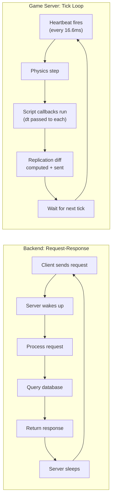
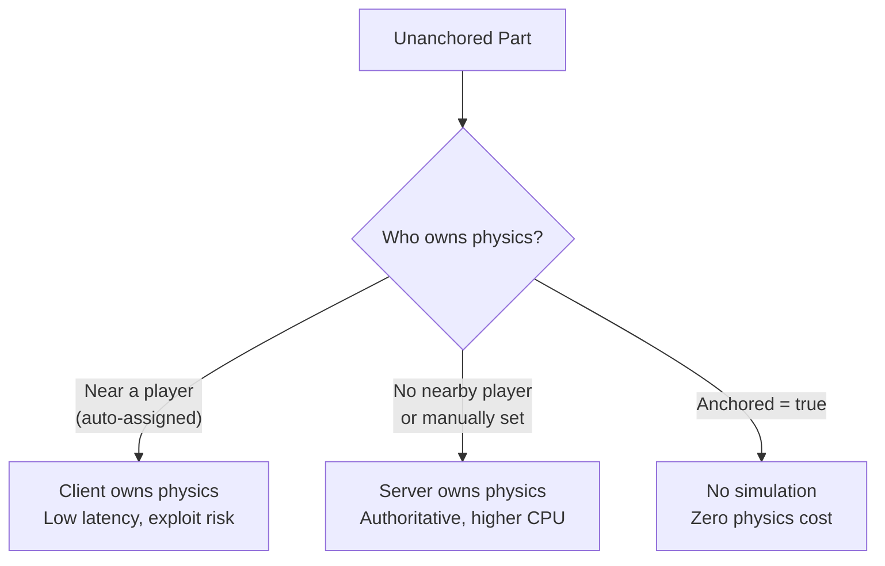
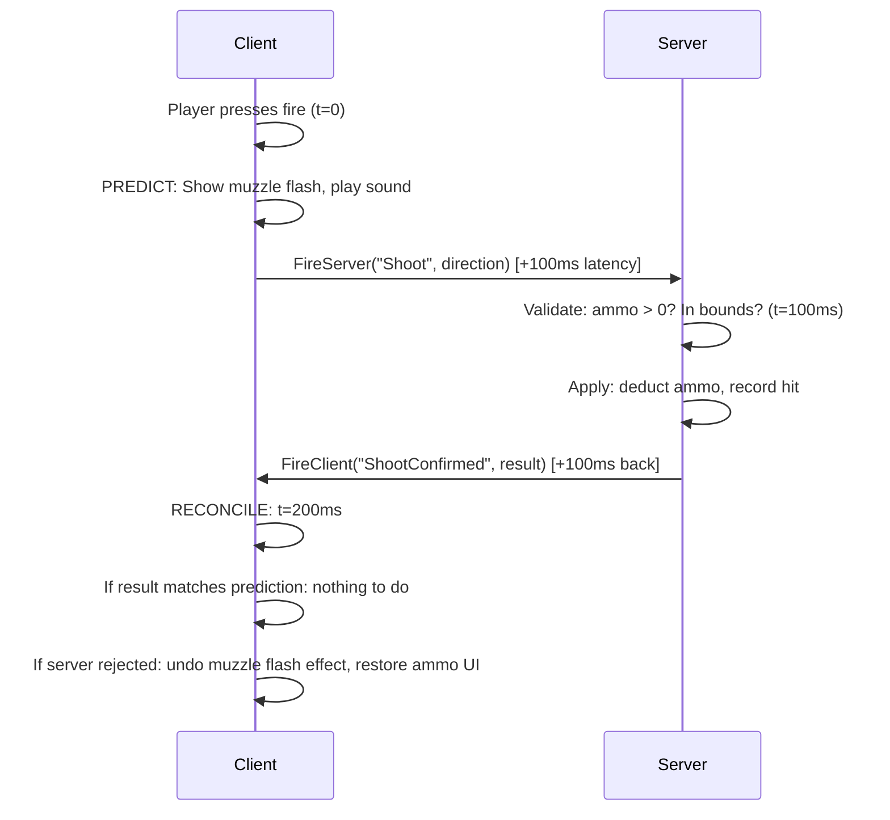

# Module 7.1: Tick-Based Simulation vs Request-Response

## The Core Difference

If your mental model of a server is "idle process that wakes up to handle a request, then sleeps," game servers will feel wrong until you replace that model entirely.

A backend service CPU graph looks like a heartbeat: spikes on traffic, valleys on idle. A game server CPU graph is a flat plateau: 100% steady-state, 60 times per second, regardless of whether anyone pressed a button.

| Backend Server | Game Server |
|---------------|-------------|
| Idle until request arrives | Simulating continuously at 60Hz |
| CPU proportional to traffic | CPU is constant (simulation budget) |
| "Slow" = high response latency | "Slow" = missed frames (hitching) |
| Scale by adding instances | Scale by reducing per-frame work |
| Work triggered by external event | Work driven by internal clock |
| Thread pool, async I/O | Single simulation thread per heartbeat |

The implication for Roblox: **you always pay for the tick**. Even with zero players in a server, physics is simulating, Heartbeat connections are firing, and scripts are running. The question is never "how much traffic can I handle" — it's "how much can I pack into 16.6ms without dropping a frame."

---

## No Idle State

Every frame, unconditionally:

1. **Physics step**: all unanchored parts integrate velocity, detect collisions, resolve constraints
2. **Script step**: all `RunService.Heartbeat` connections fire with the current delta time
3. **Replication**: the engine computes diffs between the server state and each client's known state, encodes them, and sends delta packets
4. **Render** (client only): the GPU draws the frame

There is no "wait for a player to do something." The engine does not pause. If your `Heartbeat` callback does expensive work — iterating 1000 NPCs, querying a DataStore, running complex math — that cost is paid every single frame, forever.

**Design for frame budget, not request throughput.**

A 60Hz server gives you 16.6ms per frame. A 30Hz server gives you 33.3ms. Roblox server tick rate is configurable but defaults to 60Hz. Your scripts collectively must stay under this budget or frames drop, physics stutters, and players experience rubber-banding.

```luau
-- BAD: running expensive work every frame unconditionally
RunService.Heartbeat:Connect(function(dt)
    for _, npc in ipairs(allNpcs) do
        npc:RecalculatePathfinding()  -- expensive every frame
    end
end)

-- GOOD: amortize expensive work across frames
local PATHFIND_INTERVAL = 0.5  -- recalculate every 500ms
local timeSinceLastPathfind = 0

RunService.Heartbeat:Connect(function(dt)
    timeSinceLastPathfind += dt
    if timeSinceLastPathfind >= PATHFIND_INTERVAL then
        timeSinceLastPathfind = 0
        for _, npc in ipairs(allNpcs) do
            npc:RecalculatePathfinding()
        end
    end
end)
```

---

## Spatial Programming

Backend developers think in terms of IDs and queries: "give me the record for entity X," "find all entities where field Y = Z." Game development adds a third axis that has no direct backend analogue: **physical location in 3D space**.

In a game, "what entities are relevant to player P" is answered spatially, not relationally. The world is the index.

| Backend Query | Spatial Equivalent | Roblox API |
|---------------|-------------------|------------|
| `SELECT * WHERE distance < 10` | Find all parts within radius | `workspace:GetPartBoundsInRadius(center, radius)` |
| `SELECT * WHERE in_zone = true` | Find parts overlapping a box | `workspace:GetPartBoundsInBox(cframe, size)` |
| Line-of-sight check | Raycast | `workspace:Raycast(origin, direction, params)` |
| Nearest-neighbor query | Find closest part | Iterate `GetPartBoundsInRadius`, sort by distance |
| "Is player in the safe zone?" | Region overlap | `Region3` or `GetPartBoundsInBox` with zone dimensions |

**Collision detection replaces many database queries.** Instead of maintaining a "players in zone" table and updating it on every movement event, you raycast or overlap-query on demand. The physics engine is already tracking spatial relationships — query it directly.

```luau
-- Find all players within 20 studs of a position
local function getPlayersInRadius(center: Vector3, radius: number): { Player }
    local params = OverlapParams.new()
    params.FilterType = Enum.RaycastFilterType.Include
    params.FilterDescendantsInstances = { workspace }

    local parts = workspace:GetPartBoundsInRadius(center, radius, params)
    local players = {}

    for _, part in ipairs(parts) do
        local character = part:FindFirstAncestorOfClass("Model")
        if character then
            local player = game:GetService("Players"):GetPlayerFromCharacter(character)
            if player and not table.find(players, player) then
                table.insert(players, player)
            end
        end
    end

    return players
end
```

```luau
-- Raycast: did the bullet hit anything?
local function fireRaycast(origin: Vector3, direction: Vector3): RaycastResult?
    local params = RaycastParams.new()
    params.FilterType = Enum.RaycastFilterType.Exclude
    params.FilterDescendantsInstances = { game:GetService("Players").LocalPlayer.Character }

    local result = workspace:Raycast(origin, direction.Unit * 500, params)
    return result  -- result.Instance, result.Position, result.Normal
end
```

**Physics as a continuous simulation, not a library call.** You don't call `physics.update()`. The engine runs physics every tick automatically. You set initial conditions (position, velocity, mass, constraints) and the simulation evolves. Your job is to configure the physics bodies correctly, not to drive them frame-by-frame.

---

## Time is First-Class

In request-response systems, time is metadata — a timestamp on a log entry, an expiry on a token. In game development, **time drives everything**.

The game loop passes a `deltaTime` (dt) value to every Heartbeat callback: the elapsed seconds since the last frame. This is not a constant. If the server is under load, frames drop, and dt grows. If the server is running at perfect 60Hz, dt ≈ 0.0167 seconds.

**Always multiply movement and velocity by dt.** Code that moves an object by a fixed amount per frame is frame-rate dependent — it moves faster on a fast server, slower on a slow one.

```luau
-- BAD: frame-rate dependent movement
RunService.Heartbeat:Connect(function(dt)
    part.CFrame = part.CFrame * CFrame.new(0, 0, -0.1)  -- fixed per frame
end)

-- GOOD: frame-rate independent movement
local SPEED = 6  -- studs per second

RunService.Heartbeat:Connect(function(dt)
    part.CFrame = part.CFrame * CFrame.new(0, 0, -SPEED * dt)  -- consistent regardless of tick rate
end)
```

**Frame budget as a resource.** Think of the 16.6ms budget as a finite resource you're allocating across systems. If your combat system takes 5ms, that's 30% of the budget. Profiling in game dev is mandatory, not optional — Roblox Studio's MicroProfiler (`Ctrl+F6`) shows exactly which scripts consumed which time slice in each frame.

```luau
-- Measuring frame cost
RunService.Heartbeat:Connect(function(dt)
    local start = os.clock()

    -- ... your system logic ...

    local elapsed = os.clock() - start
    if elapsed > 0.003 then  -- warn if over 3ms
        warn(string.format("System took %.2fms this frame", elapsed * 1000))
    end
end)
```

---

## State Replaces Storage

Backend services are typically stateless: they read from the database, compute, write back, and discard local state. Horizontal scaling works because any instance can handle any request.

Game servers are stateful by nature: the entire game world is in-memory state, and that state is continuously modified by physics, scripts, and player actions.

| Concept | Backend | Game Server |
|---------|---------|-------------|
| Source of truth | Database | In-memory simulation state |
| How clients get state | Query on demand | Replication (pushed automatically) |
| Persistence layer | Primary data store | DataStore (persistence only, not active state) |
| State access | SQL/ORM query | Direct table/Instance access |
| State consistency | ACID transactions | Physics simulation + server authority |

**DataStore is for persistence, not active game state.** A critical mistake from backend developers: treating DataStore like a database to query during gameplay. DataStore calls are async, rate-limited, and expensive. Never read from DataStore on a per-frame or per-event basis.

```luau
-- BAD: querying DataStore for active game state
RunService.Heartbeat:Connect(function(dt)
    local data = DataStoreService:GetDataStore("PlayerData"):GetAsync(userId)  -- async, rate-limited, wrong
    updatePlayerUI(data.coins)
end)

-- GOOD: load once on join, keep in memory, save periodically
local playerState = {}  -- in-memory cache

Players.PlayerAdded:Connect(function(player)
    -- Load once on join
    local success, data = pcall(function()
        return DataStoreService:GetDataStore("PlayerData"):GetAsync(tostring(player.UserId))
    end)
    playerState[player.UserId] = success and data or { coins = 0, level = 1 }
end)

-- Read from memory during gameplay
local function getCoins(userId: number): number
    return playerState[userId] and playerState[userId].coins or 0
end

-- Save periodically (not every frame)
task.spawn(function()
    while true do
        task.wait(60)  -- save every 60 seconds
        for userId, data in pairs(playerState) do
            pcall(function()
                DataStoreService:GetDataStore("PlayerData"):SetAsync(tostring(userId), data)
            end)
        end
    end
end)
```

---

## The Game Loop: Backend vs Tick Side by Side



---

## Hitbox Design and Lag Compensation

A hitbox is a simplified collision volume used to detect damage or interaction — typically a box or sphere that approximates a character's body or weapon's reach.

**Why hitboxes exist**: rendering meshes have thousands of polygons; collision-checking against the full mesh every frame is too expensive. A hitbox is a cheap proxy.

**The lag compensation problem**: Player A shoots at Player B. The click-to-fire input takes 100ms to reach the server. By the time the server processes the shot, Player B has moved. If the server validates the hit using Player B's *current* position, it will reject most hits from high-latency players even when they were accurate from their perspective.

**Lag compensation**: the server rewinds time by the client's measured network latency, reconstructing Player B's position at the moment Player A's client perceived the shot, then validates the hit against that historical position.

```
Timeline:
t=0:    Player A sees Player B at position (10, 0, 5) and fires
t=100ms: Server receives the shot event
        Without lag comp: validates against B's current position (15, 0, 5) → miss
        With lag comp:    rewinds B to position at t=0 (10, 0, 5) → validates → hit
```

Roblox provides basic server-side hit validation tools but does not implement full lag compensation out of the box. Competitive shooters built on Roblox implement custom hitbox systems using positional history buffers.

---

## Physics Ownership and Network Owner

In Roblox's distributed physics model, someone has to be computing the physics simulation for each unanchored Part. That entity is the **network owner**.



| Ownership | Latency | CPU | Exploit Risk | Use Case |
|-----------|---------|-----|--------------|----------|
| Client | Low | Low (offloaded) | High | Player character, held objects |
| Server | High | Higher | Low | NPCs, game objects, projectiles |
| Anchored | N/A | Zero | None | Terrain, static structures |

**Critical implication**: when a client owns physics for a Part, that client's game engine is computing and sending position updates to the server. The server trusts those updates (within limits). A cheater can send fabricated position data. For anything that matters to gameplay integrity (projectiles, pickups, damage volumes), keep physics ownership on the server.

```luau
-- Force server ownership of a part
part:SetNetworkOwner(nil)  -- nil = server owns

-- Give ownership to a specific player (e.g., their held tool)
part:SetNetworkOwner(player)

-- Check who currently owns
local owner = part:GetNetworkOwner()  -- returns Player or nil (server)
```

---

## Client Prediction

Client prediction is the technique that makes networked games feel responsive despite latency. Without it, every player action would stutter: press W → wait 100ms → character moves.

**How Roblox handles character movement**: the engine automatically predicts your own character's movement locally. When you press W, your character moves immediately on your screen. The server processes the input asynchronously and, if it disagrees (e.g., you walked through a wall), your position is corrected — the "rubber band" effect.

**Custom client prediction** for game-specific actions (casting a spell, placing a structure, firing a weapon):

1. **Input arrives** on client
2. **Predict**: immediately show the effect locally (spawn particle, play animation, move UI)
3. **Send** the input to the server via RemoteEvent
4. **Server validates**: check legality, apply authoritative state change
5. **Reconcile**: if server result differs from client prediction, correct the client state



**Gotcha**: predictions that fail reconciliation create visual glitches. Keep predictions cheap and visually reversible. Never predict irreversible effects (permanent world changes, economy transactions) — wait for server confirmation before showing those.
