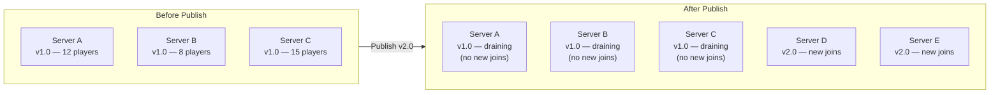
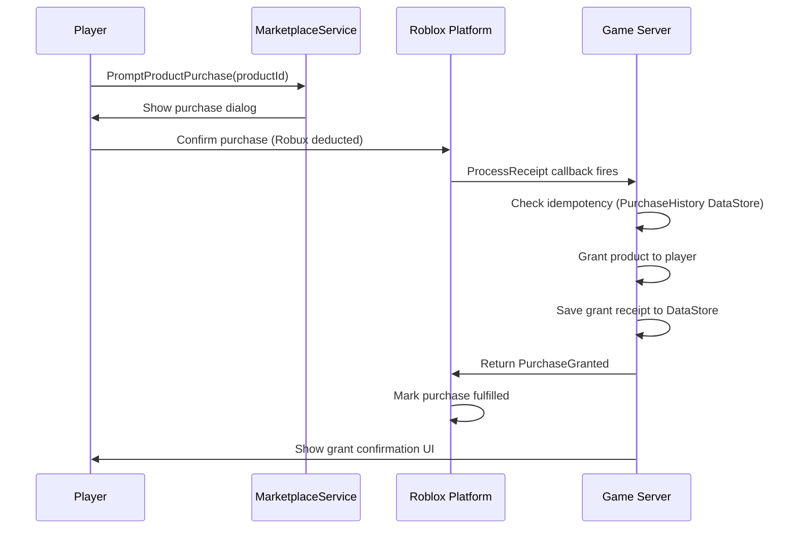

# Module 7.2: Live Ops, Monetization & Economy Design

## Rolling Updates: No Downtime Deploys

Roblox has no concept of a maintenance window. When you publish an updated place, the platform does not restart your servers, drain connections, or display a "down for maintenance" message. The update mechanism is:

1. **New servers** spin up running the new version immediately on publish
2. **Old servers** continue running the previous version until they drain naturally (all players leave)
3. **Players mid-session** on old servers finish their session on the old version
4. **Players joining** immediately get routed to new servers (new version)



### Critical Implication: No Breaking Changes

Because old and new server code run simultaneously — potentially for hours after a publish — you cannot make breaking changes:

- **Old server** reads DataStore key `"PlayerData"` and expects `{ coins = number, level = number }`
- **New server** reads the same key expecting `{ coins = number, level = number, prestige = number }`
- A player who saved on the old server joins a new server → missing `prestige` field

You must handle missing fields gracefully. Always.

**Forward-fix only**: there is no rollback mechanism. If you ship a bug, the fix is to publish another version. Old servers with the bug continue running until they drain. Design your monitoring and kill switches accordingly.

---

## Schema Migrations

DataStore schemas must be backward-compatible indefinitely. This is different from a backend database where you can run a migration script and update all rows atomically.

In Roblox, schema changes propagate as players rejoin across the multi-week server drain period:

| Change Type | Risk | Strategy |
|-------------|------|----------|
| Add new field with default | Safe | Use `Reconcile` (ProfileStore) or `if data.field == nil then data.field = default end` |
| Remove field (stop reading) | Safe | Just stop reading it — old data sits inert |
| Rename a field | Dangerous | Add new field, copy from old on load, stop writing old field |
| Change field type | Dangerous | Version field required + migration on load |
| Remove required field | Dangerous | Old servers break if they receive saves without it |

**Version field pattern** for type-changing migrations:

```luau
local SCHEMA_VERSION = 2

local function migrateData(data: table): table
    local version = data._version or 1

    if version < 2 then
        -- v1 stored xp as a flat number, v2 stores it as { current, total }
        data.xp = { current = data.xp or 0, total = data.xp or 0 }
        data._version = 2
    end

    -- Future migrations go here as version < 3, version < 4, etc.

    return data
end

-- Called immediately after loading from DataStore
local function onPlayerDataLoaded(player: Player, rawData: table)
    local data = rawData or getDefaultData()
    data = migrateData(data)
    -- Store in memory...
end
```

**ProfileStore's `Reconcile` method** handles the common case of adding fields with defaults:

```luau
-- ProfileStore automatically adds missing keys from the template
local PROFILE_TEMPLATE = {
    coins = 0,
    level = 1,
    prestige = 0,           -- new field added in v2
    inventorySlots = 10,    -- new field added in v3
}

profile:Reconcile()  -- fills in prestige and inventorySlots with defaults for old profiles
```

---

## Feature Flags via DataStore or Config

Roblox has no built-in feature flag service. The standard pattern is a `ConfigService` that reads from a DataStore or an in-memory configuration table on server startup.

**Simple in-memory flags** (change by republishing):

```luau
-- src/server/services/ConfigService.lua
local ConfigService = {}

local FLAGS = {
    DOUBLE_XP_EVENT = false,
    NEW_MAP_ENABLED = true,
    BETA_COMBAT_SYSTEM = false,
    MAINTENANCE_KILL_SWITCH = false,
}

function ConfigService:IsEnabled(flag: string): boolean
    if FLAGS.MAINTENANCE_KILL_SWITCH then
        return false  -- global kill switch disables everything
    end
    return FLAGS[flag] == true
end

return ConfigService
```

**Remote flags via DataStore** (change without republishing — only affects new servers):

```luau
-- Read feature flags from a DataStore on server startup
-- Allows toggling features by updating DataStore externally (via Open Cloud API)
local function loadRemoteFlags(): table
    local success, flags = pcall(function()
        return game:GetService("DataStoreService")
            :GetDataStore("FeatureFlags")
            :GetAsync("v1")
    end)
    return (success and flags) or {}
end
```

**Emergency kill switch pattern**: keep a `MAINTENANCE_KILL_SWITCH` flag that disables all optional systems. If you ship a bug in the combat system, enable the kill switch to disable combat while the fix propagates through server drain.

---

## Monetization Architecture

Roblox monetization uses its own virtual currency (Robux) and has two primary purchase types.

### Game Passes (One-Time Purchase)

Game Passes grant a permanent perk tied to the player's account — not a specific server or save file. The player buys it once and owns it forever across all sessions.

**Use cases**: VIP status, double XP, access to exclusive areas, permanent cosmetic packs, early access.

**Revenue**: Roblox takes a platform cut; developers receive approximately 70% of the list price.

```luau
-- Check ownership (always async — do not call every frame)
local MarketplaceService = game:GetService("MarketplaceService")

local GAMEPASS_IDS = {
    VIP = 123456789,
    DOUBLE_XP = 987654321,
}

-- Cache per session — ownership does not change mid-session
local gamePassCache: { [number]: { [number]: boolean } } = {}

local function playerOwnsGamePass(player: Player, passId: number): boolean
    local userId = player.UserId

    if gamePassCache[userId] == nil then
        gamePassCache[userId] = {}
    end

    if gamePassCache[userId][passId] == nil then
        local success, owns = pcall(function()
            return MarketplaceService:UserOwnsGamePassAsync(userId, passId)
        end)
        gamePassCache[userId][passId] = success and owns or false
    end

    return gamePassCache[userId][passId]
end

-- Call on player join to pre-warm the cache
game:GetService("Players").PlayerAdded:Connect(function(player)
    for _, passId in pairs(GAMEPASS_IDS) do
        playerOwnsGamePass(player, passId)
    end
end)

-- Clean up on leave
game:GetService("Players").PlayerRemoving:Connect(function(player)
    gamePassCache[player.UserId] = nil
end)
```

### Developer Products (Repeatable Purchase)

Developer Products can be purchased multiple times. They are the mechanism for consumable microtransactions: currency packs, revives, boosts, cosmetic items on a rotation.

**Critical requirement: `ProcessReceipt` must be idempotent.** Roblox can call `ProcessReceipt` multiple times for the same purchase (network retry, server restart mid-grant). If you grant twice, you've given the player double the value. Your handler must detect and skip duplicate grants.

```luau
local MarketplaceService = game:GetService("MarketplaceService")
local DataStoreService = game:GetService("DataStoreService")

local PRODUCT_IDS = {
    COINS_100 = 111111111,
    COINS_500 = 222222222,
    REVIVE = 333333333,
}

local purchaseHistoryStore = DataStoreService:GetDataStore("PurchaseHistory")

-- Map product ID to grant function
local productGrantHandlers: { [number]: (player: Player) -> boolean } = {
    [PRODUCT_IDS.COINS_100] = function(player)
        -- Add 100 coins to player's in-memory state
        playerState[player.UserId].coins += 100
        return true
    end,
    [PRODUCT_IDS.COINS_500] = function(player)
        playerState[player.UserId].coins += 500
        return true
    end,
    [PRODUCT_IDS.REVIVE] = function(player)
        if player.Character then
            player:LoadCharacter()
        end
        return true
    end,
}

MarketplaceService.ProcessReceipt = function(receiptInfo)
    local player = game:GetService("Players"):GetPlayerByUserId(receiptInfo.PlayerId)

    -- Player left the server before receipt could be processed
    if not player then
        return Enum.ProductPurchaseDecision.NotProcessedYet
    end

    -- Idempotency check: has this purchase receipt already been granted?
    local receiptKey = string.format("%d_%d", receiptInfo.PurchaseId, receiptInfo.PlayerId)
    local alreadyProcessed = false

    local success = pcall(function()
        alreadyProcessed = purchaseHistoryStore:GetAsync(receiptKey) == true
    end)

    if not success then
        -- DataStore read failed — do not grant, retry later
        return Enum.ProductPurchaseDecision.NotProcessedYet
    end

    if alreadyProcessed then
        -- Already granted in a previous call — safe to confirm
        return Enum.ProductPurchaseDecision.PurchaseGranted
    end

    -- Grant the product
    local handler = productGrantHandlers[receiptInfo.ProductId]
    if not handler then
        warn("No handler for product ID:", receiptInfo.ProductId)
        return Enum.ProductPurchaseDecision.NotProcessedYet
    end

    local grantSuccess = pcall(handler, player)
    if not grantSuccess then
        return Enum.ProductPurchaseDecision.NotProcessedYet
    end

    -- Record the grant so future calls are idempotent
    local saveSuccess = pcall(function()
        purchaseHistoryStore:SetAsync(receiptKey, true)
    end)

    if not saveSuccess then
        -- Could not record — do not confirm, let Roblox retry
        -- (the next call will re-grant, but we haven't confirmed yet so the player
        --  hasn't received anything — this is the correct conservative behavior)
        return Enum.ProductPurchaseDecision.NotProcessedYet
    end

    return Enum.ProductPurchaseDecision.PurchaseGranted
end
```

**The grant-save-confirm atomic pattern** (in order):
1. Grant the product to the player in memory
2. Save a record of the grant to DataStore
3. Return `PurchaseGranted`

If step 2 fails, return `NotProcessedYet`. Roblox will retry. The player receives nothing until the full sequence completes successfully.

### Game Pass vs Developer Product: When to Use Which

| Dimension | Game Pass | Developer Product |
|-----------|-----------|-------------------|
| Purchase frequency | Once per player, ever | Unlimited repeats |
| Persistence | Permanent, tied to account | Consumed on use |
| Typical price | Higher (perceived lifetime value) | Lower (impulse, volume) |
| Revenue model | One-time conversion | Recurring spend loop |
| Backend complexity | Low (ownership check, cache) | High (idempotent ProcessReceipt) |
| Player psychology | "Investment" in the game | "Transaction" in the game |
| Best use case | VIP, access, permanent perks | Currency, consumables, boosts |
| Worst use case | Consumables (players balk at non-repeatability) | Permanent access (players prefer one-time purchase for access) |

### Creator Rewards (Engagement-Based Payouts)

Previously "Engagement-Based Payouts." Roblox pays developers a share of Premium subscriber playtime spent in their game. This is not controllable — it rewards retention, not conversion. It is a passive income stream proportional to how long Premium players spend in your game. Optimize for session length and retention, and this follows.

### UGC / Avatar Marketplace

Developers with UGC creator status can publish clothing, accessories, and avatar items to the Roblox marketplace. Revenue comes from avatar item sales. This is a distinct revenue stream from in-game monetization and requires passing Roblox's moderation pipeline for each item.

---

## Monetization Flow



---

## DevEx: Developer Exchange

DevEx (Developer Exchange) converts earned Robux to real-world USD.

| Parameter | Value |
|-----------|-------|
| Exchange rate | ~$0.0038 USD per Robux (varies; check DevEx program page) |
| Minimum Robux to exchange | 30,000 Robux earned |
| Earned vs purchased | Only Robux earned through game revenue qualifies (not Robux you purchased yourself) |
| Processing | Manual review, not instant |
| Eligibility | Account age requirement, earnings threshold, good standing, ID verification |
| Tax implications | DevEx payments are taxable income in most jurisdictions |

**Practical math**: 100,000 Robux earned ≈ $380 USD after exchange rate. Roblox also takes its platform cut before you see revenue, so a 100 Robux Game Pass yields roughly 70 Robux to the developer, which is then subject to the DevEx rate if cashed out.

---

## Economy Design Principles

### Avoid Pay-to-Win

Pay-to-win mechanics — where spending money gives a direct competitive advantage — accelerate a destructive player lifecycle:

1. Free players feel disadvantaged → retention drops
2. Without free players to compete against, paid players have no one to beat → they leave too
3. ARPU (average revenue per user) spikes briefly then collapses

Design monetization so spending improves the experience, not the outcome. Cosmetics are the gold standard: they signal status without affecting gameplay balance.

### The Blend Principle

Effective Roblox monetization blends multiple value types in a single product:

- **VIP Game Pass**: cosmetic badge + slightly faster progression + exclusive social area. Not raw power — convenience and cosmetics combined.
- **Currency packs**: let players express preference for their time (buy currency vs earn slowly), not skip challenge.

### Pricing Strategy

| Product Type | Pricing Logic |
|--------------|--------------|
| Game Pass | Price for perceived lifetime value. A player calculates: "Will I play this enough to justify the cost?" Price at the point where that calculation tips positive for your target segment. |
| Developer Product (currency) | Price for impulse. Small denomination packs at low Robux cost drive volume. Offer a "value bundle" that subtly prices per-Robux more favorably to anchor the single-pack price. |
| Developer Product (consumable) | Price for the moment of need. Revives at death screen, boosts before a hard level. Price slightly above "is this worth it" so the player chooses to continue rather than quit. |

### Key Metrics

Instrument from day one. Roblox provides a built-in analytics dashboard; supplement with custom events via `HttpService` to your own analytics backend.

| Metric | What It Tells You |
|--------|------------------|
| Conversion rate | % of players who ever make a purchase |
| ARPU | Average revenue per user over a period |
| ARPPU | Average revenue per paying user |
| Retention D1/D7/D30 | Do players come back? Drives Creator Rewards |
| Session length | Engagement depth, correlates with retention |
| Spend by session count | At which session number do players first convert? |
| Churn correlation with spend | Are high spenders churning at the same rate as non-spenders? If yes, you have a satisfaction problem. |

---

## Live Ops Cadence

Live operations is the practice of running and updating a live game after launch. Backend developers often underestimate how much of game development happens post-ship.

| Update Type | Frequency | Mechanism | Risk |
|-------------|-----------|-----------|------|
| Content update | Bi-weekly to monthly | New publish | Low if additive; medium if modifying existing systems |
| Balance patch | Weekly during active ops | New publish | Low |
| Seasonal event | Quarterly | New publish + feature flag | Medium (new systems, time-limited) |
| Emergency hotfix | As needed | Publish immediately | High velocity — skip normal QA at your own risk |
| Kill switch | Immediate (no publish needed) | Feature flag via DataStore | Low — flag disables feature, no code change |

**Emergency hotfix playbook:**

1. Identify the broken system
2. Enable kill switch for that system (immediate effect on next server spin-up; old servers still broken)
3. Fix the code, test locally
4. Publish — new servers get the fix
5. Wait for old servers to drain (broken feature disabled by kill switch, players have degraded-but-playable experience)
6. Disable kill switch once old servers are fully drained

The kill switch buys you time. Without it, you're publishing into a live environment and hoping the fix ships faster than player churn.
