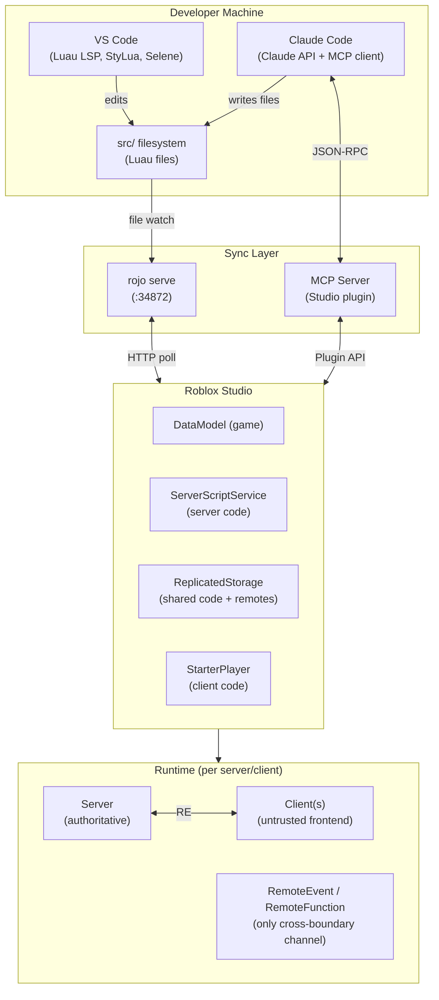

# Roblox AI Dev — Cheat Sheet

Quick reference for an experienced backend developer working with **Roblox + VS Code + Claude Code + BMAD**.

---

## 1. Architecture Overview



---

## 2. DataModel Service Quick Reference

| Service | Side | Description | Key Use |
|---------|------|-------------|---------|
| `Workspace` | Both | The 3D simulation world | Parts, models, terrain, camera |
| `ServerScriptService` | Server only | Server script container | `Script` files; never replicated |
| `ServerStorage` | Server only | Server-only asset storage | Templates, server data; invisible to clients |
| `ReplicatedStorage` | Both | Shared assets + modules | `ModuleScript`s, `RemoteEvent`s, shared data |
| `StarterPack` | Both | Cloned into each player's Backpack on spawn | Tools, gear |
| `StarterGui` | Both | Cloned into each player's PlayerGui on spawn | UI ScreenGuis |
| `Players` | Both | Container for connected Player objects | `Players.LocalPlayer` on client, `.PlayerAdded` |
| `Lighting` | Both | Global environment settings | Fog, ambient, sky, post-processing |
| `SoundService` | Both | Global audio settings | Master volume, audio groups |
| `HttpService` | Server only | HTTP requests + JSON encode/decode | External APIs, `GenerateGUID` |
| `DataStoreService` | Server only | Persistent key-value store | Player saves, leaderboards |
| `MessagingService` | Server only | Cross-server pub/sub | Server-to-server broadcasts (max 1000 subs/topic) |
| `MemoryStoreService` | Server only | Ephemeral shared in-memory store | Active game state, queues, leaderboards |
| `MarketplaceService` | Server only | Game passes, developer products, subscriptions | Monetization, purchase prompts |
| `TeleportService` | Server only | Teleport players between places | Multi-place experiences, matchmaking |
| `RunService` | Both | Frame events + context detection | `Heartbeat`, `Stepped`, `RenderStepped` |
| `PhysicsService` | Server only | Collision group management | Player-player no-clip, layer-based collisions |

---

## 3. Script Context Rules

| Script Type | Where It Runs | Can Access | Cannot Access |
|-------------|--------------|------------|---------------|
| `Script` | Server | `ServerScriptService`, `ServerStorage`, all services, `Players` collection | `Players.LocalPlayer`, client-only UI |
| `LocalScript` | Client (one player) | `Players.LocalPlayer`, `PlayerGui`, `StarterPack`, `ReplicatedStorage` | `ServerStorage`, `ServerScriptService`, other players' private data |
| `ModuleScript` required by `Script` | Server | Same as `Script` | Same limitations as `Script` |
| `ModuleScript` required by `LocalScript` | Client | Same as `LocalScript` | Same limitations as `LocalScript` |
| `ModuleScript` in `ReplicatedStorage` | Either (depends on requirer) | Depends on which side requires it | Each copy is independent — not shared memory |

> **Key rule**: `ModuleScript`s are cached per-VM. Server and client each have their own cached instance. There is no shared module state across the network boundary.

---

## 4. File Naming Conventions (Rojo)

```
src/
├── server/
│   ├── init.server.luau              → Script (name = "server" folder)
│   └── services/
│       ├── PlayerService.luau        → ModuleScript "PlayerService"
│       └── CombatService.luau        → ModuleScript "CombatService"
│
├── client/
│   ├── init.client.luau              → LocalScript (name = "client" folder)
│   └── controllers/
│       ├── UIController.luau         → ModuleScript "UIController"
│       └── InputController.luau      → ModuleScript "InputController"
│
├── shared/
│   └── utils/
│       ├── Math.luau                 → ModuleScript "Math"
│       └── Types.luau                → ModuleScript "Types"
│
└── remotes/
    └── Combat/
        ├── Attack.remote.json        → RemoteEvent "Attack"
        └── SyncHealth.remote.json    → RemoteEvent "SyncHealth"
```

**Suffix → Instance type mapping:**

| Filename Pattern | Roblox Instance |
|-----------------|-----------------|
| `Foo.server.luau` | `Script` (server) |
| `Foo.client.luau` | `LocalScript` |
| `Foo.luau` | `ModuleScript` |
| `init.server.luau` | `Script` that IS the folder |
| `init.client.luau` | `LocalScript` that IS the folder |
| `init.luau` | `ModuleScript` that IS the folder |
| `Foo.rbxm` / `Foo.rbxmx` | Binary/XML model tree |
| `Foo.json` | `ModuleScript` returning decoded table |

---

## 5. Luau Quick Reference

```luau
--!strict  -- Always. Top of every file. Full type checking.

-- ── Type annotations ──────────────────────────────────────────
local count: number = 0
local name: string? = nil          -- optional (string | nil)
type Direction = "north" | "south" | "east" | "west"
type Inventory = { [string]: number }

-- ── Generalized iteration (Luau, not Lua 5.1) ─────────────────
for i, v in { "a", "b", "c" } do   -- works on arrays
    print(i, v)
end
for key, val in someDict do         -- works on dicts (no pairs() needed)
    print(key, val)
end

-- ── String interpolation (backtick syntax) ────────────────────
local msg = `Hello {player.Name}, you have {coins} coins`

-- ── task library (never use legacy wait/spawn/delay) ──────────
task.spawn(function()   end)        -- fire-and-forget coroutine
task.defer(function()   end)        -- deferred to next resumption cycle
task.delay(2, function() end)       -- run after N seconds
task.wait(0.5)                      -- yield for N seconds (returns elapsed)
task.cancel(thread)                 -- cancel a scheduled task

-- ── Module singleton pattern ──────────────────────────────────
local MyService = {}
MyService.__index = MyService

function MyService:Init()  end      -- called once at startup
function MyService:Start() end      -- called after all services Init()

return MyService

-- ── Class pattern (metatable OOP) ─────────────────────────────
local Enemy = {}
Enemy.__index = Enemy

export type EnemyType = typeof(setmetatable({} :: {
    name: string,
    health: number,
}, Enemy))

function Enemy.new(name: string, health: number): EnemyType
    return setmetatable({ name = name, health = health }, Enemy)
end

function Enemy:TakeDamage(damage: number): ()
    self.health = math.max(0, self.health - damage)
end

return Enemy

-- ── continue keyword ──────────────────────────────────────────
for _, item in inventory do
    if item.equipped then continue end   -- skip equipped items
    processItem(item)
end
```

---

## 6. Remote Communication Decision Guide

| Use Case | Use This | Why |
|----------|----------|-----|
| Server → all clients | `RemoteEvent:FireAllClients(data)` | Broadcast (round start, global event) |
| Server → one client | `RemoteEvent:FireClient(player, data)` | Targeted update (health sync, notification) |
| Client → server | `RemoteEvent:FireServer(data)` | Standard player input (attack, buy, move) |
| Client → server (needs response) | `RemoteEvent:FireServer` + callback ID pattern | Never `RemoteFunction` server→client |
| High-frequency position/state | `UnreliableRemoteEvent:FireServer` | Packet loss OK; lower overhead at ≥20 Hz |
| Server → server (same process) | `require(module)` directly | No RPC; same VM, no network cost |
| Cross-server broadcast | `MessagingService:PublishAsync` | Pub/sub across all servers for this experience |
| Ephemeral shared state | `MemoryStoreService` (SortedMap / Queue) | Redis-like; no persistence guarantees |
| Persistent player data | `ProfileStore` (wraps DataStore) | Session locking prevents data races |

> **Hard rule**: Never call `RemoteFunction:InvokeClient()` from the server. An exploiter can hold the server thread hostage indefinitely, hanging all players.

---

## 7. Five-Step RemoteEvent Validation

Apply every step to every `OnServerEvent` handler. Treat each `FireServer` call as an untrusted HTTP request from an anonymous user.

```luau
remote.OnServerEvent:Connect(function(player: Player, arg1: unknown, arg2: unknown)

    -- Step 1: Player is in the game and their data is loaded
    local data = PlayerService:GetData(player)
    if not data or not data.IsLoaded then return end

    -- Step 2: Validate argument types
    if typeof(arg1) ~= "number" then return end
    if typeof(arg2) ~= "string" then return end

    -- Step 3: Validate argument values (ranges, enums, existence)
    local VALID = { Melee = true, Ranged = true }
    if not VALID[arg2] then return end
    if arg1 < 1 or arg1 > MAX_ID then return end

    -- Step 4: Check player permission / game context
    if GameStateService:GetState() ~= "Playing" then return end
    local char = player.Character
    if not char or not char:FindFirstChildOfClass("Humanoid") then return end

    -- Step 5: Rate limiting (token bucket per player)
    if not RateLimiter:Consume(player) then return end

    -- All checks passed — apply authoritative state change
    applyAction(player, arg1, arg2)
end)
```

---

## 8. rokit.toml Template

```toml
# rokit.toml — commit to git, pin all tool versions
[tools]
rojo      = "rojo-rbx/rojo@7.4.4"
wally     = "UpliftGames/wally@0.3.2"
selene    = "Kampfkarren/selene@0.27.1"
stylua    = "JohnnyMorganz/StyLua@0.20.0"
lune      = "lune-org/lune@0.8.9"
luau-lsp  = "JohnnyMorganz/luau-lsp@1.33.1"
```

```bash
rokit install          # install all pinned tools
rojo serve             # start sync server (Studio plugin polls :34872)
rojo build --output game.rbxl   # build place file for CI
```

---

## 9. default.project.json Template

```json
{
    "name": "MyGame",
    "tree": {
        "$className": "DataModel",

        "ServerScriptService": {
            "$className": "ServerScriptService",
            "$path": "src/server"
        },

        "StarterPlayer": {
            "$className": "StarterPlayer",
            "StarterPlayerScripts": {
                "$className": "StarterPlayerScripts",
                "$path": "src/client"
            },
            "StarterCharacterScripts": {
                "$className": "StarterCharacterScripts",
                "$path": "src/character"
            }
        },

        "ReplicatedStorage": {
            "$className": "ReplicatedStorage",
            "Modules": {
                "$className": "Folder",
                "$path": "src/shared"
            },
            "Remotes": {
                "$className": "Folder",
                "$path": "src/remotes"
            }
        },

        "ServerStorage": {
            "$className": "ServerStorage",
            "$path": "src/server-storage"
        },

        "Workspace": {
            "$className": "Workspace",
            "$properties": {
                "FilteringEnabled": true,
                "Gravity": 196.2
            },
            "World": {
                "$path": "assets/world"
            }
        }
    }
}
```

---

## 10. wally.toml Template

```toml
[package]
name     = "studio/game"
version  = "0.1.0"
registry = "https://github.com/UpliftGames/wally-index"
realm    = "shared"

[dependencies]
ProfileStore = "MadStudioRoblox/ProfileStore@1.0.0"
Promise      = "evaera/promise@4.0.0"
Fusion       = "dphfox/fusion@0.3.0"
```

```bash
wally install          # downloads packages into Packages/ directory
# Add Packages/ to default.project.json → ReplicatedStorage.Packages
```

---

## 11. DataStore Rate Limits

| Operation | Limit (2026) |
|-----------|-------------|
| Standard reads/writes | `250 + (CCU × 40)` per minute (per experience) |
| List operations | `10 + (CCU × 2)` per minute |
| Max value size | 4 MB per key |
| Key name length | 50 characters max |
| Storage cap | `100 MB + 1 MB per lifetime unique player` |

> **Pattern**: never call DataStore in a game loop. Load on `PlayerAdded`, save on `PlayerRemoving` + periodic auto-save. Use ProfileStore — it handles session locking, retry, and auto-save for you.

---

## 12. CLAUDE.md Essential Rules (Quick Reference)

- Always `--!strict` — top of every `.luau` file, no exceptions
- Use `task.*` — never legacy `wait()`, `spawn()`, or `delay()`
- Never `RemoteFunction:InvokeClient()` — server-hang vulnerability
- Server = source of truth — client input is untrusted; validate everything server-side
- DataStore = persistence only — active game state lives in memory, not DataStore
- ProfileStore for all player data — never raw DataStore for player saves
- Five-step validation on every `OnServerEvent` — type, value, permission, rate limit
- `require()` by ModuleScript instance — never by string path
- Set `Parent` last when constructing instances — avoid partial-tree replication churn
- All services expose `Init()` then `Start()` — never require a service from another service's `Init()`

---

## 13. BMAD Command Quick Reference

| Phase | Command | Agent | Output |
|-------|---------|-------|--------|
| Preproduction | `/bmad-domain-research` | Analyst (Mary) | Domain research report |
| Preproduction | `/bmad-technical-research` | Analyst (Mary) | Technical research report |
| Design | `/bmad-create-prd` | PM (John) | PRD document |
| Technical | `/bmad-agent-architect` | Architect (Cloud Dragonborn) | Architecture doc, RemoteEvent map |
| Technical | `/bmad-create-architecture` | Architect | architecture.md |
| Technical | `/bmad-create-epics-and-stories` | SM (Bob) | Epics + story list |
| Sprint | `/bmad-sprint-planning` | SM (Bob) | sprint-status.yaml |
| Sprint | `/bmad-create-story` | SM (Bob) | Story file with full context |
| Sprint | `/bmad-dev-story` | Dev (Link Freeman) | Working Luau code, story marked done |
| Sprint | `/bmad-agent-game-dev` | Dev (Link Freeman) | Story implementation |
| Sprint | `/bmad-agent-qa` | QA (GLaDOS) | TestEZ test files |
| Sprint | `/bmad-code-review` | Code Review agents | Findings report |
| Sprint | `/bmad-sprint-status` | SM (Bob) | Sprint health summary |
| Any | `/bmad-quick-dev` | Solo Dev (Indie/Barry) | Rapid spec + implementation |
| Any | `/bmad-agent-tech-writer` | Tech Writer (Paige) | Docs, guides, API reference |
| Any | `/bmad-agent-sm` | SM (Bob) | Sprint planning, story management |

> **Solo dev shortcut**: skip Phases 1–3. Write a one-paragraph concept → `/bmad-quick-dev` → describe feature → get spec + code in one pass.

---

## 14. RunService Event Quick Reference

| Event | Hz | Thread | Use For |
|-------|----|--------|---------|
| `RunService.Heartbeat` | 60 Hz (server/client) | Resumption after physics | Per-frame server logic, timers, non-render updates |
| `RunService.Stepped` | 60 Hz (server/client) | Before physics step | Pre-physics position overrides |
| `RunService.RenderStepped` | Display refresh (client only) | Render thread | Camera, character interpolation, visual-only updates |
| `RunService:BindToRenderStep(name, priority, fn)` | Display refresh (client only) | Render thread, ordered | Priority-ordered render callbacks (use Enum.RenderPriority) |

```luau
-- Context detection (useful in shared ModuleScripts)
if RunService:IsServer() then
    -- server-side init
elseif RunService:IsClient() then
    -- client-side init
end

-- Disconnect when done — orphaned connections are a memory leak
local conn = RunService.Heartbeat:Connect(function(dt: number)
    -- dt = delta time in seconds since last frame
end)
-- later:
conn:Disconnect()
```

---

## 15. Common Gotchas

1. **`Instance.new()` — set `Parent` last**: parenting triggers replication; set all properties first, then `instance.Parent = target`
2. **`require()` caches by ModuleScript identity, not path**: two `require()` calls on the same ModuleScript return the same table; renaming the file breaks nothing but moving it to a different Instance creates a new cache entry
3. **`RemoteFunction:InvokeClient()` — exploiters can hang your server**: client's `OnClientInvoke` can simply never return; the server thread yields forever and is lost
4. **DataStore in game loops — you will hit rate limits**: DataStore is a network call (~100–300ms); read once on join, write on leave + periodic save, never per-frame
5. **`wait()` is deprecated — use `task.wait()`**: legacy `wait()` has a minimum ~29ms yield regardless of argument; `task.wait()` is accurate and scheduler-friendly
6. **`ServerStorage` contents never replicate to clients**: anything parented there is invisible client-side; use `ReplicatedStorage` for anything a client needs to `require()`
7. **Attribute string value limit is 1000 chars** (not unlimited): use a StringValue child or DataStore for long strings; Instance attributes are for small scalar metadata
8. **`StreamingEnabled` — use `WaitForChild()` everywhere on the client**: parts and models load by proximity; never assume a Workspace instance exists; always `WaitForChild(name, timeout)` with a timeout and nil check
