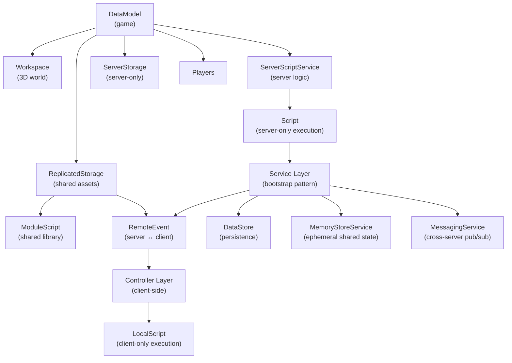

# Glossary: AI Game Development with Roblox

Comprehensive reference for all key terms across the learning path. Organized by domain. Each entry includes a definition, backend analogue where applicable, and key gotcha if any.

---

## Concept Relationship Map

---

## 1. Platform & Engine Terms

### DataModel
The root in-memory object tree of a running Roblox place, accessible as `game`. Every Instance in a running place is a node in this tree. The server's DataModel is authoritative; clients receive a synchronized (but filtered) view of it. **Backend analogue**: the in-memory process state of your application — everything loaded into RAM for the current running instance. **Gotcha**: the DataModel is not a database; mutations to it are immediate and do not persist unless explicitly saved to DataStore.

### Service
A singleton top-level child of `game` obtained via `game:GetService("ServiceName")`. Services are the engine's API surface — they cannot be instantiated directly. Examples: `DataStoreService`, `Players`, `RunService`, `MarketplaceService`. **Backend analogue**: a dependency-injected singleton in your service container. **Gotcha**: never call `game:GetService()` on every frame — call it once at the top of your script and cache the reference.

### Instance
Any object in the Roblox DataModel. Every Instance has a `ClassName` (immutable), `Name`, `Parent`, and a set of class-defined properties plus user-defined `Attributes`. **Backend analogue**: a node in a DOM tree, or a row in an object graph. **Gotcha**: destroying an Instance (`instance:Destroy()`) is permanent and removes all connections — guard against use-after-destroy with `IsDescendantOf` checks or disconnect patterns.

### Workspace
The top-level container for all 3D content in the running place (`game.Workspace`). Parts, Models, Terrain, the Camera, and spawned Characters all live here. Code running on the server and all clients can read and modify Workspace (subject to replication rules). **Backend analogue**: the runtime environment / process address space — the "world" the simulation operates on. **Gotcha**: do not store secret data in Workspace; it replicates to all clients by default.

### ReplicatedStorage
A service container whose contents replicate to all connected clients automatically. The canonical home for `ModuleScript` libraries shared between server and client, as well as `RemoteEvent` and `RemoteFunction` objects. **Gotcha**: never store server-secret data here — everything is visible to clients and can be read by exploiters.

### ServerStorage
A service container whose contents exist only on the server. Assets stored here do not replicate to clients. Use for: server-side templates, map variants, data that should never be visible to clients. **Backend analogue**: server-side only memory not exposed to the client. **Gotcha**: LocalScripts and client-side code cannot access ServerStorage; attempting to do so returns nil.

### ServerScriptService
The canonical home for server-side `Script` objects. Scripts inside ServerScriptService run on the server and their source code is not accessible to clients (unlike Workspace scripts). **Backend analogue**: your application's server-side source directory. **Gotcha**: only `Script` (not `LocalScript`) objects should live here.

### Place
A single 3D environment in Roblox — what players join and experience. A game can have multiple places (lobby, world 1, world 2). **Backend analogue**: a single deployed service instance or environment.

### Universe
A collection of places under a single game listing on Roblox. Universes share data across places via DataStore and can teleport players between places using `TeleportService`. **Backend analogue**: a microservice cluster / application suite under a single product.

### TeleportService
The API for moving players between places within the same Universe, or to other Universes. Handles the handshake for cross-server player transfer, including passing teleport data payloads. **Backend analogue**: a service mesh redirect, or load balancer routing a user to a different backend node. **Gotcha**: teleport data payloads are visible to clients — never put secrets in them; use DataStore or MemoryStore to pass server-side data across teleports.

### StreamingEnabled
A feature that streams 3D content to clients based on proximity, instead of loading the entire place upfront. Reduces initial load time and client memory usage — critical for large maps. **Backend analogue**: lazy loading / pagination of a large dataset. **Gotcha**: with StreamingEnabled, instances may not exist on the client at the moment your code runs. Always use `WaitForChild` or handle nil returns when accessing streamed content from LocalScripts.

---

## 2. Client-Server & Replication

### FilteringEnabled
The trust model that prevents clients from directly modifying the server's DataModel. Since 2018, FilteringEnabled is always on and cannot be disabled. Mutations made by a LocalScript only affect that client's local copy; they do not propagate to the server or other clients. **Backend analogue**: CSRF protection — clients cannot forge state changes; all mutations must go through validated server-side handlers. **Gotcha**: this is the single most important security model in Roblox. Every client-initiated state change must fire a `RemoteEvent` or `RemoteFunction`, and the server must validate it before applying.

### Replication
The engine's mechanism for synchronizing server-side DataModel state to clients. The engine automatically replicates: Instance creation/destruction, property changes on replicated containers, and character positions. **Backend analogue**: a real-time state sync system (WebSocket push, server-sent events). **Gotcha**: replication has bandwidth cost. Setting a property every frame on a frequently-updated object generates constant replication traffic. Batch updates or use `Attributes` with throttling.

### RemoteEvent
An asynchronous one-way communication channel between server and client. Fire from server to all clients (`FireAllClients`), to a specific client (`FireClient`), or from client to server (`FireServer`). Does not wait for a response. **Backend analogue**: a message queue publish (fire and forget). **Gotcha**: RemoteEvents must be created on the server at startup and stored in `ReplicatedStorage`. Clients must wait for them to exist before connecting.

### RemoteFunction
A synchronous request-response channel. Client calls `InvokeServer`, server runs its callback, returns a value to the client. Use sparingly — it blocks the calling thread until the server responds. **Backend analogue**: a synchronous RPC call. **Gotcha**: if the server callback errors or the server disconnects, the client's `InvokeServer` call will yield forever. Always wrap in a `pcall` with a timeout pattern.

### UnreliableRemoteEvent
A RemoteEvent variant that sends without guaranteed delivery or ordering. Lower latency than `RemoteEvent` because it uses UDP-style semantics. Use for high-frequency data where occasional packet loss is acceptable: character position updates, visual effects. **Backend analogue**: UDP datagram vs TCP stream. **Gotcha**: do not use for anything that must arrive (currency transactions, hit confirmation, state transitions) — use regular `RemoteEvent` for those.

### NetworkOwner
The entity (server or a specific client) responsible for simulating the physics of an unanchored `BasePart`. The network owner computes position updates and sends them to the server. Roblox auto-assigns ownership to the nearest player for performance; override with `:SetNetworkOwner(nil)` (server) or `:SetNetworkOwner(player)`. **Gotcha**: client-owned physics is an exploit surface. For gameplay-critical objects (projectiles, collectibles), always force server ownership.

### Attribute
A named key-value pair that can be attached to any Instance as user-defined metadata. Attributes replicate like properties and can be watched with `GetAttributeChangedSignal`. **Backend analogue**: arbitrary metadata on a database record or object. Use for small, frequently-read values (team color, health, level) rather than storing them in a separate module table. **Gotcha**: attributes are part of replication — attaching hundreds of attributes to many instances generates significant network traffic.

---

## 3. Luau Language

### Luau
Roblox's scripting language, derived from Lua 5.1 with additions: an optional gradual type system, improved performance via native code generation, and several safety and ergonomics improvements. Scripts in `.lua` or `.luau` files on disk are treated as Luau by Rojo. **Backend analogue**: a dynamically-typed scripting language embedded in a runtime — similar in position to JavaScript in a browser or Python in a data pipeline. **Gotcha**: Luau is not Lua 5.4 — features like integer division `//`, bitwise operators, and `goto` differ or are absent. Always check the Luau documentation, not generic Lua references.

### Strict Mode
Luau's opt-in static type checking mode, enabled by `--!strict` at the top of a file. In strict mode, the type checker enforces type annotations, flags incorrect usage, and enables better IDE autocomplete. **Backend analogue**: TypeScript's strict mode, or Java's static typing. **Gotcha**: strict mode requires more annotation effort upfront but catches entire classes of bugs at write time rather than runtime. Use it for all new service and controller files.

### Metatables
Luau's metaprogramming mechanism. A metatable attached to a table can define behavior for arithmetic operators, indexing, string representation, and more. The primary mechanism for implementing OOP (classes) in Luau. **Backend analogue**: `__dunder__` methods in Python, operator overloading in C#. **Gotcha**: metatables add indirection — debugging class method calls requires understanding the `__index` chain. Prefer composition over deep inheritance hierarchies.

### Task Library
Roblox's modern concurrency API replacing the legacy `wait()`, `spawn()`, and `delay()` functions. Key functions: `task.wait(seconds)`, `task.spawn(func)`, `task.defer(func)`, `task.delay(seconds, func)`, `task.cancel(thread)`. **Backend analogue**: an async scheduler (similar to `asyncio` in Python or `setTimeout`/`setImmediate` in Node.js). **Gotcha**: never use the legacy `wait()` — it can drift by up to 29ms due to Roblox's old scheduler. `task.wait()` is frame-accurate.

### ModuleScript
A script that returns a single value (typically a table/module) when `require()`d. It is the Roblox unit of code reuse — shared libraries, services, and utilities are all ModuleScripts. **Backend analogue**: a CommonJS or ES module. **Gotcha**: ModuleScripts are cached per VM — `require()` on the same ModuleScript returns the same table every time within a single script context. Server and client have separate module caches; a module required on the server and on the client are different instances.

### Script
A Luau script that runs on the **server** only (when parented to ServerScriptService or a server-appropriate location). Creates a new Lua coroutine/thread. **Backend analogue**: a server-side process entrypoint. **Gotcha**: `Script` objects parented to the client hierarchy (StarterGui, StarterPlayerScripts) are cloned to clients on join and run as `LocalScript`s — but `Script` objects themselves always execute on the server.

### LocalScript
A Luau script that runs on a **specific client**. Has access to client-only APIs (`game.Players.LocalPlayer`, `UserInputService`, `RenderStepped`). Cannot communicate with the server directly — must use `RemoteEvent`. **Backend analogue**: client-side JavaScript. **Gotcha**: never put game logic that has economic or security implications in a LocalScript — exploiters can modify it. All authoritative logic lives in Scripts on the server.

---

## 4. Development Toolchain

### Rokit
A toolchain version manager for the Roblox ecosystem. Manages versions of Rojo, Wally, Selene, StyLua, Lune, and other tools declared in `rokit.toml`. Ensures all developers and CI/CD use identical tool versions. **Backend analogue**: `asdf`, `nvm`, `sdkman` — a language/tool version manager. **Gotcha**: Rokit tools are installed per-project (in `.rokit/` and `~/.rokit/`). Running tools without activating the Rokit environment may use a globally installed (wrong) version.

### Rojo
A filesystem synchronization tool that maps a directory structure to the Roblox DataModel and vice versa. Allows writing Roblox scripts in VS Code, organized as `.luau` files, and syncing them into Roblox Studio live. **Backend analogue**: a hot-reload file watcher (like Nodemon) but for syncing source files into a game engine. **Gotcha**: Rojo's `default.project.json` defines the mapping between your filesystem and the DataModel. Changes to the project file require a Rojo restart.

### Wally
A package manager for the Roblox ecosystem. Packages declared in `wally.toml` are installed into a `Packages/` directory and mapped into the DataModel via Rojo. **Backend analogue**: npm, pip, cargo — a dependency manager. **Gotcha**: Wally packages install as `ModuleScript` objects in `ReplicatedStorage.Packages` and `ServerScriptService.ServerPackages`. The paths differ between shared and server-only packages — use the correct require path.

### pesde
An emerging Luau-native package manager with better support for typed packages and a growing registry. Alternative or complement to Wally. **Backend analogue**: an alternative to npm with TypeScript-first package resolution.

### Selene
A Luau static analysis linter. Catches undefined globals, deprecated APIs, potential runtime errors, and style issues without running the code. Configured via `selene.toml`. **Backend analogue**: ESLint for JavaScript, Pylint for Python. **Gotcha**: Selene requires a Roblox standard library definition file (`roblox.yml`) to know about Roblox globals like `workspace`, `game`, and `script`. Include the Roblox definitions package in your `selene.toml`.

### StyLua
An opinionated Luau code formatter. Enforces consistent indentation, spacing, and brace style. Configured via `stylua.toml`. **Backend analogue**: Prettier, Black, rustfmt. **Gotcha**: run StyLua as a pre-commit hook to prevent style discussions in code review. CI should fail on unformatted files.

### Lune
A standalone Luau runtime for scripting outside of Roblox Studio. Use for: build scripts, code generation, data migration scripts, test runners in CI. **Backend analogue**: Node.js (running JavaScript outside a browser). **Gotcha**: Lune does not have access to Roblox-specific APIs (`workspace`, `game`, `Instance`). Scripts that use Roblox APIs cannot run in Lune without mocking.

### luau-lsp
The Luau Language Server Protocol implementation that powers VS Code's Luau IDE features: go-to-definition, autocomplete, inline type errors, hover documentation. Configured via `.luaurc` and fed a sourcemap from Rojo for cross-file navigation. **Backend analogue**: TypeScript Language Server, pylsp, rust-analyzer. **Gotcha**: without a valid Rojo sourcemap, luau-lsp cannot resolve `require()` paths across files — autocomplete and go-to-definition break. Always run `rojo sourcemap` to keep it current.

### Sourcemap
A JSON file generated by Rojo (`rojo sourcemap`) that maps filesystem paths to DataModel paths. Used by luau-lsp to resolve `require()` calls across the project. **Backend analogue**: TypeScript's `tsconfig.json` path mappings. **Gotcha**: the sourcemap must be regenerated whenever you add, remove, or rename files. Automate with `rojo sourcemap --watch` during development.

---

## 5. Architecture Patterns

### Service-Controller Pattern
The dominant architectural pattern for medium-to-large Roblox codebases. Server-side logic is organized into **Services** (ModuleScripts in `ServerScriptService/Services/`) that handle game systems and expose functions. Client-side logic is organized into **Controllers** (ModuleScripts in `StarterPlayerScripts/Controllers/`) that manage UI and local behavior. **Backend analogue**: a layered service architecture (Controller → Service → Repository). **Gotcha**: Services must never `require()` client-side modules (trust boundary violation). Controllers must never `require()` server-side modules (they don't exist on the client).

### Bootstrap Pattern
A single entry-point `Script` (or `LocalScript`) that `require()`s and initializes all Services (or Controllers) in order. Handles initialization sequencing and dependency injection. **Backend analogue**: a dependency injection container startup sequence (`main.go`, `Application.java`, `app.py`). **Gotcha**: initialization order matters. If ServiceA depends on ServiceB being ready, ServiceB must be initialized first. Use a two-phase init: `Initialize()` then `Start()` to separate setup from activation.

### Five-Step Validation
The standard pattern for validating all client-to-server RemoteEvent calls on the server:
1. **Validate the caller**: is `player` a real player? Is their session active?
2. **Validate the data**: are all arguments present, the correct type, within expected ranges?
3. **Validate the game state**: does the server's state permit this action? (e.g., player is alive, has ammo, is not in cooldown)
4. **Apply the change**: mutate server state
5. **Broadcast the result**: fire back to clients if needed

**Backend analogue**: input validation + authorization + business rule check + write + publish. **Gotcha**: skipping any step is an exploit surface. Clients can fire RemoteEvents with arbitrary data — assume all inputs are malicious.

### ECS (Entity-Component-System)
An architectural pattern for game logic where:
- **Entity**: an identifier (integer ID), not an object
- **Component**: plain data attached to an entity (position, health, velocity)
- **System**: logic that queries for entities with specific components and operates on them

Decouples data from behavior, improves cache locality, and scales better than deep OOP hierarchies for games with thousands of entities. **Backend analogue**: a row-oriented data warehouse vs normalized relational model.

### Matter
A Lua ECS library for Roblox. Battle-tested, performant, with a clean query API and a debugging UI. The default choice for ECS in Roblox 2024+.

### Jecs
A newer, lower-level Luau ECS library with better performance than Matter for extreme entity counts. Based on flecs architecture. Use when Matter's overhead becomes measurable.

### Object Pool
A pre-allocated collection of reusable objects that avoids the cost of creating and garbage-collecting instances repeatedly. Critical for: projectiles, particle systems, damage numbers, NPCs that spawn and despawn frequently. **Backend analogue**: a database connection pool, thread pool. **Gotcha**: pooled objects must be fully reset before reuse. Failing to clear previous state (position, velocity, connections) causes ghost effects and bugs.

### Maid / Janitor
A cleanup utility pattern for managing Roblox connections, instances, and tasks. A `Maid` (or `Janitor`) holds references to things that need cleanup, and calling `:Destroy()` on it destroys all of them atomically. Prevents memory leaks from orphaned `RBXScriptConnection` objects. **Backend analogue**: RAII (Resource Acquisition Is Initialization) pattern in C++, `defer` in Go, `using` in C#. **Gotcha**: every `Connect()` call that isn't cleaned up is a memory leak. Use Maid/Janitor for all connections created dynamically (per-player, per-entity).

---

## 6. Data & APIs

### DataStore
Roblox's persistent key-value store. Each key can store up to 4MB of Lua-serializable data. Rate-limited: 60 + (10 × player count) read/write requests per minute per place. **Backend analogue**: a managed NoSQL key-value store (DynamoDB, Redis with persistence). **Gotcha**: DataStore calls are async and can fail. Always wrap in `pcall` and handle failure gracefully. Never read from DataStore during active gameplay — load on join, cache in memory, save periodically.

### ProfileStore
A community library (by loleris) built on top of DataStore that adds session locking, automatic retries, profile templates with Reconcile, and a clean per-player data API. The de-facto standard for player data management in production Roblox games. **Backend analogue**: an ORM layer on top of a database — adds sessions, migrations, and schema management.

### Session Locking
A mechanism that prevents two servers from loading and writing the same player's data simultaneously. ProfileStore implements this: when a player's profile is loaded on Server A, a lock is written to DataStore. If the player joins Server B before the lock clears, Server B waits or forces-releases the old lock. **Backend analogue**: optimistic locking or database row locking to prevent concurrent writes. **Gotcha**: without session locking, duplication exploits are possible — player joins two servers simultaneously, both load data, one's save overwrites the other's progress.

### MemoryStoreService
An in-memory data store shared across all servers in the same Universe, with TTL-based expiry. Used for: real-time leaderboards, cross-server party matching, server browser state, cooldowns shared across servers. Much faster than DataStore (no persistence overhead). **Backend analogue**: Redis (in-memory, shared, ephemeral). **Gotcha**: MemoryStore data is not persisted — it evaporates when TTL expires or Roblox flushes it. Never store data here that you can't afford to lose.

### MessagingService
A pub/sub channel for broadcasting messages across all servers in the same Universe. Rate-limited (150 + 60×players messages/minute). Used for: global announcements, cross-server events (player reached global leaderboard), moderator actions. **Backend analogue**: Redis pub/sub, AWS SNS, Kafka topic (single consumer group). **Gotcha**: messages may be delayed or dropped under load. Do not use for anything requiring guaranteed delivery or low latency. Use MemoryStore for coordination; use MessagingService for notifications.

### Open Cloud
Roblox's external REST API for interacting with game resources from outside Roblox: reading/writing DataStores, publishing places, managing inventory. Requires an API key. **Backend analogue**: a management API or admin REST endpoint. Use cases: web dashboards, external tools, automated deployment scripts.

### HttpService
The server-side service for making outbound HTTP requests from Roblox scripts. Enabled per-game in settings. Used for: webhooks to Discord, analytics to custom backends, AI integrations. **Gotcha**: HttpService is server-only (cannot use from LocalScripts). Rate-limited. Outbound calls must go to public HTTPS endpoints — `localhost` and internal Roblox URLs are blocked.

### MarketplaceService
The API for all monetization interactions: prompting purchases, checking ownership, processing receipts. **Key methods**: `PromptGamePassPurchase`, `UserOwnsGamePassAsync`, `PromptProductPurchase`, `ProcessReceipt`.

---

## 7. Performance & Security

### RunService
The service that exposes the game loop signals. Key events:

| Signal | Runs On | When | Use For |
|--------|---------|------|---------|
| `Heartbeat` | Server + Client | After physics step | Game logic, state updates |
| `Stepped` | Server + Client | Before physics step | Modifying physics state before simulation |
| `RenderStepped` | Client only | Before rendering | Visual updates, camera, UI |

**Backend analogue**: a scheduler or event loop. **Gotcha**: `RenderStepped` is client-only and runs every rendered frame — on a fast GPU this can be 120Hz+. Do not put expensive logic here; use `Heartbeat` for logic and `RenderStepped` only for camera/render-critical updates.

### Heartbeat
The primary RunService signal for game logic. Fires after the physics simulation step with `dt` (delta time in seconds since last frame). The standard place for all per-frame server and client logic. **Gotcha**: all Heartbeat connections on a server run in the same thread sequentially (no true parallelism). One slow connection delays all subsequent ones.

### Stepped
Fires before the physics simulation step. Use when you need to set physics properties (velocity, position, constraints) that the physics engine should simulate in the current frame — not after. **Gotcha**: setting a Part's position in Heartbeat means physics already ran for that frame; the Part teleports rather than being physically simulated into place.

### RenderStepped
Client-only. Fires before the frame is rendered to the screen. Use for camera manipulation, VFX, and any UI that must be synchronized with the rendered output. The most expensive callback to overuse — runs at display refresh rate (60Hz, 120Hz, etc.).

### ByteNet
A community networking library that replaces `RemoteEvent` with strictly-typed, buffer-encoded packets. Dramatically reduces network traffic for high-frequency data (positions, health, animation states). **Backend analogue**: Protocol Buffers / MessagePack replacing JSON. **Gotcha**: requires defining packet schemas upfront. Migration from plain RemoteEvents is a significant refactor — plan for it from the start on high-performance networked games.

### Anti-Cheat Architecture
The practice of designing game systems such that exploits either fail silently or produce no benefit. Core principles:
1. Server is always authoritative (clients propose actions, server validates and applies)
2. Never trust client-reported game state (health, position, ammo, currency)
3. Server-side sanity checks on all values (position jumps, impossible speeds, negative currency)
4. Rate limiting on all RemoteEvents
5. Physics ownership on server for all gameplay-critical objects

---

## 8. AI Development & BMAD

### BMAD
BMAD Game Dev Studio — an AI-assisted game development framework that runs on Claude Code. Provides 7 specialized agents (personas) for different development phases. Each agent is activated by a SKILL.md file loaded into the Claude Code session. The framework manages project context through artifact files, enabling coherent multi-session development despite AI context window limits.

### Claude Code
Anthropic's official CLI for the Claude AI model. Runs in a terminal alongside the development environment. Reads files, writes code, and executes commands. BMAD agents are skills loaded into a Claude Code session via `/skill-name` commands. **Role in Roblox dev**: Claude Code reads `.luau` source files via the filesystem (synced by Rojo), writes implementations, runs Selene/StyLua, and operates within the BMAD workflow.

### MCP Server
Model Context Protocol Server — a protocol that allows AI models like Claude to interact with external tools and services in a structured way. The Roblox MCP Server (built into Roblox Studio 2026+) exposes Studio APIs to Claude: read/modify DataModel instances, execute Lua in Studio, capture screenshots of the running game. **Backend analogue**: a tool-use / function-calling integration for AI. **Gotcha**: the MCP server requires Studio to be running and the MCP plugin active. Claude Code connects to it via the MCP configuration in `.claude/` settings.

### CLAUDE.md
A special file at the root of a project that Claude Code reads automatically before any task. Contains project-specific instructions: architecture conventions, Luau coding standards, Rojo file paths, service naming patterns, RemoteEvent naming conventions, banned patterns, and AI behavior rules. **Backend analogue**: a `CONTRIBUTING.md` and `ARCHITECTURE.md` combined, written specifically for an AI agent to consume. **Gotcha**: CLAUDE.md is only as useful as its specificity. Generic instructions are ignored. Include concrete examples of correct patterns.

### Sprint
A time-boxed development iteration (typically 1–2 weeks) in which a fixed set of stories are implemented, tested, and reviewed. In BMAD, sprints are tracked in `sprint-status.yaml`. Each story in the sprint is implemented in a separate AI session to stay within context window limits.

### Story
A single implementable unit of work. In BMAD, a story file is a self-contained Markdown document containing: the user story, acceptance criteria, task checklist, and dev notes with all architectural context needed to implement without reading other files. **Backend analogue**: a Jira ticket with attached technical design. **Gotcha**: story files must be self-contained. If an agent has to read other files to understand what to do, the story is incomplete — add the relevant context directly to dev notes.

### Epic
A grouping of related stories representing a major feature area. Epics are tracked in the sprint-status.yaml and have their own status (backlog → in-progress → done). Stories belong to exactly one Epic. **Backend analogue**: a Jira Epic, a GitHub Milestone.

### Sprint Status (sprint-status.yaml)
The single source of truth for sprint progress. Tracks status of all epics and stories: `backlog`, `ready-for-dev`, `in-progress`, `review`, `done`. Updated by the Scrum Master (Bob) and developer agents throughout the sprint. Consumed by the Scrum Master to generate sprint summaries and identify blockers.

---

## Common Errors Reference

The top 10 mistakes made by developers new to Roblox, how they manifest, and how to fix them.

---

### Error 1: Writing server logic in LocalScript (or vice versa)

**Symptom**: Code appears to run but has no effect on the game; or "attempt to index nil" on a server-only API from a client context.

**Cause**: `LocalScript` runs on the client; `Script` runs on the server. Roblox silently ignores scripts in the wrong container.

**Fix**: `Script` objects go in `ServerScriptService` or a server container. `LocalScript` objects go in `StarterPlayerScripts`, `StarterGui`, or `StarterCharacterScripts`. Check which container your script is in before debugging logic.

---

### Error 2: Forgetting FilteringEnabled — direct DataModel mutations from client

**Symptom**: Property changes in a `LocalScript` don't appear on other clients or the server.

**Cause**: FilteringEnabled is always on. Client mutations to the server DataModel are silently discarded (for replicated objects) or only visible locally.

**Fix**: Fire a `RemoteEvent` to the server, validate on server, apply the change on the server. The change then replicates to all clients.

---

### Error 3: Querying DataStore during active gameplay

**Symptom**: Game freezes or hitches; DataStore rate limit errors; inconsistent state.

**Cause**: `DataStore:GetAsync()` is async, rate-limited, and takes 200–500ms+ to return. Calling it on every player action or every frame exhausts the rate limit and stalls coroutines.

**Fix**: Load player data once on `PlayerAdded`, cache in a module-level table, read from the cache during gameplay, save to DataStore on `PlayerRemoving` and periodically (every 60s) in a background task.

---

### Error 4: Not using task.wait() — using legacy wait()

**Symptom**: Timing-sensitive code drifts by up to 29ms; animations and sequences feel slightly off.

**Cause**: The legacy `wait()` function can be delayed by up to one Roblox "throttle" period (about 29ms) by the old scheduler.

**Fix**: Replace all `wait(n)` with `task.wait(n)`. Replace `spawn(fn)` with `task.spawn(fn)`. Replace `delay(n, fn)` with `task.delay(n, fn)`.

---

### Error 5: Forgetting to disconnect RunService connections

**Symptom**: Memory grows over time; performance degrades; ghost behavior from "dead" connections.

**Cause**: Every `RunService.Heartbeat:Connect()` call that is never disconnected fires every frame forever, even after the object it references is destroyed.

**Fix**: Store the connection: `local conn = RunService.Heartbeat:Connect(fn)`. Disconnect when done: `conn:Disconnect()`. Use a `Janitor`/`Maid` pattern to clean up all connections tied to a player or entity lifecycle.

---

### Error 6: Setting Part.CFrame in Heartbeat instead of Stepped

**Symptom**: Physics-driven objects teleport or stutter; collision detection misses.

**Cause**: `Heartbeat` fires after physics has already simulated. Overriding physics positions in Heartbeat means the engine computed a frame based on the old position, then you snap it — physics and rendering are out of sync.

**Fix**: Use `Stepped` (fires before physics) for any modifications to physics state. Use `Heartbeat` for logic that reads physics results.

---

### Error 7: Not validating RemoteEvent arguments on the server

**Symptom**: Exploiters duplicate currency, teleport to arbitrary positions, or kill other players by firing crafted RemoteEvent payloads.

**Cause**: `RemoteEvent:FireServer()` can be called by any client with any arguments — exploiters abuse this.

**Fix**: Apply five-step validation to every `RemoteEvent` handler: validate caller, validate arguments (type + range), validate game state, apply, broadcast. Never trust any client-provided value.

---

### Error 8: Missing WaitForChild in LocalScripts (StreamingEnabled)

**Symptom**: `nil` errors on script startup; "attempt to index nil with 'FindFirstChild'."

**Cause**: With `StreamingEnabled` (and even without it, during initial load), instances may not exist in the client DataModel at the moment the LocalScript runs.

**Fix**: Use `WaitForChild` for instances that must exist before proceeding: `local part = workspace:WaitForChild("MyPart")`. Add a timeout: `workspace:WaitForChild("MyPart", 10)` returns nil after 10 seconds instead of yielding forever.

---

### Error 9: ProcessReceipt not idempotent — double-granting purchases

**Symptom**: Players receive double currency or items when purchasing Developer Products; support tickets for unintended grants.

**Cause**: Roblox can call `ProcessReceipt` multiple times for the same purchase ID (network retry, server restart). If the handler grants without checking for prior fulfillment, the player receives the reward twice.

**Fix**: Before granting, check a `PurchaseHistory` DataStore for the purchase ID. Grant only if not present, then record the ID. Return `PurchaseGranted` only after the grant is recorded successfully.

---

### Error 10: Require path confusion (Packages vs shared modules)

**Symptom**: `require()` returns nil; "invalid argument #1 to 'require' (ModuleScript expected, got nil)".

**Cause**: Wally installs shared packages to `ReplicatedStorage.Packages` and server packages to `ServerScriptService.ServerPackages`. Developer modules live wherever Rojo maps them. Confusing these paths, or not accounting for the Rojo sourcemap in luau-lsp, produces nil requires.

**Fix**: Define canonical require paths in `CLAUDE.md` and `.luaurc`. Use `game:GetService("ReplicatedStorage").Packages.PackageName` for shared packages. Regenerate the Rojo sourcemap (`rojo sourcemap --watch`) to keep luau-lsp navigation accurate.
